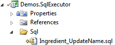
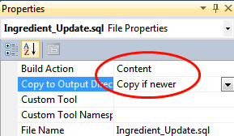

API's | JJ's Reference Architecture
===================================

<h2>Contents</h2>

- [TODO](#todo)
- [AJAX](#ajax)
- [Configuration](#configuration)
  - [Custom Configuration Sections](#custom-configuration-sections)
  - [appSettings](#appsettings)
  - [connectionStrings](#connectionstrings)
- [Embedded Resources](#embedded-resources)
- [Entity Framework 5](#entity-framework-5)
- [JavaScript / TypeScript](#javascript--typescript)
- [NHibernate](#nhibernate)
- [ORM](#orm)
- [SQL](#sql)
  - [With NHibernate](#with-nhibernate)
  - [Files instead of Embedded Resources](#files-instead-of-embedded-resources)
  - [Strings instead of Embedded Resources:](#strings-instead-of-embedded-resources)
- [XML](#xml)
- [Framework.Business Relationships](#frameworkbusiness-relationships)


TODO
----

<TODO: API’s: Make sure you mention all the important in-house API’s and external API’s in the documentation.>

<TODO: Mention JJ.Framework.

` `JJ.Framework documentation: Separate document for overviewing what’s in JJ.Framework. Otherwise (lead) developers that use it would have to have a chrystal ball to know what’s in there.>


AJAX
----

We make our own wrapper ajax methods around ones from e.g. jQuery, so we can AJAX with a single code line and handle both partial loads and full reloads.

We choose full loads first, before resorting to AJAX. See ‘First full load – then partial load – then native code’.


Configuration
-------------

For configuration we will use our own API: Framework.Configuration. It makes it easier to work with complex configuration files, while using .NET’s System.Configuration directly can be quite a lot of work.

### Custom Configuration Sections

If your configuration requires more than a flat list of key value pairs, you might make a custom configuration section. In a configuration section you can add as much hierarchy as you like. You can read out structures like the following:

```xml
<jj.demos.configuration>
  <items>
    <item name="Name1" value="1" />
    <item name="Name2" value="2" >
      <childItem name="Child" value="3" />
    </item>
  </items>
</jj.demos.configuration>
```

You can create any kind of nesting you want. With classic .NET, reading out nested configurations requires about 1 ½ hours of programming for a simple structure. With our own framework, it is easy.

You have to include the following line in the configSections element in your config file:

```xml
<section name="jj.demos.configuration" type="JJ.Framework.Configuration.ConfigurationSectionHandler, JJ.Framework.Configuration"/>
```

You only need to replace the name ‘jj.demos.configuration’ with your assembly name converted to lower case. (You can also use a custom name, which you then have to use explicitly in your code, but that is not advised.)

To read out the config you call:

```cs
var config = CustomConfigurationManager.GetSection<ConfigurationSection>();
```

MyConfigurationSection is a class you have to program yourself. Its structure of properties corresponds 1-to-1 to the XML structure. The specific behavior of the mapping is documented in the summary of CustomConfigurationManager. In short: properties map to XML elements unless you mark the property with [XmlAttribute]. Array items are expected to have the class name as the XML element name, but the element name of the array items can be specified explicty with [XmlArrayItem]. Here is an example:

```cs
internal class ConfigurationSection
{
    [XmlArrayItem("item")]
    public ItemConfig[] Items { get; set; }
}

internal class ItemConfig
{
    [XmlAttribute]
    public string Name { get; set; }

    [XmlAttribute]
    public string Value { get; set; }

    public ItemConfig ChildItem { get; set; }
}
```

Note that C# will follow the convention that property names are pascal case, while this automatically maps to the convention in XML, in which element and attribute names are camel case.

### appSettings

An appSetting looks as follows in the App.config or Web.config:

```xml
<appSettings>
  <add key="TestInt32" value="10"/>
</appSettings>
```

Reading out the appSettings classically, is done as follows:

```cs
int testInt32 = Convert.ToInt32(ConfigurationManager.AppSettings["TestInt32"]);
```

But you get errors if you mistype the string and an invalid cast exception if you convert to the wrong type. The alternative in Framework.Configuration is strongly typed. You first need to define an interface:

```cs
internal interface IAppSettings
{
    int TestInt32 { get; }
}
```

This interface defines the names and types of the settings. To retrieve a setting you use:

```cs
int testInt32 = AppSettings<IAppSettings>.GetValue(x => x.TestInt32);
```

It automatically converts to the right data type and allows you to use strongly-typed names.

### connectionStrings

Reading out connectionStrings is similar to reading out the appSettings. Connection strings in the App.config or Web.config look as follows:

```xml
<connectionStrings>
  <add name="OrderDB" connectionString="data source=10.40.XX.XX;Initial Catalog=OrderDB..." />
</connectionStrings>
```

This is the classic way of reading it out:

string connectionString = ConfigurationManager.ConnectionStrings["OrderDB"].ConnectionString;

This is the alternative in Framework.Configuration:

```cs
string connectionString = ConnectionStrings<IConnectionStrings>.Get(x => x.OrderDB);
```

You need to define an interface to be able to use the strongly-typed name:

```cs
internal interface IConnectionStrings
{
    string OrderDB { get; }
}
```


Embedded Resources
------------------

<TODO: Write text.>


Entity Framework 5
------------------

*<TODO: Add story about enabling MSDTC and transactionality.>*


JavaScript / TypeScript
-----------------------

<TODO: Describe Framework.Javascript and why you might avoid JavaScript and why you might not. Also mention TypeScript.>


NHibernate
----------

<TODO: Describe thgis problem with polymorphism:

API’s, ORM: Arch: when an entity is a proxy or not a proxy, could reference comparison fail?

\> When you retrieved a polymorphic type from HNibernate using the base type it returns a Proxy of the base type instead of a proxy of the derived type, which makes reference comparisons between base proxies and derived class proxies fail. You can then unproxy both and it will return the underlying object, which is indeed of the derived class, upon which reference comparison succeeds. But if you can also get failing reference comparisons another way. If you unproxied a derived type, and retrieve another proxy of the derived type, reference comparison should also fail.

\>> This I want to test.

So always do ID comparisons, because reference comparisons can fail.

So for polymorphic entities always Unproxy before evaluating their type.>

<TODO: describe which NHibernate methods to use and what features to avoid. Do not map binary and other serialized data fields using NHibernate, because it gives terrible performance. Use separate SQL statements for retrieving blobs. Also: always include bride entities for 1-to-n relationships, never let the two sides of the 1-to-n relationship refer to eachother directly. Always go through a bride entity. Always have surrogate keys in a bridge table, not just the composite key. Otherwise you will get problems with ORM mapping technologies crazy-complicated guarding of integrity of object graphs and passing around composite keys all the time, no-good hashing keys, ugly URL’s, etc.>

<TODO: Describe more of the pitfalls and dos and don’ts around NHibernate and also FluentNHibernate.>


ORM
---

Here is a ubiquitous quirk of ORM:

Many methods of IContext work with uncommitted / non-flushed entities: so things that are newly created, and not yet committed to the data store. But IContext.Query usually does the opposite: it only returns committed / flushed entities. This asymmetry is common in ORM’s and doing it any other way would harm performance.

<TODO:

- Reformulate the ‘ubiquitous quirk of ORM’: TryGet and Get MIGHT return uncommitted, non-flushed objects, but properties that lead to related entities usually return the uncommitted, non-flushed objects. IContext.Query or NHibernate’s ISession.QueryOver only return flushed objects. It is still a valid point that one time you get the uncommitted objects and the other time you do not. Only the way it is formulated is not entirely accurate.
- Also find a different word for ‘ubiquitous’.
- NHibernate FlushMode.Never or FlushMode.Commit does not prevent all intermediate automatic flushes. Flushes can be executed upon calling Save() even though the FlushMode.Commit's summary suggests otherwise. This happened when calling Save on a child object before calling it on the parent object. Internally then NHibernate asked itself the question if the child object was Transient and while doing so, it apparently wanted to get its identity, by executing an insert statement onto the data store. This caused a null exception on the 'ParentID' column of the child object.So the solution is either to create entities in a specific order: first the parent object, then the child object, or to choose a completely different identity generation scheme.
- ORM read-write order is relevant. 
- Mappings: do not solve n-to-n relationships with (NHibernate) mappings. Always use bridge entities.>

<TODO: A problem with ORM: meet-in-the-middle querties. You have two ends of a graph, you filter both ends and then want what is in the middle.>


SQL
---

<TODO: 

- No SQL strings:
    - Talk about not building up SQL strings in code.
    - No parameter concatination
    - Trick to prevent conditional blocks of sql. (@value is null or Value = @value)
- No SQL in the code. Use SqlExecutor and .sql files.
- No string concatination of sql parameters.
- Hiding the SQL behind a repository.
- Mention that SQL for upgrading the database structure do not belong in your project and are managed differently as described under Database Conventions.
- Placeholders >

Executing queries onto a database is normally done through ORM, but if performance is an issue, it can be combined with SQL.

We will not use stored procedures or views. Instead we store SQL files directly in our .NET projects. We put the SQL files in a sub-folder named ‘Sql’.



The classic way of executing SQL in .NET is to use System.Data.SqlClient. Instead, we will use our own SqlExecutor API. With that we can execute SQL in a strongly-typed way, often with only a single code line.

The best method of doing it is to make the SQL file embedded resources:


The SQL may look as follows:

update Ingredient set Name = @name where ID = @id;

Then put an enum in the SQL folder in your .NET project:


Add enum members that exactly correspond to the file names of the sql files:

```cs
namespace JJ.Demos.SqlExecutor.Sql
{
    internal enum SqlEnum
    {
      Ingredient_UpdateName
    }
}
```

You need to create an SqlExecutor as follows:

```cs
ISqlExecutor sqlExecutor = SqlExecutorFactory.CreateSqlExecutor(SqlSourceTypeEnum.EmbeddedResource, connection, transaction);
```

We passed the SqlConnection and SqlTransaction to it.

Then you can call a method that executes the SQL:

```cs
sqlExecutor.ExecuteNonQuery(SqlEnum.Ingredient_UpdateName, new { id, name });
```

The method names are similar to what you might be used to using SqlCommand. You pass SQL parameters along with the SqlExecutor as an anonymous type:

```cs
new { id, name }
```

The name and type of the variables id and name correspond to the parameters of the SQL. You do not need to use an anonymous type. You can use any object. As long as its properties correspond to the SQL parameters, they will be correctly used:

```cs
var ingredient = new IngredientDto
{
    ID = 10,
    Name = "My ingredient"
};

sqlExecutor.ExecuteNonQuery(SqlEnum.Ingredient_Update, ingredient);
```

You can also retrieve records as a collection of strongly typed objects:

```cs
IList<IngredientDto> records = sqlExecutor.ExecuteReader<IngredientDto>(SqlEnum.Ingredient_GetAll).ToArray();

foreach (IngredientDto record in records)
{
    // ...
}
```

The column names in the SQL are *case sensitive!*

It is smart to let the SQL file names begin with the entity type name, so they stay neatly grouped together:


### With NHibernate

If you use SqlExecutor in combination with NHibernate you have to 
use the NHibernateSqlExecutorFactory instead of the default SqlExecutorFactory:

```cs
ISession session = ...;

ISqlExecutor sqlExecutor = NHibernateSqlExecutorFactory.CreateSqlExecutor(SqlSourceTypeEnum.EmbeddedResource, session);
```

This version uses an NHibernate ISession. In order for the SQL to run in the same transaction as the SQL that NHibernate executes, it needs to be aware of the ISession.

It is usually the best choice to include the SQL as an embedded resource, but you can also use files or literal strings.

### Files instead of Embedded Resources



The is the code to create the SqlExecutor and execute an SQL file:

```cs
ISqlExecutor sqlExecutor = NHibernateSqlExecutorFactory.CreateSqlExecutor(SqlSourceTypeEnum.FileName, session);

sqlExecutor.ExecuteNonQuery(@"Sql\Ingredient\_Update.sql", new { id, name });
```

So the SqlEnum cannot be used anymore. You have to use the (relative) file path.

### Strings instead of Embedded Resources:

It is not recommended to use SQL strings in your code! But it is possible all the same using the following code:

```cs
ISqlExecutor sqlExecutor = NHibernateSqlExecutorFactory.CreateSqlExecutor(SqlSourceTypeEnum.String, session);

sqlExecutor.ExecuteNonQuery("update Ingredient set Name = @name where ID = @id", new { id, name });
```

In that case no SQL files have to be included in your project.


XML
---

Always choose XElement (LINQ to XML) over XmlDocument except when you have to use XPath.

Prefer the XmlHelper methods over using the API’s directly, because the helper will handle nullability and unicity better.

XmlToObjectConverter and ObjectToXmlConverter are also acceptable XML API’s.


Framework.Business Relationships
--------------------------------

The classes ManyToOneRelationship and OneToManyRelationship do inverse property management more or less automatically, which you then use in your models (rich, entity, API or otherwise). More or less: you still have to program classes that derive from ManyToOneRelationship and OneToManyRelationship and use them a certain way, but the result will be in a navigation property and collection property whose ends will be kept in sync.

<TODO: Perhaps clarify a bit more. Code example, perhaps.>
