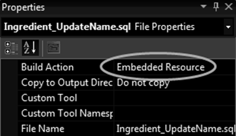
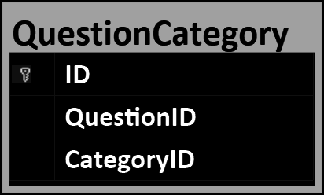
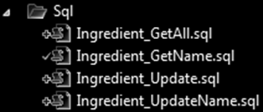

<style>.wrapper { max-width: 90% }</style>

🎁 API's
=========

[back](.)

This article describes some of the technology choices in this [software architecture](index.md).

<h3>Contents</h3>

- [Introduction](#introduction)
- [List of API's (and other tech)](#list-of-apis-and-other-tech)
  - [Code](#code)
  - [Data](#data)
  - [Logic](#logic)
  - [Presentation](#presentation)
  - [Debugging / Testing](#debugging--testing)
  - [Processing / IO](#processing--io)
  - [Other](#other)
- [More Elaborate Descriptions](#more-elaborate-descriptions)
- [Web](#web)
  - [AJAX](#ajax)
  - [JavaScript / TypeScript](#javascript--typescript)
  - [Html.BeginCollection](#htmlbegincollection)
  - [Html.BeginCollectionItem](#htmlbegincollectionitem)
- [Misc](#misc)
  - [JJ.Framework](#jjframework)
  - [Configuration](#configuration)
  - [OneToManyRelationship](#onetomanyrelationship)
  - [XML](#xml)
  - [Embedded Resources](#embedded-resources)
- [Data](#data-1)
  - [Entity Framework](#entity-framework)
  - [NHibernate](#nhibernate)
  - [ORM](#orm)
    - [Uncommitted Objects](#uncommitted-objects)
    - [Flush](#flush)
    - [Read-Write Order](#read-write-order)
    - [Bridge Entities](#bridge-entities)
    - [Binary Fields](#binary-fields)
    - [Inheritance](#inheritance)
      - [Problem: Entity / Proxy Type Mismatch](#problem-entity--proxy-type-mismatch)
      - [Problem: Base Proxy / Derived Proxy Type Mismatch](#problem-base-proxy--derived-proxy-type-mismatch)
      - [Problem: 2 Proxies / 1 Entity](#problem-2-proxies--1-entity)
      - [Problem: Query Performance](#problem-query-performance)
      - [Alternative: Unproxy for Reference Comparison](#alternative-unproxy-for-reference-comparison)
      - [Alternative: Unproxy for Type Evaluation](#alternative-unproxy-for-type-evaluation)
      - [Alternative: ID Comparison](#alternative-id-comparison)
      - [Alternative: 1-to-1 Relationship](#alternative-1-to-1-relationship)
      - [Alternative: Interfaces](#alternative-interfaces)
      - [Alternative: No Inheritance](#alternative-no-inheritance)
    - [Generic Interfaces](#generic-interfaces)
    - [Conclusion](#conclusion)
  - [SQL](#sql)
    - [With NHibernate](#with-nhibernate)
    - [SQL Files](#sql-files)
    - [SQL Strings](#sql-strings)
    - [String Concat](#string-concat)
    - [Behind Repositories](#behind-repositories)
    - [Database Upgrade Scripts](#database-upgrade-scripts)


Introduction
------------

This article lists some of the tech used in the [`JJ`](https://github.com/jjvanzon?tab=repositories) projects. Most are listed out in the [table](#list-of-apis-and-other-tech) below.

Some technology is described in more detail, mostly [data](#data-1) technologies, but also [web](#web) technology.


List of API's (and other tech)
------------------------------

### Code

<table>

<tr id="visual-studio">
  <th>
    <a href="https://visualstudio.microsoft.com/#vs-section">
       Visual Studio</a>
  </th>
  <td>
      Programming environment used for the development of the software.
  </td>
</tr>

<tr id="vs-code">
  <th>
    <a href="https://visualstudio.microsoft.com/#vscode-section">
       VS Code</a>
  </th>
  <td>
      Used for <a href="#mark-down"><code>MarkDown</code></a> editing.
  </td>
</tr>

<tr id="dotnet">
  <th><a href="https://dotnet.microsoft.com/">.NET</a></th>
  <td>Framework from Microsoft that forms the foundation of the software.</td>
</tr>

<tr id="mono">
  <th><a href="https://www.mono-project.com/">Mono</a></th>
  <td>Version of <a href="#dotnet"><code>.NET</code></a> that worked for other platforms than <code>Windows</code>. Later versions of <a href="#dotnet"><code>.NET</code></a> itself work on more platforms out-of-the-box.</td>
</tr>

<tr id="unity-game-engine">
  <th><a href="https://unity.com/">Unity Game Engine</a></th>
  <td>The first tech at that time, that would cooperate for deploying the code on multiple mobile platforms. It used the <a href="#mono"><code>Mono</code></a> compiler.</td>
</tr>

<tr id="csharp">
  <th>
    <a href="https://dotnet.microsoft.com/en-us/languages/csharp">
       C#</a>
  </th>
  <td>
      Primary programming language.
  </td>
</tr>

<tr id="visual-basic">
  <th>
    <a href="https://learn.microsoft.com/en-us/dotnet/visual-basic/">
       Visual Basic</a>
  </th>
  <td>
      Some projects might still use this programming language.
  </td>
</tr>

<tr id="resharper">
  <th>
    <a href="https://www.jetbrains.com/resharper">
       ReSharper</a>
  </th>
  <td>
      Tool for code formatting, refactoring and code smells and such.
  </td>
</tr>

<tr id="git">
  <th><a href="https://git-scm.com/">Git</a></th>
  <td>Source control, revision history, version management of the code.</td>
</tr>

<tr id="git-hub">
  <th><a href="https://github.com/jjvanzon">GitHub</a></th>
  <td>Where the source code is hosted and shared.</td>
</tr>

<tr id ="git-for-windows">
  <th><a href="https://gitforwindows.org/">Git for Windows</a></th>
  <td><code>Windows</code> version of <a href="#git"><code>Git</code></a>.</td>
</tr>

<tr id="git-extensions">
  <th><a href="https://gitextensions.github.io/">Git Extensions</a></th>
  <td>User interface for <a href="#git"><code>Git</code></a> with many options.</td>
</tr>

<tr id="tortoise-git">
  <th><a href="https://tortoisegit.org/">TortoiseGit</a></th>
  <td><a href="#git"><code>Git</code></a> user interface that shows state in <code>File Explorer</code>.</td>
</tr>

<tr id="azure-dev-ops">
  <th>
  <a href="https://dev.azure.com/jjvanzon/JJs-Software/_artifacts/feed/JJs-Pre-Release-Package-Feed">
      Azure DevOps</a>
  </th>
  <td>
      <a href="https://dev.azure.com/jjvanzon/JJs-Software/_build">Build pipeline</a>, <a href="https://dev.azure.com/jjvanzon/JJs-Software/_artifacts/feed/JJs-Pre-Release-Package-Feed">Pre-Release-Package-Feed</a>, original <a href="https://dev.azure.com/jjvanzon/JJs-Software/_workitems/">planning boards</a>, may host a <a href="https://dev.azure.com/jjvanzon/JJs-Software/_git/"> repository</a> not migrated to <a href="#git-hub"><code>GitHub</code></a>.
  </td>
</tr>

<tr id="github-issues">
  <th>
    <a href="https://docs.github.com/en/issues/tracking-your-work-with-issues/quickstart">
       GitHub Issues</a></th>
  <td>
      Gradually used more for planning.
  </td>
</tr>

<tr id="mark-down">
  <th>
    <a href="https://www.markdownguide.org/cheat-sheet">
       MarkDown</a></th>
  <td>
      Lightweight alternative for <code>HTML</code>. Used for documentation. Compatible with various web tech.
  </td>
</tr>

<tr>
  <th>
    <a href="#jjframework">
       JJ.Framework</a></th>
  <td>
      In-house programmed extensions to the <a href="#dotnet"><code>.NET Framework</code></a>.<br/>
      <a href="https://github.com/jjvanzon/JJ.Framework">GitHub</a> / 
      <a href="https://www.nuget.org/profiles/jjvanzon">NuGet</a> /
      <a href="https://dev.azure.com/jjvanzon/JJs-Software/_artifacts/feed/JJs-Pre-Release-Package-Feed">JJs-Pre-Release-Package-Feed</a>
  </td>
</tr>

<tr id="jj-framework-conversion">
  <th>
    <a href="https://www.nuget.org/packages/JJ.Framework.Conversion">
       JJ.Framework.Conversion</a>
  </th>
  <td>
      Makes it easier to convert simple types.
  </td>
</tr>

<tr id="jj-framework-reflection">
  <th>
    <a href="https://www.nuget.org/packages/JJ.Framework.Reflection">
       JJ.Framework.Reflection</a>
  </th>
  <td>
      Helps and speeds up accessing code structure elements through <a href="https://learn.microsoft.com/en-us/dotnet/framework/reflection-and-codedom/reflection">reflection</a> and <a href="https://learn.microsoft.com/en-us/dotnet/csharp/language-reference/operators/lambda-expressions">lambda expressions</a>.
  </td>
</tr>


<tr id="jj-canonical">
  <th>
    <a href="https://dev.azure.com/jjvanzon/JJs-Software/_artifacts/feed/JJs-Pre-Release-Package-Feed">
       JJ.Framework.Canonical</a>
  </th>
  <td>
      Types to share data between <code>JJ</code> projects. Small scale <a href="service-oriented-architecture.html#canonical-model"><code>Canonical</code></a> model for generic handling of <code>Successful</code> flags, <code>Validation Messages</code> and combinations of <code>IDs</code> and <code>Names</code>.
  </td>
</tr>

</table>

### Data

<table>

<tr id="sql-server">
  <th>
    <a href="https://www.microsoft.com/en-us/sql-server">
       SQL Server</a>
  </th>
  <td>
      Primary data store technology for relational databases.
  </td>
</tr>

<tr>
  <th><a href="#orm">ORM</a></th>
  <td>Hides most <a href="#sql"><code>SQL</code></a>, exposing an object graph, to focus on the logic, instead of on the data storage.</td>
</tr>

<tr>
  <th><a href="#sql">SQL</a></th>
  <td>For performance reasons <a href="#sql"><code>SQL</code></a> is hand-programmed incidentally, combined with <a href="#orm"><code>ORM</code></a>.</td>
</tr>

<tr>
  <th>
    <a href="#nhibernate">NHibernate</a>
  </th>
  <td>
      A type of <a href="#orm"><code>ORM</code></a>. Chosen in several <code>JJ</code> project because an employer also so happened to use it.
  </td>
</tr>

<tr id="query-over">
  <th>
    <a href="https://nhibernate.info/doc/nhibernate-reference/queryqueryover.html">
       QueryOver</a>
  </th>
  <td>
      A strongly-typed query language like <a href="#linq"><code>LINQ</code></a>, but then the <a href="#nhibernate"><code>NHibernate</code></a> version.
  </td>
</tr>

<tr id="fluent-nhibernate">
  <th>
    <a href="https://www.nuget.org/packages/FluentNHibernate">
       FluentNHibernate</a>
  </th>
  <td>
      A way to define <a href="#orm"><code>ORM</code></a> mappings with fluent notation.
  </td>
</tr>

<tr>
  <th>
    <a href="#entity-framework">Entity Framework</a>
  </th>
  <td>
      A type of <a href="#orm"><code>ORM</code></a>. Chosen less in the <code>JJ</code> projects, because of more experience with <a href="#nhibernate"><code>NHibernate</code></a>. Worth considering though.
  </td>
</tr>

<tr id="linq">
  <th>
      <a href="https://learn.microsoft.com/en-us/dotnet/csharp/linq/write-linq-queries">
         LINQ</a>
  </th>
  <td>
      A query language usable in <a href="#csharp"><code>C#</code></a>. Can query several types of data store, but commonly used for in-memory collections.
  </td>
</tr>

<tr id="jj-framework-collections">
  <th>
    <a href="https://www.nuget.org/packages/JJ.Framework.Collections">
       JJ.Framework.Collections</a>
  </th>
  <td><a href="#linq"><code>LINQ</code></a> extensions from the <a href="#jjframework"><code>JJ.Framework</code></a>.</td>
</tr>

<tr id="jj-framework-data">
  <th>
    <a href="https://dev.azure.com/jjvanzon/JJs-Software/_artifacts/feed/JJs-Pre-Release-Package-Feed/NuGet/JJ.Framework.Data">
       JJ.Framework.Data</a>
  </th>
  <td>
      Helps hide data access behind abstractions. It does not expose whether it is <a href="#sql-server"><code>SQL Server</code></a>, <a href="#sql"><code>SQL</code></a>, <a href="#orm"><code>ORM</code></a>, <a href="#nhibernate"><code>NHibernate</code></a> or <a href="#entity-framework"><code>Entity Framework</code></a>. It would just offer abstracted convenient methods instead. For more information see <a href="https://github.com/jjvanzon/JJ.Framework/tree/master/Framework/Data">documentation</a>.
  </td>
</tr>

<tr id="jj-framework-data-entity-framework">
  <th>
    <a href="https://dev.azure.com/jjvanzon/JJs-Software/_artifacts/feed/JJs-Pre-Release-Package-Feed/NuGet/JJ.Framework.Data.EntityFramework">
       JJ.Framework.Data.EntityFramework</a>
  </th>
  <td>
      <a href="#entity-framework"><code>Entity Framework</code></a> extension to work with <code>interfaces</code> from <a href="#jj-framework-data"><code>JJ.Framework.Data</code></a>.
  </td>
</tr>

<tr id="jj-framework-data-memory">
  <th>
    <a href="https://dev.azure.com/jjvanzon/JJs-Software/_artifacts/feed/JJs-Pre-Release-Package-Feed/NuGet/JJ.Framework.Data.Memory">
       JJ.Framework.Data.Memory</a>
  </th>
  <td>
      Extension to the <code>interfaces</code> specified in <a href="#jj-framework-data"><code>JJ.Framework.Data</code></a> that allow working with <em>in-memory</em> data for instance to <a href="patterns-other.html#mock">mock</a> a data store.
  </td>
</tr>

<tr id="jj-framework-data-nhibernate">
  <th>
    <a href="https://dev.azure.com/jjvanzon/JJs-Software/_artifacts/feed/JJs-Pre-Release-Package-Feed/NuGet/JJ.Framework.Data.NHibernate">
       JJ.Framework.Data.NHibernate</a>
  </th>
  <td>
      <a href="#nhibernate"><code>NHibernate</code></a> extension to work with <code>interfaces</code> from <a href="#jj-framework-data"><code>JJ.Framework.Data</code></a>.
  </td>
</tr>

<tr id="sql-executor">
  <th>
    <a href="https://dev.azure.com/jjvanzon/JJs-Software/_artifacts/feed/JJs-Pre-Release-Package-Feed/NuGet/JJ.Framework.Data.SqlClient">JJ.Framework.Data.SqlClient</a>
  </th>
  <td>
      Also know as <a href="https://dev.azure.com/jjvanzon/JJs-Software/_artifacts/feed/JJs-Pre-Release-Package-Feed/NuGet/JJ.Framework.Data.SqlClient"><strong><code>SqlExecutor</code></strong></a>. Work more easily with <a href="#sql"><code>SqlClient</code></a> with less code.
  </td>
</tr>

<tr id="jj-framework-data-xml">
  <th>
    <a href="https://dev.azure.com/jjvanzon/JJs-Software/_artifacts/feed/JJs-Pre-Release-Package-Feed/NuGet/JJ.Framework.Data.Xml">
       JJ.Framework.Data.Xml</a>
  </th>
  <td>
      An extension to <a href="#jj-framework-data"><code>JJ.Framework.Data</code></a> for storing in <a href="#xml"><code>XML</code></a> files. <code>System.Xml</code> is used internally.
  </td>
</tr>

<tr id="jj-framework-data-xml-linq">
  <th>
    <a href="https://dev.azure.com/jjvanzon/JJs-Software/_artifacts/feed/JJs-Pre-Release-Package-Feed/NuGet/JJ.Framework.Data.Xml.Linq">
       JJ.Framework.Data.Xml.Linq</a>
  </th>
  <td>
      Additional feature for <a href="#jj-framework-data"><code>JJ.Framework.Data</code></a> that stores data in <a href="#xml"><code>XML</code></a> files. <code>System.Xml.Linq</code> is used internally.
  </td>
</tr>

</table>

### Logic

<table>

<tr id="jj-framework-business">
  <th>
    <a href="https://www.nuget.org/packages/JJ.Framework.Business">
       JJ.Framework.Business</a>
  </th>
  <td>
      Types for supporting a business layer and/or <code>API</code>. <a href="#onetomanyrelationship">Bidirectional relationship synchronization</a>. <code>Result</code> types to pass data, succes flags and (<a href="patterns-business-logic.html#validators">validation</a>) messages. <a href="patterns-business-logic.html#sideeffects"><code>ISideEffect</code></a>: Used for some polymorphism between small pieces of business logic that go off as a result of data modification.
  </td>
</tr>

<tr id="jj-framework-validation">
  <th>
    <a href="https://dev.azure.com/jjvanzon/JJs-Software/_artifacts/feed/JJs-Pre-Release-Package-Feed/NuGet/JJ.Framework.Validation">
       JJ.Framework.Validation</a>
  </th>
  <td>
      A nice fluent notation for <a href="patterns-business-logic.html#validators">validations</a>.
  </td>
</tr>

<tr id="jj-framework-mathematics">
  <th>
    <a href="https://www.nuget.org/packages/JJ.Framework.Mathematics">
       JJ.Framework.Mathematics</a>
  </th>
  <td>
      Helpers for math things.
  </td>
</tr>

</table>

### Presentation

<h4>General</h4>

<table>

<tr id="pager-view-model-factory">
  <th>
    <a href="https://www.nuget.org/packages/JJ.Framework.Presentation">
       PagerViewModelFactory</a>
  </th>
  <td>
      Constructs a <code>PagerViewModel</code> with properties like
      <code>CanGoToFirstPage</code>, <code>CanGoToPreviousPage</code>, <code>CanGoToNextPage</code>, <code>CanGoToLastPage</code>.
  </td>
</tr>

</table>

<h4>Web</h4>

<table>

<tr id="iis">
  <th>
    <a href="https://www.iis.net/">IIS</a>
  </th>
  <td>
      Or <a href="https://www.iis.net/"><code>Internet Information Services.</code></a> For hosting web sites. 
      Some <a href="#visual-studio"><code>Visual Studio</code></a> projects like to use it upon load.
  </td>
</tr>

<tr id="mvc">
  <th>
    <a href="https://dotnet.microsoft.com/en-us/apps/aspnet/mvc">
       MVC</a>
    </th>
  <td>
      Or <a href="https://dotnet.microsoft.com/en-us/apps/aspnet/mvc"><code>Microsoft ASP.NET MVC Framework.</code></a> Web development tech. Code runs mostly server side.
  </td>
</tr>

<tr id="razor">
  <th>
    <a href="https://learn.microsoft.com/en-us/aspnet/web-pages/overview/getting-started/introducing-razor-syntax-c">
       Razor</a>
  </th>
  <td>
      A view renderer for web. Terse syntax, combining <a href="#csharp"><code>C#</code></a> and <code>HTML</code> almost seamlessly.
  </td>
</tr>

<tr id="javascript">
  <th>
    <a href="#javascript--typescript">
       JavaScript</a>
  </th>
  <td>
      Used to support UI details in web. In this <a href="index.html">architecture</a> most (UI) logic would be handled in <a href="#csharp"><code>C#</code></a> instead.
  </td>
</tr>

<tr id="typescript">
  <th>
    <a href="#javascript--typescript">
       TypeScript</a>
  </th>
  <td>
      Might be preferred over <a href="#javascript"><code>JavaScript</code></a> in the future.
  </td>
</tr>

<tr>
  <th><a href="#ajax">AJAX</a></th>
  <td>For retrieving / posting back parts of pages to the server and back.</td>
</tr>

<tr id="jquery">
  <th>
    <a href="https://jquery.com/">jQuery</a>
  </th>
  <td>
      Used to support UI details in web. Can make some <a href="#javascript"><code>JavaScript</code></a> shorter.</td>
</tr>

<tr id="jj-framework-javascript">
  <th>
    <a href="https://dev.azure.com/jjvanzon/JJs-Software/_artifacts/feed/JJs-Pre-Release-Package-Feed/NuGet/JJ.Framework.JavaScript">
       JJ.Framework.JavaScript</a>
  </th>
  <td>
      Used to support UI details in web.
      Remembering scroll position, cookie functions, URL parsing.
      Might be extended with one-line <a href="#ajax"><code>AJAX</code></a> functions one day.
  </td>
</tr>

<tr id="jj-framework-mvc">
  <th>
    <a href="https://dev.azure.com/jjvanzon/JJs-Software/_artifacts/feed/JJs-Pre-Release-Package-Feed/NuGet/JJ.Framework.Mvc">
       JJ.Framework.Mvc</a>
  </th>
  <td>
      Extensions to <a href="#mvc"><code>MVC</code></a> for web development.
  </td>
</tr>

<tr>
  <th>
    <a href="#htmlbegincollection">Html.BeginCollection</a>
  </th>
  <td>
      Part of <a href="#jj-framework-mvc"><code>JJ.Framework.Mvc</code></a>. Makes it possible to send tree structures over <code>HTTP</code> to the server-side <a href="#mvc"><code>MVC</code></a>.
  </td>
</tr>

<tr>
  <th>
    <a href="#htmlbegincollectionitem">Html.BeginCollectionItem</a>
  </th>
  <td>
      Alternative for <a href="#jjframework"><code>JJ.Framework</code></a>'s <a href="#htmlbegincollection"><code>Html.BeginCollection</code></a>.
      Allows sending a collection over <code>HTTP</code> to server-side <a href="#mvc"><code>MVC</code></a>, but not trees.
  </td>
</tr>

</table>

<h4>Win</h4>

<table>

<tr id="winforms">
  <th>
    <a href="https://learn.microsoft.com/en-us/dotnet/desktop/winforms/get-started/create-app-visual-studio">
       WinForms</a>
  </th>
  <td>
      Used in some projects: in small <a href="aspects.html#utilities">utilities</a> and <a href="https://github.com/jjvanzon/JJ.Synthesizer"><code>JJ.Synthesizer</code></a> uses it as the top-most layer.
  </td>
</tr>

<tr id="simple-process-form">
  <th><a href="https://dev.azure.com/jjvanzon/JJs-Software/_artifacts/feed/JJs-Pre-Release-Package-Feed/NuGet/JJ.Framework.WinForms">SimpleProcessForm</a></th>
  <td>Part of <a href="https://dev.azure.com/jjvanzon/JJs-Software/_artifacts/feed/JJs-Pre-Release-Package-Feed/NuGet/JJ.Framework.WinForms"><code>JJ.Framework.WinForms</code></a>. A base user interface for a <a href="aspects.html#utilities">utility</a> that runs a process.</td>
</tr>

<tr id="jj-framework-vectorgraphics">
  <th>
    <a href="https://dev.azure.com/jjvanzon/JJs-Software/_artifacts/feed/JJs-Pre-Release-Package-Feed/NuGet/JJ.Framework.VectorGraphics">
       JJ.Framework.VectorGraphics</a>
  </th>
  <td>
      A custom-programmed vector graphics model. Can be used for component-based user interfaces.
  </td>
</tr>

</table>

### Debugging / Testing

<table>

<tr id="mstest">
  <th>
    <a href="https://www.nuget.org/packages/MSTest.TestFramework">
       MSTest</a>
  </th>
  <td>
      For automated / unit testing. Seems a deprecated framework.
      Might upgrade, but it ain't on the top of the list.
  </td>
</tr>

<tr id="jj-framework-testing">
  <th>
    <a href="https://www.nuget.org/packages/JJ.Framework.Testing">
       JJ.Framework.Testing</a>
  </th>
  <td>
      Extends the <code><a href="#mstest">Assert</a> class</code>, but automatically includes the tested expression in the error messages.
  </td>
</tr>

<tr id="debugger-displays">
  <th>
    <a href="patterns-other.html#debuggerdisplays">
       DebuggerDisplays</a>
  </th>
  <td>
      A technique to quickly display helpful info in the watch screen of a programming environment.
  </td>
</tr>

<tr id="jj-framework-exceptions">
  <th>
    <a href="https://www.nuget.org/packages/JJ.Framework.Exceptions">
       JJ.Framework.Exceptions</a>
  </th>
  <td>
      Contains <code>Exception classes</code> for basic errors.
      Clear concise error messages,
      that include tested expressions and tested values.
  </td>
</tr>

<tr id="accessor">
  <th>
    <a href="patterns-other.html#accessor">Accessor</a>
  </th>
  <td>
      For accessing the internals of <code>types</code> for instance for testing purposes.
  </td>
</tr>

</table>

### Processing / IO

<table>

<tr id="jj-framework-text">
  <th>
    <a href="https://www.nuget.org/packages/JJ.Framework.Text">
       JJ.Framework.Text</a>
  </th>
  <td>
      Basic helpers for working with text.
  </td>
</tr>

<tr id="jj-framework-io">
  <th>
    <a href="https://www.nuget.org/packages/JJ.Framework.IO">
       JJ.Framework.IO</a>
  </th>
  <td>
      Contains various file functions, functions for working with streams and working with <code>CSV's</code>.
  </td>
</tr>

<tr id="jj-framework-htmltoxml">
  <th>
    <a href="https://dev.azure.com/jjvanzon/JJs-Software/_artifacts/feed/JJs-Pre-Release-Package-Feed/NuGet/JJ.Framework.HtmlToXml">
       JJ.Framework.HtmlToXml</a>
  </th>
  <td>
      <code>HtmlToXmlConverter class</code> that steals from <a href="https://www.nuget.org/packages/SgmlReaderOld/"><code>SgmlReader</code></a>. It does what its name implies.
  </td>
</tr>

<tr id="jj-framework-xml">
  <th>
    <a href="https://www.nuget.org/packages/JJ.Framework.Xml">
       JJ.Framework.Xml</a>
  </th>
  <td>
      A convenient way to map <a href="#xml"><code>XML</code></a> to (<a href="#csharp"><code>C#</code></a>) classes.<br/>
      Access <a href="#xml"><code>XML</code></a> nodes more safely, with null and uniqueness checks.
  </td>
</tr>

<tr id="jj-framework-xml-linq">
  <th>
    <a href="https://dev.azure.com/jjvanzon/JJs-Software/_artifacts/feed/JJs-Pre-Release-Package-Feed/NuGet/JJ.Framework.Xml.Linq">
       JJ.Framework.Xml.Linq</a>
  </th>
  <td>
      <a href="#jj-framework-xml">"</a>
  </td>
</tr>

<tr>
  <th><a href="#embedded-resources">Embedded Resources</a></th>
  <td>Embedded resources allow compiling files and content right inside a <code>DLL</code> or <code>EXE</code>.</td>
</tr>

<tr id="embedded-resource-reader">
  <th>
    <a href="https://www.nuget.org/packages/JJ.Framework.Common">
      EmbeddedResourceReader</a>
  </th>
  <td>
      Makes it a little easier to get <a href="#embedded-resources">embedded resource</a> <code>Streams</code>, <code>bytes</code> and <code>strings</code>.
  </td>
</tr>

</table>

### Other

<h4>Localization</h4>

<table>

<tr id="resource-strings">
  <th><a href="patterns-business-logic.html#resource-strings">Resource Strings</a></th>
  <td>For localization, <a href="patterns-business-logic.html#resource-strings"><code>resx</code></a> files can be used in <a href="#visual-studio"><code>Visual Studio</code></a>.</td>
</tr>

<tr id="jj-framework-resourcestrings">
  <th>
    <a href="https://dev.azure.com/jjvanzon/JJs-Software/_artifacts/feed/JJs-Pre-Release-Package-Feed/NuGet/JJ.Framework.ResourceStrings">
       JJ.Framework.ResourceStrings</a>
  </th>
  <td>
      Reusable button texts and such in multiple languages. For now supports Dutch, US English and some broken Polish.
  </td>
</tr>

<tr>
  <th><a href="aspects.html#localization">Localization</a></th>
  <td>More ideas about <a href="aspects.html#localization">localization</a>.</td>
</tr>

</table>

<h4>Configuration</h4>

<table>

<tr>
  <th>
    <a href="#configuration">
       JJ.Framework.Configuration</a>
  </th>
  <td>
      For working with complex <a href="#configuration">configuration</a> files. Easier than <code>System.Configuration</code>.
  </td>
</tr>

<tr>
  <th><a href="aspects.html#configuration">Configuration</a></th>
  <td>More info about <a href="aspects.html#configuration">configuration</a>.</td>
</tr>

</table>

<h4>Security</h4>

<table>

<tr id="jj-framework-security">
  <th>
    <a href="https://dev.azure.com/jjvanzon/JJs-Software/_artifacts/feed/JJs-Pre-Release-Package-Feed/NuGet/JJ.Framework.Security">
       JJ.Framework.Security</a>
  </th>
  <td>
      A generic interfacing for <a href="aspects.html#security">authenticating a user</a> and yet to be tested hashed salted password authentication.
  </td>
</tr>

<tr>
  <th>
    <a href="aspects.html#security">Security</a>
  </th>
  <td>
      If more might be needed security-wise, it may be hidden behind <a href="aspects.html#security">generic interfaces</a>, abstracting the security system.
  </td>
</tr>


</table>

<h4>Logging</h4>

<table>

<tr id="jj-framework-logging">
  <th>
    <a href="https://dev.azure.com/jjvanzon/JJs-Software/_artifacts/feed/JJs-Pre-Release-Package-Feed/NuGet/JJ.Framework.Logging">
       JJ.Framework.Logging</a>
  </th>
  <td>
      For now contains not much more than the <code>ExceptionHelper</code> class, which for instance converts <code>Exception</code> information to a <code>string</code>.
  </td>
</tr>

<tr>
  <th>
    <a href="aspects.html#logging">Logging</a>
  </th>
  <td>
      More info how <a href="#jj-framework-logging"><code>JJ.Framework.Logging</code></a> might be extended to contain more code for logging.
  </td>
</tr>

</table>


More Elaborate Descriptions
---------------------------

For some of these things you can find more elaborate descriptions below: mostly about [data](#data-1) store technologies, but also some about [web](#web) technology and [others](#misc).


Web
---

### AJAX

`AJAX` is a way to load part of a web page, so the whole page does not have to be refreshed. This may make the user interaction smoother, than reloading the entire page every time.

For `AJAX'ing` such partial web content, our team programmed [wrapper](patterns-other.md#wrapper) functions in [`JavaScript`](#javascript), around calls to [`jQuery`](#jquery), so we could `AJAX` with a single code line and handle both partial loads and full reloads the same way. It saved quite a few lines of [`JavaScript`](#javascript) code.

Our strategy was to prefer full loads, so we could keep most logic in the [`C#`](#csharp) realm. This before resorting to `AJAX` calls. See [First Full Load – Then Partial Load – Then Native Code](patterns-presentation.md#first-full-load--then-partial-load--then-native-code).

### JavaScript / TypeScript

[`JavaScript`](https://www.javascript.com/) is a programming language with a wide range of applications. Originally it was run in web browsers to optimize the user experience.

[`JavaScript`](https://www.javascript.com/) was less preferred as an architectural choice. [`JavaScript's`](https://www.javascript.com/) weak type system played a role. The strange behavior and trickiness in [`JavaScript`](https://www.javascript.com/) (part due to this weak typing) gave it less appeal.

For web, other technology was preferred in this [architecture](index.md): The idea behind [`MVC`](#mvc) was logic on the server-side. [`Views`](patterns-presentation.md#views) were in [`Razor`](#razor). Best to keep most logic [`C#`](#csharp) was the idea.

[`JavaScript`](https://www.javascript.com/) would easily get bloated, getting out of hand from a maintainability perspective, was the prevailing opinion. You could refactor [`C#`](#csharp) code, upon which lots of the [`JavaScript`](https://www.javascript.com/) might break unexpectedly, with an error message tucked away in some console window, instead of right in your face when compiling.

[`TypeScript`](https://www.typescriptlang.org/) may have saved the day to cover for the weak typing from [`JavaScript`](https://www.javascript.com/). But we hadn't tried that yet.

But still: logic in one place in one language ([`C#`](#csharp)) felt so nice. I guess the love for [`C#`](#csharp) was strong.

The idea was that a full page load was 1<sup>st</sup> choice, [`AJAX'ing`](#ajax) the 2<sup>nd</sup> choice, and last in line [`JavaScript`](https://www.javascript.com/) *only* to support the user interaction. No business logic. See also: [First Full Load – Then Partial Load – Then Native Code](patterns-presentation.md#first-full-load--then-partial-load--then-native-code).

For this last-resort [`JavaScript`](https://www.javascript.com/) we used [`jQuery`](#jquery) and some home-programmed [`JavaScript`](https://www.javascript.com/) libraries: [`JJ.Framework.JavaScript`](#jj-framework-javascript) which had some merit, but may have been superseded by newer tech by now.

I realize [`JavaScript`](https://www.javascript.com/) is popular with a lot of people and that this is a powerful force. I don't know how my opinion would change, if I would try a newer [`JavaScript`](https://www.javascript.com/) version, [`TypeScript`](https://www.typescriptlang.org/), newer tech and libraries. My heart says I'd rather stick with [`C#`](#csharp) though.

### Html.BeginCollection

In [`MVC`](#mvc) it is not so straightforward to [`HTTP` a tree structure in postdata](aspects.md#postdata-over-http).

[`JJ.Framework.Mvc`](#jj-framework-mvc) makes that easier, by offering an `HtmlHelper` extensions: [`Html.BeginCollection`](https://dev.azure.com/jjvanzon/JJs-Software/_artifacts/feed/JJs-Pre-Release-Package-Feed/NuGet/JJ.Framework.Mvc). Using that `API` you can send a [`ViewModel`](patterns-presentation.md#viewmodels) with arbitrary nestings and collections over the line. It would be restored as a [`ViewModel`](patterns-presentation.md#viewmodels) at the server side.

In the [`View`](patterns-presentation.md#views) code you would wrap each nesting inside a `using` block:

```cs
@using (Html.BeginItem(() => Model.MyItem))
{
    using (Html.BeginCollection(() => Model.MyItem.MyCollection))
    {
        foreach (var x in Model.MyItem.MyCollection)
        {
            using (Html.BeginCollectionItem())
            {
                ...
            }
        }
    }
}
```

So each time you enter a level, the `HtmlHelper` is called again and the code wrapped in a `using` block.

There can be as many collections as needed, and as much nesting as you like. The nesting can even be spread around multiple partial [views](patterns-presentation.md#views).

Input fields in a nested structure look as follows:

```cs
Html.TextBoxFor(x => x.MyProperty)
```

Or:

```cs
Html.TextBoxFor(x => Model.MyProperty)
```

But not like this:

```cs
Html.TextBoxFor(x => myLoopItem.MyItem.MyProperty)
```

Otherwise the input fields might not bind to the [`ViewModel`](patterns-presentation.md#viewmodels). This may force you to program partial [`Views`](patterns-presentation.md#views) sometimes. That may be good practice anyway, so might not be such a big trade-off.

### Html.BeginCollectionItem

In [`MVC`](#mvc) it is not so apparent how to [send a collection as `HTTP postdata`](aspects.md#postdata-over-http).

One alternative is the often-used [`Html.BeginCollectionItem`](https://www.nuget.org/packages/BeginCollectionItem):

```cs
@foreach (var child in Model.Children)
{
    using (Html.BeginCollectionItem("Children"))
    {
        ...
    }
}
```

This `API` has some limitations:

- It can send *one* collection over the wire, not trees.
- It takes a `string` a parameter, not an expression like: `() => Model.Children`.

To send trees and arbitrary nestings over `HTTP postdata`, consider using [`Html.BeginCollection`](#htmlbegincollection) from [`JJ.Framework.Mvc`](#jj-framework-mvc).


Misc
----

### JJ.Framework

[`JJ.Framework`](https://www.nuget.org/profiles/jjvanzon) are nuts, bolts and screws for software development. There were things missing in [`.NET`](#dotnet), so we programmed our own. These extensions to [`.NET`](#dotnet) are compact and reusable. They can be found on [NuGet](https://www.nuget.org/profiles/jjvanzon). The lesser-tested ones on [JJs-Pre-Release-Package-Feed](https://dev.azure.com/jjvanzon/JJs-Software/_artifacts/feed/JJs-Pre-Release-Package-Feed). You can read more information of it on the [GitHub](https://github.com/jjvanzon/JJ.Framework) repository.

They were made in the spirit of in-house developing small extensions and hiding platform-specific details behind [generalized interfaces](layers.md#loosely-coupled). They are sort part of the [software architecture](index.md) described here.

### Configuration

[`.NET`](#dotnet) code can use configuration files, often named `App.config` or `Web.config`.

To access these `configs` we might use [`JJ.Framework.Configuration`](https://www.nuget.org/packages/JJ.Framework.Configuration) quite a bit more easily than using [`.NET's`](#dotnet) `System.Configuration` directly.

You might read from its [`README`](https://www.nuget.org/packages/JJ.Framework.Configuration) how it works.

It does not seem to support reading out the `connectionStrings` section yet. So here is an idea how that might work, would it ever be programmed.

<h4>ConnectionStrings</h4>

Reading out `connectionStrings` might be made similar to reading out the [`appSettings`](https://www.nuget.org/packages/JJ.Framework.Configuration#appsettingsreadert). Connection strings in the `App.config` or `Web.config` may look as follows:

```xml
<connectionStrings>
  <add name="OrderDB" connectionString="data source=192.168.XX.XX;Initial Catalog=OrderDB..." />
</connectionStrings>
```

This would be the *classic* way of reading it out:

```cs
string connectionString =
    ConfigurationManager.ConnectionStrings["OrderDB"].ConnectionString;
```

This would be the alternative in `JJ.Framework.Configuration`:

```cs
string connectionString = 
    ConnectionStrings<IConnectionStrings>.Get(x => x.OrderDB);
```

You can define an `interface` to use the strongly-typed name:

```cs
internal interface IConnectionStrings
{
    string OrderDB { get; }
}
```

### OneToManyRelationship

*Bidirectional relationship synchronization* allows for automatic synchronization of related properties in a parent-child relationship. By setting the parent property, `product.Supplier = mySupplier`, the child collection, `mySupplier.Products`, will also be updated to include `myProduct`.

This can be achieved through the use of classes such as [`ManyToOneRelationship`](https://www.nuget.org/packages/JJ.Framework.Business#onetomanyrelationship-manytoonerelationship) and [`OneToManyRelationship`](https://www.nuget.org/packages/JJ.Framework.Business#onetomanyrelationship-manytoonerelationship) from the [`JJ.Framework.Business`](#jj-framework-business) package, which can be used in various models: [rich](patterns-other.md#rich-models), [entity](patterns-data-access.md#entities), `API` or otherwise.

There may be other options available. [`NHibernate`](#nhibernate) does not appear to do it for us automatically. However [`Entity Framework`](#entity-framework) might do this synchronization automatically. The [`LinkTo`](patterns-business-logic.md#linkto) pattern can also be used. Or hand-writing the syncing in-place. 

### XML

`XML` is a file format for storing and transmitting data. When working with `API's` for `XML` there are a few options to consider.

In most cases, it is recommended to use `XElement` (LINQ to XML) instead of `XmlDocument`. However, a useful feature of `XmlDocument` is that it supports [`XPath`](https://www.w3schools.com/xml/xpath_intro.asp).

To handle nullability and uniqueness more gracefully, it is suggested to use `XmlHelper` methods from [`JJ.Framework.Xml`](#jj-framework-xml) or [`JJ.Framework.Xml.Linq`](#jj-framework-xml-linq) over using other `API's` directly.

For converting `XML` to an object graph, [`XmlToObjectConverter`](https://www.nuget.org/packages/JJ.Framework.Xml#xmltoobjectconverter) and [`ObjectToXmlConverter`](https://www.nuget.org/packages/JJ.Framework.Xml#xmltoobjectconverter) from [`JJ.Framework.Xml`](#jj-framework-xml) and [`JJ.Framework.Xml.Linq`](#jj-framework-data-xml-linq) might be useful. They can offer simpler solutions than other `API's`.

### Embedded Resources

*Embedded resources* might be handy, to prevent including loose files with a deployment. Instead they are compiled right into your program files' `EXE` or `DLL`. This also protects those resources a bit better against modifications.

To include a file as an embedded resource, you could set the following property in [`Visual Studio`](#visual-studio):



[`JJ.Framework.Common`](https://www.nuget.org/packages/JJ.Framework.Common) contains a [`Helper`](patterns-other.md#helper) `class` [`EmbeddedResourceReader`](#embedded-resource-reader). It makes it a little bit easier to access those resources from your code:

```cs
string text = EmbeddedResourceReader.GetText(assembly, "Ingredient_UpdateName.sql");
```

Data
----

### Entity Framework

[`Entity Framework`](https://www.nuget.org/packages/EntityFramework) is a framework for data access, a so called [`ORM`](#orm) (**O**bject **R**elational **M**apper). [`Entity Framework`](https://www.nuget.org/packages/EntityFramework) might be hidden behind abstractions using [`JJ.Framework.Data.EntityFramework`](#jj-framework-data-entity-framework) and [repository interfaces](patterns-data-access.md#repository-interfaces).

At one point we noticed a slow down in [`JJ.Framework.Data.EntityFramework`](#jj-framework-data-entity-framework). But it hadn't even been modified. Probably caused by an upgrade to a newer version of [`Entity Framework`](https://www.nuget.org/packages/EntityFramework). Unfortunately [`JJ.Framework.Data.EntityFramework`](#jj-framework-data-entity-framework) was not upgraded since then. The reason was most apps used [`NHibernate`](#nhibernate) instead.

When using [`Entity Framework`](https://www.nuget.org/packages/EntityFramework), transactions might not work unless you enable `MSDTC` (**M**icrosoft **D**istributed **T**ransaction **C**oordinator). That is a `Windows` service belonging to the [`SQL Server`](#sql-server) installation.

### NHibernate

[`NHibernate`](https://www.nuget.org/packages/NHibernate) is a technology used for data access. A so called [`ORM`](#orm) (**O**bject **R**elational **M**apper). It is comparable to [`Entity Framework`](#entity-framework).

[`NHibernate`](https://www.nuget.org/packages/NHibernate) is used in some projects, because an employer favored it, and other projects joined the club.

[`NHibernate`](https://www.nuget.org/packages/NHibernate) might be hidden behind abstractions using [`JJ.Framework.Data.NHibernate`](#jj-framework-data-nhibernate) and [repository interfaces](patterns-data-access.md#repository).

### ORM

An `ORM` aims to make it easier to focus on the logic around an [entity](patterns-data-access.md#entities) model, while saving things to a database is pretty much done for you.

Here follow some issues you could encounter while using an `ORM`, and some suggestions for how to deal with it.

This information was gathered from experience, built up with [`NHibernate`](#nhibernate). It might be possible that other `ORM's` have similar issues, due to how `ORM's` work internally.

#### Uncommitted Objects

Here is something that happens in [`ORM`](#orm) sometimes:

Some methods of data retrieval work with uncommitted / non-flushed [entities](patterns-data-access.md#entities): so things that are newly created, and not yet committed to the data store. Other methods of data retrieval do the opposite: only returning committed / flushed [entities](patterns-data-access.md#entities). This asymmetry might be common in [`ORM's`](#orm), since doing it another way might harm performance considerably:

| Method | Data Read |
|--------|----------|
| `IContext.Query` | committed
| `IContext.Get` | 1st committed, then uncommitted
| `IContext.TryGet` | 1st committed, then uncommitted
| Navigation properties /<br>following the object graph | 1st committed, then uncommitted

It appears to have to do with, when the [`ORM`](#orm) goes to the database to query for objects.

#### Flush

`Flushing` in [`NHibernate`](#nhibernate) would mean that all the pending [`SQL`](#sql) statements are executed onto the database, without committing the transaction yet.

A `Flush` can help get an auto-generated `ID` from the database. Also, sometimes when [`NHibernate`](#nhibernate) is confused about the order in which to execute things, a `Flush` may help it execute things in the right order.

The trouble with `Flush` is, that it might be executed when things are not done yet, and incomplete data might go to the database, upon which database may give an error. So it is a thing to use sparsely only with a good reason, because you can expect some side-effects.

`Flushes` might also go off automatically. Sometimes [`NHibernate`](#nhibernate) wants to get a data-store generated ID. This can happen calling `Save` on an [entity](patterns-data-access.md#entities). Unlike the documentation suggests, `FlushMode.Never` or `FlushMode.Commit` may not prevent these intermediate flushes.

Upon saving a parent object, child objects might be flushed too. Internally then [`NHibernate`](#nhibernate) asked itself the question if the child object was `Transient` and while doing so, it apparently wanted to get its identity, by executing an `insert` statement onto the data store. This once caused a `null` [`Exception`](aspects.md#exceptions) on the child object's `ParentID` column.

It may also help to create [entities](patterns-data-access.md#entities) in a specific order (e.g. parent object first, child objects second) or choose a identity generation scheme, that does not require flushing an [entity](patterns-data-access.md#entities) pre-maturely.

#### Read-Write Order

It seems [`ORM's`](#orm) like it when you first read the data out, and then start writing to it. Not read, write some, read a little more, write some more. It may have to do with how it queries the database and handles [committed / uncommitted objects](#committed--uncommitted-objects).

#### Bridge Entities

An *bridge* [entity](patterns-data-access.md#entities) applies to `n => n` relationships and may require an additional table to make the link between the [entities](patterns-data-access.md#entities):


Using an [`ORM`](#orm), the bridge [entity](patterns-data-access.md#entities) might not be visible in the code, but can be managed as two collections inside the two main [entities](patterns-data-access.md#entities):

```cs
class Question
{
    IList<Category> Categories { get; set; }
}

class Category
{
    IList<Question> Questions { get; set; }
}
```

The [`ORM`](#orm) can do quite a bit of magic under the hood, to keep these collections in sync. Perhaps a little too much for its own good. You might expect quite a few [`Exceptions`](aspects.md#exceptions) to go off, while [`ORM`](#orm) tries to guard the integrity of the relationship.

These problems almost all go away, if you map a *bridge* [entity](patterns-data-access.md#entities) instead. This turns the `n => n` relationship into two `1 => n` relationships which [`ORM`](#orm) can manage with less hardship. You can let both [entities](patterns-data-access.md#entities) hold a list of *bridge* [entities](patterns-data-access.md#entities) instead. In turn, the bridge [entity](patterns-data-access.md#entities) would link back to the two main [entities](patterns-data-access.md#entities):

```cs
class QuestionCategory
{
    Question Question { get; set;}
    Category Category { get; set;}
}

class Question
{
    IList<QuestionCategory> QuestionCategories { get; set; }
}

class Category
{
    IList<QuestionCategory> CategoryQuestions { get; set; }
}
```

This also has the advantage, that the [entity](patterns-data-access.md#entities) model would not need to be refactored, if you'd want to add properties to a *combination* of things.

It might be advised, that the bridge table not rely on a *composite* key of the two `ID's`. A single *surrogate* `ID` might do better:



This is because it gives 1 handle to the combination of 2 thing. This gives [`ORM`](#orm) less difficulty managing things under the hood, prevents passing around composite keys, lower quality hash codes, URLs that don't look pretty, etc.

#### Binary Fields

You might not want to map *binary* and other *serialized data* fields using [`ORM`](#orm), because it can harm performance quite a bit.

Retrieving some loose fields of an [entity](patterns-data-access.md#entities), would also retrieve a blob in that case. As well as saving a whole blob, when changing just a few fields. That data transmission can be quite a bottle-neck sometimes.

Using separate [`SQL`](#sql) statements for retrieving blobs might be a better alternative.

#### Inheritance

Particular surprises might emerge when using *inheritance* in your [entity](patterns-data-access.md#entities) model at least while working with [`NHibernate`](#nhibernate). The main advice is to avoid inheritance at all in the [entity](patterns-data-access.md#entities) models if you can.

##### Problem: Entity / Proxy Type Mismatch

When retrieving an [entity](patterns-data-access.md#entities) through [`ORM`](#orm), it will likely not return an instance of your [entity](patterns-data-access.md#entities) type, but an instance of a type derived from your [entity](patterns-data-access.md#entities), a so called `Proxy`. This `Proxy` adds to your [entity](patterns-data-access.md#entities) a sort of connectedness to the database.

##### Problem: Base Proxy / Derived Proxy Type Mismatch

When you retrieved an [entity](patterns-data-access.md#entities) from `NHibernate` that has inheritance, using the base type it returns a `Proxy` of the base type instead of a `Proxy` of the derived type, which makes reference comparisons between base `Proxies` and derived class `Proxies` fail.

##### Problem: 2 Proxies / 1 Entity

But you can also get failing reference comparisons another way. If you `Unproxied` a derived type, and retrieve another `Proxy` of the derived type, reference comparison might also fail.

##### Problem: Query Performance

It can also harm performance of queries, getting a lot of `left joins`: one for each derived class' table.

##### Alternative: Unproxy for Reference Comparison

You can then `Unproxy` both and it will return the underlying object, which is indeed of the derived class, upon which reference comparison succeeds.

##### Alternative: Unproxy for Type Evaluation

To evaluate the *type*, you are better of `Unproxying` as well. Otherwise it will compare `Proxy` types instead of your [entity](patterns-data-access.md#entities) type. This can be confusing.

##### Alternative: ID Comparison

[ID comparison](code-style.md#entity-equality-by-id) could avoid this problem that surrounds [entity](patterns-data-access.md#entities) equality checks.

##### Alternative: 1-to-1 Relationship

An alternative for inheritance might be, to use a `1-to-1` related object to represent the base of the [entity](patterns-data-access.md#entities). Although, [`NHibernate`](#nhibernate) and other [`ORM's`](#orm) are  not a fan of `1 => 1` relationships either. What may save the day, is to map the relationship one-way only and not bidirectionally, so the [`ORM`](#orm) gets less confused.

##### Alternative: Interfaces

Letting two [entity](patterns-data-access.md#entities) types use a mutual `interface` might be an alternative too.

##### Alternative: No Inheritance

By now maybe it may be clear, that the main advice is not to use inheritance in the first place in your [entity](patterns-data-access.md#entities) models, if at all possible.

#### Generic Interfaces

Data access in this [architecture](index.md) is favored behind generic interfaces from [`JJ.Framework.Data`](#jj-framework-data).

#### Conclusion

If this makes you lose grip on reality and wonder whether [`ORM's`](#orm) are worth it? Well, they might be. They allow you to program focusing on the meaning of things, rather than how to store it. Even though that is ambiguous because the story above suggests you'd still be better off knowing what it does and how it does it. You just don't need to do it yourself anymore.

### SQL

[`SQL`](https://learn.microsoft.com/en-us/training/paths/get-started-querying-with-transact-sql) is a language for data retrieval and manipulation and other actions executed onto a *database*.

Executing queries onto a database would normally be done through [`ORM`](#orm), but if performance is an issue, it can be combined with raw [`SQL`](https://learn.microsoft.com/en-us/training/paths/get-started-querying-with-transact-sql).

Other techniques, like *stored procedures* and *views* were dismissed at one point, in favor of putting the [`SQL`](https://learn.microsoft.com/en-us/training/paths/get-started-querying-with-transact-sql) files directly the [`.NET`](#dotnet) projects, under a sub-folder named `Sql`:


The classic way of executing [`SQL`](#sql) in [`.NET`](#dotnet) would be to use `System.Data.SqlClient`. But in this [architecture](index.md) the [`SqlExecutor API`](#sql-executor) might be used.

With an `API` like that, we can execute [`SQL`](#sql) command in a strongly-typed way, often with only a single line of code.

The first choice of doing it might be to make the [`SQL`](#sql) files embedded resources:


This deploys the [`SQL`](#sql) together with your `EXE` or `DLL`, because compiles the [`SQL`](#sql) file right into the assembly.

The [`SQL`](#sql) may look as follows:

```sql
update Ingredient set Name = @name where ID = @id;
```

Then you can put an enum in the [`Sql`](#sql) folder in your `.NET` project:


Add `enum` members that correspond to the file names of the [`SQL`](#sql) files:

```cs
namespace JJ.Demos.SqlExecutor.Sql
{
    internal enum SqlEnum
    {
        Ingredient_UpdateName
    }
}
```

Then an [`SqlExecutor`](#sql-executor) can be created as follows:

```cs
ISqlExecutor sqlExecutor = SqlExecutorFactory.CreateSqlExecutor(
    SqlSourceTypeEnum.EmbeddedResource, connection, transaction);
```

We passed the `SqlConnection` and `SqlTransaction` to it.

Then you can call a method that executes the [`SQL`](#sql):

```cs
sqlExecutor.ExecuteNonQuery(SqlEnum.Ingredient_UpdateName, new { id, name });
```

Its method names are similar to an `SqlCommand`. [`SQL`](#sql) parameters can be passed along as an anonymous type:

```cs
new { id, name }
```

The name and type of `id` and `name` correspond to the parameters of the [`SQL`](#sql). You do not need to use an anonymous type. You can use any object. As long as its properties correspond to the [`SQL`](#sql) parameters:

```cs
var ingredient = new IngredientDto
{
    ID = 10,
    Name = "My ingredient"
};

sqlExecutor.ExecuteNonQuery(SqlEnum.Ingredient_UpdateName, ingredient);
```

You can also retrieve records as a collection of strongly typed objects:

```cs
IList<IngredientDto> records = sqlExecutor.ExecuteReader<IngredientDto>(SqlEnum.Ingredient_GetAll).ToArray();

foreach (IngredientDto record in records)
{
    // ...
}
```

The column names in the [`SQL`](#sql) are *case sensitive!*

It might be an idea to let the [`SQL`](#sql) file names begin with the [entity](patterns-data-access.md#entities) type name, so they stay grouped together:



#### With NHibernate

If you use [`SqlExecutor`](#sql-executor) in combination with [`NHibernate`](#nhibernate) you might want to 
use the [`NHibernateSqlExecutorFactory`](#jj-framework-data-nhibernate) instead of the default [`SqlExecutorFactory`](#sql-executor):

```cs
ISession session = ...;

ISqlExecutor sqlExecutor = NHibernateSqlExecutorFactory.CreateSqlExecutor(
    SqlSourceTypeEnum.EmbeddedResource, session);
```

This version uses an `ISession`. In order for the [`SQL`](#sql) to run in the same transaction as [`NHibernate`](#nhibernate), we made it aware of its `ISession`.

An implementation of [`NHibernateSqlExecutorFactory`](#jj-framework-data-nhibernate) can be found in [`JJ.Framework.Data.NHibernate`](#jj-framework-data-nhibernate).

#### SQL Files

*(This feature might not be available in the [`JJ.Framework`](#jjframework).)*

It might be a good choice to include the [`SQL`](#sql) as an embedded resource, but you can also use loose *files:*


Here is code to create the [`SqlExecutor`](#sql-executor) and execute the [`SQL`](#sql) file:

```cs
ISqlExecutor sqlExecutor = NHibernateSqlExecutorFactory.CreateSqlExecutor(
    SqlSourceTypeEnum.FileName, session);

sqlExecutor.ExecuteNonQuery(@"Sql\Ingredient_Update.sql", new { id, name });
```

So the `SqlEnum` cannot be used here. You'd use a (relative) file path.

#### SQL Strings

*(This feature might not be available in the [`JJ.Framework`](#jjframework).)*

It is not recommended to use [`SQL`](#sql) strings in your code. But it is possible all the same using code like this:

```cs
ISqlExecutor sqlExecutor = NHibernateSqlExecutorFactory.CreateSqlExecutor(
    SqlSourceTypeEnum.String, session);

sqlExecutor.ExecuteNonQuery("update Ingredient set Name = @name where ID = @id", new { id, name });
```

In that case no [`SQL`](#sql) files have to be included in your project.

But it might make it harder to track down all the [`SQL`](#sql) of your project and optimize it. Using [`SQL`](#sql) strings may also circumvent another layer of protection against [`SQL`](#sql) injection attacks.

#### String Concat

*[`SQL`](#sql) `string` concatenation* is sort of a no-no, because it removes a layer of protection against [`SQL`](#sql) injection attacks. `SqlClient` has `SqlParameters` from [`.NET`](#dotnet) to prevent unwanted insertion of scripting. [`SqlExecutor`](#sql-executor) from [`JJ.Framework`](#jjframework) uses `SqlParameters` under the hood, to offer the same kind of protection. This *encodes* the parameters, so that they are recognized as simple types or string values rather than additional scripting.

Here is a trick to prevent the use of `string` concatenation: When you want to filter something conditionally, depending on a parameter being filled in or not, then the following expression might be used in the [`SQL`](#sql) script's `where` clause:

```sql
(@value is null or Value = @value)
```

But there might be exceptional cases where [`SQL`](#sql) string concatenation would be favorable. Reasons to do so might include:

- You have a (complicated) [`SQL`](#sql) `select` statement and wish to take the `count` of it. String concatenation may prevent rewriting the [`SQL`](#sql) statement twice, introducing a maintenance issue. Bugs would be awaiting as you'd have to change 2 [`SQL`](#sql) scripts simultaneously, to make a change properly, which may easily be overlooked.
- Another case where `string` concatenation might be helpful, is an [`SQL`](#sql) script where you wish to include a *database name* or *schema name*.
- There might be other examples where [`SQL`](#sql) string concatenation might be used as an exception to the rule.

One variation of [`SqlExecutor`](#sql-executor) included the ability to add placeholders to the [`SQL`](#sql) files to insert additional scripting for this purpose. *(This feature might not be available in the [`JJ.Framework`](#jjframework).)* 

#### Behind Repositories

The [`repository`](patterns-data-access.md#repository) pattern is used in this [architecture](index.md).  
The [`repository`](patterns-data-access.md#repository) pattern can be used together with [`JJ.Framework.Data`](#jj-framework-data).  

Using [`SQL`](#sql) combined with [`repositories`](patterns-data-access.md#repository) can be simplified with [`SqlExecutor`](#sql).

Here is some pseudo-code to demonstrate how it is put together:

`FilterIDs.sql`

```sql
select ID from MyEntity
where CategoryID = @categoryID
and MinStartDate >= @minStartDate
```

[`C#:`](#csharp)

```cs
enum SqlEnum
{
    FilterIDs
}

class MySqlExecutor
{
    public var FilterIDs(int categoryID, DateTime minStartDate)
    {
        return SqlExecutor.ExecuteReader<int>(
            SqlEnum.FilterIDs, new { categoryID, minStartDate });
    }
}

class MyRepository : RepositoryBase
{
    public var Filter(int categoryID, DateTime minStartDate)
    {
        var ids = MySqlExecutor.FilterIDs(categoryID, minStartDate);

        var entities = ids.Select(x => Get(x));

        return entities;
    }
}

interface IMyRepository : IRepository
{
    var Filter(int categoryID, DateTime minStartDate);
}
```

This would result in:

- Keeping all the queries of an [entity](patterns-data-access.md#entities) together in a [`repository`](patterns-data-access.md#repository).
- Keeping overview of all the [`SQL`](#sql) of all the [entities](patterns-data-access.md#entities) behind an [`SqlExecutor`](#sql-executor).
- All that data access would be hidden behind [`repository interfaces`](patterns-data-access.md#repository-interfaces) decoupling the persistence technology.
 
It may seem overhead all the layers, but it might add up after adding more queries for more [entities](patterns-data-access.md#entities), that are either [`SQL`](#sql) or [`ORM`](#orm) queries. Of course you could skip layers, but this is how it is done in some of the `JJ` projects.

You might also find split up into separate assemblies: 

- `MyProject.Data`  
- `MyProject.Data.EntityFramework`
- `MyProject.Data.SqlClient`

Separating the general things from the technology-specific things.

#### Database Upgrade Scripts

[`SQL`](#sql) executed solely for database upgrading, might not be put in the main projects, but a project on the side. Suggestions of how to organize database upgrading might be found [here](database-conventions.md#upgrade-scripts).

[back](.)