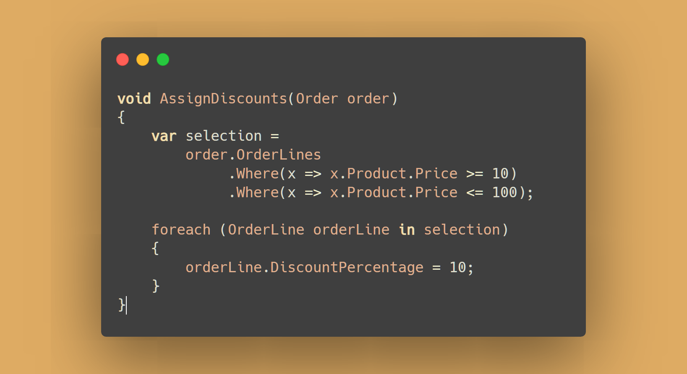

📀 ORM
=======

[back](.)

An [`ORM`](#-orm) aims to make it easier to focus on the logic around [entity](../patterns/data-access.md#entities) objects, while saving things to a database is pretty much done for you.



<h2>Contents</h2>

- [Introduction](#introduction)
- [Binary Fields](#binary-fields)
- [Read-Write Order](#read-write-order)
- [Bridge Entities](#bridge-entities)
- [Inheritance](#inheritance)
- [Generic Interfaces](#generic-interfaces)
- [Uncommitted Objects](#uncommitted-objects)
- [Flush](#flush)
- [Entity Framework](#entity-framework)
- [NHibernate](#nhibernate)
- [Conclusion](#conclusion)


Introduction
------------

This article covers specific anomalies you may encounter while using an [`ORM`](#-orm). It also offers suggestions, how to deal with it.

This article won't go into the basics of using [`ORM`](#-orm). There's other resources for that.

This information was gathered from experience, built up with [`NHibernate`](#nhibernate). It might be possible that other [`ORM's`](#-orm) have similar issues, due to how [`ORM's`](#-orm) work internally.


Binary Fields
-------------

You might not want to map *binary* and other *serialized data* fields using [`ORM`](#-orm), because it can harm performance quite a bit.

Retrieving some loose fields of an [entity](../patterns/data-access.md#entities), would also retrieve a blob in that case. As well as saving a whole blob, when changing just a few fields. That data transmission can be quite a bottle-neck sometimes, especially in a multi-user environment.

Using separate [`SQL`](sql.md) statements for retrieving blobs might be a better alternative.


Read-Write Order
----------------

It seems [`ORM's`](#-orm) like it when you first read the data out, and then start writing to it. Not read, write some, read a little more, write some more. It may have to do with its way of querying the database, caching things and how it handles [committed and uncommitted objects](#uncommitted-objects).


Bridge Entities
---------------

An *bridge* [entity](../patterns/data-access.md#entities) applies to `n => n` relationships and may require an additional table to make the link between the [entities](../patterns/data-access.md#entities):


Using an [`ORM`](#-orm), the bridge [entity](../patterns/data-access.md#entities) might not be visible in the code, but can be managed as two collections inside the two main [entities](../patterns/data-access.md#entities):

```cs
class Question
{
    IList<Category> Categories { get; set; }
}

class Category
{
    IList<Question> Questions { get; set; }
}
```

The [`ORM`](#-orm) can do quite a bit of magic under the hood, to keep these collections in sync. Perhaps a little too much for its own good. You might expect quite a few [`Exceptions`](../aspects.md#exceptions) to go off, while [`ORM`](#-orm) tries to guard the integrity of the relationship.

These problems almost all go away, if you map a *bridge* [entity](../patterns/data-access.md#entities) instead. This turns the `n => n` relationship into two `1 => n` relationships which [`ORM`](#-orm) can manage with less hardship. You can let both [entities](../patterns/data-access.md#entities) hold a list of *bridge* [entities](../patterns/data-access.md#entities) instead. In turn, the bridge [entity](../patterns/data-access.md#entities) would link back to the two main [entities](../patterns/data-access.md#entities):

```cs
class QuestionCategory
{
    Question Question { get; set;}
    Category Category { get; set;}
}

class Question
{
    IList<QuestionCategory> QuestionCategories { get; set; }
}

class Category
{
    IList<QuestionCategory> CategoryQuestions { get; set; }
}
```

This also has the advantage, that the [entity](../patterns/data-access.md#entities) model would not need to be refactored, if you'd want to add properties to a *combination* of things.

It might be advised, that the bridge table not rely on a *composite* key of the two `ID's`. A single *surrogate* `ID` might do better:


This is because it gives 1 handle to the combination of 2 thing. This gives [`ORM`](#-orm) less difficulty managing things under the hood, prevents passing around composite keys, lower quality hash codes, URLs that don't look pretty, etc.


Inheritance
-----------

Particular surprises might emerge when using *inheritance* in your [entity](../patterns/data-access.md#entities) model at least while working with [`NHibernate`](#nhibernate). The main advice is to avoid inheritance at all in the [entity](../patterns/data-access.md#entities) models if you can.


<h3 id="problem-entity--proxy-type-mismatch">
Problem: Entity / Proxy Type Mismatch</h3>

When retrieving an [entity](../patterns/data-access.md#entities) through [`ORM`](#-orm), it will likely not return an instance of your [entity](../patterns/data-access.md#entities) type, but an instance of a type derived from your [entity](../patterns/data-access.md#entities), a so called `Proxy`. This `Proxy` adds to your [entity](../patterns/data-access.md#entities) a sort of connectedness to the database.


<h3 id="problem-base-proxy--derived-proxy-type-mismatch">
Problem: Base Proxy / Derived Proxy Type Mismatch</h3>

When you retrieved an [entity](../patterns/data-access.md#entities) from `NHibernate` that has inheritance, using the base type it returns a `Proxy` of the base type instead of a `Proxy` of the derived type, which makes reference comparisons between base `Proxies` and derived class `Proxies` fail.


<h3 id="problem-2-proxies--1-entity">
Problem: 2 Proxies / 1 Entity</h3>

But you can also get failing reference comparisons another way. If you `Unproxied` a derived type, and retrieve another `Proxy` of the derived type, reference comparison might also fail.


<h3 id="problem-query-performance">
Problem: Query Performance</h3>

It can also harm performance of queries, getting a lot of `left joins`: one for each derived class' table.


<h3 id="alternative-unproxy-for-reference-comparison">
Alternative: Unproxy for Reference Comparison</h3>

You can then `Unproxy` both and it will return the underlying object, which is indeed of the derived class, upon which reference comparison succeeds.


<h3 id="alternative-unproxy-for-type-evaluation">
Alternative: Unproxy for Type Evaluation</h3>

To evaluate the *type*, you are better of `Unproxying` as well. Otherwise it will compare `Proxy` types instead of your [entity](../patterns/data-access.md#entities) type. This can be confusing.


<h3 id="alternative-id-comparison">
Alternative: ID Comparison</h3>

[ID comparison](../code-style.md#entity-equality-by-id) could avoid this problem that surrounds [entity](../patterns/data-access.md#entities) equality checks.


<h3 id="alternative-1-to-1-relationship">
Alternative: 1-to-1 Relationship</h3>

An alternative for inheritance might be, to use a `1-to-1` related object to represent the base of the [entity](../patterns/data-access.md#entities). Although, [`NHibernate`](#nhibernate) and other [`ORM's`](#-orm) are  not a fan of `1 => 1` relationships either. What may save the day, is to map the relationship one-way only and not bidirectionally, so the [`ORM`](#-orm) gets less confused.


<h3 id="alternative-interfaces">
Alternative: Interfaces</h3>

Letting two [entity](../patterns/data-access.md#entities) types use a mutual `interface` might be an alternative too.


<h3 id="alternative-no-inheritance">
Alternative: No Inheritance</h3>

By now maybe it may be clear, that the main advice is not to use inheritance in the first place in your [entity](../patterns/data-access.md#entities) models, if at all possible.


Generic Interfaces
------------------

Data access in this [architecture](../index.md) is favored behind generic interfaces from [`JJ.Framework.Data`](table.md#jj-framework-data).


Uncommitted Objects
-------------------

Here is something that happens in [`ORM`](#-orm) sometimes:

Some methods of data retrieval work with uncommitted / non-flushed [entities](../patterns/data-access.md#entities): so things that are newly created, and not yet committed to the data store. Other methods of data retrieval do the opposite: only returning committed / flushed [entities](../patterns/data-access.md#entities). This asymmetry might be common in [`ORM's`](#-orm), since doing it another way might harm performance considerably:

| Method | Data Read |
|--------|----------|
| `IContext.Query` | committed
| `IContext.Get` | 1st committed, then uncommitted
| `IContext.TryGet` | 1st committed, then uncommitted
| Navigation properties /<br>following the object graph | 1st committed, then uncommitted

It appears to have to do with, when the [`ORM`](#-orm) goes to the database to query for objects.


Flush
-----

`Flushing` in [`NHibernate`](#nhibernate) would mean that all the pending [`SQL`](sql.md) statements are executed onto the database, without committing the transaction yet.

A `Flush` can help get an auto-generated `ID` from the database. Also, sometimes when [`NHibernate`](#nhibernate) is confused about the order in which to execute things, a `Flush` may help it execute things in the right order.

The trouble with `Flush` is, that it might be executed when things are not done yet, and incomplete data might go to the database, upon which database may give an error. So it is a thing to use sparsely only with a good reason, because you can expect some side-effects.

`Flushes` might also go off automatically. Sometimes [`NHibernate`](#nhibernate) wants to get a data-store generated ID. This can happen calling `Save` on an [entity](../patterns/data-access.md#entities). Unlike the documentation suggests, `FlushMode.Never` or `FlushMode.Commit` may not prevent these intermediate flushes.

Upon saving a parent object, child objects might be flushed too. Internally then [`NHibernate`](#nhibernate) asked itself the question if the child object was `Transient` and while doing so, it apparently wanted to get its identity, by executing an `insert` statement onto the data store. This once caused a `null` [`Exception`](../aspects.md#exceptions) on the child object's `ParentID` column.

It may also help to create [entities](../patterns/data-access.md#entities) in a specific order (e.g. parent object first, child objects second) or choose an identity generation scheme, that does not require flushing an [entity](../patterns/data-access.md#entities) pre-maturely (like a `Database Sequence` or `Guids`).


Entity Framework
----------------

[`Entity Framework`](https://www.nuget.org/packages/EntityFramework) is a framework for data access, a so called [`ORM`](#-orm) (**O**bject **R**elational **M**apper). [`Entity Framework`](https://www.nuget.org/packages/EntityFramework) might be hidden behind abstractions using [`JJ.Framework.Data.EntityFramework`](table.md#jj-framework-data-entity-framework) and [repository interfaces](../patterns/data-access.md#repository-interfaces).

At one point we noticed a slow down in [`JJ.Framework.Data.EntityFramework`](table.md#jj-framework-data-entity-framework). But it hadn't even been modified. Probably caused by an upgrade to a newer version of [`Entity Framework`](https://www.nuget.org/packages/EntityFramework). Unfortunately [`JJ.Framework.Data.EntityFramework`](table.md#jj-framework-data-entity-framework) was not upgraded since then. The reason was most apps used [`NHibernate`](#nhibernate) instead.

When using [`Entity Framework`](https://www.nuget.org/packages/EntityFramework), transactions might not work unless you enable `MSDTC` (**M**icrosoft **D**istributed **T**ransaction **C**oordinator). That is a `Windows` service belonging to the [`SQL Server`](table.md#sql-server) installation.


NHibernate
----------

[`NHibernate`](https://www.nuget.org/packages/NHibernate) is a technology used for data access. A so called [`ORM`](#-orm) (**O**bject **R**elational **M**apper). It is comparable to [`Entity Framework`](#entity-framework).

[`NHibernate`](https://www.nuget.org/packages/NHibernate) is used in some projects, because an employer favored it, and other projects joined the club.

[`NHibernate`](https://www.nuget.org/packages/NHibernate) might be hidden behind abstractions using [`JJ.Framework.Data.NHibernate`](table.md#jj-framework-data-nhibernate) and [repository interfaces](../patterns/data-access.md#repository).


Conclusion
----------

If all this makes you lose grip on reality and wonder whether [`ORM's`](#-orm) are really worth it? Well, they can be. They allow you to program focusing on the meaning of things, rather than how to store it. Even though that is ambiguous because the story above suggests you'd still be better off knowing what it does and how it does it. You just don't need to do it yourself.

[back](.)