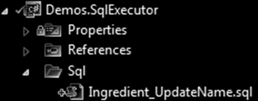

🗄 SQL
=======

[back](.)

[`SQL`](https://learn.microsoft.com/en-us/training/paths/get-started-querying-with-transact-sql) is a language for data retrieval and manipulation and other actions executed onto a *database*.  
This article introduces different ways of organizing [`SQL`](https://learn.microsoft.com/en-us/training/paths/get-started-querying-with-transact-sql) scripts in [`.NET`](table.md#dotnet) projects.


<h2>Contents</h2>

- [Combining ORM and SQL](#combining-orm-and-sql)
- [SQL in .NET Projects](#sql-in-net-projects)
- [Using Embedded Resources](#using-embedded-resources)
- [File Grouping](#file-grouping)
- [SqlEnum](#sqlenum)
- [Script Content](#script-content)
- [SqlExecutor](#sqlexecutor)
- [Parameters](#parameters)
- [Records](#records)
- [NHibernate Integration](#nhibernate-integration)
- [Using Raw SQL Files](#using-raw-sql-files)
- [Using String Literals](#using-string-literals)
- [String Concatenation](#string-concatenation)
- [Using Repositories](#using-repositories)
- [Database Upgrade Scripts](#database-upgrade-scripts)

Combining ORM and SQL
---------------------

Executing queries onto a database would normally be done through [`ORM`](orm.md#-orm), but if performance is an issue, it can be combined with raw [`SQL`](https://learn.microsoft.com/en-us/training/paths/get-started-querying-with-transact-sql).


SQL in .NET Projects
--------------------

Other techniques, like *stored procedures* and *views* were dismissed at one point, in favor of putting the [`SQL`](https://learn.microsoft.com/en-us/training/paths/get-started-querying-with-transact-sql) files directly the [`.NET`](table.md#dotnet) projects, under a sub-folder named `Sql`:




Using Embedded Resources
------------------------

It is preferred to use [embedded resources](misc.md#embedded-resources) to include the [`SQL`](#-sql) files:


This deploys the [`SQL`](#-sql) together with your `EXE` or `DLL`, because compiles the [`SQL`](#-sql) file right into the assembly.

File Grouping
-------------

It might be an idea to let the [`SQL`](#-sql) file names begin with the [entity](../patterns/data-access.md#entities) type name, so they stay grouped together:


SqlEnum
-------

Then you can put an `enum` in the [`Sql`](#-sql) folder in your [`.NET`](table.md#dotnet) project:


Add `enum` members that correspond to the file names of the [`SQL`](#-sql) files:

```cs
namespace JJ.Demos.SqlExecutor.Sql
{
    internal enum SqlEnum
    {
        Ingredient_UpdateName
    }
}
```

Script Content
--------------

The [`SQL`](#-sql) may look as follows:

```sql
update Ingredient set Name = @name where ID = @id;
```


SqlExecutor
-----------

The classic way of executing [`SQL`](#-sql) in [`.NET`](table.md#dotnet) would be to use `System.Data.SqlClient`. But in this [architecture](../index.md) the [`SqlExecutor API`](table.md#sql-executor) is used.

With an `API` like that, we can execute [`SQL`](#-sql) command in a strongly-typed way, often with only a single line of code.

An [`SqlExecutor`](table.md#sql-executor) can be created as follows:

```cs
ISqlExecutor sqlExecutor = SqlExecutorFactory.CreateSqlExecutor(
    SqlSourceTypeEnum.EmbeddedResource, connection, transaction);
```

We passed the `SqlConnection` and `SqlTransaction` to it.

Then you can call a method that executes the [`SQL`](#-sql):

```cs
sqlExecutor.ExecuteNonQuery(SqlEnum.Ingredient_UpdateName, new { id, name });
```

The method names, like `ExecuteNonQuery`, are similar to that of `SqlCommand`.


Parameters
----------

[`SQL`](#-sql) parameters can be passed along as an anonymous type:

```cs
new { id, name }
```

The name and type of `id` and `name` correspond to the parameters of the [`SQL`](#-sql). You do not need to use an anonymous type. You can use any object. As long as its properties correspond to the [`SQL`](#-sql) parameters:

```cs
var ingredient = new IngredientDto
{
    ID = 10,
    Name = "My ingredient"
};

sqlExecutor.ExecuteNonQuery(SqlEnum.Ingredient_UpdateName, ingredient);
```


Records
-------

You can also retrieve records as a collection of strongly typed objects:

```cs
IList<IngredientDto> records = 
    sqlExecutor.ExecuteReader<IngredientDto>(SqlEnum.Ingredient_GetAll).ToArray();

foreach (IngredientDto record in records)
{
    // ...
}
```

The column names in the [`SQL`](#-sql) are *case sensitive!*


NHibernate Integration
----------------------

If you use [`SqlExecutor`](table.md#sql-executor) in combination with [`NHibernate`](orm.md#nhibernate) you might want to 
use the [`NHibernateSqlExecutorFactory`](table.md#jj-framework-data-nhibernate) instead of the default [`SqlExecutorFactory`](table.md#sql-executor):

```cs
ISession session = ...;

ISqlExecutor sqlExecutor = 
    NHibernateSqlExecutorFactory.CreateSqlExecutor(
        SqlSourceTypeEnum.EmbeddedResource, session);
```

This version uses an `ISession`. In order for the [`SQL`](#-sql) to run in the same transaction as [`NHibernate`](orm.md#nhibernate), we made it aware of its `ISession`.

An implementation of [`NHibernateSqlExecutorFactory`](table.md#jj-framework-data-nhibernate) can be found in [`JJ.Framework.Data.NHibernate`](table.md#jj-framework-data-nhibernate).


Using Raw SQL Files
-------------------

*(This feature might not be available in the [`JJ.Framework`](misc.md#jjframework).)*

It might be a good choice to include the [`SQL`](#-sql) as an [embedded resource](misc.md#embedded-resources), but you can also use loose *files:*


Here is code to create the [`SqlExecutor`](table.md#sql-executor) and execute the [`SQL`](#-sql) file:

```cs
ISqlExecutor sqlExecutor = 
    NHibernateSqlExecutorFactory.CreateSqlExecutor(
        SqlSourceTypeEnum.FileName, session);

sqlExecutor.ExecuteNonQuery(@"Sql\Ingredient_Update.sql", new { id, name });
```

So the `SqlEnum` cannot be used here. You'd use a (relative) file path.


Using String Literals
---------------------

*(This feature might not be available in the [`JJ.Framework`](misc.md#jjframework).)*

It is not recommended to use [`SQL`](#-sql) strings in your code. But it is possible all the same using code like this:

```cs
ISqlExecutor sqlExecutor = 
    NHibernateSqlExecutorFactory.CreateSqlExecutor(
        SqlSourceTypeEnum.String, session);

sqlExecutor.ExecuteNonQuery(
    "update Ingredient set Name = @name where ID = @id", 
    new { id, name });
```

In that case no [`SQL`](#-sql) files have to be included in your project.

But it might make it harder to track down all the [`SQL`](#-sql) of your project and optimize it. Using [`SQL`](#-sql) strings may also circumvent another layer of protection against [`SQL`](#-sql) injection attacks.


String Concatenation
--------------------

*[`SQL`](#-sql) `string` concatenation* is sort of a no-no, because it removes a layer of protection against [`SQL`](#-sql) injection attacks. `SqlClient` has `SqlParameters` from [`.NET`](table.md#dotnet) to prevent unwanted insertion of scripting. [`SqlExecutor`](table.md#sql-executor) from [`JJ.Framework`](misc.md#jjframework) uses `SqlParameters` under the hood, to offer the same kind of protection. This *encodes* the parameters, so that they are recognized as simple types or string values rather than additional scripting.

Here is a trick to prevent the use of `string` concatenation: When you want to filter something conditionally, depending on a parameter being filled in or not, then the following expression might be used in the [`SQL`](#-sql) script's `where` clause:

```sql
(@value is null or Value = @value)
```

But there might be exceptional cases where [`SQL`](#-sql) string concatenation would be favorable. Reasons to do so might include:

- You have a (complicated) [`SQL`](#-sql) `select` statement and wish to take the `count` of it. String concatenation may prevent rewriting the [`SQL`](#-sql) statement twice, introducing a maintenance issue. Bugs would be awaiting as you'd have to change 2 [`SQL`](#-sql) scripts simultaneously, to make a change properly, which may easily be overlooked.
- Another case where `string` concatenation might be helpful, is an [`SQL`](#-sql) script where you wish to include a *database name* or *schema name*.
- There might be other examples where [`SQL`](#-sql) string concatenation might be used as an exception to the rule.

One variation of [`SqlExecutor`](table.md#sql-executor) included the ability to add placeholders to the [`SQL`](#-sql) files to insert additional scripting for this purpose. *(This feature might not be available in the [`JJ.Framework`](misc.md#jjframework).)* 


Using Repositories
------------------

The [`repository`](../patterns/data-access.md#repository) pattern is used in this [architecture](../index.md).  
The [`repository`](../patterns/data-access.md#repository) pattern can be used together with [`JJ.Framework.Data`](table.md#jj-framework-data).  

Using [`SQL`](#-sql) combined with [`repositories`](../patterns/data-access.md#repository) can be simplified using the [`SqlExecutor`](table.md#sql-executor) from [`JJ.Framework.Data.SqlClient`](table.md#sql-executor).

Here is some pseudo-code to demonstrate how it is put together:

`FilterIDs.sql`

```sql
select ID from MyEntity
where CategoryID = @categoryID
and MinStartDate >= @minStartDate
```

[`C#:`](table.md#csharp)

```cs
enum SqlEnum
{
    FilterIDs
}

class MySqlExecutor
{
    public var FilterIDs(int categoryID, DateTime minStartDate)
    {
        return SqlExecutor.ExecuteReader<int>(
            SqlEnum.FilterIDs, new { categoryID, minStartDate });
    }
}

class MyRepository : RepositoryBase
{
    public var Filter(int categoryID, DateTime minStartDate)
    {
        var ids = MySqlExecutor.FilterIDs(categoryID, minStartDate);

        var entities = ids.Select(x => Get(x));

        return entities;
    }
}

interface IMyRepository : IRepository
{
    var Filter(int categoryID, DateTime minStartDate);
}
```

This would result in:

- Keeping all the queries of an [entity](../patterns/data-access.md#entities) together in a [`repository`](../patterns/data-access.md#repository).
- Keeping overview of all the [`SQL`](#-sql) of all the [entities](../patterns/data-access.md#entities) behind an [`SqlExecutor`](table.md#sql-executor).
- All that data access would be hidden behind [`repository interfaces`](../patterns/data-access.md#repository-interfaces) decoupling the persistence technology.
 
It may seem overhead all the layers, but it might add up after adding more queries for more [entities](../patterns/data-access.md#entities), that are either [`SQL`](#-sql) or [`ORM`](orm.md#-orm) queries. Of course you could skip layers, but this is how it is done in some of the [`JJ`](https://github.com/jjvanzon?tab=repositories) projects.

You might also find a split up into separate assemblies: 

- `MyProject.Data`  
- `MyProject.Data.EntityFramework`
- `MyProject.Data.SqlClient`

Separating the general things from the technology-specific things.


Database Upgrade Scripts
------------------------

[`SQL`](#-sql) executed solely for database upgrading, might not be put in the main projects, but a project on the side. Suggestions of how to organize database upgrading might be found [here](../database-conventions.md#upgrade-scripts).

[back](.)