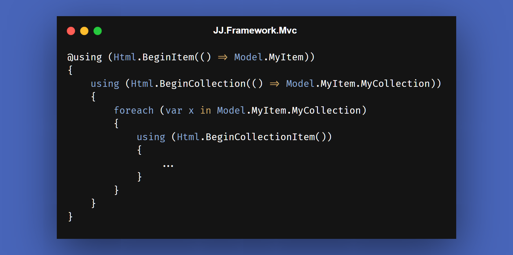

---
title: "🌐 API's Web"
description: "Choices around web technology like AJAX, MVC and JavaScript inside JJ's Reference Architecture."
image: "/images/api-web-page.png"
keywords:
  - ajax
  - javascript
  - typescript
  - html
  - http
  - mvc
  - web
  - api
  - framework
  - c#
  - .net
  - coding
  - programming
  - software engineering
  - software development
  - software design
  - software architecture
  - computers
---

🌐 API's Web
==============

[back](.)

This article describes some of the web technology choices in this [software architecture](../index.md).



<h2>Contents</h2>

- [AJAX](#ajax)
- [JavaScript / TypeScript](#javascript--typescript)
- [Html.BeginCollection](#htmlbegincollection)
- [Html.BeginCollectionItem](#htmlbegincollectionitem)


AJAX
----

`AJAX` is a way to load part of a web page, so the whole page does not have to be refreshed. This may make the user interaction smoother, than reloading the entire page every time.

For `AJAX'ing` such partial web content, our team programmed [wrapper](../patterns/other.md#wrapper) functions in [`JavaScript`](table.md#javascript), around calls to [`jQuery`](table.md#jquery), so we could `AJAX` with a single code line and handle both partial loads and full reloads the same way. It saved quite a few lines of [`JavaScript`](table.md#javascript) code.

Our strategy was to prefer full loads, so we could keep most logic in the [`C#`](table.md#csharp) realm. This before resorting to `AJAX` calls. See [Full Load – Partial Load – Cient-Native Code](../patterns/presentation.md#full-load--partial-load--client-native-code).


JavaScript / TypeScript
-----------------------

[`JavaScript`](https://www.javascript.com/) is a programming language with a wide range of applications. Originally it was run in web browsers to optimize the user experience.

[`JavaScript`](https://www.javascript.com/) was less preferred as an architectural choice. [`JavaScript's`](https://www.javascript.com/) weak type system played a role. The strange behavior and trickiness in [`JavaScript`](https://www.javascript.com/) (part due to this weak typing) gave it less appeal.

For web, other technology was preferred in this [architecture](../index.md): The idea behind [`MVC`](table.md#mvc) was logic on the server-side. [`Views`](../patterns/presentation.md#views) were in [`Razor`](table.md#razor). Best to keep most logic [`C#`](table.md#csharp) was the idea.

[`JavaScript`](https://www.javascript.com/) would easily get bloated, getting out of hand from a maintainability perspective, was the prevailing opinion. You could refactor [`C#`](table.md#csharp) code, upon which lots of the [`JavaScript`](https://www.javascript.com/) might break unexpectedly, with an error message tucked away in some console window, instead of right in your face when compiling.

[`TypeScript`](https://www.typescriptlang.org/) may have saved the day to cover for the weak typing from [`JavaScript`](https://www.javascript.com/). But we hadn't tried that yet.

But still: logic in one place in one language ([`C#`](table.md#csharp)) felt so nice. I guess the love for [`C#`](table.md#csharp) was strong.

The idea was that a full page load was 1<sup>st</sup> choice, [`AJAX'ing`](#ajax) the 2<sup>nd</sup> choice, and last in line [`JavaScript`](https://www.javascript.com/) *only* to support the user interaction. No business logic. See also: [Full Load – Partial Load – Cient-Native Code](../patterns/presentation.md#full-load--partial-load--client-native-code).

For this last-resort [`JavaScript`](https://www.javascript.com/) we used [`jQuery`](table.md#jquery) and some home-programmed [`JavaScript`](https://www.javascript.com/) libraries: [`JJ.Framework.JavaScript`](table.md#jj-framework-javascript) which had some merit, but may have been superseded by newer tech by now.

I realize [`JavaScript`](https://www.javascript.com/) is popular with a lot of people and that this is a powerful force. I don't know how my opinion would change, if I would try a newer [`JavaScript`](https://www.javascript.com/) version, [`TypeScript`](https://www.typescriptlang.org/), newer tech and libraries. My heart says I'd rather stick with [`C#`](table.md#csharp) though.


Html.BeginCollection
--------------------

In [`MVC`](table.md#mvc) it is not so straightforward to [`HTTP` a tree structure in postdata](../aspects.md#postdata-over-http).

[`JJ.Framework.Mvc`](table.md#jj-framework-mvc) makes that easier, by offering an `HtmlHelper` extensions: [`Html.BeginCollection`](https://dev.azure.com/jjvanzon/JJs-Software/_artifacts/feed/JJs-Pre-Release-Package-Feed/NuGet/JJ.Framework.Mvc). Using that `API` you can send a [`ViewModel`](../patterns/viewmodels.md) with arbitrary nestings and collections over the line. It would be restored as a [`ViewModel`](../patterns/viewmodels.md) at the server side.

In the [`View`](../patterns/presentation.md#views) code you would wrap each nesting inside a `using` block:

```cs
@using (Html.BeginItem(() => Model.MyItem))
{
    using (Html.BeginCollection(() => Model.MyItem.MyCollection))
    {
        foreach (var x in Model.MyItem.MyCollection)
        {
            using (Html.BeginCollectionItem())
            {
                ...
            }
        }
    }
}
```

So each time you enter a level, the `HtmlHelper` is called again and the code wrapped in a `using` block.

There can be as many collections as needed, and as much nesting as you like. The nesting can even be spread around multiple partial [views](../patterns/presentation.md#views).

Input fields in a nested structure look as follows:

```cs
Html.TextBoxFor(x => x.MyProperty)
```

Or:

```cs
Html.TextBoxFor(x => Model.MyProperty)
```

But not like this:

```cs
Html.TextBoxFor(x => myLoopItem.MyItem.MyProperty)
```

Otherwise the input fields might not bind to the [`ViewModel`](../patterns/viewmodels.md). This may force you to program partial [`Views`](../patterns/presentation.md#views) sometimes. That may be good practice anyway, so might not be such a big trade-off.


Html.BeginCollectionItem
------------------------

In [`MVC`](table.md#mvc) it is not so apparent how to [send a collection as `HTTP postdata`](../aspects.md#postdata-over-http).

One alternative is the often-used [`Html.BeginCollectionItem`](https://www.nuget.org/packages/BeginCollectionItem):

```cs
@foreach (var child in Model.Children)
{
    using (Html.BeginCollectionItem("Children"))
    {
        ...
    }
}
```

This `API` has some limitations:

- It can send *one* collection over the wire, not trees.
- It takes a `string` a parameter, not an expression like: `() => Model.Children`.

To send trees and arbitrary nestings over `HTTP postdata`, consider using [`Html.BeginCollection`](table.md#htmlbegincollection) from [`JJ.Framework.Mvc`](table.md#jj-framework-mvc).

[back](.)
