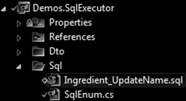
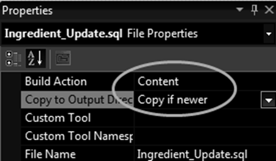

API's | JJ's Reference Architecture
===================================

This article describes some of the API and technology choices in this architecture.

<h2>Contents</h2>

- [Introduction](#introduction)
- [List of API's](#list-of-apis)
    - [Code](#code)
    - [Data](#data)
    - [Logic](#logic)
    - [Presentation](#presentation)
    - [Debugging / Testing](#debugging--testing)
    - [Processing / IO](#processing--io)
    - [Other](#other)
- [More Elaborate](#more-elaborate)
- [AJAX](#ajax)
- [Configuration](#configuration)
    - [ConnectionStrings](#connectionstrings)
- [Embedded Resources](#embedded-resources)
- [Entity Framework](#entity-framework)
- [JavaScript / TypeScript](#javascript--typescript)
- [JJ.Framework](#jjframework)
- [Keeping Bi-Directional Relationships in Sync](#keeping-bi-directional-relationships-in-sync)
- [NHibernate](#nhibernate)
- [ORM](#orm)
    - [Generic Interfaces](#generic-interfaces)
    - [Committed / Uncommitted Objects](#committed--uncommitted-objects)
    - [Flush](#flush)
    - [Read-Write Order](#read-write-order)
    - [Bridge Entities](#bridge-entities)
    - [Binary Fields](#binary-fields)
    - [Inheritance](#inheritance)
    - [Conclusion](#conclusion)
- [SQL](#sql)
    - [With NHibernate](#with-nhibernate)
    - [Files instead of Embedded Resources](#files-instead-of-embedded-resources)
    - [Strings instead of Embedded Resources](#strings-instead-of-embedded-resources)
    - [SQL String Concatenation](#sql-string-concatenation)
    - [Hiding SQL behind Repositories](#hiding-sql-behind-repositories)
    - [Database Upgrade Scripts](#database-upgrade-scripts)
- [XML](#xml)


Introduction
------------

This article lists some of the tech used in `JJ` projects. Most are listed in a table. Some technology is described in more detail, mostly data store technologies but also about web technology choices.


List of API's
-------------

### Code

|                         |                |
|-------------------------|----------------|
| Visual Studio           | Used for the development of the code.
| VS Code                 | Used for MarkDown editing.
| .NET                    | Framework from Microsoft that forms a base for the programming.
| C#                      | Primary programming language.
| `VB.NET`                | Some projects might still use this programming language.
| ReSharper               | Tool for code formatting, refactoring and code smells and such.
| git                     | Source control, revision history, version management for the code.
| [GitHub](https://github.com/jjvanzon) | Where the source code is hosted and shared.
| [Azure DevOps](https://dev.azure.com/jjvanzon/JJs-Software/_artifacts/feed/JJs-Pre-Release-Package-Feed) | Build pipeline. Pre-release package feed. Original planning boards. Might still host one project not migrated to GitHub.
| GitHub Issues           | Gradually using GitHub Issues more for planning.
| JJ.Framework            | In-house programmed extensions to the .NET Framework can be found in [GitHub](https://github.com/jjvanzon/JJ.Framework) / [NuGet](https://www.nuget.org/profiles/jjvanzon) / [JJs-Pre-Release-Package-Feed](https://dev.azure.com/jjvanzon/JJs-Software/_artifacts/feed/JJs-Pre-Release-Package-Feed)
| [JJ.Framework.Conversion](https://www.nuget.org/packages/JJ.Framework.Conversion/) | Makes it easier to convert simple types.
| [JJ.Framework.Reflection](https://www.nuget.org/packages/JJ.Framework.Reflection/) | Helps with and speeds up accessing code structure elements through reflection and lambda expressions.

### Data

|                   |                |
|-------------------|----------------|
| SQL Server        | Primary data store technology for relational databases.
| ORM               | Hides most SQL, exposing an object graph, to focus on the logic, instead of on the data storage.
| SQL               | For performance reasons SQL is hand-programmed incidentally, combined with ORM.
| [NHibernate](https://www.nuget.org/packages/NHibernate) | A type of ORM. Chosen in several `JJ` project because an employer also so happened to use it.
| [QueryOver](https://nhibernate.info/doc/nhibernate-reference/queryqueryover.html) | A strongly-typed query language like LINQ, but then the NHibernate variation.
| [FluentNHibernate](https://www.nuget.org/packages/FluentNHibernate) | A way to define ORM mappings, using fluent notation.
| [EntityFramework](https://www.nuget.org/packages/EntityFramework) | A type of ORM. Chosen less in the `JJ` projects, because more experience with NHibernate. Worth reconsidering.
| [JJ.Framework.Data](https://dev.azure.com/jjvanzon/JJs-Software/_artifacts/feed/JJs-Pre-Release-Package-Feed) | Helps hide data access behind abstractions. It does notexpose whether it is SQL Server, SQL, ORM, NHibernate. There would just be abstracted convenient methods instead.
| [SqlExecutor](https://dev.azure.com/jjvanzon/JJs-Software/_artifacts/feed/JJs-Pre-Release-Package-Feed/NuGet/JJ.Framework.Data.SqlClient) | Helps execute SQL with less code lines, and more type save than using `SqlClient` directly.
| LINQ              | A query language usable in C#. Can be used to query several types of data store, but used commonly for in-memory collections.
| [JJ.Framework.Collections](https://www.nuget.org/packages/JJ.Framework.Collections/) | `JJ` extensions to LINQ.

### Logic

|                          |                |
|--------------------------|----------------|
| [JJ.Framework.Business](https://www.nuget.org/packages/JJ.Framework.Business/) | Types for supporting a business layer and/or API. Bi-directional relationship sync. Result types to pass data, succes flags and (validation) messages.
| [JJ.Framework.Validation](https://dev.azure.com/jjvanzon/JJs-Software/_artifacts/feed/JJs-Pre-Release-Package-Feed/NuGet/JJ.Framework.Validation) | For a nice fluent notation for validations.
| [JJ.Framework.Mathematics](https://www.nuget.org/packages/JJ.Framework.Mathematics/) | Helpers for math things. See link.

### Presentation

<h4>General</h4>

|                       |                |
|-----------------------|----------------|
| [PagerViewModelFactory](https://www.nuget.org/packages/JJ.Framework.Presentation/) | Can construct a pager view model with properties like `CanGoToFirstPage`, `CanGoToPreviousPage`, `CanGoToNextPage`, `CanGoToLastPage`.

<h4>Web</h4>

|                         |                |
|-------------------------|----------------|
| IIS | (Internet Information Services.) For hosting web sites. Some Visual Studio projects wish to use it upon load.
| MVC | A web development tech in the .NET Framework. Code runs mostly server side.
| Razor | A view renderer for web. Give terse syntax, combining C# and HTML almost seemlessly.
| [Html.BeginCollection](https://dev.azure.com/jjvanzon/JJs-Software/_artifacts/feed/JJs-Pre-Release-Package-Feed/NuGet/JJ.Framework.Mvc) | Makes it possible to send tree structures over HTTP to the server-side MVC.
| [JavaScript](#javascript--typescript) | Used to support UI details in web. In this architecture most (UI) logic would be handled in C#.
| [TypeScript](#javascript--typescript) | Might be preferred over JavaScript in the future. Has not been applied
| [AJAX](#ajax) | For retrieving / posting back partial views to the server and back.
| jQuery | Used to support UI details in web. Can make some JavaScript shorter.
| [JJ.Framework.JavaScript](https://dev.azure.com/jjvanzon/JJs-Software/_artifacts/feed/JJs-Pre-Release-Package-Feed/NuGet/JJ.Framework.JavaScript) | Used to support UI details in web. Remembering scroll position, cookie functions, url parsing.  Might be extended with one-line AJAX functions once.

<h4>Win</h4>

|          |          |
|----------|----------|
| WinForms | Used in some projects. Small utilities and `JJ.Synthesizer` uses it as the top-most layer.
| [SimpleProcessForm](https://dev.azure.com/jjvanzon/JJs-Software/_artifacts/feed/JJs-Pre-Release-Package-Feed/NuGet/JJ.Framework.WinForms) | A base form for a utility that runs a process.
| [JJ.Framework.VectorGraphics](https://dev.azure.com/jjvanzon/JJs-Software/_artifacts/feed/JJs-Pre-Release-Package-Feed/NuGet/JJ.Framework.VectorGraphics) | A custom-programmed vector graphics model. Can be used for component-based user interfaces.

### Debugging / Testing

|                  |                  |
|------------------|------------------|
| [MSTest](https://www.nuget.org/packages/MSTest.TestFramework) | For automated / unit testing. Seems a deprecated framework. Might upgrade, but it ain't on the top of the list.
| [JJ.Framework.Testing](https://www.nuget.org/packages/JJ.Framework.Testing) | Extends the `Assert` class, but automatically includes the tested expression in the error messages.
| DebuggerDisplays | A technique to quickly display helpful info in the ID watch screen.
| [JJ.Framework.Exceptions](https://www.nuget.org/packages/JJ.Framework.Exceptions) | Contains exception classes for basic errors. Clear concise error messages, including tested expressions and tested values.
| [Accessor](https://www.nuget.org/packages/JJ.Framework.Reflection#accessor) | For accessing the internals of types for instance for testing purposes.

### Processing / IO

|                        |                |
|------------------------|----------------|
| [JJ.Framework.Text](https://www.nuget.org/packages/JJ.Framework.Text) | Basic helpers for working with text.
| [JJ.Framework.IO](https://www.nuget.org/packages/JJ.Framework.IO) | Contains various file functions, functions for working with streams and working with CSV's.
| [JJ.Framework.HtmlToXml](https://dev.azure.com/jjvanzon/JJs-Software/_artifacts/feed/JJs-Pre-Release-Package-Feed/NuGet/JJ.Framework.HtmlToXml) | The HtmlToXmlConverter class steals from SgmlReader. It does what it says.
| [JJ.Framework.Xml](https://www.nuget.org/packages/JJ.Framework.Xml) | A convenient way to map XML to (C#) classes.<br/>Access XML nodes more safely, with null and unicity checks.
| [JJ.Framework.Xml.Linq](https://dev.azure.com/jjvanzon/JJs-Software/_artifacts/feed/JJs-Pre-Release-Package-Feed/NuGet/JJ.Framework.Xml.Linq) | "
| [Embedded Resources](#embedded-resources) | Embedded resources allow compiling files and content right inside a DLL or EXE.
| [EmbeddedResourceReader](https://www.nuget.org/packages/JJ.Framework.Common) | Make it a little easier to get embedded resource Streams, bytes and strings.

### Other

<h4>Localization</h4>

|                  |                |
|------------------|----------------|
| [Resource Strings](patterns.md#resource-strings) | For localization, resx files can be used in Visual Studio.
| [JJ.Framework.ResourceStrings](https://dev.azure.com/jjvanzon/JJs-Software/_artifacts/feed/JJs-Pre-Release-Package-Feed/NuGet/JJ.Framework.ResourceStrings) | Reusable button texts and such in multiple languages. For now supports Dutch, US English and some broken Polish.
| [Localization](aspects.md#localization) | More ideas about localization.

<h4>Configuration</h4>

|     |     |
|-----|-----|
| [JJ.Framework.Configuration](https://www.nuget.org/packages/JJ.Framework.Configuration) | For working with complex configuration files, esier than `System.Configuration`.
| [Configuration](aspects.md#configuration) | More info about configuration.

<h4>Security</h4>

|     |     |
|-----|-----|
| [JJ.Framework.Security](https://dev.azure.com/jjvanzon/JJs-Software/_artifacts/feed/JJs-Pre-Release-Package-Feed/NuGet/JJ.Framework.Security) | A generic interfacing for authenticating a user and yet to be tested hashed salted password authentication.
| [Security](aspects.md#security) | If more might be needed security-wise, it may be hidden behind generic interfaces, abstracting the security system.

<h4>Logging</h4>

|     |     |
|-----|-----|
| [JJ.Framework.Logging](https://dev.azure.com/jjvanzon/JJs-Software/_artifacts/feed/JJs-Pre-Release-Package-Feed/NuGet/JJ.Framework.Logging) | For now might only contains the `ExceptionHelper` class, which for instance converts exception information to a string. 
| [Logging](aspects.md#logging) | Described how it might be extended to contain more other code to do with logging. 


More Elaborate
--------------

For some of these things you can find more elaborate descriptions below: mostly about data store technologies, but also some about web technology choices.


AJAX
----

For AJAX'ing partial web content, our team made our own wrapper AJAX methods, around calls to jQuery, so we could AJAX with a single code line and handle both partial loads and full reloads the same way. Saved quite a few lines of JavaScript code.

Our strategy was to prefer full loads, so we could keep most logic in the C# realm. This before resorting to AJAX calls. See [First Full Load – Then Partial Load – Then Native Code](patterns.md#first-full-load--then-partial-load--then-native-code).


Configuration
-------------

For configuration we might use the [`JJ.Framework.Configuration`](https://www.nuget.org/packages/JJ.Framework.Configuration) API, which might be quite a bit easier than using .NET's `System.Configuration` directly.

You might read from its `README` how it works, by following the link above.

It does not seem to support reading out the `connectionStrings` section yet. So here is an idea how that might work. would it ever be programmed.

### ConnectionStrings

Reading out `connectionStrings` might be made similar to reading out the `appSettings`. Connection strings in the `App.config` or `Web.config` may look as follows:

```xml
<connectionStrings>
  <add name="OrderDB" connectionString="data source=192.168.XX.XX;Initial Catalog=OrderDB..." />
</connectionStrings>
```

This would be the *classic* way of reading it out:

```cs
string connectionString = ConfigurationManager.ConnectionStrings["OrderDB"].ConnectionString;
```

This could the alternative in `JJ.Framework.Configuration`:

```cs
string connectionString = ConnectionStrings<IConnectionStrings>.Get(x => x.OrderDB);
```

You may then define an interface to be able to use the strongly-typed name:

```cs
internal interface IConnectionStrings
{
    string OrderDB { get; }
}
```

Embedded Resources
------------------

Embedded resources might be handy to prevent having to include loose files with a deployment, but instead compiling the loose files right into the assembly DLL or EXE. It also protects those resources a little bit better against modifications.

To include a file as an embedded resource, you could set the following property:


[`JJ.Framework.Common`](https://www.nuget.org/packages/JJ.Framework.Common) contains a helper class `EmbeddedResourceReader` which make it a little bit easier to access those resources in your code:

```cs
string text = EmbeddedResourceReader.GetText(
  assembly, "Ingredient_UpdateName.sql");
```


Entity Framework
----------------

Entity Framework is a framework for data access. It might be hidden behind abstractions using [`JJ.Framework.Data.EntityFramework`](https://dev.azure.com/jjvanzon/JJs-Software/_artifacts/feed/JJs-Pre-Release-Package-Feed/NuGet/JJ.Framework.Data.EntityFramework) and [repository interfaces](patterns.md#repository-interfaces).

`JJ.Framework.Data.EntityFramework` at one point seemed to become quite slow, without modifying it. It was not upgraded since then, because most of the apps used `NHibernate` instead.

It may be required to enable `MSDTC`. That would be a service belonging to an `SQL Server` installation that might have to be enabled. Otherwise transactions might not work.


JavaScript / TypeScript
-----------------------

`JavaScript` was less preferred as an architectural choice. `JavaScript's` weak type system played a role. The strange behavior and trickiness in `JavaScript` (part due to this weak typing) gave it less appeal.

The idea behind `MVC` was logic on the server-side. Views were in `Razor`. Best to keep most logic `C#` was the idea.

`JavaScript` would easily get bloated, getting out of hand from a maintainability perspective, was the opinion. In `C#` you could refactor, upon which lots of the `JavaScript` might break unexpectedly, with an error message tucked away in some console window, instead of right in your face.

`TypeScript` may have saved the day to cover for the weak typing from `JavaScript`. But it wasn't tried yet.

But still: logic in one place in one language (`C#`) felt so nice. I guess the love for `C#` is strong.

The idea was that a full page load was 1st choice, 2nd choice `AJAX'ing`, and last in line `JavaScript` only to support the user interaction. No business logic. See also: [First Full Load – Then Partial Load – Then Native Code](patterns.md#first-full-load--then-partial-load--then-native-code).

For this last-resort `JavaScript` we used `jQuery` and some home-programmed `JavaScript` libraries [`JJ.Framework.JavaScript`](https://dev.azure.com/jjvanzon/JJs-Software/_artifacts/feed/JJs-Pre-Release-Package-Feed/NuGet/JJ.Framework.JavaScript) which had some merit, but may have been superseded by newer tech by now.

I realize `JavaScript` is popuplar with a lot of people and that this is a powerful force. I don't know how my opinion would change, if I would try a newer `JavaScript` version, `TypeScript`, newer tech and libraries. My heart says I'd rather stick to `C#` though.


JJ.Framework
------------

`JJ.Framework` are extensions to `.NET`. They are compact and reusable. They can be found on [NuGet](https://www.nuget.org/profiles/jjvanzon). The lesser-tested ones on [JJs-Pre-Release-Package-Feed](https://dev.azure.com/jjvanzon/JJs-Software/_artifacts/feed/JJs-Pre-Release-Package-Feed). You can read more information of it on the [GitHub](https://github.com/jjvanzon/JJ.Framework) repository.

They were made in the spirit of in-house developing small extensions and hiding platform-specific details behind generalize interfaces. They are sort part of the software architecture described here.


Keeping Bi-Directional Relationships in Sync
--------------------------------------------

The classes `ManyToOneRelationship` and `OneToManyRelationship` do inverse property management more or less automatically, which you then use in your models (rich, entity, API or otherwise). More or less: You still have to program classes that derive from `ManyToOneRelationship` and `OneToManyRelationship` and use them a certain way, but the result would be in a navigation property and collection property whose ends will be kept in sync.

Package and code examples available on NuGet [here](https://www.nuget.org/packages/JJ.Framework.Business).

There might be other ways to do this. `Entity Framework` might do it automatically. `NHibernate` appears not to do it for us. A [`LinkTo`](patterns.md#linkto) pattern might be used in certain projects. Or hand-writing the syncing code whereever.


NHibernate
----------

`NHibernate` is a technology, used for data access. A so called `ORM`. It is comparable to `Entity Framework`.

`NHibernate` is used in some projects, because an employer favored it, and some other projects joined the club.

It might be hidden behind abstractions using [`JJ.Framework.Data.NHibernate`](https://dev.azure.com/jjvanzon/JJs-Software/_artifacts/feed/JJs-Pre-Release-Package-Feed/NuGet/JJ.Framework.Data.NHibernate) and through [repository interfaces](patterns.md#repository).


ORM
---

An `ORM` aims to make it easier to focus on the logic around an entity model, while saving things to a database is pretty much done for you.

Here follow some issues you could encounter while using one, and some suggestions for resolving them.

This information was gathered while building experience with `NHibernate`. Also having experienced `NPersist`, it might be possible that the `Entity Framework` has similar issues, due to how `ORM's` seem to work. 

### Generic Interfaces

Data access in this architecture is favored behind generic interfaces using [`JJ.Framework.Data`](https://github.com/jjvanzon/JJ.Framework/tree/master/Framework/Data).

### Committed / Uncommitted Objects

Here is something that happens n `ORM` sometimes:

Some methods of data retrieval work with uncommitted / non-flushed entities: so things that are newly created, and not yet committed to the data store. Other methods of data retrieval do the opposite: only returning committed / flushed entities. This asymmetry might be common in `ORM's`, since doing it any other way might harm performance.

| Method | Data |
|--------|------|
| `IContext.Query` | uncommitted / non-flushed
| `IContext.Get` | 1st committed / flushed, then uncommitted / non-flushed
| `IContext.TryGet` | 1st committed / flushed, then uncommitted / non-flushed
| Navigation properties /<br>following the object graph | 1st committed / flushed, then uncommitted / non-flushed

It appears to have to do with when the `ORM` goes to the database to query or save objects.

### Flush

`Flushing` in `NHibernate` would mean that all the pending `SQL` statements are executed onto the database, without committing the transaction yet.

A `Flush` can help get an auto-generated `ID` from the database. Also when `NHibernate` is confused about the order in which to execute things, a `Flush` may help it execute things in the right order sometimes.

The trouble with `Flush` is that, it might be executed when things are not done yet, and incomplete data might go to the database, upon which database may give an error. So it is a thing to use sparsely only with a good reason, because you can expect some side-effects.

`Flushes` might also go off automatically. Sometimes `NHibernate` wants to get a data-store generated ID. This can happen calling `Save` an entity. Unlike the documentation might suggest, `FlushMode.Never` or `FlushMode.Commit` may not prevent thse intermediate flushes.

Upon saving a parent object, child objects might be flushed too. Internally then `NHibernate` asked itself the question if the child object was `Transient` and while doing so, it apparently wanted to get its identity, by executing an `insert` statement onto the data store. This caused a `null` exception on the `ParentID` column of the child object.

It may also help to create entities in a specific order (e.g. parent object first, then the child objects) or choose a identity generation scheme, that does not require flushing an entity pre-maturely.

### Read-Write Order

It seems `ORM's` like it when you first read the data out, and then start writing to it. Not read, write some, read a little more, write some more. It may have to do with how it queries the database and handles committed / uncommited objects as described earlier above.

### Bridge Entities 

An *bridge* entity is for `n => n` relationhips, usually requiring an additional table to make the link between the entities.


Using an `ORM`, the bridge entity might not be visible in the code, but can be managed as two collections inside the two related entity types.

```cs
class Question
{
    IList<Category> Categories { get; set; }
}

class Category
{
    IList<Question> Questions { get; set; }
}
```

The `ORM` might do quite a bit of magic under the hood, to keep these collections in sync. Perhaps a little too much for its own good. You can expect quite a few exceptions to go off unfortunately, while `ORM` tries to guard the integrity of the relationship.

These problems almost all go away, if you map to a *bridge entity* instead. Instead of putting collections of the other entity in an entity, you let both entities hold a list of *bridge entities* instead, and the bridge entity would link to 1 entity of each type. This turns the `n => n` relationship into two `1 => n` relationships which ORM can manage with less hardship.

```cs
class QuestionCategory
{
    Question Question { get; set;}
    Question Category { get; set;}
}

class Question
{
    IList<QuestionCategory> QuestionCategories { get; set; }
}

class Category
{
    IList<QuestionCategory> CategoryQuestions { get; set; }
}
```

It might be is advised that the bridge table not to rely on a composite key of the two `ID's` of the related entities. A single surrogate `ID` field might do better.


This is because it gives 1 handle to the combination of 2 thing, giving `ORM` less difficulty managing things under the hood, prevents passing around composite keys all the time, less good hashing keys, URL's that look more difficult, etc.

### Binary Fields

You might not want to map binary and other serialized data fields using `NHibernate`, because it can harm performance quite a bit.

Retrieving some loose fields of an entity, would also retrieve a blob in that case. As wel as saving a whole blob, when changing just a few fields. That data transmission can be quite a bottle-neck sometimes.

Using separate `SQL` statements for retrieving blobs might be a better alternative.

### Inheritance

Particular surprizes might emerge when using inheritance in your entity model at least while working with `NHibernate`. The main advance is to avoid inheritance at all in the entity models if you can.

When retrieving an entity through ORM, it is likely it will not return an instance of your entity type, but an instance of a type derived from your entity type, a so called ***proxy***. This proxy adds to your entity type a sort of connectedness to the database.

When you retrieved an entity from `HNibernate` that has inheritance, using the base type it returns a proxy of the base type instead of a proxy of the derived type, which makes reference comparisons between base proxies and derived class proxies fail.

You can then *unproxy* both and it will return the underlying object, which is indeed of the derived class, upon which reference comparison succeeds.

But if you can also get failing reference comparisons another way. If you unproxied a derived type, and retrieve another proxy of the derived type, reference comparison might also fail.

[ID comparison](code-style.md#entity-equality-by-id) could avoid this problem with entity equality checks.

This also means that to evaluate the *type*, you are better of unproxying, or it will return the proxy type instead of your entity type, which can be confusing.

By now maybe it may be clear, why the main advice is not to use inheritance in the first place in your entity models, if at all possible.

An alternative for inheritance might be to use a `1-to-1` related object to represent the base of the entity. Although, `NHibernate` and other `ORM's` are  not a fan of `1 => 1` relationships either. Oh well, all in a day's work. Letting two entity types use a mutual `interface` might be an alternative too.

### Conclusion

If this makes you lose grip on reality and wonder whether `ORM's` are worth it? Well, they might still be worth it. They might allow you to program focusing on the meaning of things, rather than how to store it. Even though that is ambiguous because the story above suggests you'd still be better off knowing what it does and when it does it. You just don't need to do it yourself, or see much of it in the code.


SQL
---

Executing queries onto a database is normally done through ORM, but if performance is an issue, it can be combined with SQL.

A choice was made, not to use stored procedures or views. Instead the SQL files were stored directly the .NET projects, under a sub-folder named `Sql`.


The classic way of executing SQL in .NET would be to use `System.Data.SqlClient`. But instead, the `SqlExecutor` API might be used.

A version of it is available on [`JJs-Pre-Release-Package-Feed`](https://dev.azure.com/jjvanzon/JJs-Software/_artifacts/feed/JJs-Pre-Release-Package-Feed/NuGet/JJ.Framework.Data.SqlClient).

With an API like that, we can execute SQL in a strongly-typed way, often with only a single code line.

The first choice of doing it is to make the SQL file embedded resources:


This makes the SQL be deployed together with your DLL or EXE, because compiles the SQL file right into the assembly.

The SQL may look as follows:

```sql
update Ingredient set Name = @name where ID = @id;
```

Then put an enum in the SQL folder in your .NET project:



Add enum members that exactly correspond to the file names of the sql files:

```cs
namespace JJ.Demos.SqlExecutor.Sql
{
    internal enum SqlEnum
    {
      Ingredient_UpdateName
    }
}
```

Then an `SqlExecutor` can be created as follows:

```cs
ISqlExecutor sqlExecutor = SqlExecutorFactory.CreateSqlExecutor(SqlSourceTypeEnum.EmbeddedResource, connection, transaction);
```

We passed the `SqlConnection` and `SqlTransaction` to it.

Then you can call a method that executes the SQL:

```cs
sqlExecutor.ExecuteNonQuery(SqlEnum.Ingredient_UpdateName, new { id, name });
```

The method names are similar to what you might be used to using `SqlCommand`. You pass SQL parameters along with the `SqlExecutor` as an anonymous type:

```cs
new { id, name }
```

The name and type of the variables `id` and `name` correspond to the parameters of the SQL. You do not need to use an anonymous type. You can use any object. As long as its properties correspond to the SQL parameters, they are applied correctly:

```cs
var ingredient = new IngredientDto
{
    ID = 10,
    Name = "My ingredient"
};

sqlExecutor.ExecuteNonQuery(SqlEnum.Ingredient_Update, ingredient);
```

You can also retrieve records as a collection of strongly typed objects:

```cs
IList<IngredientDto> records = sqlExecutor.ExecuteReader<IngredientDto>(SqlEnum.Ingredient_GetAll).ToArray();

foreach (IngredientDto record in records)
{
    // ...
}
```

The column names in the SQL are *case sensitive!*

It might be an idea to let the SQL file names begin with the entity type name, so they stay grouped together:


### With NHibernate

If you use `SqlExecutor` in combination with `NHibernate` you might want to 
use the `NHibernateSqlExecutorFactory` instead of the default `SqlExecutorFactory`:

```cs
ISession session = ...;

ISqlExecutor sqlExecutor = NHibernateSqlExecutorFactory.CreateSqlExecutor(SqlSourceTypeEnum.EmbeddedResource, session);
```

This version uses an NHibernate `ISession`. In order for the SQL to run in the same transaction as the SQL that NHibernate executes, we make it aware of the `ISession` here.

A variation of this was implemented here: [`JJs-Pre-Release-Package-Feed`](https://dev.azure.com/jjvanzon/JJs-Software/_artifacts/feed/JJs-Pre-Release-Package-Feed/NuGet/JJ.Framework.Data.NHibernate).

### Files instead of Embedded Resources

*(This feature might not be available in the JJ.Framework.)*

It may usually a good choice to include the SQL as an embedded resource, but you can also use files or literal strings.



Here is code to create the `SqlExecutor` and execute an SQL file:

```cs
ISqlExecutor sqlExecutor = NHibernateSqlExecutorFactory.CreateSqlExecutor(SqlSourceTypeEnum.FileName, session);

sqlExecutor.ExecuteNonQuery(@"Sql\Ingredient\_Update.sql", new { id, name });
```

So the `SqlEnum` cannot be used here. You'd use the (relative) file path here.

### Strings instead of Embedded Resources

*(This feature might not be available in the JJ.Framework.)*

It is not recommended to use SQL strings in your code. But it is possible all the same using the following:

```cs
ISqlExecutor sqlExecutor = NHibernateSqlExecutorFactory.CreateSqlExecutor(SqlSourceTypeEnum.String, session);

sqlExecutor.ExecuteNonQuery("update Ingredient set Name = @name where ID = @id", new { id, name });
```

In that case no SQL files have to be included in your project.

But it might make it harder to track down all the SQL of your project, optimize it and using SQL strings also circumvents another layer of protection against SQL injection attacks.

### SQL String Concatenation

*`SQL` `string` concatenation* is sort of a no-no, because it removes a layer of protection against `SQL` injection attacks. `SqlClient` has `SqlParameters` from `.NET` to prevent unwanted insertion of scripting. `SqlExecutor` from `JJ.Framework` uses `SqlParameters` under the hood, to offer the same kind of protection. This encodes the parameters, so that they are recognized as simple types or string values rather than additional scripting.

Here is a trick to potentially prevent using string concatenation as an option: When you want to filter something conditionally, depending on a parameter being filled in or not then the following expression might be used in the `SQL` script's `where` clause

```sql
(@value is null or Value = @value)
```

But there might be exceptional cases where `SQL` string concatenation could be favorable. Reasons to do so might include:

- If you have a (complicated) `SQL` `select` statement and wish to take the `count` of it, concatenation may prevent rewritng the `SQL` statement twice, introducing a maintenance issue. Bugs would be awaiting as you'd have to change 2 SQL scripts simultaneously, to make change properly, which may easily be overlooked.
- Another case where `string` concatenation might be helpful, is an `SQL` script where you wish to include a *database name* or *schema name* not known beforehand.
- There might be other examples where SQL string concatenation might be used as an exception to the rule not to.

One variation of `SqlExecutor` included the ability to add placeholders to the `SQL` files to insert additional scripting for this purpose. *(This feature might not be available in the JJ.Framework.)* 

### Hiding SQL behind Repositories

The `repository` pattern is used in this architecture. The pattern is roughly described [here](patterns.md#repository).

The repository pattern can be used together with `JJ.Framework.Data`, documentation [here](https://github.com/jjvanzon/JJ.Framework/tree/master/Framework/Data).

For SQL executing in cooperation with repositories using `SqlExecutor` there is a way described here [here](#sql).

Here is some pseudo-code to demonstrate how it is put together:

`SQL:`

```sql
select ID from MyEntity
where CategoryID = @categoryID
and Kind = @kind
and MinStartDate >= @minStartDate
```

`C#:`

```cs
enum SqlEnum
{
    MyEntity_FilterIDs
}

class MySqlExecutor
{
    public var MyEntity_FilterIDs(
        int categoryID, int kind, DateTime minStartDate)
        => SqlExecutor.ExecuteReader<int>(
            SqlEnum.MyEntity_FilterIDs, 
            new { categoryID, kind, minStartDate });
    }
}

class MyRepository : RepositoryBase
{
    public var Filter(
        int categoryID, int kind, DateTime minStartDate)
    {
        var ids = MySqlExecutor.MyEntity_FilterIDs(
            categoryID, kind, minStartDate);

        var entities = ids.Select(x => Get(x));

        return entities;
    }
}

interface IMyRepository : IRepository
{
    var Filter(
        int categoryID, int kind, DateTime minStartDate);
}
```


This would result in:

- Keeping all the queries of an entity together in a `repository`.
- Keeping overview of all the SQL of all the entities behind an `SqlExecutor`.
- All that data access would be hidden `repository interfaces` decoupling the persistence technology.
 
It may seem overhead all the layers, but it might add up after adding more queries for more entities, that are either SQL or ORM queries. Of couse you could skip layers, but this is how it is done in some of the `JJ` projects.

In `JJ` projects you might also find split up into separate assemblies: 

- `MyProject.Data`  
- `MyProject.Data.EntityFramework`
- `MyProject.Data.SqlClient`

Separating the general things from the technology-specific things.

### Database Upgrade Scripts

`SQL` executed solely for database upgrading, might not be put in the main projects, but a project/folder on the side. Suggestions of how to organize database upgrading might be found [here](database-conventions.md#upgrade-scripts).


XML
---

Preference for `XElement` (`LINQ to XML`) over `XmlDocument` except when you want to use `XPath`.

Perhaps prefer the `XmlHelper` methods (from [`JJ.Framework.Xml`](https://dev.azure.com/jjvanzon/JJs-Software/_artifacts/feed/JJs-Pre-Release-Package-Feed/NuGet/JJ.Framework.Xml) or [`JJ.Framework.Xml.Linq`](https://dev.azure.com/jjvanzon/JJs-Software/_artifacts/feed/JJs-Pre-Release-Package-Feed/NuGet/JJ.Framework.Data.Xml.Linq)) over using other API's directly, because the helper will handle nullability and unicity more grafully.

`XmlToObjectConverter` and `ObjectToXmlConverter` might also be used. (Also in [`JJ.Framework.Xml`](https://dev.azure.com/jjvanzon/JJs-Software/_artifacts/feed/JJs-Pre-Release-Package-Feed/NuGet/JJ.Framework.Xml) and [`JJ.Framework.Xml.Linq`](https://dev.azure.com/jjvanzon/JJs-Software/_artifacts/feed/JJs-Pre-Release-Package-Feed/NuGet/JJ.Framework.Data.Xml.Linq)). That might be a simpler way to convert XML to an object graph than other API's.
