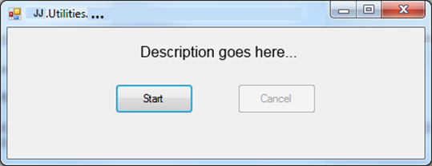

🧱 Aspects
===========

[back](.)

<h3>Contents</h3>

- [Introduction](#introduction)
- [Authoring & Reviewing](#authoring--reviewing)
- [Caching](#caching)
- [Calculation](#calculation)
- [Cascading](#cascading)
- [Circular References](#circular-references)
- [Cloning](#cloning)
- [Code Style](#code-style)
- [Collections / List Processing](#collections--list-processing)
    - [Specialized Lists](#specialized-lists)
- [Concurrency](#concurrency)
- [Configuration](#configuration)
- [Conversion](#conversion)
- [Defaults](#defaults)
- [Debugging](#debugging)
- [Entity Model / Data Model](#entity-model--data-model)
- [Entity Status Management](#entity-status-management)
- [Enums](#enums)
    - [General Rules](#general-rules)
    - [Enum-Like Entities](#enum-like-entities)
    - [Localization](#localization)
    - [TODO](#todo)
- [Errors](#errors)
- [Exceptions](#exceptions)
- [Facades](#facades)
- [Bidirectional Relationships](#bidirectional-relationships)
    - [LinkTo](#linkto)
    - [OneToManyRelationship](#onetomanyrelationship)
    - [Entity Framework](#entity-framework)
    - [Omit Inverse Property](#omit-inverse-property)
    - [TODO](#todo-1)
- [IO](#io)
- [Logging](#logging)
- [Multi-Language / Translations / Culture](#multi-language--translations--culture)
    - [Separate Content Items](#separate-content-items)
    - [Loosely Linked Translation Entities](#loosely-linked-translation-entities)
    - [Many Foreign Keys](#many-foreign-keys)
    - [Comparison Loosely Linked vs Many Foreign Keys](#comparison-loosely-linked-vs-many-foreign-keys)
- [Naming](#naming)
- [Paging](#paging)
- [Parsing](#parsing)
- [Performance](#performance)
- [Persistence](#persistence)
- [Platform Compatibility](#platform-compatibility)
- [Reflection](#reflection)
- [Scheduling](#scheduling)
- [Security](#security)
    - [User Rights Models](#user-rights-models)
        - [Organize by Entity and CRUD](#organize-by-entity-and-crud)
        - [Organize by Access Level](#organize-by-access-level)
        - [Access Yes or No](#access-yes-or-no)
        - [Organize by Feature](#organize-by-feature)
- [Side Effects](#side-effects)
- [Styling](#styling)
- [Text Processing](#text-processing)
- [Transactions](#transactions)
- [Type Safety](#type-safety)
- [Automated Testing](#automated-testing)
- [User Interface](#user-interface)
- [Utilities](#utilities)
- [Validation](#validation)
- [Versioning (Data)](#versioning-data)
- [Workflow](#workflow)


Introduction
------------

What are called 'Aspects' here, are technical concerns like [security](#security), [logging](#logging) and [validation](#validation) and many more things. In medium to large software development projects you might have to make a decision about some of these concerns. The decision can take the form of the usage of an [`API`](api.md) or applying certain [design patterns](patterns.md) or can even be solved by the programming language you use. In that way, aspects are more central than [design patterns](patterns.md), programming languages and [`API's`](api.md) and are a level of abstraction that hovers above them.

Some aspects might not be mentioned here, because they are for instance automatically solved by the programming language we use, the database engine or te [`Visual Studio IDE`](https://visualstudio.microsoft.com/#vs-section).

(The word 'aspect' is related to the 'aspect' construct in aspect oriented programming languages or frameworks, but you can think in terms of aspects even regardless of these tools and constructs.)


Authoring & Reviewing
---------------------

This aspect covers things such as marking objects with creation dates, modification dates, etcetera, adding an author's comment to objects and managing multiple versions of objects and logging which user made which change.

`< TODO: Describe better: Reviewing: Like rating content. So closely related to authoring I find that it should be grouped together. >`

`< TODO: Add specific solutions. >`


Caching
-------

`< TODO: Write texts. Include: The use of a dictionaries, TryGetValue for performance, locking static dictionaries or other dictionaries used by multiple threads. Kentico also has caching. >`


Calculation
-----------

`< TODO: Write a text. Include:` 

`Extension methods for small calculations are an option. Putting calculations directly in your entity models (rich models.) I would not recommend it, because it would mix entity modeling with calculation aspect too much. For more complicated calculations you could delegate to specialized business logic objects. You could call those 'Calculators'. Those could have a recursive structure of objects, if needed. You can also create code generators that compile to more optimal calculation code, if the structure of the calculation does not very too much over time it may be worth it to periodically recompile. Code generators are not easy, though. You could use a visitor to simplify, but isolate complex recursive calculations. >`


Cascading
---------

`< TODO: Write texts. Include: `

`Talk about DeleteWithRelatedEntities and UnlinkRelatedEntities.`

`Do mention NHibernate cascading. `

`See 'LinkTo' under 'Patterns'. `

`See Cascading in Patterns.`

`Alternatives: In database. might not play well with ORM. Does not give the idea of control to the C# programmer. Alternative: triggers. Downside: Why would you do that if databases already have delete actions?`

`It is also a mechanism known to be applicable to a relation database. In this architecture the choice is made to do it in C# code, to make it extra visible that these deletions take place, and not to accidentally delete things by accident without seeing much of it in the logic. ORM's might also not like it when you use cascade delete in the database. >`


Circular References
-------------------

`< TODO: An example of a check procedure. Mention that it must be checked when writing data, not when reading data, so only writing has a performance penalty, but reading does not. >`


Cloning
-------

`< TODO: Describe. >`


Code Style
----------

Code style an be enforced with different methods:

- The [Code Style](code-style.md) handbook, such as is part of [this Reference Architecture](index.md).
- Write your own code analysers, though this can be difficult except for the really basic ones. Far easier are the options below. <https://docs.microsoft.com/en-us/visualstudio/extensibility/getting-started-with-roslyn-analyzers>
- Using Visual Studio's code style options from the Options screen.
- [`ReSharper`](https://www.jetbrains.com/resharper)!


Collections / List Processing
-----------------------------

`< TODO: Write text. Include: >`

- When to use which, interface types, array / list, KeyValuePair / Tuple / custom tuple class.
- Functions in JJ.Framework.Common.The extension methods and the KeyValuePairHelper.
- ToArray() trick when you adapt the list within the loop.>

### Specialized Lists

`< TODO: Talk about constrained lists and how to program a specialized list if a normal list does not suffice. >`


Concurrency
-----------

In a web-based application time elapses between retrieving data to edit and saving changes. Between these actions the data may have been changed by another user.

In [this architecture](index.md) the concurrency strategy is: the last user wins. This is accomplished in code using TryGet-Insert-Update-Delete pattern, that results in readable saving code and restoration of state, regardless of what another user did to it.

<h3>Alternatives</h3>

This paragraph is not that important to read. It is a longer story about the benefits and downsides of several ways to handle concurrency.

One possiblity is locking access to the data. This might not be such a good choice. One reason is that the data is not accessible to other users until the original user saves his changes. A user might leave open an editing window. In fact we cannot be sure that user has even closed the window at all, so we do not know when to unlock the data. Locking can cause a paralizing effect, especially in high-concurrency situations. 

Another technique for handling concurrency is to assume that other users probably will not change the data, but if he had, the save procedure fails. Just before saving, the system checks if the data in the data store was changed since the data was retrieved. If the data is different, this will result in an error message. This requires quite some checks by the system, and remembering original values. Furthermore, in high concurrency situations the number of error messages may increases. And an error message basically means that the user needs to discard his changes and start again, which does not sound ideal.

The preferred technique in [this architecture](index.md) works OK in high-concurrency situations, with data shared data by users. The strategy is: the last one to save wins. The data is updated to the state the user wants to save. During the save procedure data will be locked (but not in between the user action of retrieving the data and the later action of saving the data). During the save transaction the data will be update to the state the used wants. In situations where data is hardly shared, this will accomplish the desired effect and just save the user's changes. In situations where data is more frequently changed by different users, it may result in successive saving of each user's changes, in case of which the last user wins. In case of even more concurrency, the last one to save will win discarding the losing user's save action, which may cause confusion with the user that lost. In case of even more concurrency, when many transactions accessing the same data run at the same time, the concurrency problems associated with data stores can occur, in the worst case dead-locks. If save procedures are sufficiently short and fast, this might scarcely occur.

The way this strategy of 'last user wins' is accomplished, is by running the save operation in a transaction, adopting a TryGet-Insert-Update pattern for entities. There wll be no checks regarding whether an object is new or already existed. Not-found objects are simple recreated, so that ghost objects (objects read out by one user, deleted by another user) are restored.

Another strategy that will not be used, is trying to keep all users' additions of related entities. However, this may create more confusion, ambiguity and code complexity. Here is the ambiguity: When a related entity is not in user A's list and it is in user B's list, does this mean it is user B's addition of the related entity, or user A's removal of the related entity? The ambiguity could be solved by marking which entities are actually new, which are unmodified and which are removed. This will add complexity to the code, but does take away the ambiguity. Now here is the confusion: User A that just saved a data set, gets to see a different data set after saving. User B also gets to see a different data set than what he saved. Neither user seems to have control over the data set. In other strategies at least user B gets to see the data exactly how he saved it, while user A gets to see the data how user B overwrote it. The only thing that you might gain from this strategy, is that users can work on the same data set at the same time, and the result is the accumulation of all these user's changes. However, it is much harder to manage and the benefits are little.


Configuration
-------------

For configuration we will use our own `API`: [`JJ.Framework.Configuration`](https://www.nuget.org/packages/JJ.Framework.Configuration). It makes it easier to work with complex configuration files, while using `.NET's System.Configuration` directly can be quite a lot of work. For details see the document [`API's`](api.md#configuration).

We will use 3 ways of storing configuration settings:

- Custom configuration sections.
- Reading out the appSettings section.
- Reading out the connectionStrings section.

There is another configuration method in [`.NET`](https://dotnet.microsoft.com/): the Settings designer in the project properties. We will not use that, because it is very error-prone. The synchronization between the entered data and the XML does not work very well, and this creates the risk that you might put production settings in a test environment or test settings in a production environment.


Conversion
----------

See: 'Converter', 'TryGet-Insert-Update', 'TryGet-Insert-Update-Delete / Collection Conversion', 'Singular, Plural, Non-Recursive, Recursive and WithRelatedEntities' under 'Design Patterns'.


Defaults
--------

Implemented as side-effects that go off in a Facades's Create methods. See 'Side Effects', 'Facade' under 'Design Patterns'.


Debugging
---------

See [`DebuggerDisplays`](patterns.md#debuggerdisplays) in `Patterns`.


Entity Model / Data Model
-------------------------

`< TODO: Discuss different data modeling options. Among which entity models. >`

`< TODO: Unintended n -> 1 relationships. >`

`< TODO: Is this statement true? When there is a 1-to-1 relationship, not to be confused with a 0-to-1 relationship, there is never a technical necessesity to have 2 entities, they may just as well have been 1. >`

`< TODO: Explain No polymorphism in entity models + the solution. >`


Entity Status Management
------------------------

Entity status management (or 'object status management') is the recording of whether an entity is new, dirty, clean or deleted. Also it is recording if individual properties are dirty or clean. Currently entity status management is done explicitly by using an EntityStatusManager class, that is simply a wrapper for some dictionaries and HashSets that store this information. Then EntityStatusManager is then passed around the [presentation](layers.md#presentation-layer) and business layer for a particular functional domain.

There is are reusable `EntityStatusManager` classes in [`JJ.Framework.Business`](https://www.nuget.org/packages/JJ.Framework.Business), but you are probably better off custom programming one for every functional domain that needs it. That custom-programmed class can then be more specific about exactly which entities and properties get status flagging instead of leaving it up to the entity status writers to guess what entity status reporting is needed and entity status readers to guess of what entities and properties it can expect status to be properly supplied. With a specifically programmed EntityStatusManager you could make members like IsNew(Order) and NameIsDirty(Customer), to be way more specific about what entity status management you need.

<h3>Alternatives</h3>

The consequence of explicit entity status management through the EntityStatusManager class is that if you forget to call it, the entity status may not be correctly reflected by the EntityStatusManager. An alternative is to leave entity status management up to an [`ORM`](api.md#orm) or other persistence technology. Not all persistence technologies provide this information. To consistently have entity status management through IContext across all platforms, [`JJ.Framework.Data`](https://dev.azure.com/jjvanzon/JJs-Software/_artifacts/feed/JJs-Pre-Release-Package-Feed/NuGet/JJ.Framework.Data) should offer its own alternative to entity status management for persistence technologies that do not provide it. This is a difficult task and a project on its own. To lay the responsibility over entity status management at the Persistence side, it would make [`JJ.Framework.Data`](https://dev.azure.com/jjvanzon/JJs-Software/_artifacts/feed/JJs-Pre-Release-Package-Feed/NuGet/JJ.Framework.Data) much more complicated, and would require at least a form of property interception to respond to property changes to record IsDirty status for properties. Complicating [`JJ.Framework.Data`](https://dev.azure.com/jjvanzon/JJs-Software/_artifacts/feed/JJs-Pre-Release-Package-Feed/NuGet/JJ.Framework.Data) also harms the more or less impartial nature of it, since it should be an interface onto other persistence technologies, rather than a replacement of it.

This is why the explicit status management solution won over the entity status management in the persistence framework.


Enums
-----

### General Rules

- Use the `Enum` suffix for enum types e.g. OrderStatus**Enum**.
- Always give an enum the enum member `Undefined` with value `0`:

```cs
enum MyEnum
{
    Undefined = 0
}
```

This prevents you from accidently forgetting to assign the enum value.

- Prefer not using specific underlying enum types. Enums 'derive' from int by default, but you can e.g. do the following, which is not recommended:

```cs
enum MyEnum : long
{
}
```

- When taking action depending on an enum value, you might use a switch statement.
  In that case always specify the default case and throw an exception in the default case:

```cs
MyEnum myEnum;

switch (myEnum)
{
    case MyEnum.MyEnumMember1:
        // Do something
        break;
    case MyEnum.MyEnumMember2:
        // Do something
        break;
    default:
        throw new InvalidValueException(myEnum);
        // OR:
        throw new ValueNotSupportedException(myEnum);
}
```

Not only is it informative for the programmer debugging a problem and does it prevent processing invalid or incomplete data, it is also a fail-safe for the fact that an enum is a very weak type. You can assign any int value to it, even ones that are not an enum member!

```cs
enum MyEnum
{
    Undefined = 0,
    MyEnumMember1 = 1,
    MyEnumMember2 = 2
}

var myEnum = (MyEnum)3; // WORKS!
```

The difference between throwing an InvalidValueException or a ValueNotSupportedException is that you would use InvalidValueException if all enum members except Undefined were part of the switch, because then it was not a sensible enum value. You would throw ValueNotSupportedException if the switch uses only some of the enum members, but other perfectly sensible members were not relevant in this particular case. But it is not a disaster to use these exception types interchangedly.

- Use enum member `Undefined` in place of `null`, so also *avoid nullable enum* types.

### Enum-Like Entities

- Entity models often contain enum-like entities:

```cs
public class SectionType
{
    public virtual int ID { get; set; }
    public virtual string Name { get; set; } 
}
```

Often you do not need more than these two properties.

It is common to end the enum-like entity type with the suffix 'Type' (not a strict requirement).

The Name property will be filled with the string that is exactly the enum member name:

```cs
new SectionType 
{ 
    ID = 5, 
    Name ="SubChapter" 
}
```

- Enum-like entities have an enum-equivalent in the *Business* Layer:

```cs
public enum SectionType
{
    Undefined = 0,
    Book = 1,
    Article = 2,
    Paragraph = 3,
    Chapter = 4,
    SubChapter = 5
}
```

Note that the enums themselves do not belong in the entity model, but in the Business layer.

- It is *not* recommended to give enum-like entities an inverse property to the entities that use it.

```cs
public class SectionType
{
    // NOT RECOMMENDED!
    public virtual IList<Section> Sections { get; set; }
}
```

The problem with this is that the list is likely to become very large, and maintaining this list (for instance in the LinkTo methods) can result in queries very harmful for performance, while you are not even noticing you are doing anything significant.

- To make assigning an enum-like entity easier, you can put extension methods in your `Business` layer. You can put this in the `Extensions` folder and call the class `EnumExtensions`. They also ensure consistency in the way that enum-like types are handled. The enum extensions allow you to write code as follows to assign enum-like entities:

```cs
SectionTypeEnum sectionTypeEnum = section.GetSectionTypeEnum();

section.SetSectionTypeEnum(SectionTypeEnum.Paragraph, _sectionTypeRepository);
```

Here is an example implementation of the extension methods:

```cs
public static SectionTypeEnum GetSectionTypeEnum(this Section section)
{
    if (section == null) throw new NullException(() => section);
    if (section.SectionType == null) return SectionTypeEnum.Undefined;

    return (SectionTypeEnum)section.SectionType.ID;
}

public static void SetSectionTypeEnum(this Section entity, SectionTypeEnum enumValue, ISectionTypeRepository repository)
{
    if (repository == null) throw new NullException(() => repository);

    if (enumValue == SectionTypeEnum.Undefined)
    {
        entity.UnlinkSectionType();
    }
    else
    {
        SectionType sectionType = repository.Get((int)enumValue);
        entity.LinkTo(sectionType);
    }
}
```

### Localization

- Localization of the enum member display names is done by means of resources, usually in the Resources.resx  in the Business layer. (See the 'Resources' pattern and Appendix B for explanations on how to manage resources). The key of the resource should exactly match the enum member name.
- The following code allows you to retrieve an enum member display name:

```cs
Resources.ResourceManager.GetString(SectionTypeEnum.Paragraph.ToString())
```

But a helper extension methods can make the code much more readable.  This allows you to for instance use:

```cs
  string str1 = ResourceHelper.GetSectionTypeDisplayName(section);
  string str2 = ResourceHelper.GetPropertyDisplayName(sectionType);
  string str3 = ResourceHelper.GetPropertyDisplayName(sectionTypeEnum);
  string str4 = ResourceHelper.GetPropertyDisplayName("Paragraph");
```

Put a class in your Business.Resouces namespace, can it for instance ResourceHelper.  These are examples of such ResourceHelper methods:

```cs
public static class ResourceHelper
{
    public static string GetSectionTypeDisplayName(Section section)
    {
        if (section == null) throw new NullException(() => section);
        string str = GetPropertyDisplayName(section.SectionType);
        return str;
    }

    public static string GetPropertyDisplayName(SectionType sectionType)
    {
        if (sectionType == null) throw new NullException(() => sectionType);
        string str = Resources.ResourceManager.GetString(sectionType.Name);
        return str;
    }

    public static string GetPropertyDisplayName(SectionTypeEnum sectionTypeEnum)
    {
        string str = Resources.ResourceManager.GetString(sectionTypeEnum.ToString());
        return str;
    }

    public static string GetPropertyDisplayName(string resourceName)
    {
        string str = Resources.ResourceManager.GetString(resourceName);
        return str;
    }
}
```

### TODO

`< TODO: The following things are not yet discussed there:

- If you use Guids as primary keys, you cannot use enums for the ID's of enum-like entities.
- ID's columns of enum-like entities are never auto-increment.
- Indexes on enum-like columns are not necessary because they do not have a lot of variation in values, which makes an index not very effective, and also you will not often join or search on an enum-like column.>


Errors
------

`< TODO: Describe that there are several ways to handle errors: Exceptions, validation messages, status enums and booleans. >`

`< TODO: Practices or patterns: Introduce returning a bool as an alternative for returning success or failure.`

`- Sounds like a practice.`  
`- But also sounds like a pattern.`  
`- But it also sounds like the philosophical case of the aspect of validation and error handling, which is quite polymorphic in sofware development these days: string messages, booleans, status enums and exceptions. A lot of different ways of handling similar things, really. It works out OK in practice, but it does not seem very elegant. >`


Exceptions
----------

- Do null-checks on arguments of public methods.
- Sometimes miscellaneous checks need to be performed on public methods.
- Arguments of private methods do not have to be checked if the class already enforces the rule elsewhere.
- For null-checks, use NullException (in [`JJ.Framework.Exceptions`](https://www.nuget.org/packages/JJ.Framework.Exceptions)).
- Use NotImplementedException for methods you have not finished yet.
- Use NotSupportedException for interface methods that are not supported.
- Use InvalidValueException or ValueNotSupportedException (in [`JJ.Framework.Exceptions`](https://www.nuget.org/packages/JJ.Framework.Exceptions)) in the default in a switch statement over an enum value.
- Use other exception types out of [`JJ.Framework.Exceptions`](https://www.nuget.org/packages/JJ.Framework.Exceptions).
- Otherwise just throw the Exception base class.
- Mention the variable or property name in the exception message.
- Mention the ID of an object in the exception message.
- You can put alternative keys or other data in the exception by using anonymous types:

```cs
throw new Exception($"Item with {new { name }} not found");
```

This will produce a message like: Item with { name = "Item 1" } not found.

- Possibly mention the invalid value in the exception message.
- For most exceptions, use dry formulations such as 'not found', 'cannot be null' and 'must be greater than 0'.
- Put exceptions at the beginning of a method if possible.
- Do not use exception filtering (catching specific exception types) unless you absolutely have to:

```cs
try
{
    // Do something
}
catch (IOException)
{
}
```

In fact, prefer not to retrieve information by catching an exception at all.

- To show a full exception message `Exception.ToString()` does a pretty good job including inner exceptions. If you like you can use [`ExceptionHelper`](https://dev.azure.com/jjvanzon/JJs-Software/_artifacts/feed/JJs-Pre-Release-Package-Feed/NuGet/JJ.Framework.Logging) from [`JJ.Framework.Logging`](https://dev.azure.com/jjvanzon/JJs-Software/_artifacts/feed/JJs-Pre-Release-Package-Feed/NuGet/JJ.Framework.Logging) to get a neatly formatted exception text. It also has a [`GetInnermostException`](https://dev.azure.com/jjvanzon/JJs-Software/_artifacts/feed/JJs-Pre-Release-Package-Feed/NuGet/JJ.Framework.Logging) helper method.


Facades
-------

Facades might sound like a pattern to you, but regardless of whether you use the facade pattern or not, your system has facades whether you know it or not. Most systems have points where multiple responsibilities come together and are combined.

If you have an [`MVC`](https://dotnet.microsoft.com/en-us/apps/aspnet/mvc) web app and you think you do not have facades, then it is probably the controllers that are your facades.

If you have a poorly layered Windows app, you probably have a lot of facades: each form probably is one.

You could even say that a very flat, unstructured user app's facade is the user interface itself, which combines all the underlying code together into a simpler view on it.

In an architecture with many different business logic objects, that each take an arbitrary set of dependencies, all of those business logic objects are facades. You could ask yourself questions about the large gedree of interdependence in your system, and if the responsibilities are separated clearly enough. You could try to make your business logic objects operate as independent from eachother as possble, and only have a few that combine a lot aspects of together by delegating to smaller business logic objects.

These are all options to choose from. You can just mess around and do whatever. Or you can actively think about the choices you make about where you put your facades.


Bidirectional Relationships
---------------------------

Aka "Inverse Relationship Management" or "Inverse Property Management".

Inverse property management means for instance that if a parent property is set: `myProduct.Supplier = mySupplier`, then automatically the product is added to the child collection too: `mySupplier.Products.Add(myProduct)`.

Here are a few methods to do this:

### LinkTo

[LinkTo](patterns.md#linkto) is a light-weight pattern to link both ends of a relationship in one call.

### OneToManyRelationship

The [OneToManyRelationship](api.md#onetomanyrelationship) is an `API` from [`JJ.Framework.Business`](https://www.nuget.org/packages/JJ.Framework.Business/) that can manage the two ends of a relationship automatically.

### Entity Framework

If you use [`Entity Framework`](api.md#entity-framework) it might do it automatically for you.

### Omit Inverse Property

Reasons not to have an inverse property can be:
    
- Enum-like type
- Loosely linked entity
- 1-to-1 relationship
- The inverse relationship would result in an impractically large list.

### TODO

`< TODO: Consider incorporating these ideas here: >`

- Make story about inverse property management in property setters. A general description.
- Idea 2015-04-29: Inverse property management with a List and a HashSet to make operations not n-problems...


IO
--

`< TODO: Write description. Mention CsvReader e.d. The use of .NET serialization API's XML, etc. Mention the StreamHelper. >`


Logging
-------

Be careful how much you log. Logging unhandled exceptions is usually good enough. If you log a lot, it creates a performance penalty and can impose a serious strain on your infrastructure. Servers have crashed under the pressure of logging. A simple try-catch on a main level and a call to the logger will usually suffice.

For logging we will use our own `API`: [`JJ.Framework.Logging`](https://dev.azure.com/jjvanzon/JJs-Software/_artifacts/feed/JJs-Pre-Release-Package-Feed/NuGet/JJ.Framework.Logging). It has an easy interface and simple configuration. It allows you to log to a file or debug output and is extensible to support more such logging channels. You can use a log level with your log calls and configure which log levels are included in which logging channel. For instance: you might only log exceptions to a file, but log debug information to the debug output.

Config example:

```cs
<configuration>
  <configSections>
    <section name="jj.framework.logging" type="JJ.Framework.Configuration.ConfigurationSectionHandler, JJ.Framework.Configuration"/>
    <section name="jj.framework.logging.file" type="JJ.Framework.Configuration.ConfigurationSectionHandler, JJ.Framework.Configuration"/>
  </configSections>

  <jj.framework.logging>
    <loggers>
      <logger type="DebugOutput" level="Debug" />
      <logger type="File" level="Exception" />
    </loggers>
  </jj.framework.logging>

  <jj.framework.logging.file
    filePathFormat="C:\Log\JJ.Utilities.MyUtility-DEV-{0}.log"
    filePathDateFormat="yyyy\_MM\_dd\_HH" /> 

</configuration>
```

If you insist on using `Log4Net`, make a separate `ILogger` implementation behind which you hide `Log4Net`. The downside of `Log4Net` is that its configuration can be quite verbose and complicated. [`JJ.Framework.Logging`](https://dev.azure.com/jjvanzon/JJs-Software/_artifacts/feed/JJs-Pre-Release-Package-Feed/NuGet/JJ.Framework.Logging) is simple and can run on all platforms.


Multi-Language / Translations / Culture
---------------------------------------

For button texts and other labels in an application: see [Resource `strings`](patterns.md#resource-strings). That does not solve multi-lingual user data, for which multiple solutions are possible.

`< TODO: Mention: Setting the thread culture rather than custom handling of the current culture. Also: prefer using the culture name as a key in the database directly, rather than a surrogate key. >`

### Separate Content Items

One option to support multi-language, is for a content item to be only available in a specific language. That means a different language gets totally separate content items.

### Loosely Linked Translation Entities

One possible solution is each possble naming / grammar structure to each have a generic entity type, that can be tied to an arbitrary entity:

```
NameAndDescription { ID, Name, Description, CultureName, EntityTypeName, EntityID }

SingularAndPlural { ID, Singular, Plural, CultureName, EntityTypeName, EntityID }
```

The combination { EntityTypeName, EntityID } is a alternative key to the entity. This makes the translation item structure independent on the model it is applied to, which can be a benefit.

### Many Foreign Keys

Another alternative is to give the translation item entity a whole bunch of foreign keys: one for each possible translatable entity type.

NameAndDescription { ID, Name, Description, CultureName, __ProductID, DepartmentID__ }

A downside of that is that the table structure is dependent on the domain model you applied it to. This can be a problem if you want your translation structure to be very isolated from the other functional domains or used by functional domains that you do not develop yourself. It really depends on your requirements whether this is a problem at all.

### Comparison Loosely Linked vs Many Foreign Keys

The foreign key solution does have a big benefit over the generic key solution, because [ORM's](api.md#orm) will cache the entities in memory and be immediately available throught the object graph, even translation items that have not been committed to the database yet. With generic keys, you cannot query the translation items until they are flushed to the database.

To work with non-flushed loosely linked translation items, you would have to do some sort of caching. You could do the caching in the repositories / data access layer, but that does increase the logic complexity of your possibly so simple and elegant data access layer. You could also opt to make caching a business logic concern and pass around entity cache objects or translation facades around your business layer, as a substitute for getting them from a repository directly, which would not work for non-flushed ('uncommitted') entities.

A lot of work to use the loosely linked entities. This is not unique to loosely linked translation entities. It is a problem with any alternative key, that non-flushed entities cannot be retrieved with a ([`LINQ`](https://learn.microsoft.com/en-us/dotnet/csharp/linq/write-linq-queries)) query.


Naming
------

See 'Names' under 'Coding Style'.


Paging
------

All page numbering starts at 1. Even though we usually start counting at 0 as programmers, to the user the first page is still 1 and it is very confusing if you do not carry through the same numbering throughout the whole software layering. Only right before you retrieve something from a data store you may convert the numbers to fit your data store's needs.

Throughout the software layering we pass through 1-based page numbers and page count. Our data store may need a first index instead, but we only convert to that number as deeply into the layering as possible.

`< TODO: Describe programming practices for working with paging in views. >`


Parsing
-------

`< TODO: Explain how you could structure your parser code? >`


Performance
-----------

`< TODO: Give a few pointers to performance issues. Like reflection has a performance penalty compared to literal values, so do expressions. Pre-calculation and caching. >`

`< TODO: Describe: When you use a dictionary and when to use a list (there is a tipping point) >`

`< TODO: Aspects, Performance: Some optimizations seem only possible with inheritance and many classes, such as the fastest static dispatch and e.g. preventing dictionary lookups by having only one value stored per object instead of a dictionary for multiple objects. Oh, that is not necessarly inheritance. But why is inheritance the only construct that can do that, because inheritance also comes with downsides. >`

\> It is because delegates are not as fast because the pointer needs to be dereferenced, and delegates may have a more confusing syntax in [`C#`](https://dotnet.microsoft.com/en-us/languages/csharp) for structures that complex, while inheritance syntax is clearer in [`C#`](https://dotnet.microsoft.com/en-us/languages/csharp). Also: the prevention of dictionaries has nothing to do with inheritance, it has to do with graphs, which can be accomplished with objects referencing eachother. The reason you seem bound to a construct for the OperatorCalculator is that for CalculateSample have a reference to a specific SampleCalculator you need to turn the CalculateSample method into a SampleCalculator class, because functions cannot contain have instance members.>

`< TODO: Aspects, Performance: Detail about nested loops: just traversing multiple levels is not a bad nested loop. Lookups of 5 to 7 items do not require a dictionary. >`


Persistence
-----------

To access a data store (usually a database), [`JJ.Framework.Data`](https://dev.azure.com/jjvanzon/JJs-Software/_artifacts/feed/JJs-Pre-Release-Package-Feed/NuGet/JJ.Framework.Data) will be used. Through that framework you can access data using different underlying persistence technologies, such as [`NHibernate`](api.md#nhibernate) and [`Entity Framework`](#entity-framework) or even flat files or [`XML`](api.md#xml). The framework gives you a single interfacing regardless of the underlying persistence technology, loosely coupling the business logic and front-ends from the way you store your data.

The main interface of the framework is `IContext`.

See also: [`ORM`](api.md#orm).


Platform Compatibility
----------------------

`< TODO: Short description of that there are platform compatibility helpers. >`


Reflection
----------

`< TODO: You might go into the important utilities we have in the JJ.Framework and basics of System.Reflection including tips of when to use reflection. The use of the ReflectionCache. >`


Scheduling
----------

Various solutions are available for scheduling a process (periodically) in time.

- `Windows Task Scheduler`
- Immediately running a process in the background in a web application.
- Using a job scheduling `API`. For instance 'Quartz' scheduling.

`< TODO: Go into the various options and explain a little further.]`


Security
--------

`< TODO: Security needs a lot more topics. IP checking, encrypting information, secure HTTP, preventing various sorts of injection... >`

`< TODO: Check if these topics are covered, otherwise make a neat description of it: Password hashing, .NET has intrinsic security API's, but when you use Framework.Security it allows you to interface with a security API through a common interface, which makes it easier to switch to another security API when we want to. Framework.Security keeps us from being strongly dependent on a specific security API. Mention the IPChecker in JJ.Framework.Web? >`

`< TODO: Aspects, Security: If content is to be protected with authorization, then for partial presenters you need to do authorization checks if the presenter cass is public, and do not have to do authorization if the presenter class is internal. >`

for enum-like tables.

`< TODO: Mention: Security? Guids can be safe for security. For instance, for smaller underlying entities you could not guess the ID and sneekily change someone elses data, when only the user-ownership of higher objects are checked.`

`In other words: If you can enter ID's of child objects by inspecting HTML, you can screw up another user's data or another document's data if you do not check if the original belongs to the right document / user. >`

Authentication, authorization and user rights management in the application architecture will be interfaced with using pretty much the same pattern as the way we interface with persistence. Just like we create an IContext and repositories in the top-level project, often an [`MVC`](https://dotnet.microsoft.com/en-us/apps/aspnet/mvc) app, and pass it to the layers below that, the security context is also created in the top-level project, and passed to the layers below that. Both persistence and security are infrastructural things, and they will be handled in a symmetric way.

There are the following interfaces:

```cs
IAuthenticator
IAuthorizer
IRightsManager
```

The interfaces might have different implementations, depending on the underlying security technology used.

`IAuthenticator` will validate if a user's credentials are correct.

`IAuthorizer` will verify if that user is permitted to access certain parts of the system.

`IRightsManager` will allow you to manage and change the users' rights.

```cs
IAuthenticator 
{ 
    bool IsAuthentic(string userName, ...); 
    void AssertAuthentication(string userName, ...);
}

IAuthorizer
{
    bool IsAuthorized(string userName, params string[] securablePathElements);
    void AssertAuthorization(string userName, params string[] securablePathElements);
}

IRightsManager
{
    bool UserExists(string userName);
    bool UserIsLocked(string userName);
    void CreateUser(string userName, string password);
    void DeleteUser(string userName);
    bool ChangePassword(string userName, string oldPassword, string newPassword);
    bool ChangeUserName(string oldUserName, string newUserName);
    string ResetPassword(string userName);
    bool UnlockUser(string userName);
    void Grant(string userName, params string[] securablePathElements);
    void Revoke(string userName, params string[] securablePathElements);
    void CreateSecurable(params string[] securablePathElements);
    void DeleteSecurable(params string[] securablePathElements);
    bool SecurableExists(params string[] securablePathElements);
    IList<string> GetPageOfUserNames(int pageNumber, int pageSize);
    int GetUserCount();
}
```

### User Rights Models

There are several ways you can subdivide your use rights to your application or system. None of them are silver bullets. They are all just options. The lists below indicate things a user could be separately granted or denied access to.

#### Organize by Entity and CRUD

```
Order List
Order Read
Order Insert
Order Delete
Order Execute
Product List
Product Read
Product Insert
Product Delete
Product Execute
```

Do note that this subdivision could lead to a massive amount of securables that you do not even need. It may seem flexible, but might also be poorly overviewable and a pain to maintain. Consider other models of user rights.

#### Organize by Access Level

```
Visitor
User
Admin
Super Admin
```

#### Access Yes or No

Being allowed or disallowed access to an application, with no futher subdivision in securables.

#### Organize by Feature

```
Ordering
Email Campaigns
Calculation Module
```


Side Effects
------------

See 'Side Effects' under 'Design Patterns'.


Styling
-------

Possible API's:

- CSS
- Less
- Gulp


Text Processing
---------------

`< TODO: Write text. Include: Functions in JJ.Framework.Common, including StringSplit and the StringSplit with quotation. >`


Transactions
------------

`< TODO: Write text. Include: Discuss what NHibernate does, explicit and implicit commit, IContext, how to use the SqlExecutor API. Discuss view model transaction and how to work transactionally regardless of how a database does it.`

`- Describe transactionality: usage of rollback and commit. Document that flush is an exception and dangerous and if used, must be commented with the reason why you use it.`

`- Framework: The way Commit and Rollback work now, an intermediate commit means you cannot use previously gotten entities. You cannot use entities gotten from a previous transaction, because under the hood the NHibernate session is replaced by a new one, meaning the previously gotten entities are connected to a closed session. I do not know how much of a problem that actually is. Perhaps it is OK. Perhaps I should have opened another transaction on the same session somehow. I'm not sure. >`


Type Safety
-----------

[`C#`](https://dotnet.microsoft.com/en-us/languages/csharp) has type-safety built in. For type safety in [`JavaScript`](api.md#javascript--typescript), use [`TypeScript`](api.md#javascript--typescript).


Automated Testing
-----------------

If you would unit test everything, it might cost you 60% of your development time, which may be quite a tax to pay. Therefore, unit testing may not be seen as mandatory. It might only *support* the goal of testing. However, in certain cases, unit testing might be an efficient way of testing.

Here are a few examples where unit testing might  be useful.

Unit testing may be handy to debug a specific procedure in the system, without having to go through a user interface and several layers in between.

Unit testing may also be handy for important functionality that you may want to guarantee to work. Price calculations may be an example where unit testing could be found important. Not only might we want prices to always be correct, but also when a price calculation may be slightly off, it could be easily missed in manual testing.

Another case where unit testing may come in handy, might be when a calculation may have quite a few different variations. Sometimes manual testing might only cover 10%, while 50 unit test might cover 95% of the situations and could be run each time you release the software.

But in some cases simply debugging and testing functionally may be a better choice, for efficiency's sake.

<h3>Efficiently Writing Unit Tests</h3>

Possible strategies for writing unit tests more efficiently:

- 5x as much test code as production code might feel excessive.
- It may feel like too much work. You might not feel up to writing so much unit test code.
- Perhaps do not test the same exception, through all possible control flow paths. Perhaps just one test for that is enough.
- Perhaps test some different values for each parameter once.
- Perhaps concern yourself with testing each control flow path.
- Perhaps not to test each and every combinations of parameter values.
- Perhaps look more at the implementation and base the test on it.
- It might make assumptions on the implementation, which might not be what a unit test should be concerned with.
- But this is an attempt to find ways to cut corners that outweigh the costs.
- It might not make them better tests, but it might make it more doable.
- "Have you seen it work?" might be good question to ask (or "Have you seen it work *in a unit test* once?")
- "Could I skip this and be happy?"
- Collapsing disparate, but very similar cases into one test method might help.
- When following these guidelines, adding a feature might not 'explode' the number of tests.
- If there is the desire to limit the amount of time developing automated tests, but wanting to have a comprehensive testing after all, it may be an idea to think: "What would I test if I would manually test?" and perhaps like that keep you from going into technical details and edge-cases too much.

<h3>More Thorough Unit Tests</h3>

Possible things to do that might make tests adequately thorough:

- Perhaps contradictory: not using the same values for trivial values but varying them may prevent some unexpected false positives. (The opposite has been seen recommended, but thoughts may differ on the topic.) Sometimes though, it may just be confusing to use many different values. (The argument some times found somewhere: It may shift focus away from the main intent of the test.)
- Perhaps try to incorporate multiplicity: instead just testing 1 item, what would happen for multiple items?

<h3>Readable & Debuggable Unit Tests</h3>

Possible strategies for making unit tests easier to debug and read:

- Tests that follow a similar control flow might be put closer together.
- Less class-level constants, more literals or method-level constants, even if it means repetition, might be a good thing. It may make the intent of the test clearer locally.
- Sometimes shorten variable names, in cases where expressive names' lengths might get out of hand, to prevent it from becoming a dizzying pile of words.
- Sometimes the readability might mean, not the test, but the production code might be changed, to perhaps be *refactored* for cleaner interfacing perhaps.
- *'Particularness'* of a case may be a reason for an added test.
- A *'complex example'*, as a sort of summary of the code's usages, might be nice to have.


User Interface
--------------

`< TODO: Make a final text out of these preliminary texts. User Interfaces have a ton of ways to implement them. Especially due to the large amount of different presentation technologies that exist. But I like to keep a little independence from specific presentation technologies, by at least abstracting my views to view models, which are just simple DTO objects that describe the data that is shown on screen. More such patterns can be found under 'Presentation Patterns'. ViewModels can then be applied to your UserControls, cshtml, exposed through Web API's or consumed as json in JavaScript UI's. Creating a ViewModel can be independent on the specific presentation technology you use. This is just a handful of choices you could make regarding your UI. One could wonder if User Interface is really just one aspect, since it covers about half your code base. >`


Utilities
---------

Utilities are processes that are not run very often. Utilities contains small programs for IT. For example: load translations, things to run for deployment.

[`JJ.Framework.WinForms`](https://dev.azure.com/jjvanzon/JJs-Software/_artifacts/feed/JJs-Pre-Release-Package-Feed/NuGet/JJ.Framework.WinForms) contains a reusable window, [`SimpleProcessForm`](https://dev.azure.com/jjvanzon/JJs-Software/_artifacts/feed/JJs-Pre-Release-Package-Feed/NuGet/JJ.Framework.WinForms), in to start and cancel the process and show progress information.



Here is a code example:

```cs
public partial class MainForm : SimpleProcessForm
{
    public MainForm()
    {
        InitializeComponent();
    }

    private void MainForm_OnRunProcess(object sender, OnRunProcessEventArgs e)
    {
        var executor = new MyExecutor (x => ShowProgress(x), () => !IsRunning);
        executor.Execute();
    }
}
```

The `MyExecutor` class may look as follows and can call its callbacks at its own discretion:

```cs
internal class ExecutorDemo
{
    private Action<string> _progressCallback;
    private Func<bool> _isCancelledCallback;
    public ExecutorDemo(Action<string> progressCallback = null, Func<bool> isCancelledCallback = null)
    {
        _progressCallback = progressCallback;
        _isCancelledCallback = isCancelledCallback;
    }

    public void Excecute(IList<MyClass> list)
    {
        if (list == null) throw new NullException(() => list);

        DoProgressCallback("Starting.");

        foreach (MyClass item in list)
        {
            DoProgressCallback("Busy..."); // TODO: include percentage or '3/100' in the text.

            if (DoIsCancelledCallback())
            {
                DoProgressCallback("Cancelled.");
                return;
            }
        }

        DoProgressCallback("Finished.");
    }

    private void DoProgressCallback(string message)
    {
        if (_progressCallback != null)
        {
            _progressCallback(message);
        }
    }

    private bool DoIsCancelledCallback()
    {
        if (_isCancelledCallback != null)
        {
            return _isCancelledCallback();
        }

        return false;
    }
}
```


Validation
----------

See 'Validators' under 'Design Patterns'.


Versioning (Data)
-----------------

`< TODO: Describe. >`


Workflow
--------

`< TODO: Describe some more thoughts about this and about the different API's. >`

Possible API's:

- Windows Workflow Foundation
- Captaris Workflow
- Kentico Workflows

[back](.)
