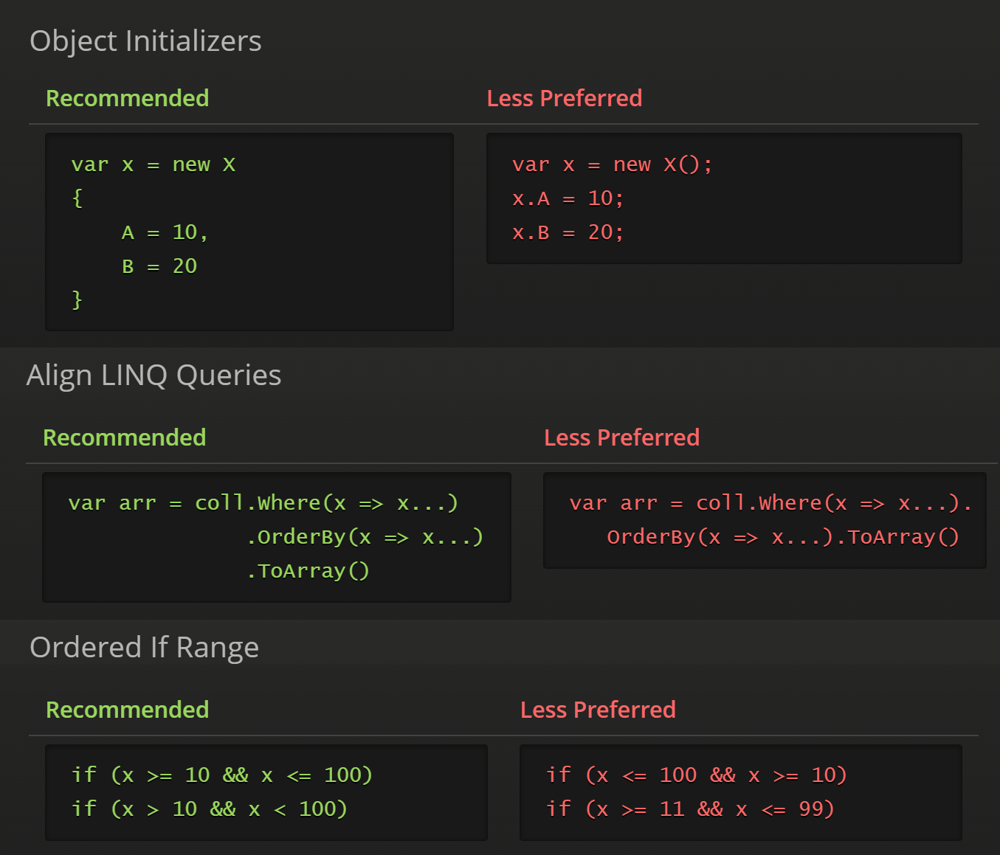

<style>.wrapper { max-width: 90% }</style>

🔣 Code Style
==============

[back](.)

[Code style](#-code-style) makes things easier to read. It is about  using clear *names* as well as *white space*.  
Specific *language construct* preferences are also part of the deal.



<h2>Contents</h2>

- [Introduction](#introduction)
- [Casing](#casing)
- [Naming](#naming)
    - [Method Names](#method-names)
    - [Class Names](#class-names)
    - [Boolean Names](#boolean-names)
    - [Collection Names](#collection-names)
    - [Enum Names](#enum-names)
    - [DateTime Names](#datetime-names)
    - [Sort Order](#sort-order)
    - [File-Related Variable Names](#file-related-variable-names)
    - [Prefixes and Suffixes](#prefixes-and-suffixes)
    - [Event Names / Delegate Names](#event-names--delegate-names)
    - [Test Class Names](#test-class-names)
    - [Test Method Names](#test-method-names)
    - ['Hungarian' Notation](#hungarian-notation)
- [Enters](#enters)
    - [Properties on Separate Lines](#properties-on-separate-lines)
    - [Variables on Separate Lines](#variables-on-separate-lines)
    - [Enters between Methods](#enters-between-methods)
    - [Enters in Methods](#enters-in-methods)
    - [Loops Multi-Line](#loops-multi-line)
    - [Enters between Switch Cases](#enters-between-switch-cases)
    - [Surplus Enters Between Braces](#surplus-enters-between-braces)
    - [Generic Constraints on Separate Line](#generic-constraints-on-separate-line)
    - [Generic Constraints on Same Line for One-Liners](#generic-constraints-on-same-line-for-one-liners)
- [Spaces and Braces](#spaces-and-braces)
    - [Auto-Formatting](#auto-formatting)
    - [Indentation](#indentation)
    - [No Braces for Single-Line If Statements](#no-braces-for-single-line-if-statements)
    - [Braces for Multi-Line Statements](#braces-for-multi-line-statements)
    - [Tabular Form Less Preferred](#tabular-form-less-preferred)
    - [Align LINQ Queries](#align-linq-queries)
- [Encapsulation](#encapsulation)
    - [Members Private](#members-private)
    - [Types Internal](#types-internal)
    - [Explicit Access Modifiers](#explicit-access-modifiers)
    - [No Public Fields](#no-public-fields)
    - [Public Members for Internal Classes](#public-members-for-internal-classes)
    - [Prefer Interface Types](#prefer-interface-types)
    - [Nested Class on Top](#nested-class-on-top)
    - [1 Type 1 File](#1-type-1-file)
    - [No Lone Classes](#no-lone-classes)
- [Comments](#comments)
    - [Comments in Summaries](#comments-in-summaries)
    - [Comments in English](#comments-in-english)
    - [No Comments without Info](#no-comments-without-info)
    - [No Unused / Outcommented Code](#no-unused--outcommented-code)
- [More Notation](#more-notation)
    - [Object Initializers](#object-initializers)
    - [Default Switch Case at the Bottom](#default-switch-case-at-the-bottom)
    - [Long Code Lines](#long-code-lines)
    - [Var](#var)
        - [Anonymous Types](#anonymous-types)
        - [New Statements](#new-statements)
        - [Direct Casts](#direct-casts)
        - [Long Code Lines](#long-code-lines-1)
        - [Views](#views)
    - [No Inferrable Type Arguments](#no-inferrable-type-arguments)
    - [FileOpen, FileMode, FileAccess, FileShare](#fileopen-filemode-fileaccess-fileshare)
    - [Ordered If Range](#ordered-if-range)
    - [Parameter Order](#parameter-order)
    - [Namespace Tips](#namespace-tips)
        - [Full Namespaces](#full-namespaces)
        - [Half Namespaces](#half-namespaces)
        - [Unique Class Names](#unique-class-names)
        - [Type Aliases](#type-aliases)
- [Member Order](#member-order)
- [Misc Preferences](#misc-preferences)
    - [Null / Empty Strings](#null--empty-strings)
    - [String.IsNullOrEmpty](#stringisnullorempty)
    - [String.Equals](#stringequals)
    - [Prefer Value and HasValue](#prefer-value-and-hasvalue)
    - [Prefer ToArray](#prefer-toarray)
    - [CLR Data Types](#clr-data-types)
    - [No Decisions from Exceptions](#no-decisions-from-exceptions)
    - [Entity Equality by ID](#entity-equality-by-id)
    - [Compiler Directives](#compiler-directives)
    - [Activator.CreateInstance](#activatorcreateinstance)


Introduction
------------

This article lists code style preferences, that might be followed in some of the [`JJ`](https://github.com/jjvanzon?tab=repositories) projects.

They mostly conform to `Microsoft` standards described in these articles:

- [C# Coding Conventions](http://msdn.microsoft.com/en-us/library/vstudio/ff926074.aspx)  
- [Coding Techniques and Programming Practices](http://msdn.microsoft.com/en-us/library/aa260844%28v=vs.60%29.aspx)

A tool like [`ReSharper`](api/table.md#resharper) may help. Its settings can be fine-tuned to closely match the preferences. It then checks the code style and can auto-format for you.


Casing
------

| Suggestion                                                        | Examples                       |
|-------------------------------------------------------------------|--------------------------------|
| Pascal case for properties, methods, `class` names and `events`   | `MyProperty` `MyMethod`
| Camel case for local variables and parameters                     | `myLocalVariable` `myParameter`
| Fields in camel case starting with underscore                     | `_myField`
| Constants in capitals with underscores between words              | `MY_CONSTANT`
| `Type` arguments just the letter `T` or start with the letter `T` | `T` `TEntity` `TViewModel`
| `Interfaces` start with `I`.                                      | `IMyInterface`
| Abbreviations not preferred                                       |
| Abbreviations of 2 letters with capitals.                         | `ID`
| Abbreviations of 3 letters or more in pascal case.                | `Mvc`
| [`MVC`](api/table.md#mvc) partial [`View`](patterns/presentation.md#views) names in pascal case, starting with underscore | `_MyPartialView`
| For long identifiers, underscores to separate 'the pieces'        | `Sine_OperatorCalculator_VarFrequency`


Naming
------

Reasons for naming conventions might be, just knowing what kind of system elements they are.

### Method Names

Method names commonly start with *verbs,* e.g. `CreateOrder`.  
For clarity generally don't use verbs, for things other than methods.  
Suggestions for verbs:

| Verb        | Description |
|-------------|-------------|
| `Add`       | `List.Add(item)`<br>`ListManager.Add(list, item)`<br>(`List` can be the ***`this`*** argument or the first argument.)
| `Assert`    | Throws an [`Exception`](aspects.md#exceptions) if input is invalid.
| `Calculate` |
| `Clear`     | Clears a list.
| `Convert`   |
| `ConvertTo` |
| `Create`    | Returns a new object.
| `Delete`    |
| `Ensure`    | Setting up a state, if not set up yet.<br>If `Ensure` means to throw an [`Exception`](aspects.md#exceptions),<br>consider using the `Assert` verb instead.
| `Execute`   |
| `Generate`  |
| `Get`       |
| `Invoke`    |
| `Parse`     |
| `Process`   |
| `Remove`    |
| `Save`      |
| `Set`       |
| `Try`       |
| [`TryGet`](patterns/other.md#tryget) | Returns `null` if an `object` does not exist.
| `Validate`  | Generating [`validation`](aspects.md#validation) messages for user-input errors.

### Class Names

In this [architecture](index.md), `class` names may end with a [pattern](patterns/README.md) name or a *verb* converted to a *noun*, e.g.:

    Converter
    Validator
    Calculator

And they may start with a term out of the *functional domain* (like `Order`, `Product` or `Price`):

    OrderConverter
    ProductValidator
    PriceCalculator

More *specialized* `classes` might get a prefix or suffix (like `Optimized` or `WithPriorityShipping`):

    OptimizedPriceCalculator
    OrderValidatorWithPriorityShipping

Abstract `classes` might prefer a `Base` suffix:

    ProductValidatorBase

It might be quite important to see in code, whether something is a `base` class. But exceptions may be made. For instance, [entity](patterns/data-access.md#entities) `classes` might leave out the `Base` suffix for readability reasons.

You might keep *variables* names similar to the `class` names and include the prefixes and suffixes, so it stays clear what they are.

Apart form *pattern names*, here are some other suggested 'last names' for `classes`:

|              | |
|--------------|-|
| `Resolver`   | A `class` that does lookups requiring complex keys or different ways of looking up depending on the situation, fuzzy lookups, etc.
| `Dispatcher` | A `class` calls different methods or sends messages to different endpoints  based on the input it receives.
| `Invoker`    | Something that invokes a method, possibly based on input or specific conditions.
| `Provider`   | A `class` that provides something. It can be useful to have a separate `class` that provides something if there are many conditions or contextual dependencies involved in retrieving something. A `Provider` might also be used when something is retrieved conditionally or if retrieval is postponed until later.
| `Asserter`   | A `class` meant to throw `Exceptions` under certain conditions.
|              | Any verb might become a `class` name, by turning it into a verby noun, e.g. `Convert` => [`Converter`](patterns/data-transformation.md#converter).

### Boolean Names

When naming *boolean* variables, consider using prefixes and suffixes:

| Prefix / Suffix | Example               | Comment |
|-----------------|-----------------------|---------|
| `Is...`         | `IsDeleted`           | Might be the most common prefix.
| `Must...`       | `MustDelete`          |
| `Can...`        | `CanDelete`           | Might indicate what *user* can do.
| `Has...`        | `HasRecords`          |
| `Are...`        | `AreEqual`            | For plural things.
| `Not...`        | `NotNull`             | A nice prefix, but perhaps be careful with negative names. See [Double Negatives](practices-and-principles.md#double-negatives-).
| `Include...`    | `IncludeHidden`       | Verb are usually for methods, but these may make sense for booleans.
| `Exclude...`    | `ExcludeSpecialChars` | "
| `...Exists`     | `FileExists`          |
| `Always...`     |                       |
| `Never...`      |                       |
| `Only...`       |                       |

A prefix might not always be put at the beginning. If it looks better, you might put it somewhere else:

    LinesAreCopied

instead of:
    
    AreLinesCopied

Some boolean names are so common, that they might not need a prefix:

    Visible
    Enabled

### Collection Names

Plural words are preferred for collections:

    Products
    Orders

Variable names for amounts of elements might be named:

    Count

So perhaps avoid plural words to denote a count or describe things other than collections.

### Enum Names

This [architecture](index.md) tends to end `enum` types with the `Enum` suffix e.g. `OrderStatusEnum`.

Another alternative might be the suffix `Mode`, e.g. `ConnectionMode`. But `Enum` expresses it more explicitly and that might be quite important.

### DateTime Names

A `DateTime` property might be suffixed with `Utc` or `Local`:

<pre class="green">
StartDateLocal
OrderDateTimeUtc
</pre>

An alternative suffix for `DateTimes` could be `When`:

<pre class="green">
ModifiedWhen
OrderedWhen
</pre>

But that might not look so nice, when you add the `Local` and `Utc` suffixes again:

<pre class="red">
ModifiedWhenUtc
OrderedWhenLocal
</pre>

### Sort Order

For number sequences the following names might be used:

    ListIndex
    IndexNumber
    SortOrder
    Rank

Perhaps don't use the word `Index` on its own, because that's an [`SQL`](api/sql.md) keyword.

### File-Related Variable Names

Variable names that describe parts of *file paths* might easily become ambiguous. Here are some suggestions to make them clearer: 

| Name                     | Value          
|--------------------------|--------------------------
| `FileName`                 | `"MyFile.txt"`
| `FilePath`                 | `"C:\MyFolder\MyFile.txt"`
| `FolderPath`               | `"C:\MyFolder"`
| `SubFolder`                | `"MyFolder"`
| `RelativeFolderPath` /<br>`SubFolder` /<br>`SubFolderPath` | `"MyFolder\MyFolder2"`
| `RelativeFilePath`         | `"MyFolder\MyFile.txt"`
| `FileNameWithoutExtension` | `"MyFile"`
| `FileExtension`            | `".txt"`
| `AbsoluteFilePath`         | `"C:\MyFolder\MyFile.txt"`
| `AbsoluteFolderPath`       | `"C:\MyFolder"`
| `AbsoluteFileName`         | DOES NOT EXIST
| `FileNamePattern` /<br>`FilePathPattern` / etc.<br>wildcards like `*` and `?` | `*.xml`<br>`C:\temp\BLA_???.csv`
| `FileNameFormat` /<br>`FilePathFormat` / etc.<br>placeholders like `{0}` and `{0:dd-MM-yyyy}` | `order-{0}.txt`<br>`orders-{0:dd-MM-yyyy}\*.*`

### Prefixes and Suffixes

| Example                  | Description
|--------------------------|--------------------
| `source...`<br>`dest...` | In code that converts one structure to the other, it might be clear to use the prefixes `source` and `dest`. You might use them consistently in the variable names, to keep track of where data comes from and where it goes.
| `existing...`            | Denoting that something already existed (in the database).
| `new...`                 | Denoting that the object was just newly created.
| `original...`            | May denote that this is an original value that was (temporarily) replaced.
| [`...WithRelatedEntities`](patterns/other.md#singular-plural-non-recursive-recursive-and-withrelatedentities)<br>[`...WithRelatedObjects`](patterns/other.md#singular-plural-non-recursive-recursive-and-withrelatedentities) | Indicating that it does more than handling a single object. Related objects linked to it are also included.
| `Versatile...`           | `Versatile` in that it might handle a multitude of types or situations.
| `...With...`             | When making a specialized `class` that works well for a specific situation, you might use the word `With` in the `class` name e.g.:<br> `CostCalculator`<br>`CostWithTaxCalculator`
| `...Polymorphic`         | Handling a variety of (derived) `types`, which may need different ways of processing.
| `...IfNeeded`            | A suffix alternative for `Conditional` that might be easier to read.
| `...Unsafe`              | When it lacks e.g. thread-safety, executes unmanaged code, or lacks some other checks.
| `...Recursive`           | When the process is recursive. Meaning: A method might call itself directly or indirectly. Or when processing a tree, the same type of data might be there deeper down the tree. 
| `To...`                  | For conversion from one thing to another. Sometimes the ***`this`*** is the source of the conversion, for example:<br>`array.ToHashSet()`<br>Sometimes a parameter is the source, for instance:<br>`MyConverter.ToHashSet(object[] array)`<br>But `Convert` or `ConvertTo` might be used as an alternative in that case:<br>`MyConverter.ConvertToHashSet(object[] array)`<br>
| `From...`                | For conversion from one thing to another. A lot like `To...` but executed on the `dest` object:<br>`dest.FromSource(source)`<br>The `To...` prefix might be more common, and possibly more readable.

### Event Names / Delegate Names

`Event` names and `delegate` names representing what *just happened* might be written in the past tense. For example:

    Deleted
    TransactionCompleted

`Event` names and `delegate` names representing what is *about to happen* might be written in the following form:

    Deleting
    TransactionCompleting

*User-initiated* `events` might not follow that pattern:

    Click
    DoubleClick
    KeyPress
    MouseUp

`Delegate` names might also have the suffix `Callback` or `Delegate`:

    ProgressInfoCallback
    AddItemDelegate

Sometimes the word `On` may be used:

    OnSelectedIndexChanged
    OnClick

Or the prefix `Handle`:

    HandleMouseDown

Or the suffix `Requested`, if your `event` looks like a method name.

    RemoveRequested

The names mentioned above can be used for `events`, but also for methods that *raise* or *handle* the event. Some prefixes for these methods include: `On`, `Handle`, `Fire`, and `Do`.

Perhaps avoid using `event` names with two `event`-indicating words, like <code class="red">OnDragging</code> or <code class="red">OnMouseUp</code>. Instead, you can use shorter names like <code class="green">Dragging</code> or <code class="green">MouseUp</code>.

### Test Class Names

`Test class` names end with the word `Tests`.

<table><tr><th class="green">Recommended</th><th class="red">Less Preferred</th></tr><tr><td markdown="1" class="green">

```csharp
[TestClass]
public class ValidatorTests()
{
    
}
```

</td><td markdown="1" class="red">

```csharp
[TestClass]
public class Tests_Validator()
{
    
}
```

</td></tr></table>

Reason: Just convention.

### Test Method Names

Prefer to start `test` method names with `Test_` and use underscores freely.

<table><tr><th class="green">Recommended</th><th class="red">Less Preferred</th></tr><tr><td markdown="1" class="green">

```cs
[TestMethod]
public void Test_Validator_NotNullOrEmpty_Valid()
{ }

[TestMethod]
public void Test_Validator_NotNullOrEmpty_NotValid()
{ }
```

</td><td markdown="1" class="red">

```cs
[TestMethod]
public void Test1()
{ }

[TestMethod]
public void Test2()
{ }
```

</td></tr></table>

Reason:  
When test names mean to be descriptive, they might become long. Underscores can separate the 'pieces' and make it more readable.

### 'Hungarian' Notation

Avoid prefixes such as `strName`.


Enters
------

### Properties on Separate Lines

<table><tr><th class="green">Recommended</th><th class="red">Less Preferred</th></tr><tr><td markdown="1" class="green">

```cs
int A { get; set; } 
int B { get; set; }

int C
{
    get { ... }
    set { ... }
}

int D
{
    get 
    {
        ... 
    }
    set 
    { 
        ...
    }
}
```

</td><td markdown="1" class="red">

```cs
int A { get; set; } int B { get; set; } 
```

</td></tr></table>

Reason:  
Otherwise it might be easily overlooked, that there is another property.

### Variables on Separate Lines

<table><tr><th class="green">Recommended</th><th class="red">Less Preferred</th></tr><tr><td markdown="1" class="green">

```cs
int i;
int j;
```

</td><td markdown="1" class="red">

```cs
int i, j; 
```

</td></tr></table>

Reason:  
Just a preference. It's up to you. But when you're not familiar with it, variables might be missed while searching the code. This syntax would have to be taken into account.

### Enters between Methods

<table><tr><th class="green">Recommended</th><th class="red">Less Preferred</th></tr><tr><td markdown="1" class="green">

```cs
void Bla()
{
   
}

void Bla2()
{
   
}
```

</td><td markdown="1" class="red">

```cs
void Bla()
{
    
}
void Bla2()
{
    
}
```

</td></tr></table>

Reason: Just a bit more tidy.

### Enters in Methods

Putting enters inside methods between the 'pieces that do something'.  

<table><tr><th class="green">Recommended</th><th class="red">Less Preferred</th></tr><tr><td markdown="1" class="green">

```cs
void Bla()
{
    var x = new X();
    x.A = 10;
    
    var y = new Y();
    y.B = 20;
    y.X = x;
    
    Bla2(x, y);
}
   
```

</td><td markdown="1" class="red">

```cs
void Bla()
{
    var x = new X();
    x.A = 10;
    var y = new Y();
    y.B = 20;
    y.X = x;
    Bla2(x, y);
} 
```

</td></tr></table>

Reason:  
Visible separation between steps inside methods.

### Loops Multi-Line

<table><tr><th class="green">Recommended</th><th class="red">Less Preferred</th></tr><tr><td markdown="1" class="green">

```cs
foreach (var x in list)
{ 
    Bla();
}
```

</td><td markdown="1" class="red">

```cs
foreach (var x in list) { Bla(); } 
```

</td></tr></table>

Reason: May look odd if you're not used to it.

### Enters between Switch Cases

<table><tr><th class="green">Recommended</th><th class="red">Less Preferred</th></tr><tr><td markdown="1" class="green">

```cs
switch (x)
{
    case 1:
        break;

    case 2:
        break;
}
```

</td><td markdown="1" class="red">

```cs
switch (x)
{
    case 1:
        break;
    case 2:
        break;
}
```

</td></tr></table>

Reason: A bit tidier and the bits better separated.

### Surplus Enters Between Braces

<table><tr><th class="green">Recommended</th><th class="red">Less Preferred</th></tr><tr><td markdown="1" class="green">

```cs
    }
}
```

</td><td markdown="1" class="red">

```cs
    }
    
}
```

</td></tr></table>

Reason: More tidy.

### Generic Constraints on Separate Line

<table><tr><th class="green">Recommended</th><th class="red">Less Preferred</th></tr><tr><td markdown="1" class="green">

```cs
class MyGenericClass<T>
    where T: MyInterface
{
    ...
}
```

</td><td markdown="1" class="red">

```cs
class MyGenericClass<T> where T: MyInterface
{
    ...
}
```

</td></tr></table>

Reason: So they stand out.

### Generic Constraints on Same Line for One-Liners

<table><tr><th class="green">Recommended</th><th class="red">Less Preferred</th></tr><tr><td markdown="1" class="green">

```cs
interface IMyInterface
{
    void MyMethod(T param) where T : ISomething
}
```

</td><td markdown="1" class="red">

```cs
interface IMyInterface
{
    void MyMethod(T param) 
        where T : ISomething
} 
```

</td></tr></table>

Reason:  
It might have been on a single line for readability, so perhaps we want to keep it like that.


Spaces and Braces
-----------------

### Auto-Formatting

Perhaps start out with [`Visual Studio's`](api/table.md#visual-studio) auto-formatting enabled and set to its defaults.  

Reason: Less surprising to the next developer.

### Indentation

Apply indentation properly.

<table><tr><th class="green">Recommended</th><th class="red">Less Preferred</th></tr><tr><td markdown="1" class="green">

```cs
object ParseValue(string input, Type type)
{
    if (type.IsNullableType())
    {
        if (string.IsNullOrEmpty(input))
        {
            return null;
        }

        type = type.GetUnderlyingNullableTypeFast();
    }

    if (type.IsEnum)
    {
        return Enum.Parse(type, input);
    }

    if (type == typeof(TimeSpan))
    {
        return TimeSpan.Parse(input);
    }

    if (type == typeof(Guid))
    {
        return new Guid(input);
    }

    return Convert.ChangeType(input, type);
}
```

</td><td markdown="1" class="red">

```cs
        object ParseValue(string input,
Type type 
            )
{
        if (type.IsNullableType()) 
        {
    if (string.IsNullOrEmpty(input)) {
    return null;
}

type = type.GetUnderlyingNullableTypeFast();
    }

        if (type.IsEnum) 
    {
return Enum.Parse(type, input);
    }

            if (type == 
    typeof(TimeSpan))
{
                return TimeSpan.Parse(input);
}

            if (type == typeof(Guid))
            { 
    return new Guid(input);
            }


        return 
        Convert.ChangeType(
   input, 

        type);
                }
```

</td></tr></table>

Reason: More readable.

### No Braces for Single-Line If Statements

<table><tr><th class="green">Recommended</th><th class="red">Less Preferred</th></tr><tr><td markdown="1" class="green">

```cs
if (condition) Bla();
```
 
</td><td markdown="1" class="red">

```cs
if (condition) { Bla(); }
```

</td></tr></table>

Reason: Less clutter.

### Braces for Multi-Line Statements

<table><tr><th class="green">Recommended</th><th class="red">Less Preferred</th></tr><tr><td markdown="1" class="green">

```cs
foreach (var x in list)
{
    Bla();
}

if (condition)
{
    Bla();
    Something();
}
```

</td><td markdown="1" class="red">

```cs
foreach (var x in list)
    Bla();

if (condition)
    Bla(); 
    Something();
```

</td></tr></table>

Reason:  
Without braces, only the next line is looped or executed conditionally. The line after that would not be part of the loop or `if`, which might not be very obvious and might lead to error.

### Tabular Form Less Preferred

<table><tr><th class="green">Recommended</th><th class="red">Less Preferred</th></tr><tr><td markdown="1" class="green">

```cs
public int ID { get; set; }
public bool IsActive { get; set; }
public string Text { get; set; }
public string Answer { get; set; }
public bool IsManual { get; set; }
```

</td><td markdown="1" class="red">

```cs
public int    ID       { get; set; }
public bool   IsActive { get; set; }
public string Text     { get; set; }
public string Answer   { get; set; }
public bool   IsManual { get; set; } 
```

</td></tr></table>

Reason:  
Tabular form might be undone by auto-formatting. It may look nice, but maybe get your eyes used to non-tabular form instead.

### Align LINQ Queries

Aligning the elements:

<table><tr><th class="green">Recommended</th><th class="red">Less Preferred</th></tr><tr><td markdown="1" class="green">

```cs
var arr = coll.Where(x => x...)
              .OrderBy(x => x...)
              .ToArray()
```

</td><td markdown="1" class="red">

```cs
var arr = coll.Where(x => x...).
   OrderBy(x => x...).ToArray() 
```

</td></tr></table>

Reason: readability.


Encapsulation
-------------

### Members Private

Keeping members private is preferred. 

```cs
private void Bla()
{
    ...
}
```

Reason:  
Other code might become dependent on publicly accessible things. Managing dependencies like that is quite a thing in software development.

### Types Internal 

Keep types `internal` is preferred.

```cs
internal class MyClass
{
    ...   
}
```

Reason:  
Managing dependency between parts is quite a concern in software development. We might protect things from forming too many connections, by using access modifying keywords, like `private` and `internal`.

### Explicit Access Modifiers

<table><tr><th class="green">Recommended</th><th class="red">Less Preferred</th></tr><tr><td markdown="1" class="green">

***`public`***` int Bla() { ... }`

</td><td markdown="1" class="red">

`int Bla() { ... }`

</td></tr></table>

Reason:  
Avoiding confusion about the defaults.

Exception:  
`Interface` members have no access modifiers.

### No Public Fields

Prefer not to use `public` fields. Use either `private` fields or use *properties*. 

<table><tr><th class="green">Recommended</th><th class="red">Less Preferred</th></tr><tr><td markdown="1" class="green">

`public int X `***`{ get; set; }`***

</td><td markdown="1" class="red">

`public int X;`

</td></tr></table>

Reason:  
Some may say using `public` fields makes the `interface` less stable. Fields may look similar to `properties` from the outside. However, frameworks may expect `properties`, not fields. This makes it harder to use fields in reusable functions and may cause compatibility issues.

### Public Members for Internal Classes

The use of `internal` members is not recommended within `internal` classes.

<table><tr><th class="green">Recommended</th><th class="red">Less Preferred</th></tr><tr><td markdown="1" class="green">

`internal class A { `***`public`***` void B { } }`

</td><td markdown="1" class="red">

`internal class A { `***`internal`***` void B { } }`

</td></tr></table>

Reason:  
If the `class` is `internal`, the members are automatically `internal` too. When making the `class` `public`, more access modifiers may need to change, creating an opportunity for error.

### Prefer Interface Types

<table><tr><th class="green">Recommended</th><th class="red">Less Preferred</th></tr><tr><td markdown="1" class="green">

***`IList`***`<int> list = new List<int>;`

</td><td markdown="1" class="red">

***`List`***`<int> list = new List<int>; `

</td></tr></table>

Reason:  
`Interface types` may give you less to refactor when changing a `type`. Less dependency on specific implementation, allowing for an easier switch to another `class`.

### Nested Class on Top

Putting nested `classes` at the top of the parent `class'` code. 

<table><tr><th class="green">Recommended</th><th class="red">Less Preferred</th></tr><tr><td markdown="1" class="green">

```cs
internal class A
{
    private class B
    {
        
    }
    
    ...

    public int X { get; set; }
}
```

</td><td markdown="1" class="red">

```cs
internal class A
{
    public int X { get; set; }
    
    ...
    
    private class B
    {
        
    }
}
```

</td></tr></table>

Reason:  
It may not be obvious there are nested `classes`, unless they are put at the top.

### 1 Type 1 File

Give each `class` (or `interface` or `enum`) its own file.

Reason:  
One might be surprised to find `types` hidden away behind a single file name. It may harm the overview of the different pieces of the code.

Exceptions:  
This guideline does not apply to nested `classes`. Also, a single `class` can be split across multiple files if they are `partial classes`. This guideline may also be ignored if there are a large number of smaller `classes`.

### No Lone Classes

It may not be very handy to have many folders that only contain one or few `classes`. Consider moving those `classes` to other folders or putting them together in a single `Helpers` folder.


Comments
--------

### Comments in Summaries

You might put comment for members in `<summary>` tags. 

<table><tr><th class="green">Recommended</th><th class="red">Less Preferred</th></tr><tr><td markdown="1" class="green">

```cs
/// <summary> This is the x coordinate. </summary>
int X { get; set; }
```

</td><td markdown="1" class="red">

```cs
// This is the x-coordinate.
int X { get; set; } 
```

</td></tr></table>

Reason:  
Your comment might be valuable from the outside for others to see. Your `summary` would show up when hovering over a member.

### Comments in English

<table><tr><th class="green">Recommended</th><th class="red">Less Preferred</th></tr><tr><td markdown="1" class="green">

```cs
// This is a thing.
```

</td><td markdown="1" class="red">

```cs
// Dit is een ding. 
```

</td></tr></table>

Reason:  
English is basically the main language in IT. A broader reach of people might be able to read your comments.

### No Comments without Info

Avoid comments that do not add information.

<table><tr><th class="green">Recommended</th><th class="red">Less Preferred</th></tr><tr><td markdown="1" class="green">

```cs
int x;
```

</td><td markdown="1" class="red">

```cs
// This is x
int x;
```

</td></tr></table>

Reason:  
Less visual clutter. Reading it might not be worth the time.

### No Unused / Outcommented Code

Avoid leaving around unused or outcommented code. If necessary, you can move it to an `Archive` folder.

Reason:  
Unused code might clutter your vision. It may also give the impression, that it was outcommented in error.


More Notation
-------------

### Object Initializers

<table><tr><th class="green">Recommended</th><th class="red">Less Preferred</th></tr><tr><td markdown="1" class="green">

```cs
var x = new X
{
    A = 10,
    B = 20
}
```

</td><td markdown="1" class="red">

```cs
var x = new X();
x.A = 10;
x.B = 20; 
```

</td></tr></table>

Reason: More readable.

### Default Switch Case at the Bottom

<table><tr><th class="green">Recommended</th><th class="red">Less Preferred</th></tr><tr><td markdown="1" class="green">

```cs
switch (x)
{
    case 0:
        break;
    
    case 1:
        break;
    
    default:
        break;
}
```

</td><td markdown="1" class="red">

```cs
switch (x)
{
    default:
        break;

    case 0:
        break;

    case 1:
        break;
} 
```

</td></tr></table>

Reason:  
The default `switch` case is often the 'last resort' case, so it may make sense to put it last.

### Long Code Lines

Avoid long code lines for readability.

### Var

The use of `var` is not preferred here.

<table><tr><th class="green">Recommended</th><th class="red">Less Preferred</th></tr><tr><td markdown="1" class="green">

***`int`***` x = y.X;`

</td><td markdown="1" class="red">

***`var`***` x = y.X;`

</td></tr></table>

Reason:  
A variable `type` might be relevant to see.

Exceptions:  
But in some cases, `var` may be preferred after all. For example, when the `type` is obvious, or it makes the code more readable.

#### Anonymous Types

<table><tr><th class="green">Recommended</th><th class="red">Not Preferred</th></tr><tr><td markdown="1" class="green">

***`var`***` q = from x in list select new { A = x.A };`

</td><td markdown="1" class="red">

***`X`***` q = from x in list select new { A = x.A };`

</td></tr></table>

#### New Statements

<table><tr><th class="green">Recommended</th><th class="red">Less Preferred</th></tr><tr><td markdown="1" class="green">

***`var`***` x = new X();`

</td><td markdown="1" class="red">

***`X`***` x = new X();`

</td></tr></table>

#### Direct Casts

<table><tr><th class="green">Recommended</th><th class="red">Less Preferred</th></tr><tr><td markdown="1" class="green">

***`var`***` x = (X)y;`

</td><td markdown="1" class="red">

***`X`***` x = (X)y;`

</td></tr></table>

#### Long Code Lines

<table><tr><th class="green">Recommended</th><th class="red">Less Preferred</th></tr><tr><td markdown="1" class="green">

```cs
foreach (var entry in dictionary)
```

</td><td markdown="1" class="red">

```cs
foreach (KeyValuePair<Canonical.ValidationMessage,  
         Tuple<NonPhysicalOrderProductList, Guid>> entry in dictionary)
```

</td></tr></table>

#### Views

<table><tr><th class="green">Recommended</th><th class="red">Less Preferred</th></tr><tr><td markdown="1" class="green">

`<% foreach (`***`var`***` order in Model.Orders) %>`

</td><td markdown="1" class="red">

`<% foreach (`***`OrderViewModel`***` order in Model.Orders) %>`

</td></tr></table>

### No Inferrable Type Arguments

Prefer not to use `type` arguments that can be *inferred*. 

<table><tr><th class="green">Recommended</th><th class="red">Less Preferred</th></tr><tr><td markdown="1" class="green">

`References(x => x.Child)`

</td><td markdown="1" class="red">

`Reference`***`<Child>`***`(x => x.Child)`

</td></tr></table>

Reason: Less visual clutter.

### FileOpen, FileMode, FileAccess, FileShare

When a `FileStream` is opened it is appreciated to specify the aspects `FileMode`, `FileAccess` and `FileShare` explicitly. Try to use the most logical and most limiting values tailored to the situation.

Reason:  
Otherwise these aspects may have surprising defaults.

### Ordered If Range 

When expressing a *range* in an `if` statement, showing the actual *limits* of the range may look better. Also, mentioning the *start* of the range first and the *end* of the range second might make it more readable.

<table><tr><th class="green">Recommended</th><th class="red">Less Preferred</th></tr><tr><td markdown="1" class="green">

```cs
if (x >= 10 && x <= 100)
if (x > 10 && x < 100)
```

</td><td markdown="1" class="red">

```cs
if (x <= 100 && x >= 10)
if (x >= 11 && x <= 99) 
```

</td></tr></table>

Reason: Readability. More obvious what the range limits are.

### Parameter Order

Passing *infrastructure*-related parameters to constructors or methods, the parameters might be listed in a certain order:

- __[entities](patterns/data-access.md#entities)__ (or loose values)
- __[persistence](aspects.md#persistence)__
- __[security](aspects.md#security)__
- __culture__
- __other__

For instance:

```cs
class MyPresenter
{
    public MyPresenter(
        MyEntity entity, 
        IMyRepository repository,
        IAuthenticator authenticator,
        string cultureName,
        int pageSize)
    {
        ...
    }
}
```

Reason:  
Just to have some kind of standard for consistency.

### Namespace Tips

#### Full Namespaces

*Full* `namespaces` in code might not be preferred:

<table><tr><th class="red">

Less Preferred

</th></tr><tr><td markdown="1" class="red">

```cs
JJ.Business.Cms.RepositoryInterfaces.IUserRepository userRepository =
    PersistenceHelper.CreatCmsRepository<JJ.Business.Cms.RepositoryInterfaces.IUserRepository>(cmsContext);
```
</td></tr></table>

Reason:  
Long and wordy code can make it harder to read.

#### Half Namespaces

*Half* a `namespace` might not be preferred either:

<table><tr><th class="red">

Less Preferred

</th></tr><tr><td markdown="1" class="red">

```cs
Cms.RepositoryInterfaces.IUserRepository userRepository = 
    PersistenceHelper.CreateCmsRepository<Cms.RepositoryInterfaces.IUserRepository>(cmsContext);
```

</td></tr></table>

Reason:  
If you'd want to rename the `namespace`, it might create more manual work. The shortened `namespace` could be overlooked when searching through the code.

#### Unique Class Names

To prevent using a `namespace` in the code line, you might give a `class` a more unique name:

<table><tr><td markdown="1" class="green">

```cs
ICmsUserRepository cmsUserRepository = 
    PersistenceHelper.CreateCmsRepository<ICmsUserRepository>(cmsContext);
```

</td></tr></table>

#### Type Aliases

To disambiguate a `type` name, you might use a `type` *alias* instead. This can prevent long `namespaces` in the code lines:

<table><tr><th class="green">

Recommended

</th></tr><tr><td markdown="1" class="green">

```cs
using IUserRepository_Cms = JJ.Business.Cms.RepositoryInterfaces.IUserRepository;

IUserRepository_Cms cmsUserRepository = 
    PersistenceHelper.CreateCmsRepository<IUserRepository_Cms>(cmsContext);
```

</td></tr></table>

Reason:  
Long, visually cluttered code lines might be harder to read.


Member Order
------------

To improve readability, try giving the members in your code a logical order, instead of putting them all in an arbitrary order. Suggestions for organizing the members in your code:

|                          |     |
|--------------------------|-----|
| __Chronological__        | When one method delegates to another in a particular order, you might order the methods chronologically.
| __By functional aspect__ | When your code has distinct functionalities, you might keep members with similar functions together and add a comment line above the group.
| __By technical aspect__  | You may choose to keep your fields together, your `properties` together, your methods together. Another option might be to group them by access modifier (e.g. `public` or `private`).
| __By layer__             | When you can identify *layers* in your `class`, you might first list the members of layer 1, then the members of layer 2, etc.

You might prefer to make it chronological if possible. Otherwise, order it by functional aspect. But there are no rights and wrongs here. Whatever seems most appropriate for your code.


Misc Preferences
----------------

### Null / Empty Strings

Prefer handling both `null` and `""` the same way.  

Reason: No surprises when using either `null` or `""`.

### String.IsNullOrEmpty

Prefer `string.IsNullOrEmpty` to check if a `string` is filled in. 

<table><tr><th class="green">Recommended</th><th class="red">Less Preferred</th></tr><tr><td markdown="1" class="green">

```cs
String.IsNullOrEmpty(str)
```

</td><td markdown="1" class="red">

```cs
str == null 
```

</td></tr></table>

Reason:  
Reference equality (`==`) may fail in exceptional cases even when `strings` are equal.

### String.Equals

Prefer `string.Equals` to check the equality of `string`. 

<table><tr><th class="green">Recommended</th><th class="red">Less Preferred</th></tr><tr><td markdown="1" class="green">

```cs
string.Equals(str, "bla")
```

</td><td markdown="1" class="red">

```cs
str == "bla"
```

</td></tr></table>

Reason:  
*Reference* equality (`==`) may fail in exceptional cases even if `string` *values* are equal.

### Prefer Value and HasValue

For `Nullable` types:

<table><tr><th class="green">Recommended</th><th class="red">Less Preferred</th></tr><tr><td markdown="1" class="green">

```cs
int? number;
if (number.HasValue)
{
    string message = $"Number = {number.Value}";
}
```

</td><td markdown="1" class="red">

```cs
int? number;
if (number != null)
{
    string message = $"Number = {number}";
}
```

</td></tr></table>

Reason:  
The less preferred one may look nice, but the behavior of the code would change considerably, if the variable type is changed to `object`.

### Prefer ToArray

Prefer `ToArray` over `ToList`. 

<table><tr><th class="green">Recommended</th><th class="red">Less Preferred</th></tr><tr><td markdown="1" class="green">

`IList<int> collection = x.`***`ToArray`***`();`

</td><td markdown="1" class="red">

`IList<int> collection = x.`***`ToList`***`();`

</td></tr></table>

Reason: More performance.  
Downside: The `Add` method may throw an [`Exception`](aspects.md#exceptions) for an `Array`.

### CLR Data Types

Prefer using [`CLR`](https://learn.microsoft.com/en-us/dotnet/standard/clr)- compliant data types. Some aren't [`CLR`](https://learn.microsoft.com/en-us/dotnet/standard/clr)- compliant.

<table><tr><th class="green">Recommended</th><th class="red">Less Preferred</th></tr><tr><td markdown="1" class="green">

```cs
int
long
byte
```

</td><td markdown="1" class="red">

```cs
// Unsigned types:
uint
ulong
// And also:
sbyte
```

</td></tr></table>

Reason:  
For compatibility with more variations of [`.NET`](api/table.md#dotnet).

### No Decisions from Exceptions

Avoid getting information by catching an [`Exception`](aspects.md#exceptions). Prefer getting your information without using [`Exception`](aspects.md#exceptions) handling.

<table><tr><th class="green">Recommended</th><th class="red">Less Preferred</th></tr><tr><td markdown="1" class="green">

```cs
bool FileExists(string path)
{
    return File.Exists(path);
}
```

</td><td markdown="1" class="red">

```cs
bool FileExists(string path)
{
    try
    {
        File.Open(path, ...);
        return true;
    }
    catch (IOException)
    {
        return false;
    }
}
```

</td></tr></table>

Reason:  
[`Exception`](aspects.md#exceptions) handling is more performance intensive than might be expected. When no [`Exception`](aspects.md#exceptions) goes off, [`Exception`](aspects.md#exceptions) handling might perform well, but when an [`Exception`](aspects.md#exceptions) does go off, quite a few things happen, like gathering `StackTrace` information.

### Entity Equality by ID

[Entity](patterns/data-access.md#entities) equality checks might be better done by `ID` than by *reference*.

<table><tr><th class="green">Recommended</th><th class="red">Less Preferred</th></tr><tr><td markdown="1" class="green">

```cs
if (entity1.ID == entity2.ID)
```

</td><td markdown="1" class="red">

```cs
if (entity1 == entity2) 
```

</td></tr></table>

Reason:  
Code that compares *identities* may be less likely to break, because [persistence frameworks](api/orm.md#-orm) don't always ensure *instance* integrity.

(Also consider doing [null checks](practices-and-principles.md#null-checks) on the [entities](patterns/data-access.md#entities) if needed.)

### Compiler Directives

Prefer not to use *compiler directives*, unless the code cannot run on a platform without excluding that piece of code. Otherwise a *boolean* variable might be preferred, a [configuration](aspects.md#configuration) setting or different *concrete implementations* of `classes`.

<table><tr><th class="green">Recommended</th><th class="red">Less Preferred</th></tr><tr><td markdown="1" class="green">

```cs
if (config.FeatureXEnabled)
{
    // ...
}
```

</td><td markdown="1" class="red">

```cs
#if FEATURE_X_ENABLED
    // ...
#endif
```

</td></tr></table>

Reason:  
When using these compiling directives, a compilation might succeed, without all the code being actually compilable.

### Activator.CreateInstance

Prefer using the `new` keyword instead of `Activator.CreateInstance`. Using generics' `new` constraint  might avoid some of the `Activator.CreateInstance` calls.

<table><tr><th class="green">Recommended</th><th class="red">Less Preferred</th></tr><tr><td markdown="1" class="green">

```cs
new T()
```

</td><td markdown="1" class="red">

```cs
Activator.CreateInstance(typeof(T)) 
```

</td></tr></table>

A call to `Activator.CreateInstance` might be the last choice for instantiating an `object`.

Reason:  
`New` statements are strongly typed, less likely to break and possibly faster.

[back](.)