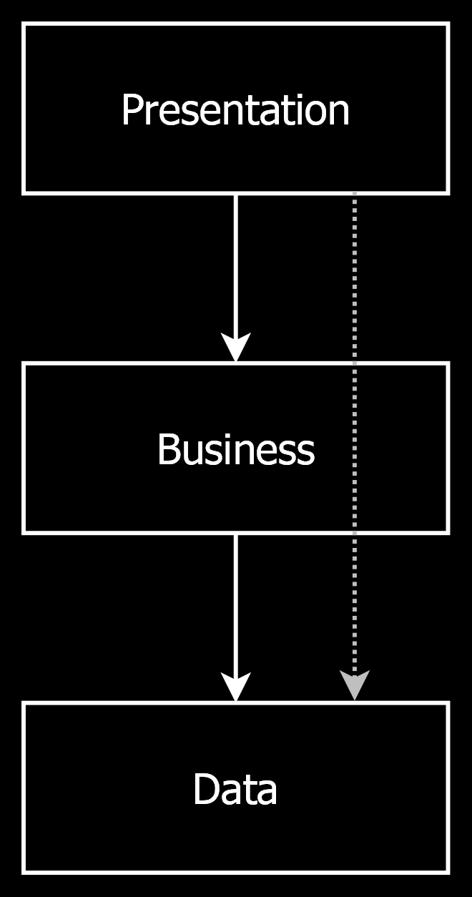
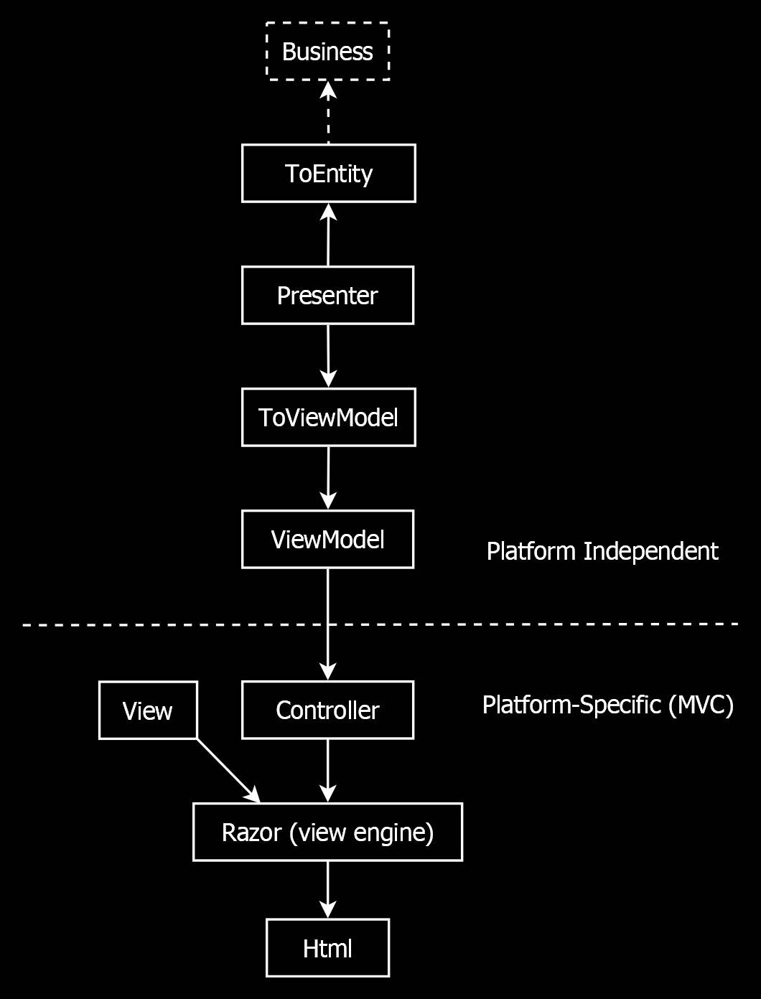

Layers
======

[back](.)

Software might be built up of layers. This article describes how these layers might be structured. Each layer comes with different technology.

<h3>Contents</h3>

- [Three Layers](#three-layers)
- [Data Layer](#data-layer)
    - [Database (DB)](#database-db)
    - [ORM (NHibernate)](#orm-nhibernate)
    - [Mappings](#mappings)
    - [Entities](#entities)
    - [Repositories](#repositories)
    - [Repository Interfaces](#repository-interfaces)
    - [Platform Independence](#platform-independence)
- [Presentation Layer](#presentation-layer)
    - [Calls the Business Layer](#calls-the-business-layer)
    - [Presenter](#presenter)
    - [ViewModel](#viewmodel)
    - [ToViewModel](#toviewmodel)
    - [ToEntity](#toentity)
    - [Facades](#facades)
    - [MVC](#mvc)
    - [MVC Controllers](#mvc-controllers)
    - [URLs](#urls)
    - [View Engine (Razor)](#view-engine-razor)
    - [Views (Razor)](#views-razor)
    - [HTML](#html)
    - [Platform Independence](#platform-independence-1)
- [Business Layer](#business-layer)
    - [Layer Connections](#layer-connections)
    - [Magic](#magic)
    - [Facades](#facades-1)
    - [CRUD](#crud)
    - [Validation](#validation)
    - [Side-Effects](#side-effects)
    - [Calculations](#calculations)
    - [Conversions](#conversions)
    - [Enums](#enums)
    - [Resources Strings](#resources-strings)
    - [Defaults](#defaults)
    - [Cascading](#cascading)
    - [Cloning](#cloning)
    - [Relationship Syncing](#relationship-syncing)
    - [Platform Independence](#platform-independence-2)
- [Perpendicular Layers](#perpendicular-layers)
    - [Perpendicular](#perpendicular)
    - [Framework](#framework)
    - [Infrastructure](#infrastructure)
    - [Loosely Coupled](#loosely-coupled)
    - [Services](#services)
- [Alternatives](#alternatives)

Three Layers
------------

Software can be split up into `3` layers:

The [presentation](#presentation-layer) layer is the visual part of a program. It is what the user sees.

The [business](#business-layer) layer can model of the functionality of a software program, but you generally don't see it. It defines the rules of the system. It is like the internal, mechanical parts.

The [data](#data-layer) layer models and stores the data. It models functionality more passively: it does not really do anything on its own. It does not really process the data. It just stores it.

The [presentation](#presentation-layer) layer builds upon the [business](#business-layer) layer with user interface technology.

The [business](#business-layer) layer uses the [data](#data-layer) layer to store the data.

Sometimes the [presentation](#presentation-layer) layer skips the [business](#business-layer) layer, and uses the [data](#data-layer) layer directly, where the [business](#business-layer) layer would not really add any functionality.

The [data](#data-layer) layer may be programmed with mostly fixed patterns in this architecture. The [presentation](#presentation-layer) layer is mostly fixed patterns too. The [business](#business-layer) layer can have patterns as well, but it gets a little more creative. If anything special needs to happen, it might be put in the [business](#business-layer) layer.

Data Layer
----------

The *data layer* models and stores the data. It might be built up of the following sub-layers:

### Database (DB)

It starts with the database (DB). This can be a *relational database* like `Microsoft SQL Server`, that structuredly stores the data into tables and relationships. But the it could also be another type of data store: an [`XML`](apis.md#xml) file, flat file or even just in-memory data, wherever the data is *stored*.

### ORM (NHibernate)

The database might not be directly accessed by the rest of the code. It may go through an *object-relational mapper* (or [`ORM`](apis.md#orm)), like [`NHibernate`](apis.md#nhibernate). The [`ORM`](apis.md#orm) would translate database records to objects called [*entities*](patterns.md#entity).
    
It could also be a different data access technology, instead of [`NHibernate`](apis.md#nhibernate): a different [`ORM`](apis.md#orm), like [`Entity Framework`](apis.md#entity-framework) or [`XML`](apis.md#xml) files, or perhaps [`SqlClient`](apis.md#sql) to execute raw [`SQL`](apis.md#sql) onto a database.

### Mappings

The [entity](patterns.md#entity) objects have properties, that map to columns in the database, and properties that point to related entities. [`NHibernate`](apis.md#nhibernate) needs [mappings](patterns.md#mapping), that define which *class* maps to which *table* and which *columns* map to which *properties*.

[`FluentNHibernate`](https://www.nuget.org/packages/FluentNHibernate) is an `API` that can help to build up these [mappings](patterns.md#mapping).

### Entities

With all this in place, out come objects called [entities](patterns.md#entity), loaded from the database. These [entity](patterns.md#entity) classes represent the domain model.

### Repositories

The [entities](patterns.md#entity) may not be directly read out of [`NHibernate`](apis.md#nhibernate) by the rest of the code, but accessed using [`Repositories`](patterns.md#repository). You might see the [`Repositories`](patterns.md#repository) as a set of queries. Each [entity](patterns.md#entity) type might have its own [`Repository`](patterns.md#repository). Next to providing a central place to manage an optimal set of queries, the [`Repositories`](patterns.md#repository) keep the rest of the code independent of [`NHibernate`](apis.md#nhibernate), in case you would like to switch to a different data storage technology.

### Repository Interfaces

The [`Repository`](patterns.md#repository) implementations might not used directly, but accessed through [`interfaces`](patterns.md#repository-interfaces), so that we can indeed use a different data access technology, just by instantiating a different [`Repository`](patterns.md#repository) *implementation*. The [`Repository interfaces`](patterns.md#repository-interfaces) are also handy for [testing](aspects.md#automated-testing), to create a [fake](patterns.md#mock) in-memory data store, instead of connecting to a real database. The API [`JJ.Framework.Data`](https://dev.azure.com/jjvanzon/JJs-Software/_artifacts/feed/JJs-Pre-Release-Package-Feed/NuGet/JJ.Framework.Data/) can help to abstract this data access, providing a base for these [`Repositories`](patterns.md#repository) and [interfaces](patterns.md#repository-interfaces).

### Platform Independence

The dashed line going right through the [diagram](#data-layer), separates the *platform-specific* code from the *platform independent* code. The platform-specific code concerns itself with [`NHibernate`](apis.md#nhibernate) and `SQL Server`, while the platform independent code is unaware of what the underlying storage technology is. You may as well stick an [`XML`](apis.md#xml) file under it and not use `SQL Server` or [`NHibernate`](apis.md#nhibernate). This allows us to program against the same model, regardless of how it is stored. This platform-independence, also allows deployment of the same code in different environment that can run `.NET`, such as a *mobile phone*, *windows* or *web*.

Presentation Layer
------------------

The *presentation* layer is the visual part of a program. It is what the user sees. It can be split up into the following sub-layers:

### Calls the Business Layer

The [presentation layer](#presentation-layer) calls the [business layer](#business-layer), which contains the rules that surround the system. It feeds the [business layer](#business-layer) input from the user, and processes its output to preparate it for display on screen.

### Presenter

It is the [`Presenter`](patterns.md#presenter) classes that talk to this [business layer](#business-layer). The [`Presenters`](patterns.md#presenter) together form a model of the application navigation. Each screen might get its own [`Presenter`](patterns.md#presenter). Each method in that [`Presenter`](patterns.md#presenter) would represent a specific *user action* in that screen.

### ViewModel

A [`ViewModel`](patterns.md#viewmodel) would contain a specific subset of data: exactly the selection of data, that is to be shown on screen. In this architecture [`ViewModels`](patterns.md#viewmodel) are a pure data objects, no logic. That makes them more easily usable for different presentation technologies and might easily be sent over a wire.

### ToViewModel

The [`Presenters`](patterns.md#presenter) might delegate to a [`ToViewModel`](patterns.md#toviewmodel) layer, to translate the data and the results from the [business logic](#business-layer) to a subset of data that is shown on screen.

### ToEntity

The [`Presenters`](patterns.md#presenter) also delegate to a [`ToEntity`](patterns.md#toentity) layer, to translate user input back to [`entity`](patterns.md#entity) data, before passing it on to the [business layer](#business-layer).

### Facades

[`Presenter`](patterns.md#presenter) classes combine several responsibilities around the presentation.

The [`Presenters`](patterns.md#presenter) call upon the [business layer](#business-layer) to *save*, [`Validate`](patterns.md#validators), execute [`SideEffects`](patterns.md#side-effects) and other *logic* around the user action.

Because the [`Presenters`](patterns.md#presenter) combine several responsibilities together they can be called the [`Facades`](patterns.md#facade) or [combinators](patterns.md#facade) of the [presentation layer](#presentation-layer).

### MVC

`MVC` is the technology of choice in this architecture for programming user interfaces in web technology. In our architecture the `MVC` layer builds on top of the [`Presenter`](patterns.md#presenter) layer.

### MVC Controllers

`MVC` uses [`Controllers`](patterns.md#controller), which are similar to [`Presenters`](patterns.md#presenter) in that they group together related *user actions* and each user action gets a specific *method*.

[`Controllers`](patterns.md#controller) are quite specific to `MVC` and an equivalent might not be present on other presentation platforms. However, even on other presentation platforms it might be advisable to have a *central spot* to manage calls to the [`Presenter`](patterns.md#presenter) and showing the right [`ciew(s)`](patterns.md#views) depending on its result.

### URLs

`MVC` takes care that the request from the web browser automatically makes the right [`Controller`](patterns.md#controller) method go off. Each method in a [`Controller`](patterns.md#controller) tends to represent a `URL`.

The parameters of a [`Controller`](patterns.md#controller) method can be `URL` parameters. A parameter can also be *post data*. [`ViewModel`](patterns.md#viewmodel) parameters are accepted by `MVC` [`Controller`](patterns.md#controller) methods and are built up of post data by `MVC` automatically.

[`JJ.Framework.Mvc`](https://dev.azure.com/jjvanzon/JJs-Software/_artifacts/feed/JJs-Pre-Release-Package-Feed/NuGet/JJ.Framework.Mvc) might be used to send whole tree structures of post data over the wire to be correctly parsed by `MVC`.

### View Engine (Razor)

After the [`Controller`](patterns.md#controller) method is done, the view engine kicks in. The view rendering automatically goes off after the [`Controller`](patterns.md#controller) method is done.

### Views (Razor)

The view engine of choice in this architecture is `Razor`. It can offer a concise syntax for programming [views](patterns.md#views), in which you combine `C#` with `HTML`. `Razor` has tight integration with `MVC`. The view engine uses a [`ViewModel`](patterns.md#viewmodel) as input, along with the view template (`cshtml`) and the output is a specific piece of `HTML`.

In `WinForms` the [views](patterns.md#views) would be the `Forms` and `UserControls`. It is advised that even if a [view](patterns.md#views) can have code-behind, to only put simple code in `Forms` and `Controls` . The real work might be delegate to the [Presenter](patterns.md#presenter) layer instead.

### HTML

The `Razor` engine produces a piece of `HTML` received by the web browser. 

`HTML` here can be replaced by the type of presentation output. In `WinForms` it might be the controls and their data. But it can be a generated `PDF` file as well. Anything that can come out of presentation any technology might be called a [view](patterns.md#views).

### Platform Independence

The dashed line going right through the [diagram](#presentation-layer) above separates the *platform-specific* code from the *platform independent* code. 

The *platform-specific* code concerns itself with `MVC`, `HTML` and `Razor`, while the *platform independent* code is unaware of which presentation technology is used.

That means that we can use the same kind of application logic for multiple presentation techniques, such as offering an application both *web* based as well as on *Windows*. This helped give us the flexibility to deploy apps on *mobile* platforms using the same base techniques as we would use on *Windows* or *web*.

Business Layer
--------------

What is business logic? Basically anything that is not [presentation](#presentation-layer), [data access](#data-layer) or [infrastructure](#perpendicular-layers), might be considered the [business logic](#business-layer). It defines the *rules* of a system, like the internal, mechanical parts. It might be split up into the following things:

### Layer Connections

The [business layer](#business-layer) resides in between the [data access](#data-layer) and the [presentation layer](#presentation-layer).

The [business layer](#business-layer) can use [entities](patterns.md#entity) out of the [data layer](#data-layer). These [entity](patterns.md#entity) classes represent the domain model. But sometimes would call [repositories](patterns.md#repository) to execute queries.

### Magic

The [presentation layer](#presentation-layer) uses the [business layer](#business-layer) for anything special that might be done. The [business layer](#business-layer) executes rules and such. Sometimes when something special is programmed in the [presentation layer](#presentation-layer), it may be worth considering moving it to the [business layer](#business-layer) instead.

### Facades

Calling the [business layer](#business-layer) may happen for the most part through [`Facades`](patterns.md#facade). They would combine multiple aspects of the [business logic](#business-layer), by calling [`Validators`](patterns.md#validators), [`SideEffects`](patterns.md#side-effects), [cascading](patterns.md#cascading) and other things in all a row. The [`Facades`](patterns.md#facade) give a few clear *entry points* into the [business layer](#business-layer).

### CRUD

The [`Facades`](patterns.md#facade) may orient around the basic data operations **C**reate, **R**ead, **U**pdate and **D**elete or [CRUD](practices-and-principles.md#crud). This set of basic operations might not change much, keeping these interfaces relative stable. In exceptional cases, additional *non-CRUD* operations might be added too.

### Validation

The [business layer](#business-layer) can execute [`Validators`](patterns.md#validators) that verify, that the data corresponds to all the rules.

### Side-Effects

The [business layer](#business-layer) executes [`SideEffects`](patterns.md#side-effects) when altering data, for instance updating the *date time modified* or for instance automatically *generating a name*.

### Calculations

The [business layer](#business-layer) would also be responsible for [calculations](aspects.md#calculation).

### Conversions

When one thing is [converted](aspects.md#conversion) into another, this might be done in the [business layer](#business-layer). This could be *simple objects* converted from one to the other, but also whole *(tree) structures* converted into another.

### Enums

[Enums](aspects.md#enums) are like multiple choice variables. Some [entities](patterns.md#entity) in the [data layer](#data-layer) might have corresponding [enums](aspects.md#enums) in the [business layer](#business-layer), as well as some pattern-wise logic around [enums](aspects.md#enums).

### Resources Strings

[Resource strings](patterns.md#resource-strings) can make texts in an app multi-lingual. These might be put in the [business layer](#business-layer) to translate terms from the business domain and other texts.

### Defaults

Setting [default values](aspects.md#defaults) when creating an [entity](patterns.md#entity) might be done automatically by using a [`SideEffect`](patterns.md#side-effects) class in a [`Facade`](patterns.md#facade).

### Cascading

Along with one [entity](patterns.md#entity), other [entities](patterns.md#entity) might be deleted. [Cascading](aspects.md#cascading) here means the deletion of related [entities](patterns.md#entity) when a main entity is deleted. [Cascading](aspects.md#cascading) can also mean *unlinking* [entities](patterns.md#entity) before deleting a related entity. In this architecture it might be done in `C#` to make it extra visible that these deletions take place.

### Cloning

Sometimes there is code for [cloning](aspects.md#cloning) or copying an object or graph of objects. Code for this kind of [cloning](aspects.md#cloning) might be put in the [business layer](#business-layer) too.

### Relationship Syncing

[Relationship synchronization](aspects.md#bidirectional-relationships) can keep two ends of a relationship in sync. It means for instance that if a parent property is set: `Product.Supplier = mySupplier`, then automatically the product is added to the child collection too: `Supplier.Products.Add(myProduct)`. This can be put in the [business layer](#business-layer) as well.

### Platform Independence

A [business layer](#business-layer) might be platform independent in this architecture, so that the code can be used anywhere. This might sometimes require specific API choices, generic interfaces, or some in-house programmed [framework API's](apis.md#jjframework). These choices are inherently part of this architecture. When most things are built on [entities](patterns.md#entity) and [repository interfaces](patterns.md#repository-interfaces), the [business logic](#business-layer) is relatively independent, which means that the magic of the software would be deployable on many platforms.

Perpendicular Layers
--------------------

The subdivision into [data](#data-layer), [business](#business-layer) and [presentation](#presentation-layer) is quite fundamental in this software architecture. But there can be additional layers, called *perpendicular* layers:

### Perpendicular

At the bottom are the previously discussed [Data](#data-layer), [Business](#business-layer) and [Presentation](#presentation-layer) layers, layed down flat on their side. The perpendicular layers are rotated 90 degrees and placed right onto the main layering. That's why these layers are called *perpendicular*.

### Framework

The *Framework* layer consists of API's that could support any aspect of software development, so could be used in any part of the layering. That is why it stretches right from [Data](#data-layer) to [Presentation](#presentation-layer) in the [diagram](#perpendicular-layers).

### Infrastructure

*Infrastructure* is things like security, network connections and storage.

The infrastructure can be seen as part at the outer end of the [data layer](#data-layer) and part at the outer end of the [presentation layer](#presentation-layer), because the outer end of the [data layer](#data-layer) is actually performing the reading and writing from specific data source.

However it is the [presentation layer](#presentation-layer) in which the final decision is made what the infrastructural context will be. The rest of the code tends to operates independent of the infrastructure in this architecture and only the top-level project determines what the context will be.

### Loosely Coupled

The infrastructure tends to be [loosely coupled](practices-and-principles.md#loose-coupling) in this software architecture. Let's take [user right management](aspects.md#security) an example.

[User right management](aspects.md#security) can alter the program navigation model in the [`Presenter`](patterns.md#presenter) layer, adapting it to what rights the user has.

In that respect the platform-independent [presentation layer](#presentation-layer) is dependent on the *infrastructure*, which is a paradox. The reason the [`Presenter`](patterns.md#presenter) layer is platform-independent after all, is that it communicates with the infrastructure using an `interface`, that may have a different *implementation* depending on the infrastructural context in which it runs.

Both *infrastructure implementation* and [presentation layer](#presentation-layer) are dependent on an `interface`, but neither is dependent on each other. Just shedding light on the power of `C# interfaces`.

### Services

What's meant with *services* in this architecture, is exposing [business logic](#business-layer) through a network interface, like with the `SOAP` protocol. A service may also expose a [presentation](#presentation-layer) model to the outside world.

Because *services* are about a specific network / communication protocol here, this *service* layer might be considered part of the *infrastructure* too.

Alternatives
------------

Here is a variation on this architectural layering, that might also sometimes be used: [data](#data-layer) and [business](#business-layer) in one layer. Benefit: Might be easier to understand. Downside: More likely for [data access](#data-layer) and [business](#business-layer) to get entangled. No [repositories](patterns.md#repository). Just C# interfaces for everything. Not bothering with what's [data](#data-layer) or [business](#business-layer) or [repository](patterns.md#repository). It would still keep things [loosely coupled](practices-and-principles.md#loose-coupling) and [separation between concerns](practices-and-principles.md#separation-of-concerns) would also still be there.

[back](.)
