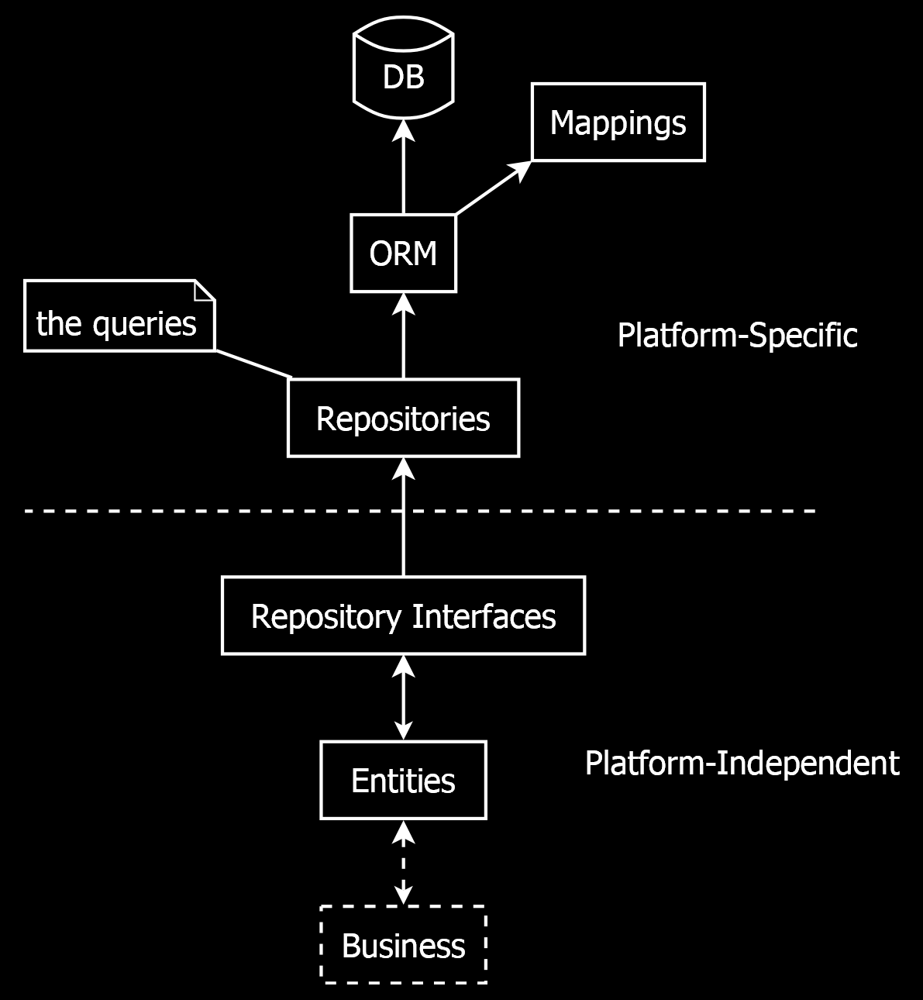

🧅 Layers
==========

[back](.)

Software can be built up of layers. This article describes how layers could be structured. Each layer comes with different technology.

<h3>Contents</h3>

- [3 Layers](#3-layers)
    - [Connections Between Layers](#connections-between-layers)
    - [Skipping Business Layer](#skipping-business-layer)
    - [Patterns](#patterns)
- [Data Layer](#data-layer)
    - [Database (DB)](#database-db)
    - [ORM (NHibernate)](#orm-nhibernate)
    - [Mappings](#mappings)
    - [Entities](#entities)
    - [Repositories](#repositories)
    - [Repository Interfaces](#repository-interfaces)
    - [Platform Independence](#platform-independence)
- [Presentation Layer](#presentation-layer)
    - [Calls the Business Layer](#calls-the-business-layer)
    - [Presenter](#presenters)
    - [ViewModel](#viewmodel)
    - [ToViewModel](#toviewmodel)
    - [ToEntity](#toentity)
    - [Facades](#facades)
    - [MVC](#mvc)
    - [MVC Controllers](#mvc-controllers)
    - [URLs](#urls)
    - [View Engine (Razor)](#view-engine-razor)
    - [Views (Razor)](#views-razor)
    - [HTML](#html)
    - [Platform Independence](#platform-independence-1)
- [Business Layer](#business-layer)
    - [Layer Connections](#layer-connections)
    - [Magic](#magic)
    - [Validation](#validation)
    - [SideEffects](#sideeffects)
    - [Calculations](#calculations)
    - [Conversions](#conversions)
    - [Enums](#enums)
    - [Resources Strings](#resources-strings)
    - [Defaults](#defaults)
    - [Cascading](#cascading)
    - [Cloning](#cloning)
    - [Bidirectional Relationship Synchronization](#bidirectional-relationship-synchronization)
    - [Facades](#facades-1)
    - [CRUD](#crud)
    - [Platform Independence](#platform-independence-2)
- [Perpendicular Layers](#perpendicular-layers)
    - [Perpendicular](#perpendicular)
    - [Framework](#framework)
    - [Infrastructure](#infrastructure)
    - [Loosely Coupled](#loosely-coupled)
    - [Services](#services)
- [Decoupled](#decoupled)
- [Alternatives](#alternatives)

3 Layers
--------

Software can be split up into 3 main layers:

The [presentation](#presentation-layer) layer is the visual part of a program. It is what the user sees.

The [business](#business-layer) layer is like internal, mechanical parts. It can model the functionality of a program, but it isn't directly visible. 

The [data](#data-layer) layer stores the data. It models functionality more passively: It does not really process anything. It just stores things.

### Connections Between Layers

The [presentation](#presentation-layer) layer builds upon the [business](#business-layer) layer with user interface technology.

The [business](#business-layer) layer uses the [data](#data-layer) layer to store the data.

### Skipping Business Layer

Sometimes the [presentation](#presentation-layer) layer skips the [business](#business-layer) layer using the [data](#data-layer) layer directly, represented with the dotted line in the [diagram](#3-layers) above. This can happen when the [business](#business-layer) layer does not really add any functionality.

### Patterns

The [data](#data-layer) layer may be programmed with mostly fixed patterns in this [architecture](index.md). The [presentation](#presentation-layer) layer is mostly patterns too. The [business](#business-layer) layer can have patterns as well, but it gets a little more creative. If anything special needs to happen, it might be put in the [business](#business-layer) layer.

Data Layer
----------

The *data layer* models and stores the data. It might be built up of the following sub-layers:

### Database (DB)

It starts with the database. This can be a *relational database* like [`Microsoft SQL Server`](api.md#sql-server), which structuredly stores the data into tables and relationships. But it could also be another type of data store: an [`XML`](api.md#xml) file, *flat* file or even just *in-memory* data.

### ORM (NHibernate)

The database might not be directly accessed by the rest of the code. It may go through an *object-relational mapper* (or [`ORM`](api.md#orm)), like [`NHibernate`](api.md#nhibernate). This [`ORM`](api.md#orm) would translate database records to objects called [entities](patterns-data-access.md#entities).
    
It could also be a different data access technology: a different [`ORM`](api.md#orm), like [`Entity Framework`](api.md#entity-framework), or [`XML`](api.md#xml) files, or perhaps [`SqlClient`](api.md#sql) to execute raw [`SQL`](api.md#sql) onto the database.

### Mappings

[Entity](patterns-data-access.md#entities) objects have *properties*, that map to *columns* in the database, and properties that point to *related* [entities](patterns-data-access.md#entities). [`NHibernate`](api.md#nhibernate) needs [mappings](patterns-data-access.md#mapping), that define which *class* maps to which *table* and which *column* map to which *property*.

The [`FluentNHibernate API`](api.md#fluent-nhibernate) can help set up these [mappings](patterns-data-access.md#mapping).

### Entities

With all this in place, out come objects called [entities](patterns-data-access.md#entities), loaded from the database. These [entity](patterns-data-access.md#entities) objects represent the functional domain.

### Repositories

[`NHibernate`](api.md#nhibernate) might not be directly accessed by the rest of the code. The other code might talk to the [`Repositories`](patterns-data-access.md#repository) instead. You might see a [`Repository`](patterns-data-access.md#repository) as a *set of queries*. Each [entity type](patterns-data-access.md#entities) could have its own [`Repository`](patterns-data-access.md#repository). Next to providing a central place to manage an optimal set of queries, the [`Repositories`](patterns-data-access.md#repository) keep the rest of the code independent of [`NHibernate`](api.md#nhibernate), in case you would like to switch to a different data technology.

### Repository Interfaces

The [`Repository`](patterns-data-access.md#repository) implementations might not used directly, but accessed through [`interfaces`](patterns-data-access.md#repository-interfaces), so that we can indeed use a different data access technology, just by instantiating a different [`Repository`](patterns-data-access.md#repository) *implementation*.

### Platform Independence

The dashed line going right through the [diagram](#data-layer) above, separates the *platform-specific* part from the *platform independent* part.

The platform-*specific* part concerns itself with [`NHibernate`](api.md#nhibernate) and [`SQL Server`](api.md#sql-server). The platform *independent* part is unaware of the underlying storage technology. You may as well stick an [`XML`](api.md#xml) file under it and not use [`SQL Server`](api.md#sql-server) or [`NHibernate`](api.md#nhibernate) at all.

This makes it possible, to program against the same model, regardless of how it is stored. This platform-independence, also helps deploy the same code to different environments like *mobile*, *Windows* or *web*.

Presentation Layer
------------------

The *presentation* layer is the visual part of a program. It is what the user sees. It can be split up into the following sub-layers:

### Calls the Business Layer

The [presentation layer](#presentation-layer) calls the [business layer](#business-layer), which contains the rules that surround the system. It feeds the [business layer](#business-layer) input from the user, and processes the output data for display on screen.

### Presenter

It is the [`Presenter`](patterns-presenters.md#-presenters) classes that talk to this [business layer](#business-layer). The [`Presenters`](patterns-presenters.md#-presenters) together form a model of *application navigation*. Each screen might get its own [`Presenter`](patterns-presenters.md#-presenters). Each [`Presenter`](patterns-presenters.md#-presenters) *method* represents a specific *user action* on that screen.

### ViewModel

A [`ViewModel`](patterns-presentation.md#viewmodels) would contain a specific subset of data: exactly the selection of data, that is shown on screen. In this [architecture](index.md) [`ViewModels`](patterns-presentation.md#viewmodels) are a pure [data objects](patterns-data-access.md#dto), no logic. So they can be more easily used with different presentation technologies. These pure [data objects](patterns-data-access.md#dto) can also be sent over the line without many surprises.

### ToViewModel

The [`Presenters`](patterns-presenters.md#-presenters) might delegate to a [`ToViewModel`](patterns-presentation.md#toviewmodel) layer, to translate the data and the results from the [business logic](#business-layer) to a subset of data that is shown on screen.

### ToEntity

The [`Presenters`](patterns-presenters.md#-presenters) also delegate to a [`ToEntity`](patterns-data-access.md#toentity) layer, to translate user input back to [entity](patterns-data-access.md#entities) data, before passing it on to the [business layer](#business-layer).

### Facades

[`Presenter`](patterns-presenters.md#-presenters) classes combine several [responsibilities](patterns-presentation.md#toentity-business-toviewmodel-round-trip) around [presentation](#presentation-layer).

They call upon the [business layer](#business-layer) to `Save`, [`Validate`](patterns-business-logic.md#validators), execute [`SideEffects`](patterns-business-logic.md#sideeffects). They initiate translation between [entities](patterns-data-access.md#entities) and [`ViewModels`](patterns-presentation.md#viewmodels) and might also execute [security](aspects.md#security) checks.

Because the [`Presenters`](patterns-presenters.md#-presenters) combine several [responsibilities](patterns-presentation.md#toentity-business-toviewmodel-round-trip) together, they can be called the [`Facades`](patterns-business-logic.md#facade) or [combinators](patterns-business-logic.md#facade) of the [presentation layer](#presentation-layer).

### MVC

[`MVC`](api.md#mvc) is the technology of choice in this [architecture](index.md) for programming *user interfaces* for *web technology*. In this [architecture](index.md) the [`MVC`](api.md#mvc) layer builds on top of the [`Presenter`](patterns-presenters.md#-presenters) layer.

### MVC Controllers

[`MVC`](api.md#mvc) uses [`Controllers`](patterns-presentation-mvc.md#controller), which are similar to [`Presenters`](patterns-presenters.md#-presenters) in that they group together related *user actions* and each user action gets a specific *method*.

[`Controllers`](patterns-presentation-mvc.md#controller) are quite specific to [`MVC`](api.md#mvc). An equivalent might not be present on other presentation platforms.

However, even on other presentation platforms, like [`WinForms`](api.md#winforms), it might be advisable, to have a *central spot* to manage calls to the [`Presenters`](patterns-presenters.md#-presenters) and showing the right [`View`](patterns-presentation.md#views) depending on their results.

### URLs

Requests from the web browser automatically make the right [`Controller`](patterns-presentation-mvc.md#controller) method go off. [`MVC`](api.md#mvc) makes sure of that. Each method in a [`Controller`](patterns-presentation-mvc.md#controller) tends to get a `URL`.

The parameters of a [`Controller`](patterns-presentation-mvc.md#controller) method can be `URL` parameters. A parameter can also be *post data*. [`ViewModel`](patterns-presentation.md#viewmodels) parameters are accepted by [`MVC`](api.md#mvc) [`Controllers`](patterns-presentation-mvc.md#controller). The [`ViewModels`](patterns-presentation.md#viewmodels) and are built up from post data by [`MVC`](api.md#mvc) automatically.

[`JJ.Framework.Mvc`](api.md#htmlbegincollection) might be used to send whole *tree structures* of post data over the wire to be correctly parsed by [`MVC`](api.md#mvc).

### View Engine (Razor)

After the [`Controller`](patterns-presentation-mvc.md#controller) method is done, the view engine kicks in. The view rendering automatically goes off.

### Views (Razor)

A [view engine](#view-engine-razor) that might be used in this [architecture](index.md) is [`Razor`](api.md#razor). It offers a concise syntax for programming [`Views`](patterns-presentation.md#views), that combines [`C#`](api.md#csharp) with `HTML.` [`Razor`](api.md#razor) has tight integration with [`MVC`](api.md#mvc). The [view engine](#view-engine-razor) can use a [`ViewModel`](patterns-presentation.md#viewmodels) as input, along with the [`View`](patterns-presentation.md#views) template (`*.cshtml`). The output is a specific piece of `HTML` sent back to the web browser.

In [`WinForms`](api.md#winforms) the [`Views`](patterns-presentation.md#views) would be the `Forms` and `UserControls`. It is advisable that even if a [`View`](patterns-presentation.md#views) can have *code-behind*, to only put simple code in it and delegate the real work to  [`Presenters`](patterns-presenters.md#-presenters).

### HTML

The [`Razor`](api.md#razor) engine produces a piece of `HTML` received by the web browser. 

`HTML` here can be replaced by the type of presentation output. In [`WinForms`](api.md#winforms) it might be the controls and their data. But it can also be a generated `PDF` file. Anything that can come out of a presentation technology might be considered a [`View`](patterns-presentation.md#views).

### Platform Independence

The dashed line going right through the [diagram](#presentation-layer) above separates the *platform-specific* part from the *platform independent* part. 

The *platform-specific* part concerns itself with [`MVC`](api.md#mvc), `HTML` and [`Razor`](api.md#razor), while the *platform independent* part is unaware of which presentation technology is used.

That means that we can use similar logic for multiple presentation techniques, such as offering an application both *web* based as well as *Windows* or a *mobile* app.

Business Layer
--------------

What is business logic? Basically anything that is not [presentation](#presentation-layer), [data access](#data-layer) or [infrastructure](#infrastructure), might be considered the *business logic*. It's the *rules* of a system. It's like the internal, mechanical parts. The business layer might be split up into the following things:

### Layer Connections

The [business layer](#business-layer) resides in between the [data access](#data-layer) and the [presentation layer](#presentation-layer).

The [business layer](#business-layer) can use [entities](patterns-data-access.md#entities) out of the [data layer](#data-layer). These [entity](patterns-data-access.md#entities) classes represent the domain model. But sometimes it would call [repositories](patterns-data-access.md#repository) to execute queries.

### Magic

The [presentation layer](#presentation-layer) uses the [business layer](#business-layer) for anything special that might be done. The [business layer](#business-layer) guards rules and such. Sometimes when something special is programmed in the [presentation layer](#presentation-layer), it may be worth considering moving it to the [business layer](#business-layer).

### Validation

The [business layer](#business-layer) can execute [`Validators`](patterns-business-logic.md#validators) that verify that the data corresponds to expectations.

### SideEffects

The [business layer](#business-layer) can execute [`SideEffects`](patterns-business-logic.md#sideeffects) when altering data, for instance updating the *date time modified* or automatically *generating a name* for a new object.

### Calculations

The [business layer](#business-layer) would also be responsible for [calculations](aspects.md#calculation).

### Conversions

One thing can be [converted](aspects.md#conversion) to another. Conversions might be found in the [business layer](#business-layer). This could be for *simple objects*. But you might also convert whole *trees* and *structures* to another.

### Enums

[`Enums`](aspects.md#enums) are like *multiple choice* variables. Some [entities](patterns-data-access.md#entities) in the [data layer](#data-layer) might have corresponding [`enums`](aspects.md#enums) in the [business layer](#business-layer). And some pattern-wise logic around [`enums`](aspects.md#enums) might be there in the [business layer](#business-layer) too.

### Resources Strings

[Resource `strings`](patterns-business-logic.md#resource-strings) can make texts in an app [multi-lingual](aspects.md#multi-language--translations--culture). These might be put in the [business layer](#business-layer) to translate terminology from the functional domain.

### Defaults

Setting [default values](aspects.md#defaults) when creating an [entity](patterns-data-access.md#entities) might be done automatically by using a [`SideEffect`](patterns-business-logic.md#sideeffects) class. Those may be executed in the [business layer](#business-layer).

### Cascading

Along with one [entity](patterns-data-access.md#entities), other [entities](patterns-data-access.md#entities) might be deleted. [`Cascading`](aspects.md#cascading) here means the deletion of related [entities](patterns-data-access.md#entities) when a main [entity](patterns-data-access.md#entities) is deleted. [`Cascading`](aspects.md#cascading) can also mean *unlinking* some [entities](patterns-data-access.md#entities) before deleting a related [entity](patterns-data-access.md#entities). In this [architecture](index.md) this might be done in [`C#`](api.md#csharp) to make it extra visible that these deletions take place.

### Cloning

Sometimes there is code for [cloning](aspects.md#cloning) or copying an object or graph of objects. Code for this kind of [cloning](aspects.md#cloning) might be put in the [business layer](#business-layer) too.

### Bidirectional Relationship Synchronization

[Bidirectional relationship synchronization](aspects.md#bidirectional-relationship-synchronization) can keep the two ends of a relationship in sync. By setting the parent property, `product.Supplier = mySupplier`, the child collection, `mySupplier.Products`, will also be updated to include `myProduct`. This mechanism can be made part of a [business layer](#business-layer).

### Facades

Calling the [business layer](#business-layer) can happen through [`Facades`](patterns-business-logic.md#facade). They would combine several aspects of the [business logic](#business-layer), by calling [`Validators`](patterns-business-logic.md#validators), [`SideEffects`](patterns-business-logic.md#sideeffects), [`Cascading`](patterns-business-logic.md#cascading) and other things in all a row. [`Facades`](patterns-business-logic.md#facade) might provide a few main *entry points* into the [business layer](#business-layer).

### CRUD

The [`Facades`](patterns-business-logic.md#facade) may orient around the basic data operations: **C**reate, **R**ead, **U**pdate and **D**elete or `CRUD`. This set of basic operations might not change much, keeping the `interfaces` relative stable. But *Non-CRUD* operations might be added too.

### Platform Independence

A [business layer](#business-layer) might be *platform independent* in this [architecture](index.md), so that the code can be used anywhere. When most things are built upon [entities](patterns-data-access.md#entities) and [repository interfaces](patterns-data-access.md#repository-interfaces), the [business logic](#business-layer) is relatively independent, which means that the magic of the software would be deployable on many platforms. Sometimes this might require specific [`API`](api.md#list-of-apis-and-other-tech) choices, generic interfaces and [in-house programmed `API's`](api.md#jjframework). These choices are inherently part of this [software architecture](index.md).

Perpendicular Layers
--------------------

The subdivision into [data](#data-layer), [business](#business-layer) and [presentation](#presentation-layer) is quite fundamental in this [software architecture](index.md). But there can also be additional layers, called *perpendicular* layers:

### Perpendicular

At the bottom you can see [Data](#data-layer), [Business](#business-layer) and [Presentation](#presentation-layer) layers, laid down flat on their side. The *perpendicular* layers are rotated 90° and placed right on top of the main layering. That's why these layers are called *perpendicular*.

### Framework

The [Framework](api.md#jjframework) layer consists of `API's` that could support any aspect of software development, so could be used in any part of the layering. That is why it stretches right from [Data](#data-layer) to [Presentation](#presentation-layer) in the [diagram](#perpendicular-layers).

### Infrastructure

*Infrastructure* is things like [security](aspects.md#security), network connections and storage.

The infrastructure can be seen as part at the outer end of the [data layer](#data-layer) and part at the outer end of the [presentation layer](#presentation-layer), because the outer end of the [data layer](#data-layer) is actually performing the reading and writing from specific data source.

However it is the [presentation layer](#presentation-layer) in which the final decision is made what the infrastructural context will be. The rest of the code tends to operates independent of the infrastructure in this [architecture](index.md) and only the top-level project would eventually determine what the context will be.

### Loosely Coupled

The infrastructure tends to be [loosely coupled](practices-and-principles.md#loose-coupling) in this  [software architecture](index.md). Let's take [user rights management](aspects.md#security) an example.

[User rights management](aspects.md#security) can alter the program navigation model in the [`Presenter`](patterns-presenters.md#-presenters) layer, adapting it to what the user is allowed to do.

In that respect the platform-independent [presentation layer](#presentation-layer) is dependent on the [security](aspects.md#security) *infrastructure*, which is a paradox. The reason the [`Presenter`](patterns-presenters.md#-presenters) layer is platform-independent after all, is that it communicates with the infrastructure using an [`interface`](https://learn.microsoft.com/en-us/dotnet/csharp/language-reference/keywords/interface), that may have a different *implementation* depending on the infrastructural context in which it runs. This could be accomplished with a [config file](api.md#configuration) or [dependency injection](practices-and-principles.md#dependency-injection).

### Services

What's meant with *services* in this [architecture](index.md), is exposing [business logic](#business-layer) through a network interface, like the `SOAP` protocol. A service may also expose a [presentation](#presentation-layer) model to the outside world.

Decoupled
---------

[`Presenter`](patterns-presenters.md#-presenters) `classes` decouple [presentation](#presentation-layer) from [business logic](#business-layer) so you have full flexibility in the [presentation layer](#presentation-layer). [`Presenters`](patterns-presenters.md#-presenters) also decouple the [presentation technology](api.md#presentation) so it can be flexibly replaced. The [repositories](patterns-data-access.md#repository) decouple the [data technology](api.md#data). And the generic interfaces on [infrastructure](#infrastructure) decouple the [infrastructure](#infrastructure). Everything is decoupled to keep our options open. 

Alternatives
------------

Here is a variation on this architectural layering, that might also sometimes be used: [data](#data-layer) and [business](#business-layer) in one layer. Benefit: Might be easier to understand. Downside: More likely for [data access](#data-layer) and [business](#business-layer) to get entangled.

Another alternative is: no [repositories](patterns-data-access.md#repository). But [`C# interfaces`](https://learn.microsoft.com/en-us/dotnet/csharp/language-reference/keywords/interface) for everything. Not bothering with what's [data](#data-layer) or [business](#business-layer) or [repository](patterns-data-access.md#repository).

It would still keep things [loosely coupled](practices-and-principles.md#loose-coupling) and [separation of concerns](practices-and-principles.md#separation-of-concerns) would also stay intact.

[back](.)