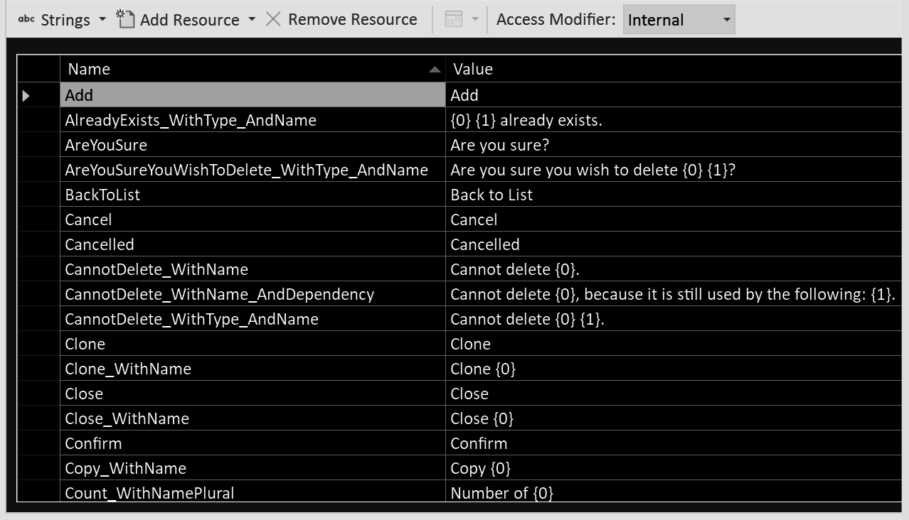

---
title: "🧶 Patterns"
---

`[ Draft ]`

🧶 Patterns
============

[back](.)

<h3>Contents</h3>

- [Introduction](#introduction)
- [Data Access Patterns](#data-access-patterns)
    - [Entities](#entities)
    - [Mapping](#mapping)
    - [DTO](#dto)
    - [Repository](#repository)
    - [Repository Interfaces](#repository-interfaces)
- [Business Logic Patterns](#business-logic-patterns)
    - [Business Layer](#business-layer)
    - [RepositoryWrappers](#repositorywrappers)
    - [Validators](#validators)
    - [SideEffects](#sideeffects)
    - [LinkTo](#linkto)
        - [Unlink](#unlink)
        - [NewLinkTo](#newlinkto)
    - [Cascading](#cascading)
    - [Facade](#facade)
    - [Visitor](#visitor)
    - [Resource Strings](#resource-strings)
- [Presentation Patterns](#presentation-patterns)
    - [ViewModels](#viewmodels)
        - [Only Data](#only-data)
        - [Screen ViewModels](#screen-viewmodels)
        - [Entity ViewModels](#entity-viewmodels)
        - [Partial ViewModels](#partial-viewmodels)
        - [ListItem ViewModels](#listitem-viewmodels)
        - [Lookup ViewModels](#lookup-viewmodels)
        - [How to Model](#how-to-model)
        - ["What", not "How"](#what-not-how)
        - ["What", not "Why"](#what-not-why)
        - [Keeping It Clean](#keeping-it-clean)
        - [No Entities](#no-entities)
        - [Avoid ViewModel to ViewModel Conversion](#avoid-viewmodel-to-viewmodel-conversion)
        - [Avoid Inheritance](#avoid-inheritance)
        - [Conclusion](#conclusion)
    - [Lookup Lists](#lookup-lists)
    - [ToViewModel](#toviewmodel)
    - [ToEntity](#toentity)
    - [Presenter](#presenter)
    - [ToEntity-Business-ToViewModel Round-Trip](#toentity-business-toviewmodel-round-trip)
    - [NullCoalesce (ViewModels)](#nullcoalesce-viewmodels)
    - [Views](#views)
    - [First Full Load – Then Partial Load – Then Native Code](#first-full-load--then-partial-load--then-native-code)
    - [Temporary ID's](#temporary-ids)
    - [Stateless and Stateful](#stateless-and-stateful)
    - [Considerations](#considerations)
        - [ToEntity / ToViewModel](#toentity--toviewmodel)
- [Presentation Patterns (MVC)](#presentation-patterns-mvc)
    - [Controller](#controller)
    - [Post-Redirect-Get](#post-redirect-get)
    - [ValidationMessages in ModelState](#validationmessages-in-modelstate)
    - [Polymorphic RedirectToAction / View()](#polymorphic-redirecttoaction--view)
    - [For Loops for Lists in HTTP Postdata](#for-loops-for-lists-in-http-postdata)
    - [Return URL's](#return-urls)
    - [Back Buttons](#back-buttons)
- [Data Transformation Patterns](#data-transformation-patterns)
    - [Converter](#converter)
    - [TryGet-Insert-Update](#tryget-insert-update)
    - [TryGet-Insert-Update-Delete / Full-CRUD Conversion / Collection Conversion](#tryget-insert-update-delete--full-crud-conversion--collection-conversion)
    - [State Flagging](#state-flagging)
    - [DocumentModel](#documentmodel)
    - [Selector-Model-Generator-Result](#selector-model-generator-result)
- [Other Patterns](#other-patterns)
    - [Accessor](#accessor)
    - [Adapter](#adapter)
    - [Anti-Encapsulation](#anti-encapsulation)
    - [Initialization and Finalization](#initialization-and-finalization)
    - [Constructor Inheritance](#constructor-inheritance)
    - [Comma Appending](#comma-appending)
    - [DebuggerDisplays](#debuggerdisplays)
    - [Executor](#executor)
    - [Inheritance-Helper](#inheritance-helper)
    - [Factory](#factory)
    - [Factory-Base-Interface](#factory-base-interface)
    - [TryGet](#tryget)
    - [Get-TryGet-GetMany](#get-tryget-getmany)
    - [Helper](#helper)
    - [Info](#info)
    - [Mock](#mock)
    - [Name Constants](#name-constants)
    - [NullCoalesce](#nullcoalesce)
    - [Plug-In Model](#plug-in-model)
    - [Progress and Cancel Callbacks](#progress-and-cancel-callbacks)
    - [Singular, Plural, Non-Recursive, Recursive and WithRelatedEntities](#singular-plural-non-recursive-recursive-and-withrelatedentities)
    - [Wrapper](#wrapper)
- [Alternatives](#alternatives)
    - [Rich Models](#rich-models)


Introduction
------------

Design patterns are coding techniques to solve common programming problems. They can bring consistency to the code. They help us reuse established solutions and improve the overall design of the software. They also are an extension to the software layering.


Data Access Patterns
--------------------

### Entities

`Entities` are the `classes` that represent the *functional domain model*.

Contents:

- [Pure Data Objects](#pure-data-objects)
- [Enums](#enums)
- [Collections](#collections)
- [Virtual Members](#virtual-members)
- [Inheritance](#inheritance)
- [Real Code](#real-code)


<h4 id="pure-data-objects">Pure Data Objects</h4>

In this [architecture](index.md), we aim to keep the [`Entity`](#entities) `classes` [just data](#dto) and free of logic. The [`Entities`](#entities) in this [architecture](index.md) have properties of simple types and references or lists to other [`Entities`](#entities).

```cs
class Supplier
{
    int ID { get; set; }
    string Name { get; set; }
    Address Address { get; set; }
    IList<Product> Products { get; set; }
}
```


<h4 id="enums">Enums</h4>

You might even want to avoid `enums` in the [`Entity`](#entities) `classes` and put those in the [business layer](layers.md#business-layer) instead. Often the database contain [`enum`-like `Entities`](aspects.md#enum-like-entities), which you could as [`Entities`](#entities) in your model. This to keep it a purer representaton of the data model:

```cs
class Supplier
{
    Industry Industry { get; set; }
}

class Industry
{
    int ID { get; set; }
    int Name { get; set; }
}

enum IndustryEnum
{
    Retail = 1,
    Travel = 2
}
```


<h4 id="collections">Collections</h4>

Creating collections upon initialization is recommended for [`Entity`](#entities) `classes`. [`NHibernate`](api.md#nhibernate) does not always create the collections for us. By creating a collection we can omit some `null` checks in the code:

```cs
class Supplier
{
    var Products { get; set; } = new List<Product>();
}
```


<h4 id="virtual-members">Virtual Members</h4>

For [`Entity`](#entities) `classes`, `public` members should be `virtual`, otherwise [persistence technologies](aspects.md#persistence) may not work. This is because [`ORM's`](api.md#orm) want to create [`Proxy classes`](api.md#problem-entity--proxy-type-mismatch), that tend to override all the properties.

```cs
class Supplier
{
    virtual int ID { get; set; }
    virtual int Name { get; set; }
    ...
}
```


<h4 id="inheritance">Inheritance</h4>

Generally avoid [inheritance](api.md#inheritance) within your [`Entity`](#entities) models, because it can make using data technologies harder.


<h4 id="real-code">Real Code</h4>

The previous code examples for [`Entities`](#entities) were just illustrative pseudo-code. This might be a more realistic example:

```cs
public class Supplier
{
    public virtual int ID { get; set; }
    public virtual string Name { get; set; }
    public virtual Address Address { get; set; }
    public virtual IList<Product> Products { get; set; } = new List<Product>();
}
```

### Mapping

`Mappings` are `classes` programmed for a particular [persistence technology](aspects.md#persistence), e.g. [`NHibernate`](api.md#nhibernate), that map the [`Entity`](#entities) model to how the `objects` are stored in the data store (e.g. an [`SQL Server`](api.md#sql-server) database). A `Mapping` defines which `class` maps to which `table` and which `column` maps to which *property*.

### DTO

`DTO` = *data transfer object*. `DTO's` only contain data, no logic. They are used to transfer data between different parts of a system. In certain situations, where passing an  [`Entity`](#entities) is not handy or efficient, a `DTO` might be a good alternative.

For instance: A specialized, optimized [`SQL`](api.md#sql) query may return a result with a particular record structure. You could program a `DTO` that is a strongly typed version of these records. In many cases you want to query for [`Entity`](#entities) `objects` instead, but in some cases this is not fast / efficient enough and you might resort to a `DTO`.

`DTO's` can be used for other data transfers than [`SQL`](api.md#sql) queries as well.

### Repository

A `Repository` is like a set of queries. `Repositories` return or save [`Entities`](#entities) in the data store. Simple types, not [`Entities`](#entities), are preferred for parameters. The `Repository` pattern is a way to put queries in a single place. The `Repositories'` job is also to provide an optimal set of queries.

Typically, every [`Entity type`](#entities) gets its own `Repository`.

It might be best to not expose types from the underlying [persistence technology](aspects.md#persistence), so the `Repository` abstraction stays neutral.

### Repository Interfaces

Any [`Repository type`](#repository) will get an associated `Repository interface`. This keeps our system loosely coupled from the underlying [persistence technology](aspects.md#persistence).

The `Repository interfaces` are also handy for [testing](aspects.md#automated-testing), to create a [fake](#mock) in-memory data store, instead of connecting to a real database. The `API` [`JJ.Framework.Data`](api.md#jj-framework-data) can help abstract this data access, providing a base for these [`Repositories`](#repository) and `interfaces`.

Business Logic Patterns
-----------------------

### Business Layer

[Presentation](layers.md#presentation-layer), [`Entity` model](#entities) and [persistence](aspects.md#persistence) should be straightforward [pattern-wise](#introduction). If anything 'special' needs to happen it belongs in the [business layer](layers.md#business-layer). Any number of different [patterns](#introduction) can be used. But also things, that do not follow any standard [pattern](#introduction).

The [business layer](layers.md#business-layer) externally speaks a language of [`Entities`](#entities) or sometimes [`DTO's`](#dto). Internally it can talk to [`Repository interfaces`](#repository-interfaces) for [data access](aspects.md#persistence).

It is preferred that [business logic](layers.md#business-layer) hooks up with  [`Entity`](#entities) `classes` rather than [`Repositories`](#repository). But there is a large gray area. Using [`Entities`](#entities) improves testability, limits queries and limits interdependence, dependency on a data source and passing around a lot of [`Repository`](#repository) variables.

### RepositoryWrappers

Passing around lots of [`Repositories`](#repository) can create long lists of parameters, prone to change. To prevent that phenomenon, sets of [`Repositories`](#repository) could be combined into [`RepositoryWrappers`](#repositorywrappers). Those can then be passed around instead. This keeps the parameter lists shorter.

You can make a single [`RepositoryWrapper`](#repositorywrappers) with all the [`Repositories`](#repository) out of a [functional domains](namespaces-assemblies-and-folders.md#functional-domains) in it.

Some logic might use [`Repositories`](#repository) out of multiple [domains](namespaces-assemblies-and-folders.md#functional-domains). You could choose to pass around multiple [`RepositoryWrappers`](#repositorywrappers): one for each [domain model](namespaces-assemblies-and-folders.md#functional-domains). But you could also make a custom [`RepositoryWrapper`](#repositorywrappers) with [`Repositories`](#repository) from multiple [functional domains](namespaces-assemblies-and-folders.md#functional-domains).

You may also want to more limited [`RepositoryWrappers`](#repositorywrappers). For instance one for each [partial domain](namespaces-assemblies-and-folders.md#partial-domains). This keeps the width of dependency more narrow, so logic that has nothing to do with certain [`Repositories`](#repository), would not accidentally become dependent on them.

An alternative to [`RepositoryWrappers`](#repositorywrappers) might be [dependency injection](practices-and-principles.md#dependency-injection). Under this [link](practices-and-principles.md#dependency-injection) you can find some criticism about the techique, but that might be due to not using a very safe [dependency injection](practices-and-principles.md#dependency-injection) `API`. [`RepositoryWrappers`](#repositorywrappers) and [dependency injection](practices-and-principles.md#dependency-injection) might also go hand in hand in combination with each other.

### Validators

Separate [`Validator`](api.md#jj-framework-validation) `classes` could be used for [validation](aspects.md#validation). Specialized `classes` can be derived from [`VersatileValidator`](api.md#jj-framework-validation) from the [`JJ.Framework`](api.md#jjframework).

It is recommended to keep [`Validators`](api.md#jj-framework-validation) independent from each other.

If multiple [`Validators`](api.md#jj-framework-validation) should go off, you might call them individually one by one.

For complex [`Validator`](api.md#jj-framework-validation), it is suggested to add a [prefix or suffix](code-style.md#prefixes-and-suffixes) to the name such as [`Recursive`](#singular-plural-non-recursive-recursive-and-withrelatedentities) or `Versatile` to make it clear that it is more than a simple [`Validator`](api.md#jj-framework-validation).

Next to [`Validators`](api.md#jj-framework-validation) deciding whether user input is valid, [`Validators`](api.md#jj-framework-validation) could also be used to generate *warnings*, that are not blocking, but help the user work with an app.

[`Validators`](api.md#jj-framework-validation) might also be used for *delete constraints*. For instance when an [`Entity`](#entities) is still in use, you might not be able to delete it.

### SideEffects

The [business layer](layers.md#business-layer) can execute [`SideEffects`](api.md#jj-framework-business) while altering data, for instance to record a *date time modified*, set [default values](aspects.md#defaults), or automatically generate a *name*.

We could implement an `interface` [`ISideEffect`](api.md#jj-framework-business) for each of these. It has only one method: `Execute`. This gives us some polymorphism over [`SideEffects`](api.md#jj-framework-business) so it is easier to handle them *generically* and for instance `Execute` multiple in a row.

Using separate `classes` for [`SideEffects`](api.md#jj-framework-business) can create overview over pieces of logic, creative in nature, and prevent things from getting entangled.

[`SideEffects`](api.md#jj-framework-business) might evaluate conditions internally. The caller of the [`SideEffect`](api.md#jj-framework-business) `class` would not know what conditions there are. A [`SideEffect`](api.md#jj-framework-business) could skip over its own execution, when it wouldn't apply. This makes the [`SideEffect`](api.md#jj-framework-business) fully responsible for what happens. What a [`SideEffect`](api.md#jj-framework-business) does can also depend on [status flagging](aspects.md#entity-status-management).

### LinkTo

This pattern is about [bidirectional relationship synchronization](aspects.md#bidirectional-relationship-synchronization). That means that if a parent property is set: `myProduct.Supplier = mySupplier`, automatically the product is added to the child collection too: `mySupplier.Products.Add(myProduct)`.

To manage [bidirectional relationships](aspects.md#bidirectional-relationship-synchronization), even when the underlying [persistence technology](aspects.md#persistence) doesn't, we could link [`Entities`](#entities) together using [`LinkTo`](#linkto) extension methods. By calling [`LinkTo`](#linkto), both ends of the relationship are updated. Here is a template for a [`LinkTo`](#linkto) method that works for an `1-to-n` relationship:

```cs
public static void LinkTo(this Child child, Parent parent)
{
    if (child == null) throw new NullException(() => child);

    if (child.Parent != null)
    {
        if (child.Parent.Children.Contains(child))
        {
            child.Parent.Children.Remove(child);
        }
    }

    child.Parent = parent;

    if (child.Parent != null)
    {
        if (!child.Parent.Children.Contains(child))
        {
            child.Parent.Children.Add(child);
        }
    }
}
```

Beware that all the checks and list operations can come with a performance penalty.

You could put the [`LinkTo`](#linkto) methods together in a `class` named `LinkToExtensions`. You might put it in a [`LinkTo`](#linkto) [`namespace`](namespaces-assemblies-and-folders.md#patterns) in your project.

If a [`LinkTo`](#linkto) method name becomes ambiguous, you could suffix it, for instance:

    LinkToParentDocument

#### Unlink

Next to [`LinkTo`](#linkto) methods, you might also add [`Unlink`](#unlink) methods in an `UnlinkExtensions class`:

```cs
public static void UnlinkParent(this Child child)
{
    if (child == null) throw new NullException(() => child);
    child.LinkTo((Parent)null);
}
```

#### NewLinkTo

If you are linking `objects` together, that you *know are new*, you may use better-performing variations for [`LinkTo`](#linkto), called [`NewLinkTo`](#newlinkto), that omit the expensive checks:

```cs
public static void NewLinkTo(this Child child, Parent parent)
{
    if (child == null) throw new NullException(() => child);
    child.Parent = parent;
    parent.Children.Add(child);
}
```

But beware that [`LinkTo`](#linkto) might be a better choice, because executing [`NewLinkTo`](#newlinkto) onto *existing* `objects` may corrupt the `object` graph.

### Cascading

[`Cascading`](aspects.md#cascading) means that upon `Deleting` a main [`Entity`](#entities), *child-*[`Entities`](#entities) are `Deleted` too. But if they are not inherently part of the main [`Entity`](#entities), they would be [`Unlinked`](#unlink) instead.

This can be implemented as a pattern in [`C#`](api.md#csharp). A reason to do it in [`C#`](api.md#csharp), is to explicitly see in the code, that the other `Deletions` take place. It may be important not to hide this from view.

One way to implement [`Cascading`](aspects.md#cascading), is through extension methods:  
`DeleteRelatedEntities` and `UnlinkRelatedEntities`.

Contents:

- [Code Files](#cascading-code-files)
- [DeleteRelatedEntities](#deleterelatedentities)
- [UnlinkRelatedEntities](#unlinkrelatedentities)
- [Delete Main Entity](#cascading-delete-main-entity)
- [Cascading & Repositories](#cascading-and-repositories)
- [Nuance](#cascading-nuance)
- [Conclusion](#cascading-conclusion)


<h4 id="cascading-code-files">Code Files</h4>

Here is a suggestion for how to organize the [`Cascading`](#cascading) code.

In the `csproj` of the [`Business` layer](layers.md#business-layer), you could put a [sub-folder](namespaces-assemblies-and-folders.md#patterns) called [`Cascading`](#cascading) and put two code files in it:

```
JJ.Ordering.Business.csproj
    |
    |- Cascading
        |
        |- DeleteRelatedEntitiesExtensions.cs
        |- UnlinkRelatedEntitiesExtensions.cs
```


<h4 id="deleterelatedentities">DeleteRelatedEntities</h4>

Here is how  `DeleteRelatedEntitiesExtensions.cs` might look internally:

```cs
/// <summary>
/// Deletes child entities inherently part of the main entity.
/// </summary>
public static class DeleteRelatedEntitiesExtensions
{
    public static void DeleteRelatedEntities(this Order order)
    {
        ...
    }
}
```

In there, child [`Entities`](#entities) are successively `Deleted`:

```cs
/// <summary>
/// Deletes child entities inherently part of the main entity.
/// </summary>
public static class DeleteRelatedEntitiesExtensions
{
    public static void DeleteRelatedEntities(this Order order)
    {
        // Delete child entities.
        foreach (var orderLine in order.OrderLines.ToArray())
        {
            _repository.Delete(orderLine);
        }
    }
```

(Note: The `ToArray` can prevent an `Exception` about the loop collection being modified.)

Before an extension method `Deletes` a child [`Entity`](#entities), it might call [`Cascading`](#cascading) upon the child [`Entity`](#entities) too!

```cs
public static void DeleteRelatedEntities(this Order order)
{
    // Delete child entities.
    foreach (var orderLine in order.OrderLines.ToArray())
    {
        // Call cascading on the child entity too!
        orderLine.UnlinkRelatedEntities(); 

        _repository.Delete(orderLine);
    }
}
```


<h4 id="unlinkrelatedentities">UnlinkRelatedEntities</h4>

`UnlinkRelatedEntities` might be a little bit easier. It neither requires [`Repositories`](#repository) not does it do much recursion:

```cs
/// <summary>
/// Unlinks related entities, not inherently part of the main entity.
/// </summary>
public static class UnlinkRelatedEntitiesExtensions
{
    public static void UnlinkRelatedEntities(this OrderLine orderLine)
    {
        orderLine.UnlinkOrder();
        orderLine.UnlinkProduct();
    }
}
```

Note that it uses the [Unlink](#unlink) pattern discussed earlier.


<h4 id="cascading-delete-main-entity">Delete Main Entity</h4>

The [`Cascading`](#cascading) extension methods delete *related* [`Entities`](#entities), not the *main* [`Entity`](#entities). The idea behind that is: Where a main [`Entity`](#entities) is `Deleted`, we could call the [`Cascading`](#cascading) methods first:

```cs
entity.DeleteRelatedEntities();
entity.UnlinkRelatedEntities();

// Delete main entity separately.
_repository.Delete(entity);
```

That way we can see explicitly that more `Deletions` take place.


<h4 id="cascading-and-repositories">Cascading & Repositories</h4>

The [`DeleteRelatedEntities`](#deleterelatedentities) methods might need [`Repositories`](#repository) to perform the `Delete` operations.

You could pass these [`Repositories`](#repository) as *parameters:*

```cs
public static void DeleteRelatedEntities(
    this Order order,
    /* Repository parameter */
    IOrderLineRepository repository)
{
    foreach (var orderLine in order.OrderLines.ToArray())
    {
        orderLine.UnlinkRelatedEntities();
        repository.Delete(orderLine);
    }
}
```

Or you might make [repositories](#repository) available through a technique called [dependency injection](practices-and-principles.md#dependency-injection).
 
It's up to you. The choice to use *extension* methods was also a matter of preference.


<h4 id="cascading-nuance">Nuance</h4>

Sometimes an [`Entity`](#entities) does have related [`Entities`](#entities) to [`Cascadedly`](#cascading) [`Unlink`](#unlink) or `Delete`, but sometimes it doesn't, creating subtleties in the implementation.


<h4 id="cascading-conclusion">Conclusion</h4>

Hopefully this introduced a way to build up [`Cascading`](#cascading) code by just using a pattern.

### Facade

A [`Facade`](#facade) combines several related (usually [`CRUD`](layers.md#crud)) operations into one `class` that also performs additional [business logic](layers.md#business-layer) and [`Validation`](#validators), [`SideEffects`](#sideeffects), integrity constraints, [conversions](aspects.md#conversion), etc. It delegates to other `classes` to do the work. If you do something using a [`Facade`](#facade) you should be able to count on it that integrity is maintained.

It is a combinator `class`: a [`Facade`](#facade) combines other (smaller) parts of the [business layer](layers.md#business-layer) into one, offering a single entry point for a lot of related operations. A [`Facade`](#facade) can be about a [partial functional domain](namespaces-assemblies-and-folders.md#partial-domains), so managing a *set* of [`Entity`](#entities) `types` together.

<h4>Repositories instead of Facades</h4>

[`Facades`](#facade) may typically contain [`CRUD`](layers.md#crud) operations, that could be used as an entry point for all your [business logic](layers.md#business-layer) and [data access](layers.md#crud) needs. But in some cases, it may be more appropriate to use the [data access layer](layers.md#data-layer) directly.

For example, a simple `Get` by `ID` may be better going through a [`Repository`](#repository). There could be other cases where using [`Repositories`](#repository) directly is a better choice. For instance in the [`ToEntity`](#toentity) and [`ToViewModel`](#toviewmodel) code, which is usually straightforward [data conversion](aspects.md#conversion).

The reason is, that a [`Facade`](#facade) could create an excessive amount of dependency and high degree of coupling. Because simple operations executed frequently, would require a reference to a [`Facade`](#facade), a [combinator](#facade) `class`, naturally dependent on many other `objects`. So, for a simple `Get` it may be better to use a [`Repository`](#repository), to limit the interdependence between things.

### Visitor

<h4>Contents</h4>

- [Introduction](#visitor-introduction)
- [Visit Methods](#visit-methods)
- [Base Visitor](#base-visitor)
- [Specialized Visitors](#specialized-visitors)
- [Optimization](#visitor-optimization)
- [Entry Points](#visitor-entry-points)
- [Using Fields](#visitor-using-fields)
- [Polymorphic Visitation](#polymorphic-visitation)
- [Change the Sequence](#visitor-change-the-sequence)
- [Accept Methods](#accept-methods)
- [Conclusion](#visitor-conclusion)


<h4 id="visitor-introduction">Introduction</h4>

A [`Visitor`](#visitor) `class` processes a recursive tree structure that might involve many `objects` and multiple `types` of `objects`. Usually a [`Visitor`](#visitor) translates a complex structure into something else. Examples are calculating total costs over a recursive structure, or filtering down a whole `object` graph by complex criteria. [`Visitors`](#visitor) can result in well performing code.

Whenever a whole recursive structure needs to be processed, the [`Visitor`](#visitor) pattern may be a good way to go.


<h4 id="visit-methods">Visit Methods</h4>

A [`Visitor`](#visitor) `class` has a set of [`Visit`](#visit-methods) methods, e.g. `VisitOrder`, `VisitProduct`, typically one for every `type`:

```cs
class Visitor
{
    void VisitOrder(Order order) { }
    void VisitOrderLine(OrderLine orderLine) { }
    void VisitProduct(Product product) { }
}
```

It can also have separate [`Visit`](#visit-methods) methods for `collections`:

```cs
void VisitOrderLines(IList<OrderLine> orderLines) { }
```

And there might be [`Visit`](#visit-methods) methods for special cases:

```cs
void VisitPhysicalProduct(Product product) { }
void VisitDigitalProduct(Product product) { }
```


<h4 id="base-visitor">Base Visitor</h4>

A `base` [`Visitor`](#visitor) might simply follow the whole recursive structure, and has a [`Visit`](#visit-methods) method for each node. Here is an example where an `Order` structure is `Visited`:

```cs
class OrderVisitorBase
{
    /// <summary>
    /// VisitOrder processes the child objects:
    /// Customer, Supplier and OrderLines.
    /// </summary>
    protected virtual void VisitOrder(Order order)
    {
        VisitCustomer(order.Customer);
        VisitSupplier(order.Supplier);

        foreach (var orderLine in order.OrderLines.ToArray())
        {
            VisitOrderLine(orderLine);
        }
    }

    /// <summary>
    /// VisitOrderLine also processes its child object: Product.
    /// </summary>
    protected virtual void VisitOrderLine(OrderLine orderLine)
        => VisitProduct(orderLine.Product);

    protected virtual void VisitCustomer(Customer customer) { }
    protected virtual void VisitSupplier(Supplier supplier) { }
    protected virtual void VisitProduct(Product product) { }
}
```

The ones with *child objects* also call [`Visit`](#visit-methods) on their children. Those without children have empty implementations.


<h4 id="specialized-visitors">Specialized Visitors</h4>

You can make *specialized* [`Visitor`](#visitor) classes, by overriding the [`Visit`](#visit-methods) methods.

If you only want to process certain `types` of `objects`, you can override [`Visit`](#visit-methods) methods for those `types` only:

```cs
/// <summary>
/// This specialized Visitor only processes
/// OrderLines and Products,
/// so the respective Visit methods are overridden.
/// </summary>
class OrderSummaryVisitor : OrderVisitorBase
{
    protected override void VisitOrderLine(OrderLine orderLine)
        => base.VisitOrderLine(orderLine);

    protected override void VisitProduct(Product product) 
        => base.VisitProduct(product);
}
```

They call their `base` methods. Keep those calls in there, so the `base` will process the rest of the recursive structure!

The aim for this new [`Visitor`](#visitor) is to create a text, that summarizes the `Order`. 
Here is the code that uses a `StringBuilder` for this:

```cs
/// <summary>
/// Here the Visit methods are extended,
/// creating a text that summarizes the Order.
/// </summary>
class OrderSummaryVisitor : OrderVisitorBase
{
    StringBuilder _sb = new();

    protected override void VisitOrderLine(OrderLine orderLine)
    {
        _sb.Append($"{orderLine.Quantity} x ");

        base.VisitOrderLine(orderLine);
    }

    protected override void VisitProduct(Product product)
    {
        _sb.Append($"{product.Name}");
        _sb.AppendLine();

        base.VisitProduct(product);
    }
}
```

The result of the process might be a text like this:

```
1 x Cool Gadget
2 x Fidget Thing
```


<h4 id="visitor-optimization">Optimization</h4>

You can make the performance better by `overriding` [`Visit`](#visit-methods) methods for skipping parts of the recursive structure that don't you don't need:

```cs
/// <summary>
/// This Visitor aims to optimize the recursive process.
/// </summary>
class OrderSummaryVisitor : OrderVisitorBase
{
    /// <summary>
    /// Override VisitOrder and leave out part of the recursion.
    /// </summary>
    protected override void VisitOrder(Order order)
    {
        // Customer and Supplier are skipped here for optimization.

        foreach (var orderLine in order.OrderLines.ToArray())
        {
            VisitOrderLine(orderLine);
        }

        // Don't call base here. This method replaced it.
    }
}
```

However, be mindful of the trade-off between performance and completeness, as skipping parts of the structure also means missing out on the deeper objects.


<h4 id="visitor-entry-points">Entry Points</h4>

`Public` methods can show us the starting point of the recursion, making it easier to understand where the process begins:

```cs
class OrderSummaryVisitor : OrderVisitorBase
{
    StringBuilder _sb = new();

    /// <summary>
    /// This Execute method is the only one that's public.
    /// This makes it clear where the process starts.
    /// The Visit methods are kept protected
    /// for internal processing.
    /// </summary>
    public string Execute(Order order)
    {
        VisitOrder(order);
        return _sb.ToString();
    }

    ...
}
```

This is why the [`Visit`](#visit-methods) methods are `protected`, not `public`.

Here is the complete code sample of our derived `Visitor`:

```cs
class OrderSummaryVisitor : OrderVisitorBase
{
    StringBuilder _sb = new();

    public string Execute(Order order)
    {
        VisitOrder(order);
        return _sb.ToString();
    }

    protected override void VisitOrder(Order order)
    {
        foreach (var orderLine in order.OrderLines.ToArray())
        {
            VisitOrderLine(orderLine);
        }
    }

    protected override void VisitOrderLine(OrderLine orderLine)
    {
        _sb.Append($"{orderLine.Quantity} x ");

        base.VisitOrderLine(orderLine);
    }

    protected override void VisitProduct(Product product)
    {
        _sb.Append($"{product.Name}");
        _sb.AppendLine();

        base.VisitProduct(product);
    }
}
```


<h4 id="visitor-using-fields">Using Fields</h4>

The result of a [`Visitor's`](#visitor) operation is typically stored in *fields* and used across multiple [`Visit`](#visit-methods) methods. This is because the result structure might not have a straightforward, 1-to-1 relationship with the source structure. This makes fields the better choice over parameters and return values. It makes our `base` [`Visitors`](#visitor) more reusable too.


<h4 id="polymorphic-visitation">Polymorphic Visitation</h4>

Sometimes there is a [`Visit`](#visit-methods) method for each concrete `type` with the same `base type`.

For instance `Customer` and `Supplier` might both derive from a `Party` base type:

```cs
class Supplier : Party { }
class Customer : Party { }
```

A [`Visitor`](#visitor) `class` might allow tapping into different levels of the abstraction like this:

```cs
protected virtual void VisitPartyPolymorphic(Party party)
{
    switch (party)
    {
        case Supplier supplier:
            VisitSupplier(supplier);
            break;

        case Customer customer:
            VisitCustomer(customer);
            break;
    }
}

protected virtual void VisitSupplier(Supplier supplier)
    => VisitPartyBase(supplier);

protected virtual void VisitCustomer(Customer customer)
    => VisitPartyBase(customer);

protected virtual void VisitPartyBase(Party party) { }
```

This way you can separately `override` a [`Visit`](#visit-methods) method for `Supplier` or `Customer`.

But you could also `override` `VisitPartyBase` instead, where you wish to handle both `Parties` the same way.

The `VisitPartyPolymorphic` method is best used for switching between different types. It might not be the first choice for `overriding`. However, it's still the best method to *call*, as it ensures that all specialized [`Visit`](#visit-methods) methods are called.

You need all those methods delegating in the right order, for the visitation to work properly.

Here is another example of polymorphic visitation, where we don't `switch` on an `object type`, but on an `enum` instead:

```cs
protected virtual void VisitProductPolymorphic(Product product)
{
    var productTypeEnum = product.GetProductTypeEnum();
    switch (productTypeEnum)
    {
        case ProductTypeEnum.Physical:
            VisitPhysicalProduct(product);
            break;

        case ProductTypeEnum.Digital:
            VisitDigitalProduct(product);
            break;
    }
}

protected virtual void VisitPhysicalProduct(Product product)
    => VisitProductBase(product);

protected virtual void VisitDigitalProduct(Product product)
    => VisitProductBase(product);

protected virtual void VisitProductBase(Product product) { }
```

This way we can create [`Visit`](#visit-methods) methods for specific cases if needed.

Here is a full example of a [`Visitor`](#visitor) `class` with polymorphic [`Visit`](#visit-methods) methods:

```cs
class PolymorphicVisitorBase
{
    protected virtual void VisitOrder(Order order)
    {
        VisitPartyPolymorphic(order.Customer);
        VisitPartyPolymorphic(order.Supplier);
        VisitOrderLines(order.OrderLines);
    }

    protected virtual void VisitPartyPolymorphic(Party party)
    {
        switch (party)
        {
            case Supplier supplier:
                VisitSupplier(supplier);
                break;

            case Customer customer:
                VisitCustomer(customer);
                break;
        }
    }

    protected virtual void VisitSupplier(Supplier supplier)
        => VisitPartyBase(supplier);

    protected virtual void VisitCustomer(Customer customer)
        => VisitPartyBase(customer);

    protected virtual void VisitPartyBase(Party party) { }

    protected virtual void VisitOrderLines(IList<OrderLine> orderLines)
    {
        foreach (OrderLine orderLine in orderLines)
        {
            VisitOrderLine(orderLine);
        }
    }

    protected virtual void VisitOrderLine(OrderLine orderLine)
        => VisitProductPolymorphic(orderLine.Product);

    protected virtual void VisitProductPolymorphic(Product product)
    {
        var productTypeEnum = product.GetProductTypeEnum();
        switch (productTypeEnum)
        {
            case ProductTypeEnum.Physical:
                VisitPhysicalProduct(product);
                break;

            case ProductTypeEnum.Digital:
                VisitDigitalProduct(product);
                break;
        }
    }

    protected virtual void VisitPhysicalProduct(Product product)
        => VisitProductBase(product);

    protected virtual void VisitDigitalProduct(Product product)
        => VisitProductBase(product);

    protected virtual void VisitProductBase(Product product) { }
}
```


<h4 id="visitor-change-the-sequence">Change the Sequence</h4>

You might also `override` a [`Visit`](#visit-methods) method to change the order in which things are processed.

```cs
/// <summary>
/// This Visitor changes the order of processing.
/// </summary>
class ReversedOrderVisitor : OrderVisitorBase
{
    protected override void VisitOrder(Order order)
    {
        foreach (var orderLine in order.OrderLines.ToArray())
        {
            VisitOrderLine(orderLine);
        }

        // Visit Customer and Supplier last instead of first.
        VisitCustomer(order.Customer);
        VisitSupplier(order.Supplier);
    }
}
```


<h4 id="accept-methods">Accept Methods</h4>

The *classic* [`Visitor`](#visitor) pattern has a bit of a drawback in my opinion. It requires that `classes` *used by* the [`Visitor`](#visitor) have to be *adapted*. `Accept` methods would be added to them. I think this is adapting the wrong `classes`. My advice would be not to do that, and leave out these `Accept` methods. This would keep the [`Visitor`](#visitor) `classes` self-sufficient and separate from the rest of the code.

However, `Accept` methods can be used for specialized use-cases for instance to prevent the [polymorphic visitation](#polymorphic-visitation) pattern proposed earlier.


<h4 id="visitor-conclusion">Conclusion</h4>

By creating a `base` [`Visitor`](#visitor) and multiple specialized [`Visitors`](#visitor), you can create short and powerful code for processing recursive structures. A coding error is easily made, and can break calculations easily. However, it is the best and fastest choice for complicated processes that involve complex recursive structures.

There are also alternatives. For instance, [`JJ.Framework.Collections`](api.md#jj-framework-collections) has a method for [`LINQ`](api.md#linq)-style processing of recursive structures: [`.SelectRecursive`](https://www.nuget.org/packages/JJ.Framework.Collections#recursive-collection-extensions), which might work for simpler scenarios.

Another good example of a [`Visitor`](#visitor) `class` is [`.NET's`](api.md#dotnet) own [`ExpressionVisitor`](https://learn.microsoft.com/en-us/dotnet/api/system.linq.expressions.expressionvisitor). However, the style of the [`Visitors`](#visitor) might be different here. It can still be called a [`Visitor`](#visitor) if it operates by slightly different rules.

### Resource Strings

<h4 id="">Contents</h4>

- [Introduction](#resource-strings-introduction)
- [Visual Studio Editor](#resource-strings-visual-studio-editor)
- [File Names](#resource-string-file-names)
- [Descriptive Names](#resource-strings-descriptive-names)
- [ResourceFormatter](#resourceformatter)
- [ResourceFormatterHelper](#resourceformatterhelper)
- [Reusability](#resource-strings-reusability)
- [Use the Business Layer](#resource-strings-use-the-business-layer)
- [For More Information](#resource-strings-more-information)


<h4 id="resource-strings-introduction">Introduction</h4>

To store `Button Texts` and [model](#entities) translations in [`.NET`](api.md#dotnet) projects, `resx` files can be used.


<h4 id="resource-strings-visual-studio-editor">Visual Studio Editor</h4>

Here's what the `Resource strings` editor looks like in [`Visual Studio`](api.md#visual-studio):




<h4 id="resource-string-file-names">File Names</h4>

[`.NET`](api.md#dotnet) returns the translations in the right language, of the `CurrentCulture`, if you name your `Resource` files like this:

    Resources.resx
    Resources.nl-NL.resx
    Resources.de-DE.resx

[`CultureNames`](https://www.csharp-examples.net/culture-names/) like `nl-NL` and `de-DE` are commonly used within [`.NET`](api.md#dotnet).

The *culture-independent* `Resources.resx` might be used for the language `US English`.


<h4 id="resource-strings-descriptive-names">Descriptive Names</h4>

For clarity it's recommended to keep the [`Resource Name`](#resource-strings-visual-studio-editor) descriptive of the text it represents:

    Name: Save
    Value: "Save"

    Name: Save_WithName
    Value: "Save {0}"


<h4 id="resourceformatter">ResourceFormatter</h4>

You could use `ResourceFormatters` to add the correct values to the `{0}` placeholders:

```cs
public static class ResourceFormatter
{
    public static string Save_WithName(string name) 
        => string.Format(Resources.Save_WithName, name);
}
```

By using `ResourceFormatters`, you can ensure the safe usage of placeholders in the code:

```cs
ResourceFormatter.Save_WithName("Document");
```

Returning:

```cs
"Save Document"
```


<h4 id="resourceformatterhelper">ResourceFormatterHelper</h4>

You can streamline your code and minimize the risk of typos by using the `ResourceFormatterHelper` from the [`JJ.Framework`](api.md#jj-framework-resourcestrings):

```cs
public static class ResourceFormatter
{
    private static readonly ResourceFormatterHelper _helper 
        = new (Resources.ResourceManager);

    public static string Save => _helper.GetText();

    public static string Save_WithName(string name) 
        => _helper.GetText_WithOnePlaceHolder(name);
}
```

This eliminates the need to repeat the [`Resource Name`](#resource-strings-visual-studio-editor) in the code. It also encourages consistency by forcing the method names to match the [`Resource Names`](#resource-strings-visual-studio-editor).


<h4 id="resource-strings-reusability">Reusability</h4>

[`JJ.Framework.ResourceStrings`](api.md#jj-framework-resourcestrings) goes even further than that. It provides reusable [`Resources`](#resource-strings) for common phrases like `Delete`, `Edit`, `Save`, and more. No more typing out the same messages over and over again!


<h4 id="resource-strings-use-the-business-layer">Use the Business Layer</h4>

[`Resource strings`](#resource-strings) may play a role beyond just presentation. They're also commonly used in the [business layer](layers.md#business-layer). Keeping the `DisplayNames` for [model](#entities) properties in the [`business layer`](layers.md#business-layer) makes it possible to reuse them from multiple places.


<h4 id="resource-strings-more-information">For More Information</h4>

Extra information in Dutch about how to structure the [`Resource` files](#resource-string-file-names) can be read in [Appendix B](appendices.md#appendix-b-knopteksten-en-berichtteksten-in-applicaties-resource-strings--dutch-).


Presentation Patterns
---------------------

`< TODO: Make code samples slightly shorter. >`

### ViewModels

[`ViewModels`](#viewmodels) are as simple as they are invaluable in [this architecture](index.md).

A [`ViewModel`](#viewmodels) provides a simplified and organized representation of the data to display on screen.

#### Only Data

In [this architecture](index.md) a [`ViewModel`](#viewmodels) it is meant to be purely a [data object](#dto). It's recommended that [`ViewModels`](#viewmodels) only have `public` properties, *no* methods, *no* constructors, *no* member initialization and *no* list instantiation. This to insist that the code *handling* the [`ViewModels`](#viewmodels) takes full responsibility for their data. This also makes it better possible to integrate with different types of technology, as it keeps the [`ViewModels`](#viewmodels) simple. Here is an example of a simple [`ViewModel`](#viewmodels):

```cs
public class ProductViewModel
{ 
    public int ID { get; set; }
    public string Name { get; set; }
    public string Description { get; set; }
}
```

#### Screen ViewModels

Every screen can get a [`ViewModel`](#viewmodels). Here are some [`Screen ViewModels`](#screen-viewmodels) you might find in an application: 

    ProductDetailsViewModel
    ProductListViewModel
    ProductEditViewModel
    ProductDeleteViewModel

These names are built up from parts:

1. Start with the [`Entity`](#entities) name:  
   `Product`, `Category`
2. Then something [`CRUD`](layers.md#crud)-related:  
   `Details`, `List`, `Edit`, `Delete` or `Deleted`
3. And end it with:  
   [`ViewModel`](#viewmodels)

Instead of [`CRUD`](layers.md#crud) actions, you could also use terminology like `Overview`, `Selector`, `NotFound`, or `Login`:

    ProductOverviewViewModel
    CategorySelectorViewModel
    NotFoundViewModel
    LoginViewModel

Here is a code example of a [`Screen ViewModel`](#screen-viewmodels):

```cs
public class ProductEditViewModel
{
    public int ID { get; set; }
    public string Name { get; set; }
    public string Description { get; set; }
    public string Category { get; set; }
    public string ProductType { get; set; }
    public IList<string> ValidationMessages { get; set; }
    public bool CanDelete { get; set; }
}
```

#### Entity ViewModels

You can also reuse [`ViewModels`](#viewmodels) that represent single [`Entities`](#entities), e.g.:

    ProductViewModel
    CategoryViewModel

For instance:

```cs
public class CategoryViewModel 
{ 
    public int ID { get; set; }
    public string Name { get; set; }
}
```

[`Entity ViewModels`](#entity-viewmodels) might be reused among different [`Screen ViewModels`](#screen-viewmodels), for instance:

```cs
/// <summary>
/// An Edit ViewModel using several Entity ViewModels.
/// </summary>
public class ProductEditViewModel
{
    public int ID { get; set; }
    public string Name { get; set; }

    // Uses Entity ViewModels
    public CategoryViewModel Category { get; set; }
    public ProductTypeViewModel ProductType { get; set; }
}
```

[`Entity ViewModels`](#entity-viewmodels) can also be called [`Item ViewModels`](#entity-viewmodels).

#### Partial ViewModels

[`Partial ViewModels`](#partial-viewmodels) describe *parts* of a screen, to keep overview of its sections, like:

    LoginPartialViewModel
    ButtonBarViewModel
    MenuViewModel
    PagerViewModel
    
They may or may not have the word `Partial` in their name. Here is a code sample of a `ButtonBarViewModel`:

```cs
/// <summary>
/// Partial ViewModel representing a ButtonBar.
/// </summary>
public class ButtonBarViewModel 
{ 
    public bool CanSave { get; set; }
    public bool CanDelete { get; set; }
    public bool CanCreate { get; set; }
    public bool CanShowList { get; set; }
}
```

Each property in there says whether you can use a certain button or not.

The [`Partial ViewModels`](#partial-viewmodels) can be used in [`Screen ViewModels`](#screen-viewmodels). Here some [`Partials`](#partial-viewmodels) are used in the `ProductEditViewModel`:

```cs
/// <summary>
/// Edit ViewModel with Partials
/// </summary>
public class ProductEditViewModel
{
    public int ID { get; set; }
    public string Name { get; set; }

    // Partials:
    public ButtonBarViewModel Buttons { get; set; }
    public LoginPartialViewModel Login { get; set; }
    public PagerViewModel Pager { get; set; }
}
```

#### ListItem ViewModels

[`ListItem ViewModels`](#listitem-viewmodels) are similar to the [`Entity ViewModels`](#entity-viewmodels) but instead they might represent a row in *list* or *grid*. Here are some names they might have:

    ProductListItemViewModel
    CategoryListItemViewModel

A `ProductListItemViewModel` could look as follows:

```cs
public class ProductListItemViewModel 
{ 
    public int ID { get; set; }
    public string Name { get; set; }
    public string Description { get; set; }
    public string UsedBy { get; set; }
    public bool CanDelete { get; set; }
}
```

[`ListItem ViewModels`](#listitem-viewmodels) can be used in a `ListViewModel`:

```cs
/// <summary>
/// Example of a ViewModel using ListItem ViewModels.
/// </summary>
public class ProductListViewModel
{
    // Here, Product ListItemViewModel is used.
    public IList<ProductListItemViewModel> Products { get; set; }
}
```

Some list views only need an [`IDNameDto`](api.md#jj-canonical), which can be found in the [`JJ.Canonical`](api.md#jj-canonical) project:

```cs
namespace JJ.Data.Canonical
{
    public class IDAndName
    {
        public int ID { get; set; }
        public string Name { get; set; }
    }
}
```

Here you can find [`IDAndName`](api.md#jj-canonical) objects used in a `ListViewModel`:

```cs
/// <summary>
/// Example of a List ViewModel that uses IDAndName as the item type.
/// </summary>
public class ProductListViewModel
{
    // Here, IDAndName is used as a list item.
    public IList<IDAndName> Products { get; set; }
}
```

#### Lookup ViewModels

A *lookup* list can hold the data for a control like a drop-down box, e.g.:

```cs
IList<IDNameDto> ProductTypeLookup { get; set; }
```

It might be used in a [`Screen ViewModel`](#screen-viewmodels) like so:

```cs
/// <summary>
/// Edit ViewModel with a Lookup List in it.
/// </summary>
public class ProductEditViewModel
{
    public int ID { get; set; }
    public string Name { get; set; }
    public IDAndName ProductType { get; set; }

    // Here is the Lookup ViewModel.
    IList<IDAndName> ProductTypeLookup { get; set; }
}
```

#### How to Model

A [`ViewModel`](#viewmodels) is an abstract representation of what is shown on screen. The idea for how to model them is:

> *A [`ViewModel`](#viewmodels) says __what__ is shown on screen, not __how__ or __why__.*

#### "What", not "How"

A [`ViewModel`](#viewmodels) says ***what*** is shown on screen, not ***how:***

Therefore `CanDelete` may be a better name than `DeleteButtonVisible`. Whether it is a `Button` or a hyperlink or `Visible` or `Enabled`, should be up to the [`View`](#views) instead.

#### "What", not "Why"

A [`ViewModel`](#viewmodels) should say ***what*** is shown on screen, not ***why:***  

For instance: if the business logic tells us that an [`Entity`](#entities) is a very special [`Entity`](#entities), and it should be displayed read-only, the [`ViewModel`](#viewmodels) might contain a property `IsReadOnly` or `CanEdit`, not a property named `ThisIsAVerySpecialEntity`. 
The *reason* for displaying data read-only should not be a concern for a [`ViewModel`](#viewmodels) or a [view](#views).

#### Keeping It Clean

[`ViewModels`](#viewmodels) might only use *simple* `types` and *references* to other [`ViewModels`](#viewmodels). That way the whole [`ViewModel`](#views) layer stays self-contained.

#### No Entities

For instance, a [`ViewModel`](#viewmodels) in [this architecture](index.md) isn't supposed to reference any [`Entities`](#entities). This would potentially connect the [`ViewModel`](#viewmodels) to a database, which isn't desired or possible in all contexts.

Even when the [`ViewModel`](#entities) looks almost exactly the same as the [`Entity`](#entities), we tend to not use [`Entities`](#entities) directly. 

[`Entity`](#entities):

```cs
public class Product
{
    public virtual int ID { get; set; }
    public virtual string Name { get; set; }
    public virtual ProductType ProductType { get; set; }
}
```

[`ViewModel`](#viewmodels):

```cs
public class ProductViewModel
{
    public int ID { get; set; }
    public string Name { get; set; }
    public ProductTypeViewModel ProductType { get; set; }
}
```

It is worth noting that linking to an [`Entity`](#entities) can result in the availability of other related [`Entities`](#entities), which may broaden the scope of the view beyond our desires.

`< TODO: Code sample that shows following an object graph, making objects available, unintentionally coupled with. >`

An added benefit of decoupling the [`ViewModels`](#viewmodels) from [`Entities`](#entities), is that it makes it possible to change a [`ViewModel`](#viewmodels) without affecting the [data access layer](layers.md#data-layer) or the [business logic](layers.md#business-layer).

`< TODO: Code sample showing a view model and entity model looking quite different even though they are about the same entity. >`

#### Avoid ViewModel to ViewModel Conversion

Prefer converting from [`Entities`](#entities) to [`ViewModel`](#viewmodels) and back using the [`ToViewModel`](#toviewmodel) and [`ToEntity`](#toentity) patterns.

It is not advised to convert [`ViewModels`](#viewmodels) to other [`ViewModels`](#viewmodels) directly.

`< TODO: Code sample.>`

What we're trying to prevent here is too much interdependence between [`ViewModels`](#viewmodels). But there may be exceptions. There could be cases, where it makes more sense to operate directly on the [`ViewModels`](#viewmodels).

`< TODO: Code sample of an action operating on ViewModels alone. >`

For instance, you might yield over non-persisted properties from [`ViewModel`](#viewmodels) to [`ViewModel`](#viewmodels).

`< TODO: Code sample yielding over non-persisted properties from one view model to the next. >`

#### Avoid Inheritance

Inheritance is not the go-to choice for [`ViewModels`](#viewmodels).

`< TODO: Code sample with base and derived ViewModel. A 'bad example' with too much functional overlap. Perhaps a ProductScreenViewModelBase or something with all sorts of propeties in it, that might be used in specific Screen ViewModel. >`

Using inheritance creating a `base` [`ViewModel`](#viewmodels) can lead to a high number of interdependencies between the [`Views`](#views) and the [`ViewModels`](#viewmodels). If the `base` [`ViewModel`](#viewmodels) changes, it can potentially break many [`Views`](#views), making the application harder to maintain. By avoiding inheritance, a [`ViewModel`](#viewmodels) will only break the [`Views`](#views) that directly depend on it, reducing the potential impact of changes.

`< TODO: Code sample with a few 'clean' Product Screen ViewModels. >`

To really 'seal' the deal, you could make the [`ViewModel`](#viewmodels) `classes` `sealed` to prevent inheritance at all.

`< TODO: Short code sample with a ViewModel class that is sealed. >`

Though no hard rules here. It doesn't mean that inheritance should always be avoided. It may still be possible to use inheritance in a way that is manageable and maintainable, by applying it carefully.

`< TODO: A 'clean' ViewModelBase. >`

But you could also choose to use other design patterns, such as composition, to reduce the impact of changes.

`<TODO: Code sample. >`

#### Conclusion

Hopefully this gave a good impression of how [`ViewModels`](#viewmodels) might be structured. They can enable technology independence, prevent hard coupling to business logic and data access, and offer a flexible way to model the user interaction. In the coming sections, more patterns will be introduced, to illustrate how these [`ViewModels`](#viewmodels) are used in practice, where they come and go: how they come into play.

### Lookup Lists

`< TODO: Consider moving further down. >`

In a stateless environment, lookup lists in [`Views`](#views) can be resource-intensive. For instance a drop down list in each row of a grid in which you choose from 1000 items may easily bloat your `HTML`. You might repeat the same list of 1000 items for each grid row. There are multiple ways to combat this problem.

For small lookup lists you might include a copy of the list in each [Item ViewModel](#entity-viewmodels) and repeat the same lookup list in `HTML`.

Reusing the same list instance in multiple [ViewModels](#viewmodels) may seem to save you some memory, but a message formatter may actually repeat the list when sending a [`ViewModel`](#viewmodels) over the line.

For lookup lists up until say 100 items you might want to have a single list in an [`Edit ViewModel`](#screen-viewmodels). A central list may save some memory but, but when you still repeat the HTML multiple times, you did not gain much. You may use the HTML5 `<datalist>` tag to let a `<select>` / drop down list reuse the same data. You might also use a [`jQuery`](api.md#jquery) trick to populate a drop down just before you slide it open.

For big lookup list a viable option seems to [`AJAX`](api.md#ajax) the list and show a popup that provides some search functionality, and not retrieve the full list in a single request. Once [`AJAX'ed`](api.md#ajax) you might *cache* the popup to be reused each time you need to select something from it.

### ToViewModel

An extension method that convert an [`Entity`](#entities) to a [`ViewModel`](#viewmodels). You can make simple `ToViewModel` methods per [`Entity`](#entities), converting it to a simple [`ViewModel`](#viewmodels) that represents the [`Entity`](#entities). You can also have methods returning more complex [`ViewModels`](#viewmodels), such as `ToDetailsViewModel()` or `ToCategoryTreeEditViewModel()`.

You may pass [`Repositories`](#repository) to the `ToViewModel` methods if required.

Sometimes you cannot appoint one [`Entity type`](#entities) as the source of a [`ViewModel`](#viewmodels). In that case you cannot logically make it an extension method, but you make it a [`Helper`](patterns.md#helper) method in the `static ViewModelHelpers class`.

The `ToViewModel classes` should be put in the sub-folder / sub-namespace `ToViewModel` in your csproj. For an app with many [`Views`](#views) a split it up into the following files may be a good plan:

    ToIDAndNameExtensions.cs
    ToItemViewModelExtensions.cs
    ToListItemViewModelExtensions.cs
    ToPartialViewModelExtensions.cs
    ToScreenViewModelExtensions.cs
    ToViewModelHelper.cs
    ToViewModelHelper.EmptyViewModels.cs
    ToViewModelHelper.Values.cs
    ToViewModelHelper.Items.cs
    ToViewModelHelper.ListItems.cs
    ToViewModelHelper.Lookups.cs
    ToViewModelHelper.Partials.cs
    ToViewModelHelper.Screens.cs

For clarity: the `ViewModelHelper` files are all `ViewModelHelper partial classes`. The other files have a `class` that has the same name as the file.

Inside the `classes`, the methods should be sorted by source [entity](#entities) or application section alphabetically and each section should be headed by a comment line, e.g.:

```cs
// Orders

public static OrderListViewModel ToListViewModel(this IList<Order> orders) { ... }
public static OrderEditPopupViewModel ToEditViewModel(this Order order) { ... }
public static OrderDeletePopupViewModel ToDeleteViewModel(this IList<Order> orders) { ... }
```

Some [`ViewModels`](#viewmodels) do not take one primary [`Entity`](#entities) as input. So it does not make sense to turn it into an extension method, because you cannot decide which [`Entity`](#entities) is the this argument. In that case we put it in a `ViewModelHelper class` with `static classes` without this arguments. `ViewModelHelper` is also part of the `ToViewModel` layer.

### ToEntity

Extension methods that convert a [`ViewModel`](#viewmodels) to an [`Entity`](#entities).

You typically pass [`Repositories`](#repository) to the method. A simple `ToEntity` method might look up an existing [`Entity`](#entities), if it exists, it would be updated, if it does not, it would be created.

A more complex `ToEntity` method might also update related [`Entities`](#entities). In that case related [`Entities`](#entities) might be inserted, updated and deleted, depending on whether the [`Entity`](#entities) still exists in the [`ViewModel`](#viewmodels) or in the data store.

A `ToEntity` method takes on much of the resposibility of a Save action.

`< TODO: Describe the organization of the ToEntity extensions. >`

### Presenter

A `Presenter` models the user interactions. A non-visual blue-print of the user interface.

Each [`View`](#views) gets its own `Presenter`.

Each *user action* on that screen is represented by a *method*.

A `Presenter` represents what a user can do in a screen.

The methods of the `Presenter` work by a [`ViewModel`](#viewmodels)-in, [`ViewModel`](#viewmodels)-out principle.

An action method returns a [`ViewModel`](#viewmodels) that contains the data to display on screen. Action methods can also *receive* a [`ViewModel`](#viewmodels) parameter containing the data the user has edited. Other action method parameters are also things the user chose. An action method can return a different [`ViewModel`](#viewmodels) than the [`View`](#views) the `Presenter` is about. Those might be actions that navigate to a different [`View`](#views). That way the `Presenters` are a model for what the user can do with the application.

Sometimes you also pass infra and config parameters to an action method, but it is preferred that the main chunk of the infra and settings is passed to the `Presenters` constructor.

Internally a `Presenter` can use [business logic](layers.md#business-layer) and [`Repositories`](#repository) to access the domain model.

All [`ViewModel`](#viewmodels) creation should be delegated to the [`ToViewModel`](#toviewmodel) layer (rather than inlining it in the `Presenter` layer), because then when the [`ViewModel`](#viewmodels) creation aspect should be adapted, there is but one place in the code to look. It does not make the `Presenter` a needless hatch ('doorgeefluik'), because the `Presenter` is responsible for more than just [`ViewModel`](#viewmodels) creation, it is also resposible for retrieving data, calling business logic and converting [`ViewModels`](#viewmodels) to [`Entities`](#entities).

### ToEntity-Business-ToViewModel Round-Trip

A [`Presenter`](#presenter) is a combinator `class`, in that it combines multiple smaller aspects of the [presentation logic](layers.md#presentation-layer), by delegating to other `classes`. It also combines it with calls to the business layer.

A [`Presenter`](#presenter) action method might be organized into phases:

- [Security](aspects.md#security)
- [`ViewModel`](#viewmodels) [Validation](#validators)
- [`ToEntity`](#toentity) / GetEntities
- [Business](layers.md#business-layer)
- [`Commit`](api.md#orm)
- [`ToViewModel`](#toviewmodel)
- Non-Persisted (yield over non-persisted data from old to new [`ViewModel`](#viewmodels))
- Redirect

Not all of the phases must be present. [`ToEntity`](#toviewmodel) / Business / [`ToViewModel`](#toviewmodel) might be the typical phases. Slight variations in order of the phases are possible. But separate these phases, so that they are not intermixed and entangled.

Comment the phases in the code in the [`Presenter`](#presenter) action method:

```cs
// ToEntity
Dinner dinner = userInput.ToEntity(_dinnerRepository);

// Business
_dinnerFacade.Cancel(dinner);

// ToViewModel
DinnerDetailsViewModel viewModel = dinner.ToDetailsViewModel();
```

Even though the actual call to the business logic might be trivial, it is still necessary to convert from [`Entity`](#entities) to [`ViewModel`](#viewmodels) and back. This is due to the stateless nature of the web. It requires restoring state from the [`View`](#views) to the [`Entity`](#entities) model in between requests. You might save the computer some work by doing partial loads instead of full loads or maybe even do [`JavaScript`](api.md#javascript) or other native code.

`< TODO: Consider this: Patterns, Presentation: There is something wrong with the pattern 'ToEntity-Business-ToViewModel-NonPersisted' sometimes it is way more efficient to execute the essence of the user action onto the user input ViewModel. Sometimes it is even the only way to execute the essense of the user action onto the user input ViewModel. Examples are removing a row an uncommitted row or collapsing a node in a tree view. >`

### NullCoalesce (ViewModels)

When you user input back as a [`ViewModel`](#viewmodels) from your presentation framework of choice, for instance [`MVC`](api.md#mvc), you might encounter null-lists in it, for lists that do not have any items. To prevent other code from doing `NullCoalescing` or instead tripping over the nulls, you can centralize the `NullCoalescing` of pieces of [`ViewModel`](#viewmodels) and call it in the [`Presenter`](#presenter).

`< TODO: Better description. Also incorporate:`

`- Also add a code example.`  
`- Consider making a separate pattern description for NullCoalesce methods in general and move it to the Other Patterns section to which you then refer from this section NullCoalesce (ViewModels).`
`- NullCoalesce. Applied to viewmodels that are passed to Presenters. The choice is made here to only NullCoalesce things that a View / client technology might leave out. Theoretically it might be better to NullCoalesce everything in the ViewModel, but this does take full traversal of the tree, which comes with a (small) performance penalty. Also: the NullCoalesce procedures take some typing time for the programmer, and requires maintenance when the structure changes. That is why the choice is made to only NullCoalesce a select set of things, that is adapted to our specific needs, rather than something that will always work. >`

### Views

A *template* for rendering the `View`.

It might be `HTML`.

In `WebForms` this would be an `aspx`.

In [`MVC`](api.md#mvc) it can be an `aspx` or `cshtml`.

Any code used in the [`View`](#views) should be simple. That is: most tasks should be done by the [`Presenter`](#presenter), which produces the [`ViewModel`](#viewmodels), which is simply shown on screen. The [`View`](#views) should not contain [business logic](layers.md#business-layer).

### First Full Load – Then Partial Load – Then Native Code

You could also call it: first choice full load.

In web technology you could also call it:

Full postback - [`AJAX`](api.md#ajax) - [`JavaScript`](api.md#javascript)

When programming page navigation, the first choice for showing content is a *full page load* in this [architecture](index.md). Only if there is a very good reason, we might use [`AJAX`](api.md#ajax) to do a *partial load*. Only with a very good reason, we might start programming user interaction in [`JavaScript`](api.md#javascript).

But it was always the first choice to do full postbacks.

The reason for this choice is *maintainability*: programming the application navigation in [`C#`](api.md#csharp) using [`Presenters`](#presenter) is more maintainable than a whole lot of [`JavaScript`](api.md#javascript). Also: when you do not use [`AJAX`](api.md#ajax), the [`Presenter`](#presenter) keeps full control over the application navigation, and you do not have to let the web layer be aware of page navigation details.

Furthermore [`AJAX'ing`](api.md#ajax) comes with extra difficulties. For instance that [`MVC`](api.md#mvc) `<input>` tag ID's vary depending on the context and must be preserved after an [`AJAX`](api.md#ajax) call, big code blocks of [`JavaScript`](api.md#javascript) for doing [`AJAX`](api.md#ajax) posts, managing when you do a full redirect or just an update of a div. Keeping overview over the multitude of formats with which you can get and post partial content. The added complexity of sometimes returning a row, sometimes returning a partial, sometimes returning a full [`View`](#views). Things like managing the redirection to a full [`View`](#views) from a partial action. Info from a parent [`ViewModel`](#viewmodels) e.g. a lookup list that is passed to the generation of a child [`ViewModel`](#viewmodels) is not available when you generate a partial [`View`](#views). `Request.RawUrl` cannot be used as a return URL in links anymore. Related info in other panels is not updated when info from one panel changes. A lot of times the data on screen is so intricately related to eachother, updating one panel just does not cut it. The server just does not get a chance to change the [`View`](#views) depending on the outcome of the business logic. Sometimes an [`AJAX`](api.md#ajax) call's result should be put in a different target element, depending on the type you get returned, which adds more complexity.

Some of the difficulties with [`AJAX`](api.md#ajax) have been solved by employing a specific way of working, as described under [`AJAX`](api.md#ajax) in the Aspects section.

### Temporary ID's

When you edit a list, and between actions you do not commit you may need to generate ID's for the rows that are not committed, otherwise you cannot identify them individually to for instance delete a specific uncommitted row. For this you can add a TemporaryID to the [`ViewModel`](#viewmodels), that are typically Guids.

The TemporaryID's can be really temporary and can be regenerated every time you create a new [`ViewModel`](#viewmodels).

The TemporaryID concept breaks down, as soon as you need to use it to refer to something from multiple places in the [`ViewModel`](#viewmodels).

An alternative is to let a data store generate the ID's by flushing pendings statements to the data store, which might give you data-store-generated ID's. But this method fails when the data violates database constraints. Since the data does not have to be valid until we press save, this is usually not a viable option, not to speak of that switching to another persistence technology might not give you data-store-generated ID's upon flushing at all.

Another alternative is a different ID generation scheme. You may use an [`SQL`](api.md#sql) Sequence, or use GUID's, which you assign from your code. Switching from int ID's to GUID's is a high impact change though, and does come with performance and storage penalties.

### Stateless and Stateful

The [presentation patterns](#presentation-patterns) may differ slightly if used in a stateful environment, but most of it stays in tact. For instance that [`Presenters`](#presenter) have action methods that take a [`ViewModel`](#viewmodels) and output a new [`ViewModel`](#viewmodels) is still useful in that setting. In a stateless environment such as web, it is needed, because the input [`ViewModel`](#viewmodels) only contains the user input, not the data that is only displayed and also not the lookup lists for drop down list boxes, etc. So in a stateless environment a new [`ViewModel`](#viewmodels) has to be created. You cannot just return the user input [`ViewModel`](#viewmodels). You would think that in a stateful environment, such as a `Windows` application, this would not be necessary anymore, because the read-only [`View`](#views) data does not get lost between user actions. However, creating a new [`ViewModel`](#viewmodels) is still useful, because it creates a kind of transaction, so that when something fails in the action, the original [`ViewModel`](#viewmodels) remains untouched.

You would be making assumptions in your [`Presenter`](#presenter) code when you program a stateful or stateful application. Some things in a stateful environment environment would not work in a stateless environment and you might make some `objects` long-lived in a stateful environment, such as `Context`, [`Repositories`](#repository) and [`Presenters`](#presenter). But even if you build code around those assumptions, then when switching to a stateless environment –  if that would ever happen – the code is still so close to what's needed for stateless, that it might not come with any insurmountable problems. I would not beforehand worry about 'will this work in stateless', because then you would write a lot of logic and waste a lot of energy programming something that might probably never be used. And programming something for no reason at all, handling edge cases that would never occur, is a really counter-intuitive, unproductive way of working.

### Considerations

#### ToEntity / ToViewModel

`< TODO: Explain the argument that ViewModel, ToEntity and ToViewModel does require programming a lot of conversion code, but gives you complete freedom over your program navigation, but the alternative, a framework prevents writing this conversion code for each application, but has the downside that you are stuck with what the framework offers and loose the complete freedom over your how your program navigation works. >`


Presentation Patterns (MVC)
---------------------------

`< TODO: Mention ModelState.ClearErrors. >`

`< TODO: Mention: Using Request.UrlReferrer in Http Get actions crashes. Use Request.RawUrl. >`

### Controller

In an [`ASP.NET MVC`](api.md#mvc) application a [`Controller`](patterns.md#controller) has a lot of responsibilities, but in this [architecture](index.md) most of the responsibility is delegated to [`Presenters`](#presenter). The responsibilities that are left for the [`MVC`](api.md#mvc) [`Controllers`](#controller) are the URL routing, the HTTP verbs, redirections, setting up infrastructural context and miscellaneous [`MVC`](api.md#mvc) quirks.

The [`Controller`](#controller) may use multiple [`Presenters`](#presenter) and [`ViewModels`](#viewmodels), since it is about multiple screens.

[`Entity`](#entities) names put in [`Controller`](#controller) are plural by convention. So Customer**s**Controller not `CustomerController`.

### Post-Redirect-Get

This is a quirk intrinsic to [`ASP.NET MVC`](api.md#mvc). We must conform to the Post-Redirect-Get pattern to make sure the page navigation works as expected.

At the end of a post action, you must call `RedirectToAction()` to redirect to a Get action.

Before you do so, you must store the [`ViewModel`](#viewmodels) in the `TempData` dictionary. In the Get action that you redirect to, you have to check if the [`ViewModel`](#viewmodels) is in the TempData dictionary. If the [`ViewModel`](#viewmodels) exist in the TempData, you must use that [`ViewModel`](#viewmodels), otherwise you must create a new [`ViewModel`](#viewmodels).

Here is simplified pseudo-code in which the pattern is applied.

```cs
public ActionResult Edit(int id)
{
    object viewModel;
    if (!TempData.TryGetValue(TempDataKeys.ViewModel, out viewModel))
    {
      // TODO: Call Presenter
    }
    return View(viewModel);
}

[HttpPost]
public ActionResult Edit(EditViewModel viewModel)
{
    // TODO: Call Presenter
    TempData[TempDataKeys.ViewModel] = viewModel2;
    return RedirectToAction(ActionNames.Details);
}
```

There might be an exception to the rule to always `RedirectToAction` at the end of a Post. When you would redirect to a page that you can never go to directly, you might return `View()` instead, because there is no `Get` method. This may be the case for a `NotFoundViewModel` or a `DeleteConfirmedViewModel`.

`< TODO:`

`- Mention that return View in case of validation messages is the way to go, because otherwise MVC will not remember un-mappable wrong input values, like Guids and dates entered as strings. (In one case this lead to the browser asking for resending postdata upon clicking the back button, so check whether this is actually a good idea.)`  
`- Not using return View() in a post action makes old values not be remembered. >`

<h4>Considerations</h4>

If you do not conform to the Post-Redirect-Get pattern in [`MVC`](api.md#mvc), you may get to see ugly URL's. When you hit the back button, you might go to an unexpected page, or get an error. You may see original values that you changed re-appear in the user interface. You may also see that [`MVC`](api.md#mvc) keeps complaining about [validation](#validators) errors, that you already resolved. So conform to the Post-Redirect-Get pattern to stay out of trouble.

### ValidationMessages in ModelState

For the architecture to integrate well with [`MVC`](api.md#mvc), you have to make [`MVC`](api.md#mvc) aware that there are [validation](#validators) messages, after you have gotten a [`ViewModel`](#viewmodels) from a [`Presenter`](#presenter). If you do not do this, you will get strange application navigation in case of [validation](#validators) errors.

You do this in an [`MVC`](api.md#mvc) HTTP GET action method.

The way we do it here is as follows:

```cs
if (viewModel.ValidationMessages.Any())
{
    ModelState.AddModelError(
        ControllerHelper.DEFAULT_ERROR_KEY,
        ControllerHelper.GENERIC_ERROR_MESSAGE);
}
```

In theory we could communicate all [validation](#validators) messages to [`MVC`](api.md#mvc) instead of just communicating a single generic error message. In theory [`MVC`](api.md#mvc) could be used to color the right input fields red automatically, but in practice this breaks easily without an obvious explanation. So instead we manage it ourselves. If we want a [validation](#validators) summary, we simply render all the [validation messages from the [`ViewModel`](#viewmodels) ourselves and not use the `Html.ValidationSummary()` method at all. If we want to change the appearance of input fields if they have [validation](#validators) errors, then the [`ViewModel`](#viewmodels) should give the information that the appearance of the field should be different. Our [`View's`](#views) content is totally managed by the [`ViewModel`](#viewmodels).

### Polymorphic RedirectToAction / View()

A [`Presenter`](#presenter) action method may return different types of [`ViewModels`](#viewmodels).

This means that in the [`MVC`](api.md#mvc) [`Controller`](#controller) action methods, the [`Presenter`](#presenter) returns `object` and you should do polymorphic type checks to determine which [`View`](#views) to go to.

Here is simplified code for how you can do this in a post method:

```cs
var editViewModel = viewModel as EditViewModel;
if (editViewModel != null)
{
    return RedirectToAction(ActionNames.Edit, new { id = editViewModel.Question.ID });
}

var detailsViewModel = viewModel as DetailsViewModel;
if (detailsViewModel != null)
{
    return RedirectToAction(ActionNames.Details, new { id = viewModel.Question.ID });
}
```

At the end throw the following exception (from [`JJ.Framework.Exceptions`](api.md#jj-framework-exceptions)):

```cs
throw new UnexpectedTypeException(() => viewModel);
```

To prevent repeating this code for each [`Controller`](#controller) action, you could program a generalized method that returns the right ActionResult depending on the [`ViewModel`](#viewmodels) type. Do consider the performance penalty that it may impose and it is worth saying that such a method is not very easy code.

### For Loops for Lists in HTTP Postdata

An alternative to for [posting collections](aspects.md#postdata-over-http) is using for-loops.

```cs
@Html.TextBoxFor(x => x.MyItem.MyProperty)

@for (int i = 0; i < Model.MyItem.MyCollection.Count; i++)
{
    @Html.TextBoxFor(x => x.MyItem.MyCollection[i].MyProperty)
}
```

This solution only works if the expressions you pass to the `Html` helpers contain the full path to a [`ViewModel`](#viewmodels) property (or hack the `HtmlHelper.ViewData.TemplateInfo.HtmlFieldPrefix`) and therefore it does not work if you want to split up your [`View`](#views) code into partials.

### Return URL's

- Return URL's indicate what page to go back to when you are done in another page.
- It is used when you are redirected to a login screen, so it knows what page to go back to after you login.
- Return URL's are encoded into a URL parameter, called 'ret' e.g.:
  `http://www.mysite.com/Login?`__`ret=%2FMenu%2FIndex`__

The ret parameter is the following value encoded:  `/Menu/Index`  
That is the URL you will go back to after you log in.

The Login action can redirect to the ret URL like this:

```cs
[HttpPost]
public ActionResult Login(... string ret = null)
{
    ...
    return Redirect(ret);
    ...
}
```

ASSIGN DIFFERENT RET FOR FULL PAGE LOAD OR [`AJAX`](api.md#ajax) CALL.

- For full page loads, the ret parameter must be set to:

  ```cs
  Request.RawUrl
  ```

- For [`AJAX`](api.md#ajax) calls the ret parameter must be set to:

  ```cs
  Url.Action(ActionNames.Index)
  ```

- The ret parameter is set in a [`Controller`](#controller) action method, when you return the ActionResult. Example:

  EXAMPLE WORKS FOR FULL PAGE LOAD ONLY!!!

  ```cs
  return RedirectToAction(
    ActionNames.Login,
    ControllerNames.Account,
    new { ret = Request.RawUrl });
  ```

- A return URL should always be optional, otherwise you could never serparately debug a [`View`](#views).
- That way you have an easily codeable, well maintainable solution.
- Do not use RefferrerUrl, because that only works for HttpPost, not HttpGet. Use Request.RawUrl instead.

- There is a built-in error proneness in return URLs'. If you pass the same return URL along multiple HTTP requests, only one action has to forget to pass along the return URL and a back or close button is broken and you will find out very late that it is, because it is not an obvious thing to test. The same error-proneness is there for return actions with return actions with return actions, or with bread-crumb like structures with multiple return actions built in.

`< TODO: Incorporate this: Ret parameters can be done with new { ret = Request.RawUrl } for full load, and for AJAX this works: { ret = Url.Action(ActionNames.Index) } if you always make sure you have an Index action in your Controller, which is advisable. >`

### Back Buttons

There is a pitfall in builing back buttons. If you mix back buttons being handled at the server side, compared to window.history.back() at the client-side, you run the risk that the back button at one point keeps flipping back and foreward between pages.


Data Transformation Patterns
----------------------------

### Converter

A `class` that converts one data structure to another. Typically more is involved than just converting a single `object`. A whole `object` graph might be converted to another, or a flat list or raw data to be parsed might be converted to an `object` structure or the other way around.

By implementing it as a `Converter`, it simplifies the code. You can then say that the only responsibility of the `class` is to simply transform one data structure to another: nothing more, nothing less and leave other responsibilities to other `classes`.

### TryGet-Insert-Update

When converting one type to another one might use the `TryGet-Insert-Update` pattern. Especially when converting an [`Entity`](#entities) with related [`Entities`](#entities) from one structure to another this pattern will make the code easier to read.

[`TryGet`](#tryget) first gets a possible existing destination [`Entity`](#entities).

`Insert` will create the [`Entity`](#entities) if it did not exist yet, possibly setting some defaults.

`Update` will update the rest of the properties of either the existing or newly created `object`.

When you do these actions one by one for one destination [`Entity`](#entities) after another, you will get readable code for complex conversions between data structures.

Note that deletion of destination `objects` is not managed by the `TryGet-Insert-Update` pattern.

### TryGet-Insert-Update-Delete / Full-CRUD Conversion / Collection Conversion

Used for managing complex conversions between data structures, that require insert, update and delete operations. There is no one way of implementing it, but generally it will involve the following steps:

- Loop through the source collection.
- [`TryGet`](#tryget): look up an item in the destination collection.
- `Insert`: create a new item in the destination collection if none exists.
- `Update`: update the newly created or existing destination item.
- Do `Delete` operations after that:
- Generally you can use an `Except` operation on the collections of existing items and items to keep, to get the collection of items to `Delete`.
- Then you loop through that collection and `Delete` each item.

<h4>Considerations</h4>

Converting one collection to another may involve more than creating a destination `object` for each source `object`. What complicates things, is that there may already be a destination collection. That means that insert, update and delete operations are required. There are different ways to handle this depending on the situation. But a general pattern that avoids a lot of complexity, is to do the inserts and updates in one loop, and do the deletes in a second loop. The inserts and updates are done first by looping through the source collection and applying the [`TryGet-Insert-Update` pattern](#tryget-insert-update) on each item, while the `Delete` operations are done separately after that by comparing collections of [`Entities`](#entities) to figure out which items are obsolete.

In a little more detail:

- Loop through the source collection.
- [`TryGet`](#tryget): look up an item in the destination collection.
- `Insert`: create a new item in the destination collection if none exists.
- `Update`: update the newly created or existing destination item.
- Do `Delete` operations after that:
- Generally you can use an `Except` operation on the collections of existing items and items to keep, to get the collection of items to `Delete`.
- Then you loop through that collection and `Delete` each item.

Here follows some pseudo code for how to do it:

```cs
void ConvertCollection(IList sourceCollection, IList destCollection)
{
    foreach (var sourceItem in sourceCollection)
    {
        var destItem = TryGet(...);
        if (destItem == null)
        {
            destItem = Insert();
        }

        destItem.Name = sourceItem.Name; // Update
    }
    
    var itemsToDelete = destCollection.Except(sourceCollection);
    foreach (var itemToDelete in itemsToDelete)
    {
        Delete(itemToDelete);
    }
}
```

The specific way to implement it, is different in every situation. Reasons that there are many ways to do it are:

- You cannot always count on instance integrity.
- You cannot always count on identity integrity.
- The key to a destination item might be complex, instead of just an ID.
- You do not always have a [`Repository`](#repository).
- It does not always need to be full-[`CRUD`](layers.md#crud).
- You might need to report exactly what operation is executed on each [`Entity`](#entities).
- You might need a separate normalized [*singular* form](patterns.md#singular-plural-non-recursive-recursive-and-withrelatedentities) of the conversion, that may conflict with the way of working in the [*plural* form](patterns.md#singular-plural-non-recursive-recursive-and-withrelatedentities).
- An alternative `isNew` detection might be needed.
- Some persistence technologies will behave unexpectedly when first retrieving and then writing and then retrieving again. Intermediate redundant retrievals should be avoided. Or not, depending on the situation.

Each variation has either overhead or elegance depending on the situation. If you always pick the same way of doing it, you may end up with unneccesary and unsensical overhead, or with an overly complicated expression of what you are trying to do.

The general forms above is a good starting point. Then it needs to work correctly. The next quality demand is a tie between readability and performance.

### State Flagging

An alternative to [`TryGet-Insert-Update-Delete` pattern](#tryget-insert-update-delete--full-crud-conversion--collection-conversion), which kind of does a full diff of a source and destination structure, is maintaining a kind of flagging in the source structure: `Added`, `Modified`, `Deleted` and `Unmodified`.

A downside is that when two people try to save a piece of data at the same time, you may end up with a corrupted structure. It depends on the situation whether this would happen at all, since not all data may be edited by every user.

Another downside to flagging is that the source structure must be adapted to it, which is not always an option / a good option.

The [`TryGet-Insert-Update-Delete` pattern](#tryget-insert-update-delete--full-crud-conversion--collection-conversion), though, creates a last-user-wins situation, because not flagging determines whether it is an `Update` or `Insert`, but actual existence of dest `object` determines it.

### DocumentModel

An analog of a [`ViewModel`](#viewmodels), but then for document generation, rather than [`View`](#views) rendering. It is a `class` that contains all data that should be displayed in the document. It can end with the suffix `Model` instead of `DocumentModel` for brevity, but then it must be clear from the context that we are talking about a document model.

Just as with [`ViewModels`](#viewmodels), inheritance structures are not allowed. To prevent inheritance structures it may be wise to make the `DocumentClasses classes sealed`.

### Selector-Model-Generator-Result

<h4 id="">Contents</h4>

- [Introduction](#selector-model-generator-result-introduction)
- [Generating a Document](#generating-a-document)
- [Data Source Independence](#selector-model-generator-result-data-source-independence)
- [Multiple Import Formats](#selector-model-generator-result-multiple-import-formats)
- [Limiting Complexity](#selector-model-generator-result-limiting-complexity)
- [MVC](#selector-model-generator-result-mvc)


<h4 id="selector-model-generator-result-introduction">
Introduction
</h4>

For data transformations you may want to split up the transformation in two parts:

- A `Selector` which returns the data as an `object` graph, or `Model`.
- A `Generator` (or `Converter`) that converts the `object` graph (or `Model`) into a specific format.

This is especially useful if there are either multiple input formats or multiple output formats or both, or if in the future either the input format or output format could change.

This basic pattern is present in many architectures and can be applied to many different parts of architecture.

Her follow some examples.


<h4 id="generating-a-document">
Generating a Document
</h4>

An example of where it is useful, is generating a document in multiple format e.g. `XLSX`, `CSV` and `PDF`. In that case the data selection and basic tranformations are programmed once (a `Selector` that produces a `Model`) and exporting three different file formats would require programming three different generators. Reusable generators for specific file formats such as `CSV` may be programmed. Those will make programming a specialized generators very easy. So then basically exporting a document is mostly reading out a data source and producing an `object` graph.


<h4 id="selector-model-generator-result-data-source-independence">
Data Source Independence
</h4>

The [`Selector-Model-Generator-Result`](#selector-model-generator-result) pattern is also useful when the same document can have different data sources. Let's say you want to print an invoice out of the system, but print another invoice out of an ordering system in the same formatting e.g. a `PDF`. This requires 2 `Selectors`, 1 `Model` and 1 `Generator`, instead of 2 `Generators` with complex code and potentially different-looking `PDF's`.


<h4 id="selector-model-generator-result-multiple-import-formats">
Multiple Import Formats
</h4>

You might want to import similar data out of multiple different data sources or multiple file formats. By splitting the work up into a `Selector` and a `Generator` you can share must of the code between the two imports, and reduce the complexity of the code.


<h4 id="selector-model-generator-result-limiting-complexity">
Limiting Complexity
</h4>

Even if you do not expect multiple input formats or multiple output formats or a change in input or output format, the split up in a `Selector` and a `Generator` can be used to make the code less complicated to write, and subsequently also prevent errors and save time programming and maintaining the code.


<h4 id="selector-model-generator-result-mvc">
MVC
</h4>

[`MVC`](api.md#mvc) itself contains a specialized version of this very pattern. The following layering stacks are completely analogous to eachother:

- [`Selector` - `Model` - `Generator` – `Result`](#selector-model-generator-result)
- [`Controller`](#controller) - [`ViewModel`](#viewmodels) - view engine – [`View`](#views)


Other Patterns
--------------

### Accessor

An [`Accessor`](api.md#accessor) `class` allows access to non-public members of a `class`. This can be used for testing or for special access to a `class` from special places. [`JJ.Framework.Reflection`](api.md#jj-framework-reflection) has an implementation of a reusable [`Accessor`](api.md#accessor) `class`.

### Adapter

`< TODO: Describe what an adapter is in general and what kind of variations you can think of. >`

### Anti-Encapsulation

Encapsulation makes sure a `class` protects its own data integrity. Anti-encapsulation is the design choice to let a `class` check none of its data integrity. Then you know that something else is 100% responsible for the integrity of it, and the `class` itself will guard none of it.

The reason not to use encapsulation is that it can go against the grain of frameworks, such as [`ORM's`](api.md#orm) and data serialization mechanisms.

Anti-encapsulation can also be a solution to prevent spreading of the same responsibility over multiple places. If the `class` cannot check all the rules itself, it may be better the check all the rules elsewhere, instead of checking half the rules in the `class` and the other half in another place.

### Initialization and Finalization

Cleanup code should be symmetric to the set-up code. Build something up in the constuctor then dispose things in the finalizer, start a service at startup then stop a service at shutdown, etc. If in the constructor you bind an event, then in the destructor you unbind it.

You can also choose to implement IDisposable. This is useful if you want to be able to explicitly trigger finalization. Finalizers/destructors only go off when the garbage collector feels like it, and you might want to imperatively tell an `object` to clean up its stuff.

- If you implement IDisposable, call Dispose from the finalizer/destructor.:

    ```cs
    ~MyClass 
    {
        Dispose();
    }
    ```

- Make sure the dispose can successfully run regardless of state, so check any variable you might use for null first and be tollerant towards null.

    ```cs
    public void Dispose()
    {
        _myConnection?.Close();
    }
    ```

- Also call `GC.SuppressFinalize()` in the `Dispose()` method, because then the garbage collector will skip a few unneeded steps in getting rid of the `object`.

### Constructor Inheritance

Sort of forces a derived `class` to have a constructor with specific arguments. Constructors are not inherited, but inheriting from a `base class` that has specific constructors forces your derived `class` to call that `base` constructor, often leading to exposing a similar constructor in the derived `class`.

### Comma Appending

Different ways to append a comma only in between elements.

Example 1:

```cs
string concatenatedElements = string.Join(",", elements);
```

Example 2:

```cs
var sb = new StringBuilder();

int count = elements.Count;
for (int i = 0; i < count; i++)
{
    string element = elements[i];
    
    sb.Append(element);
    
    bool isLast = i == count - 1;
    if (!isLast)
    {
        sb.Append(',');
    }
}
```

Example 3:

```cs
var sb = new StringBuilder();

bool mustAppendComma = false;
foreach (string element in elements)
{
    if (mustAppendComma) sb.Append(',');
    mustAppendComma = true;
    sb.Append(element);
}
```

### DebuggerDisplays

See: [Using the DebuggerDisplay Attribute](https://learn.microsoft.com/en-us/visualstudio/debugger/using-the-debuggerdisplay-attribute)

`< TODO: Describe how I handle DebuggerDisplays. Snippet of text: DebuggerDisplays with private property DebuggerDisplay. >`

### Executor

`Executor classes` are `classes` that encapsulate a whole process to run. For processes that involve more than just a single function, for instance downloading a file, transforming it and then importing it, involving infrastructure end-points and possibly multiple back-end libraries.

By giving each of those processes its own `Executor class`, you make the code overviewable, and also make the process more easily runnable from different contexts, e.g. in a scheduler, behind a service method or by means of a button in a UI or in a utility.

### Inheritance-Helper

One weakness of inheritance in [`.NET`](api.md#dotnet) might be, that there is no multiple inheritance: you can only derive from one `base class`. This can lead to problems programming a `base class`, because one `base` will offer you one set of functionalities and the other `base` the other functionalities. (See the [Cartesian Product of Features Problem](practices-and-principles.md#cartesian-product-of-features-problem).) To still use inheritance to have behaviors turned on or off, but not have an awkward inheritance structure, and problems picking what feature to put at which layer of inheritance, you could simply program [`Helper classes`](#helper) (`static classes` with `static` methods) that implement each feature, and then use inheritance, letting derived `classes` delegate to the [`Helpers`](#helper), to give each `class` a specific set of features and specific versions of the features, to polymorphically have the features either turned on or off. You will still have many derived `classes`, but no arbitrary spreading of features over the `base classes`, and no code repetition either.

This allows you to solve what inheritance promises to solve, but does not do a good job at on its own. It basically solves the [Cartesian Product of Features Problem](practices-and-principles.md#cartesian-product-of-features-problem), the problem that there is no multiple inheritance and the problem with big hairy `base classes`, all weakneses of inheritance.

### Factory

A `Factory class` is a `class` that constructs instances. But it usually means that it creates a concrete `type`, returning it as an `abstract type`. The concrete `type` that is instantiated depends on the input you pass to the `Factory's` method:

```cs
public static class ThingFactory
{
    public static IThing CreateThing(int parameter)
    {
        switch (parameter)
        {
            case 0:
                return new NormalThing();
            case 1:
                return new SpecialThing();
            default:
                throw new Exception(
                  String.Format("parameter value '{0}' is not supported.", parameter));
        }
    }
}
```

A `Factory class` is used if you want to instantiate an implementation of a `base class` or `interface`, but it depends on conditions which implementation it has to be or if you wish to abstract away knowledge of the specific concrete `types` it produces.

A `class` that returns instances with various states is also simply called a `Factory`, even though no polymorphism is involved.

(The classic implementation is not used here, which is a `static` method in a `base class`.)

### Factory-Base-Interface

The `Factory-Base-Interface` pattern is a common way the [`Factory`](#factory) pattern is applied. Next to a [`Factory`](#factory), as described above in the [`Factory`](#factory) pattern, you give each concrete implementation that the [`Factory`](#factory) can return a mutual `interface`, which also becomes the return type of the [`Factory`](#factory) method. To also give each concrete implementation a mutual `base class`, with common functionality in it, and also to sort of force an implementation to have a specific constructor (see 'Constructor Inheritance').

### TryGet

A combination of a `TryGet` method and a `Get` method (e.g. `TryGetObject` and `GetObject`) means that `TryGet` would return `null` if the `object` does not exist and `Get` would `throw` an `Exception` if the `object` does not exist.

Call `Get` if it makes sense that the `object` should exist.

Call `TryGet` if the non-existence of the `object` makes sense.

If you call a `TryGet` you should handle the `null` value that could be returned.

`TryGet` can `throw` other `Exceptions`, even though it does not `throw` an `Exception` if the `object` does not exist.

### Get-TryGet-GetMany

Often you need a combination of the three methods that either get a list, a single item but allow `null` or get a single item and insist it is not `null`. You can implement the [plural](patterns.md#singular-plural-non-recursive-recursive-and-withrelatedentities) variation and base the `Get` and [`TryGet`](#tryget) on it using the same kind of code every time:

```cs
public Item GetItem(string searchText)
{
    Item item = TryGetItem(searchText);

    if (item == null)
    {
        throw new Exception(String.Format("Item with searchText '{0}' not found.", searchText));
    }

    return item;
}

public Item TryGetItem(string searchText)
{
    IList<Item> items = GetItems(searchText);
    switch (items.Count)
    {
        case 0:
            return null;

        case 1:
            return items[0];

        default:
            throw new Exception(String.Format(
                "Multiple items found for searchText '{0}'.", searchText));
    }
}

public IList<Item> GetItems(string searchText)
{
    return _items.Where(x => !String.IsNullOrEmpty(x.Name) &&
                             x.Name.Contains(searchText))
                 .ToArray();
}
```

The `GetItem` and `TryGetItem` methods are the same in any situation, except for names and `Exception` messages. Only the [plural](patterns.md#singular-plural-non-recursive-recursive-and-withrelatedentities) method is different depending on the situation. 

### Helper

`Helper classes` are `static classes` with `static` methods that help with a particular aspect of programming. They can make other code shorter or prevent repeating of code, for functions that do not require any more structure than a flat list of methods.

The word `Helper` might also be used more generally. Like something that 'helps' in general. For instance a project might have a [`Helpers`](namespaces-assemblies-and-folders.md#structure) folder with a limited number of (smaller) `classes` in it.

### Info

`Info objects` are like [DTO's](#dto) in that they are usually used for yielding over information from one place to another. `Info objects` can be used in limited scopes, `internal` or `private classes` and serve as a temporary place of storing info. But `Info objects` can also have a broader scope, such as in frameworks, and unlike [DTO's](#dto) they might have constructor parameters, auto-instantiation, encapsulation and other implementation code.

### Mock

A `Mock object` is used in testing as a replacement for a `object` used in production. This could be an [`Entity` model](#entities), an alternative [`Repository` implementation](#repository) (that returns `Mock` [`Entities`](#entities) instead of data out of a database). A `Mock object` could even be a database record. Unlike other patterns the convention is to put the word `Mock` at the beginning of the `class` rather than at the end.

### Name Constants

To prevent typing in a lot of strings in code, make a `static class` with constants in it, that become placeholders for the name.

E.g. `ViewNames`, with constants in it like this:

```cs
public static class ViewNames
{
    public const string Edit = "Edit";
}
```

the name of the constant would be exactly the same as the `string` text.

Everywhere you need to use the name, refer to the constant instead of putting a literal `string` there.

This prevents typing errors and makes "Find all References" possible.

`< TODO: Consider not assinging the string value at all, but using nameof(ViewNames.Edit). Consider using nameof() over an existing member to begin with. >`

### NullCoalesce

`< TODO: See NullCoalesce (ViewModels) and write some good text here. >`

### Plug-In Model

`< TODO: Describe my implementation of a nice plug-in model including the ReflectionHelper.GetImplementation methods. >`

### Progress and Cancel Callbacks

To make a process cancellable and report process without being dependent on the presentation framework, you can simply pass a few callback delegates to a method or `class`.

```cs
public Excute(Action<string> progressCallback, Func<bool> isCanceledCallback)
{
    progressCallback("Starting.");

    if (isCanceledCallback())
    {
        progressCallback("Cancelled.");
        return;
    }

    // ...

    progressCallback("Finished.");
}
```

It depends on your problem whether those callbacks are nullable and you should do the appropriate null-checks depending on the situation.

`< TODO: Add explanations and code examples about the client code. >`

Sometimes it is useful to separate `Cancel` into two: `Canceling` and `Canceled`. This is because a process might not cancel immediately. A UI should not immediately enable a Start button again after the user pressed Cancel. A isCancelingCallback then allows the client to signal to the process that cancellation is requested. And an isCanceledCallback will let the process signal the client that cancelation has complete, so it can enable the start button again.

### Singular, Plural, Non-Recursive, Recursive and WithRelatedEntities

When processing `object` structures, it is best to split everything up into separate methods.

Every [`Entity type`](#entities) will get a method (the 'singular' variation) that processes a single `object`. That method will not process any underlying related items, only the one `object`.

In case of conversions from one `object` structure to another, every *destination* [`Entity`](#entities) gets a 'singular' method, not the *source* [`Entity`](#entities), because that would easily create messy, unmanageable code.

A 'plural' method processes a whole list of items. 'Plural' methods are less useful. Prefer 'singular' methods over 'plural' ones. 'Plural' methods usually do not add anything other than a loop, which is too trivial to create a separate method for. Only when operations must be executed onto a whole list of `objects` (for instance determining a total price of a list of items or when there are specific conditions), it may be useful to create a separate 'plural' method.

'Singular' or 'plural' methods do not process related [`Entities`](#entities) unless they have the method suffix `WithRelatedEntities` or `Recursive` at the end of the method name. Keep the `Recursive` and `RelatedEntities` methods separate from the not-`WithRelatedEntities` methods. Related [`Entities`](#entities)' means [`Entities`](#entities) intrinsically part of the [`Entity`](#entities), not links to reused [`Entities`](#entities). Also, not the parent.

There is a subtle difference between `WithRelatedEntities` and  `Recursive`. They are similar, but `Recursive` processing can pass the same `object type` again and again, while processing with related [`Entities`](#entities) processes a tree of `objects`, in which the same `object type` does not recur at a deeper level.

Finer details about the 'singular' form:

- They do not process child [`Entities`](#entities), they can however link to reusable [`Entities`](#entities), such as `enum`-like types, or categories.
- They usualy do not assign a parent. The caller of the 'singular' form does that. That way methods are more independent of context and better reusable and code better rewritable. There are exceptions to that rule.

Here is an example of some 'singular', 'plural', non-`Recursive` and `Recursive` methods. Note that the words 'singular' and 'plural' are not used in the method names.

```cs
private class MyProcess
{
    private StringBuilder _sb = new StringBuilder();
    public string ProcessRecipeRecursive(Recipe recipe)
    {
        if (recipe == null) throw new NullException(() => recipe);
        ProcessRecipe(recipe);
        ProcessIngredients(recipe.Ingredients);
        ProcessRecipesRecursive(recipe.SubRecipes);
        return _sb.ToString();
    }

    private void ProcessIngredients(IList<Ingredient> ingredients)
    {
        _sb.AppendLine("Ingredients:");
        foreach (Ingredient ingredient in ingredients)
        {
            ProcessIngredient(ingredient);
        }
    }

    private void ProcessIngredient(Ingredient ingredient)
    {
        _sb.AppendLine(String.Format("{0} {1} ({2})", ingredient.QuantityDescription, ingredient.Name, ingredient.ID));
    }

    private void ProcessRecipesRecursive(IList<Recipe> recipes)
    {
        _sb.AppendLine("Sub-Recipes:");
        foreach (Recipe recipe in recipes)
        {
            ProcessRecipeRecursive(recipe);
        }
    }

    private void ProcessRecipe(Recipe recipe)
    {
        _sb.AppendLine(String.Format("Recipe: {0} ({1})", recipe.Name, recipe.ID));
    }

}
```

### Wrapper

A `Wrapper class` is a `class` that wraps one or more other `objects`. This can be useful in various situations. You might give the `Wrapper` additional helper methods that the wrapped `object` does not have. You might dispose the underlying `Wrapper object` and create a new one, keeping the references to the `Wrapper object` in tact even though the `Wrapped object` does not exist anymore. You may hide a specific `object` in a `Wrapper` and give it an alternative `interface`, you might wrap multiple `objects` in one `Wrapper` to pass them around as a single `object` for convenience.


Alternatives
------------

### Rich Models

`< TODO: Write story with pros and cons. Include:`

`>> Arch: another downside of rich models is the magic of it. You are not sure what happens and all sorts of non-obvious side-effects may go off.`

`- Arch: anemic models and separation of concerns and no rich models can have the consequence that you loose identity and instance integrity, because derived structures are more common. For controls for instance, with gesture events, the original object needs to be found and raised an event on, and you cannot get away with doing it on a derived object unless you clone everything. Not sure how to descrive this clearly. It is about rich models vs. anemic models and when and how to apply which and what are the pros and cons and I do not have a clear image of that yet.`  
`- Explain the problems with rich models in the business layer comprised of derived classes out of the persistence layer, that extend the model with specific relations, constraints and rules, that you do not enforce in the persistence layer.`  
`  Problems with putting it in the business layer include that the persistence layer does not know how to instantiate the derived class, so it must instantiate the base class. Also: if rules are strictly enforced in an extended entity model, it is hard to separate creating Entities from validating it, so instead of user-generated validation messages, you might get exception messages instead.`  
`  Problems with putting the specialized classes in the persistence layer include that the entity model must stay as clean as possible: anything you put in the data layer is hard to get rid of.`  
`  When you do need an business logic interfacing that is comprised of an 'extended' entity model, then you cannot really use inheritance. You might be able to create a facade class that creates a wrapper class around the 'base' class out of the entity model.`  
`  Currently the choice is to not make an extended entity model in the business layer.`  
`- Arch: against rich models: You want your entity model to be a direct depiction of what is actually stored, so that you have control over that. If it is obscured, this means less control over what is going on. >`

`< TODO: Compare rich models with the 2D separation of concerns. >`

[back](.)
