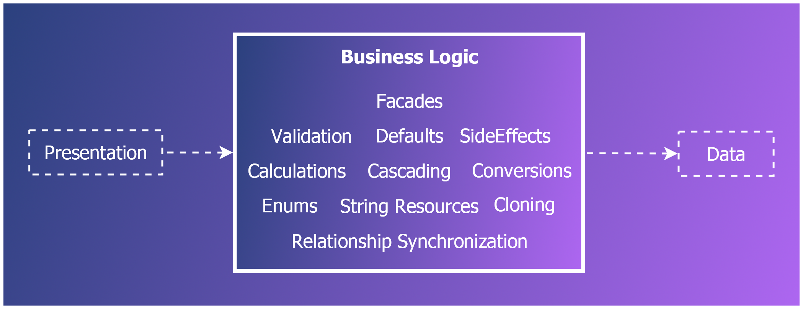

🤖 Patterns : Business Logic
============================

[back](README.md)

[Business logic](#-patterns--business-logic) guards the rules of a system: the invisible engine of the software.  
It sits between the [presentation](../layers.md#presentation-layer) and the [data layer](../layers.md#data-layer)



<h2>Contents</h2>

<ul>
<li><a href="#introduction">Introduction</a></li>
<li><a href="#repositorywrappers">RepositoryWrappers</a></li>
<li><a href="#validators">Validators</a></li>
<li><a href="#sideeffects">SideEffects</a></li>
<li><a href="#linkto">LinkTo</a>
    <ul>
    <li><a href="#unlink">Unlink</a></li> 
    <li><a href="#newlinkto">NewLinkTo</a></li> 
    </ul>
</li>
<li><a href="https://jjvanzon.github.io/JJs-Reference-Architecture/patterns/cascading.html">Cascading</a></li>
<li><a href="#facade">Facade</a></li>
<li><a href="https://jjvanzon.github.io/JJs-Reference-Architecture/patterns/visitors.html">Visitors</a></li>
<li><a href="https://jjvanzon.github.io/JJs-Reference-Architecture/patterns/resource-strings.html">Resource Strings</a></li>
</ul>


Introduction
------------

[Presentation](../layers.md#presentation-layer), [`Entity` model](data-access.md#entities) and [persistence](../aspects.md#persistence) should be straightforward [pattern-wise](README.md). If anything 'special' needs to happen it belongs in the [business layer](../layers.md#business-layer). Any number of different [patterns](README.md) can be used. But also things, that do not follow any standard [pattern](README.md).

The [business layer](../layers.md#business-layer) externally speaks a language of [`Entities`](data-access.md#entities) or sometimes [`DTO's`](data-access.md#dto). Internally it can talk to [`Repository interfaces`](data-access.md#repository-interfaces) for [data access](../aspects.md#persistence).

It is preferred that [business logic](../layers.md#business-layer) hooks up with  [`Entity`](data-access.md#entities) `classes` rather than [`Repositories`](data-access.md#repository). But there is a large gray area. Using [`Entities`](data-access.md#entities) improves testability, limits queries and limits interdependence, dependency on a data source and passing around a lot of [`Repository`](data-access.md#repository) variables.


RepositoryWrappers
------------------

Passing around lots of [`Repositories`](data-access.md#repository) can create long lists of parameters, prone to change. To prevent that phenomenon, sets of [`Repositories`](data-access.md#repository) could be combined into [`RepositoryWrappers`](#repositorywrappers). Those can then be passed around instead. This keeps the parameter lists shorter.

You can make a single [`RepositoryWrapper`](#repositorywrappers) with all the [`Repositories`](data-access.md#repository) out of a [functional domains](../namespaces-assemblies-and-folders.md#functional-domains) in it.

Some logic might use [`Repositories`](data-access.md#repository) out of multiple [domains](../namespaces-assemblies-and-folders.md#functional-domains). You could choose to pass around multiple [`RepositoryWrappers`](#repositorywrappers): one for each [domain model](../namespaces-assemblies-and-folders.md#functional-domains). But you could also make a custom [`RepositoryWrapper`](#repositorywrappers) with [`Repositories`](data-access.md#repository) from multiple [functional domains](../namespaces-assemblies-and-folders.md#functional-domains).

You may also want to more limited [`RepositoryWrappers`](#repositorywrappers). For instance one for each [partial domain](../namespaces-assemblies-and-folders.md#partial-domains). This keeps the width of dependency more narrow, so logic that has nothing to do with certain [`Repositories`](data-access.md#repository), would not accidentally become dependent on them.

An alternative to [`RepositoryWrappers`](#repositorywrappers) might be [dependency injection](../practices-and-principles.md#dependency-injection). Under this [link](../practices-and-principles.md#dependency-injection) you can find some criticism about the techique, but that might be due to not using a very safe [dependency injection](../practices-and-principles.md#dependency-injection) `API`. [`RepositoryWrappers`](#repositorywrappers) and [dependency injection](../practices-and-principles.md#dependency-injection) might also go hand in hand in combination with each other.


Validators
----------

Separate [`Validator`](../api/table.md#jj-framework-validation) `classes` could be used for [validation](../aspects.md#validation). Specialized `classes` can be derived from [`VersatileValidator`](../api/table.md#jj-framework-validation) from the [`JJ.Framework`](../api/misc.md#jjframework).

It is recommended to keep [`Validators`](../api/table.md#jj-framework-validation) independent from each other.

If multiple [`Validators`](../api/table.md#jj-framework-validation) should go off, you might call them individually one by one.

For complex [`Validator`](../api/table.md#jj-framework-validation), it is suggested to add a [prefix or suffix](../code-style.md#prefixes-and-suffixes) to the name such as [`Recursive`](other.md#singular-plural-non-recursive-recursive-and-withrelatedentities) or `Versatile` to make it clear that it is more than a simple [`Validator`](../api/table.md#jj-framework-validation).

Next to [`Validators`](../api/table.md#jj-framework-validation) deciding whether user input is valid, [`Validators`](../api/table.md#jj-framework-validation) could also be used to generate *warnings*, that are not blocking, but help the user work with an app.

[`Validators`](../api/table.md#jj-framework-validation) might also be used for *delete constraints*. For instance when an [`Entity`](data-access.md#entities) is still in use, you might not be able to delete it.


SideEffects
-----------

The [business layer](../layers.md#business-layer) can execute [`SideEffects`](../api/table.md#jj-framework-business) while altering data, for instance to record a *date time modified*, set [default values](../aspects.md#defaults), or automatically generate a *name*.

We could implement an `interface` [`ISideEffect`](../api/table.md#jj-framework-business) for each of these. It has only one method: `Execute`. This gives us some polymorphism over [`SideEffects`](../api/table.md#jj-framework-business) so it is easier to handle them *generically* and for instance `Execute` multiple in a row.

Using separate `classes` for [`SideEffects`](../api/table.md#jj-framework-business) can create overview over pieces of logic, creative in nature, and prevent things from getting entangled.

[`SideEffects`](../api/table.md#jj-framework-business) might evaluate conditions internally. The caller of the [`SideEffect`](../api/table.md#jj-framework-business) `class` would not know what conditions there are. A [`SideEffect`](../api/table.md#jj-framework-business) could skip over its own execution, when it wouldn't apply. This makes the [`SideEffect`](../api/table.md#jj-framework-business) fully responsible for what happens. What a [`SideEffect`](../api/table.md#jj-framework-business) does can also depend on [status flagging](../aspects.md#entity-status-management).


LinkTo
------

This pattern is about [bidirectional relationship synchronization](../aspects.md#bidirectional-relationship-synchronization). That means that if a parent property is set: `myProduct.Supplier = mySupplier`, automatically the product is added to the child collection too: `mySupplier.Products.Add(myProduct)`.

To manage [bidirectional relationships](../aspects.md#bidirectional-relationship-synchronization), even when the underlying [persistence technology](../aspects.md#persistence) doesn't, we could link [`Entities`](data-access.md#entities) together using [`LinkTo`](#linkto) extension methods. By calling [`LinkTo`](#linkto), both ends of the relationship are updated. Here is a template for a [`LinkTo`](#linkto) method that works for an `1-to-n` relationship:

```cs
public static void LinkTo(this Child child, Parent parent)
{
    if (child == null) throw new NullException(() => child);

    if (child.Parent != null)
    {
        if (child.Parent.Children.Contains(child))
        {
            child.Parent.Children.Remove(child);
        }
    }

    child.Parent = parent;

    if (child.Parent != null)
    {
        if (!child.Parent.Children.Contains(child))
        {
            child.Parent.Children.Add(child);
        }
    }
}
```

Beware that all the checks and list operations can come with a performance penalty.

You could put the [`LinkTo`](#linkto) methods together in a `class` named `LinkToExtensions`. You might put it in a [`LinkTo`](#linkto) [`namespace`](../namespaces-assemblies-and-folders.md#patterns) in your project.

If a [`LinkTo`](#linkto) method name becomes ambiguous, you could suffix it, for instance:

    LinkToParentDocument

### Unlink

Next to [`LinkTo`](#linkto) methods, you might also add [`Unlink`](#unlink) methods in an `UnlinkExtensions class`:

```cs
public static void UnlinkParent(this Child child)
{
    if (child == null) throw new NullException(() => child);
    child.LinkTo((Parent)null);
}
```

### NewLinkTo

If you are linking `objects` together, that you *know are new*, you may use better-performing variations for [`LinkTo`](#linkto), called [`NewLinkTo`](#newlinkto), that omit the expensive checks:

```cs
public static void NewLinkTo(this Child child, Parent parent)
{
    if (child == null) throw new NullException(() => child);
    child.Parent = parent;
    parent.Children.Add(child);
}
```

But beware that [`LinkTo`](#linkto) might be a better choice, because executing [`NewLinkTo`](#newlinkto) onto *existing* `objects` may corrupt the `object` graph.


Facade
------

A [`Facade`](#facade) combines several related (usually [`CRUD`](../layers.md#crud)) operations into one `class` that also performs additional [business logic](../layers.md#business-layer) and [`Validation`](#validators), [`SideEffects`](#sideeffects), integrity constraints, [conversions](../aspects.md#conversion), etc. It delegates to other `classes` to do the work. If you do something using a [`Facade`](#facade) you should be able to count on it that integrity is maintained.

It is a combinator `class`: a [`Facade`](#facade) combines other (smaller) parts of the [business layer](../layers.md#business-layer) into one, offering a single entry point for a lot of related operations. A [`Facade`](#facade) can be about a [partial functional domain](../namespaces-assemblies-and-folders.md#partial-domains), so managing a *set* of [`Entity`](data-access.md#entities) `types` together.

<h4>Repositories instead of Facades</h4>

[`Facades`](#facade) may typically contain [`CRUD`](../layers.md#crud) operations, that could be used as an entry point for all your [business logic](../layers.md#business-layer) and [data access](../layers.md#crud) needs. But in some cases, it may be more appropriate to use the [data access layer](../layers.md#data-layer) directly.

For example, a simple `Get` by `ID` may be better going through a [`Repository`](data-access.md#repository). There could be other cases where using [`Repositories`](data-access.md#repository) directly is a better choice. For instance in the [`ToEntity`](presentation.md#toentity) and [`ToViewModel`](presentation.md#toviewmodel) code, which is usually straightforward [data conversion](../aspects.md#conversion).

The reason is, that a [`Facade`](#facade) could create an excessive amount of dependency and high degree of coupling. Because simple operations executed frequently, would require a reference to a [`Facade`](#facade), a [combinator](#facade) `class`, naturally dependent on many other `objects`. So, for a simple `Get` it may be better to use a [`Repository`](data-access.md#repository), to limit the interdependence between things.


Visitor
-------

See the [`Visitors`](visitors.md) article.


Resource Strings
----------------

See the [`Resource Strings`](resource-strings.md) article.


[back](README.md)
