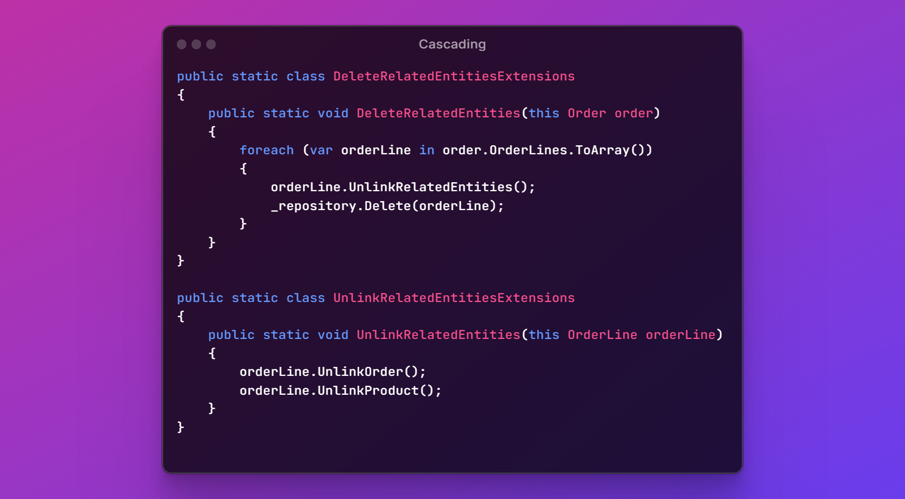

---
title: "🎋 Cascading"
description: "Upon deleting a main entity, child-entities can be deleted too. Implemented as a pattern in C#, to see these deletions explicitly take place."
image: "/images/cascading-page.png"
keywords:
  - cascading
  - delete
  - unlink
  - entities
  - design patterns
  - patterns
  - c#
  - .net
  - coding
  - programming
  - software engineering
  - software development
  - software design
  - software architecture
  - computers
---

🎋 Cascading
============

[back](business-logic.md)

[`Cascading`](../aspects.md#cascading) means that upon deleting a main entity, child-entities are deleted too.



<h2>Contents</h2>

- [Introduction](#introduction)
- [Code Files](#code-files)
- [DeleteRelatedEntities](#deleterelatedentities)
- [UnlinkRelatedEntities](#unlinkrelatedentities)
- [Delete Main Entity](#delete-main-entity)
- [Cascading & Repositories](#cascading--repositories)
- [Nuance](#nuance)
- [Alternative: Database Cascading](#alternative-database-cascading)
- [Alternative: ORM-Mappings](#alternative-orm-mappings)
- [Conclusion](#conclusion)


Introduction
------------

[`Entities`](data-access.md#entities) can be automatically `Deleted` along with other [`Entities`](data-access.md#entities). But if they are not inherently part of the main [`Entity`](data-access.md#entities), they would be [`Unlinked`](business-logic.md#unlink) instead.

This can be implemented as a pattern in [`C#`](../api/table.md#csharp). A reason to do it in [`C#`](../api/table.md#csharp), is to explicitly see in the code, that the other `Deletions` take place. It may be important not to hide this from view.

One way to implement [`Cascading`](../aspects.md#cascading), is through extension methods:  
`DeleteRelatedEntities` and `UnlinkRelatedEntities`.


Code Files
----------

Here is a suggestion for how to organize the [`Cascading`](#-cascading) code.

In the `csproj` of the [`Business` layer](../layers.md#business-layer), you could put a [sub-folder](../namespaces-assemblies-and-folders.md#patterns) called [`Cascading`](#-cascading) and put two code files in it:

```
JJ.Ordering.Business.csproj
    |
    |- Cascading
        |
        |- DeleteRelatedEntitiesExtensions.cs
        |- UnlinkRelatedEntitiesExtensions.cs
```


DeleteRelatedEntities
---------------------

Here is how  `DeleteRelatedEntitiesExtensions.cs` might look internally:

```cs
/// <summary>
/// Deletes child entities inherently part of the main entity.
/// </summary>
public static class DeleteRelatedEntitiesExtensions
{
    public static void DeleteRelatedEntities(this Order order)
    {
        ...
    }
}
```

In there, child [`Entities`](data-access.md#entities) are successively `Deleted`:

```cs
public static class DeleteRelatedEntitiesExtensions
{
    public static void DeleteRelatedEntities(this Order order)
    {
        // Delete child entities.
        foreach (var orderLine in order.OrderLines.ToArray())
        {
            _repository.Delete(orderLine);
        }
    }
```

(Note: The `ToArray` can prevent an `Exception` about the loop collection being modified.)

Before an extension method `Deletes` a child [`Entity`](data-access.md#entities), it might call [`Cascading`](#-cascading) upon the child [`Entity`](data-access.md#entities) too:

```cs
public static void DeleteRelatedEntities(this Order order)
{
    foreach (var orderLine in order.OrderLines.ToArray())
    {
        // Call cascading on the child entity too!
        orderLine.UnlinkRelatedEntities(); 

        _repository.Delete(orderLine);
    }
}
```


UnlinkRelatedEntities
---------------------

`UnlinkRelatedEntities` might be a little bit easier. It neither requires [`Repositories`](data-access.md#repository) not does it do much recursion:

```cs
/// <summary>
/// Unlinks related entities, not inherently part of the main entity.
/// </summary>
public static class UnlinkRelatedEntitiesExtensions
{
    public static void UnlinkRelatedEntities(this OrderLine orderLine)
    {
        orderLine.UnlinkOrder();
        orderLine.UnlinkProduct();
    }
}
```

Note that it uses the [`Unlink`](business-logic.md#unlink) pattern discussed earlier.


Delete Main Entity
------------------

The [`Cascading`](#-cascading) extension methods delete *related* [`Entities`](data-access.md#entities), not the *main* [`Entity`](data-access.md#entities). The idea behind that is: Where a main [`Entity`](data-access.md#entities) is `Deleted`, we could call the [`Cascading`](#-cascading) methods first:

```cs
entity.DeleteRelatedEntities();
entity.UnlinkRelatedEntities();

// Delete main entity separately.
_repository.Delete(entity);
```

That way we can see explicitly that more `Deletions` take place.


Cascading & Repositories
------------------------

The [`DeleteRelatedEntities`](#deleterelatedentities) methods might need [`Repositories`](data-access.md#repository) to perform the `Delete` operations.

You could pass these [`Repositories`](data-access.md#repository) as *parameters:*

```cs
public static void DeleteRelatedEntities(
    this Order order,
    /* Repository parameter */
    IOrderLineRepository repository)
{
    foreach (var orderLine in order.OrderLines.ToArray())
    {
        orderLine.UnlinkRelatedEntities();
        repository.Delete(orderLine);
    }
}
```

Or you might make [repositories](data-access.md#repository) available through a technique called [dependency injection](../practices-and-principles.md#dependency-injection).
 
It's up to you. The choice to use *extension* methods was also a matter of preference.


Nuance
------

Sometimes an [`Entity`](data-access.md#entities) indeed has related [`Entities`](data-access.md#entities) to [`Cascadedly`](#-cascading) [`Unlink`](business-logic.md#unlink) or `Delete`, but sometimes it doesn't, creating subtleties in the implementation.


Alternative: Database Cascading
--------------------------------

Instead of using [`C#`](../api/table.md#csharp) to perform the [`Cascading`](#-cascading) you could also configure the *database* to do it for you. You could use `Triggers` or `Delete Actions` for that.

But this might not play along nicely with our data access technology of choice: [`ORM`](../api/orm.md). Saving the changes could then complain about too many records modified, because more records were affected than the [`ORM`](../api/orm.md) expected.


Alternative: ORM-Mappings
-------------------------

You can also configure the [`ORM`](../api/orm.md) through [`Mappings`](data-access.md#mapping) to automatically handle the [`Cascading`](#-cascading).

A downside of this might be, that the deletions are hidden away from view. It may surprise programmers, when related data is automatically deleted. This can result in unintended consequences, taking away control from the programmer.


Conclusion
----------

Hopefully this gave a good impression of how you could build up [`Cascading`](#-cascading) code by just using a pattern in [`C#`](../api/table.md#csharp).


[back](business-logic.md)
