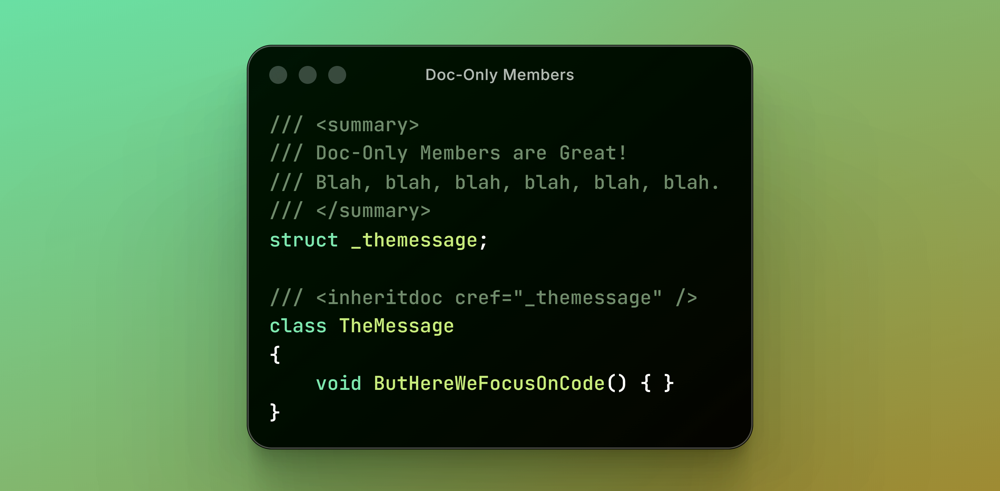
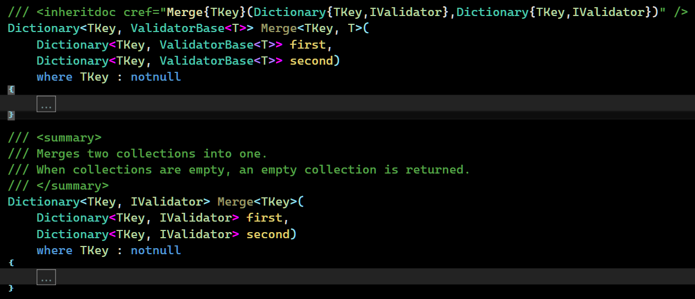
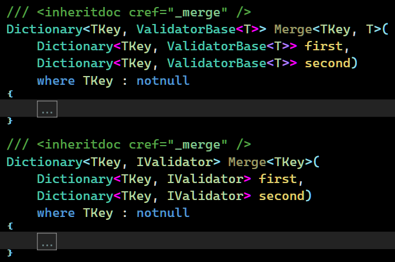
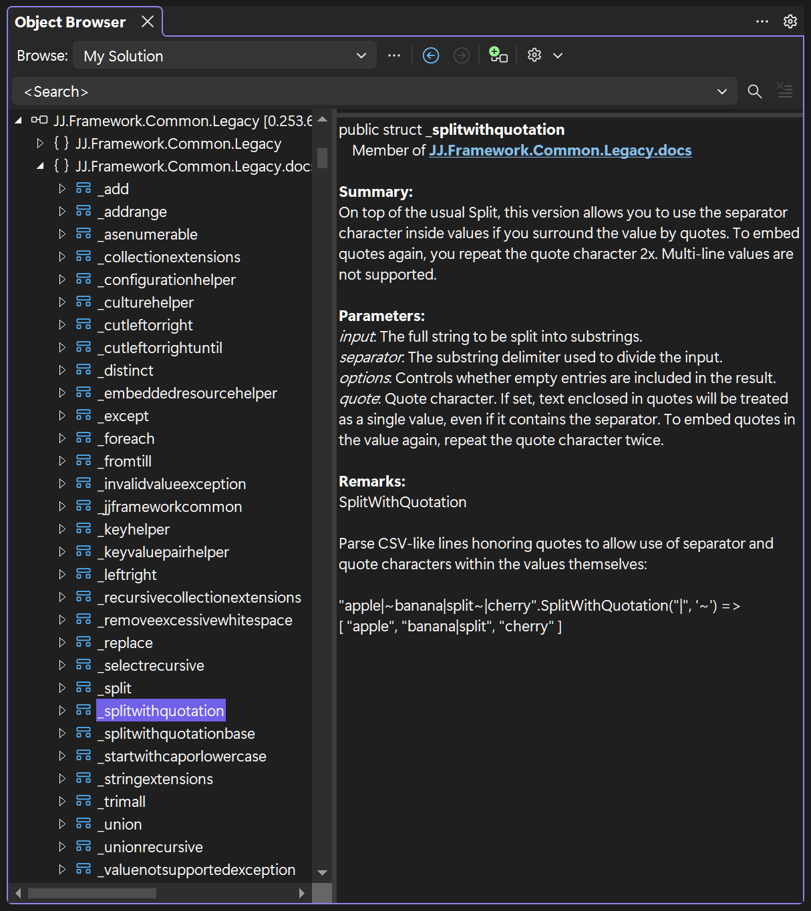
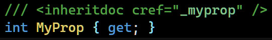
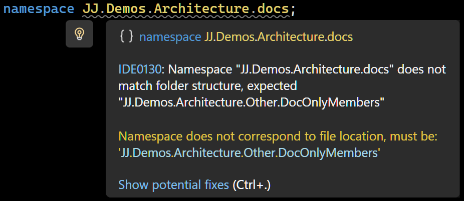
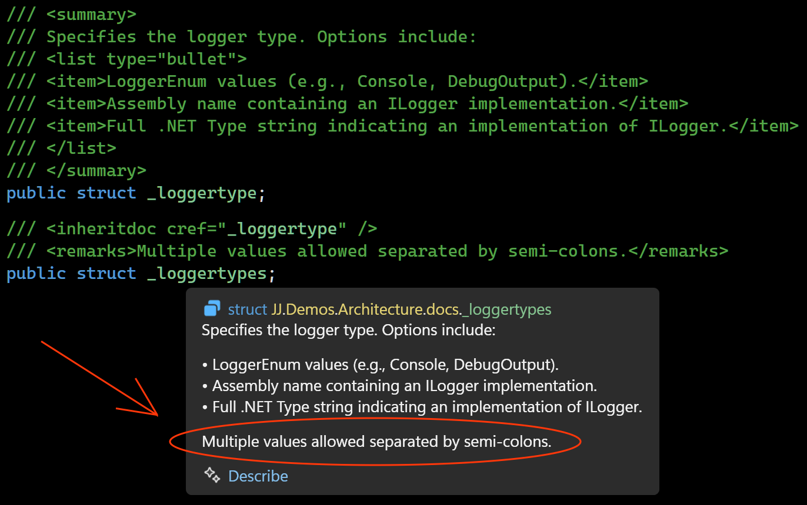
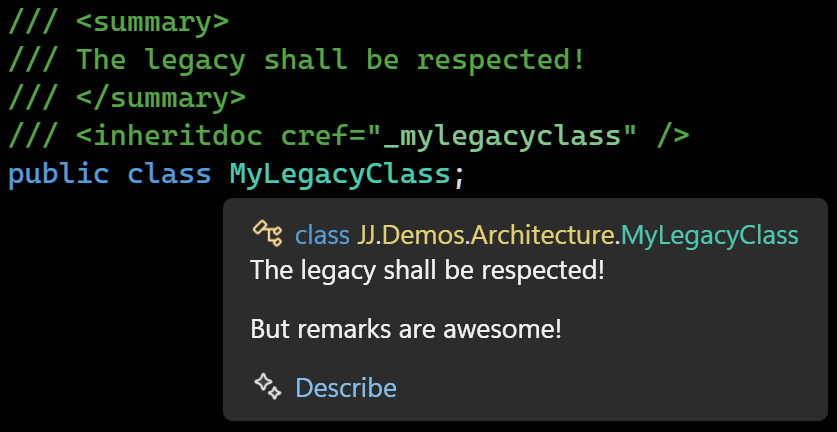

📔 Doc-Only Members
====================

[back](README.md)

Centralize and reuse comments: a pattern to improve your docs in code.



<h2>Contents</h2>

- [What are XML Doc Comments?](#what-are-xml-doc-comments)
- [Declutter Your Code!](#declutter-your-code)
- [Stop Repeating the Comments!](#stop-repeating-the-comments)
- [Inherit the Comments!](#inherit-the-comments)
- [Reuse the Comments!](#reuse-the-comments)
- [Reuse the Comments Anywhere!](#reuse-the-comments-anywhere)
- [Say "No" to Bewildering Links](#say-no-to-bewildering-links)
- [Say "No" to XPaths](#say-no-to-xpaths)
- [Unobtrusive Doc-Only Members](#unobtrusive-doc-only-members)
- [Make 'Em Play Nicely](#make-em-play-nicely)
- [Writing Efficiently](#writing-efficiently)
- [Conclusion](#conclusion)

What are XML Doc Comments?
--------------------------

XML doc comments are those special comments, that pop up when you hover classes, methods or properties in your code:


You can add them to your own code, so IntelliSense pops up while you program.

Take this example method:

```cs
string StartWithCap(string input)
{
    if (input.Length == 0) return input;
    return input.Left(1).ToUpper() + input.CutLeft(1);
}
```

Do you know what it does? Great, but this might help:  

```cs
/// <summary>
/// Changes the first character to upper case:
/// <code>
/// StartWithCap("test") = "Test"
/// </code>
/// </summary>
string StartWithCap(string input)
{
    if (input.Length == 0) return input;
    return input.Left(1).ToUpper() + input.CutLeft(1);
}
```

An `XML` doc comment helps you remember what it's for. Even if you have not much to say, a slight addition of detail can make the reader get an "aha" moment of recognition.

There's a lot of other options for writing doc comments, that we will cover in this article.

Declutter Your Code!
--------------------

See, the doc comments are put in the code, and it can get quite crowded with them.

I couldn't even give a good example: it'd overpower this very article just as it'd overpower your code. Here's a one anyway where `<summary>` tags take up much of the space:

```cs
/// <summary>
/// Returns the left part of a string.
/// Can return less characters than
/// the length provided if string is shorter.
/// </summary>
string TakeStart(string input, int length)
{
    if (length > input.Length) length = input.Length;
    return input.Left(length);
}

/// <summary>
/// Takes the part of a string until the specified delimiter. 
/// Excludes the delimiter itself.
/// </summary>
string TakeStartUntil(string input, string until)
{
    if (until == null) throw new ArgumentNullException(nameof(until));
    int index = input.IndexOf(until, StringComparison.Ordinal);
    if (index == -1) return "";
    string output = input.Left(index);
    return output;
}

/// <summary>
/// Takes the part of a string until the specified delimiter. 
/// Excludes the delimiter itself.
/// </summary>
string TakeStartUntil(string input, char until)
{
    return TakeStartUntil(input, until.ToString());
}
```

Usually there's more comments, but I didn't want you to stop reading. Sometimes you can hardly see the code for the comments. Where is my code? Oh, it's hiding behind that wall of text.

Stop Repeating the Comments!
----------------------------

Comments also often get repeated. In the former example you can already spot the repetition:

```cs
/// <summary>
/// Takes the part of a string until the specified delimiter.
/// Excludes the delimiter itself.
/// </summary>
string TakeStartUntil(string input, string until);

/// <summary>
/// Takes the part of a string until the specified delimiter.
/// Excludes the delimiter itself.
/// </summary>
string TakeStartUntil(string input, char until);
```

They have exactly the same comment! But there are ways to avoid the clutter.

Inherit the Comments!
---------------------

One way is to use `<inheritdoc>`, which takes over the doc comment from the `base` class or method. This is a shortcut to avoid repeating the comment:

```cs
/// <inheritdoc />
class Rectangle : Element
{
    /// <inheritdoc />
    Rectangle(Element parent) : base(parent) { }
}
```

It makes the `Rectangle` class inherit comments of its base class  `Element`. Here is the `Element` class. The comments live there and we didn't need to repeat them:

```cs
/// <summary>
/// VectorGraphics element that can contain
/// VectorGraphics child elements.
/// </summary>
class Element
{
    /// <summary>
    /// VectorGraphics element that can contain
    /// VectorGraphics child elements.
    /// </summary>
    /// <param name="parent">
    /// When in doubt, use Diagram.Background.
    /// </param>
    public Element(Element parent) { }
}
```

Here's a resulting IntelliSense tool tip:


It works! But there's still all that comment in the `Element` base class! Oh no! Now what?

Reuse the Comments!
-------------------

`<inheritdoc>` is very flexible. You can use the `cref` attribute to point at any member you want. This comes out handy for our constructor, so we can brush away some more repeated text:

```cs
/// <summary>
/// VectorGraphics element that can contain
/// VectorGraphics child elements.
/// </summary>
/// <param name="parent">
/// When in doubt, use Diagram.Background.
/// </param>
class Element
{
    /// <inheritdoc cref="Element" />
    public Element(Element parent) { }
}
```

There constructor now `inherits` the doc from the `Element class`, with the `cref` attribute. Here's a resulting tool tip:


Yes, it's lazy! But efficient. 

But wait! This is all fine and dandy, but there's still a bunch of comment in the base class. Because eventually, it's got to live somewhere? What shall we do?

Reuse the Comments Anywhere!
----------------------------

Where'd the code go? Can't see the code for the comments. To find our code back, we can use a trick! It would make things a lot easier. I like to put my comments in a file called `docs.cs`:

```cs
/// <summary>
/// VectorGraphics element that can contain
/// VectorGraphics child elements.
/// </summary>
/// <param name="parent">
/// When in doubt, use Diagram.Background.
/// </param>
struct _element;
```

Those are our __Doc-Only Members__. They can be referenced with `inheritdoc`:

```cs
/// <inheritdoc cref="_element" />
class Rectangle : Element
{
    /// <inheritdoc cref="_element" />
    Rectangle(Element parent) : base(parent) { }
}

/// <inheritdoc cref="_element" />
class Element
{
    /// <inheritdoc cref="_element" />
    public Element(Element parent) { }
}
```

Now each documentation is just a single unobtrusive line with an `inheritdoc` tag.

Now the code doesn't get cluttered with comments anymore, the `inheritdoc cref`'s are simple, it's easier to reuse the same doc comment for efficiency, and have meaningful, helpful pop ups all over the place. The docs are now central, which makes it easier to review, revise and maintain.

It's my preferred way of doing it now.


Say "No" to Bewildering Links
-----------------------------

Ever come across something like this?


These `cref` links can get wild if you're dealing with overloads and, oh boy, generics:



With centralized doc comments, we've snuck by that beast completely:




Much cleaner!

Say "No" to XPaths
------------------

There is an alternative: Storing docs in separate `XML` files:

```xml
<?xml version="1.0" encoding="utf-8" ?>
<docs>
  <member name="Shout">
    <summary>
      Converts the text to upper case and appends an exclamation mark.
    </summary>
  </member>
</docs>
```

Then, you can link to it with `XPath`:

```cs
/// <include file='docs.xml' path='docs/member[@name="Shout"]/*' />
public string Shout(string input) => input.ToUpper() + "!";
```

It works, but requires knowing `XPath`, and the links are verbose. When something gets renamed, docs silently vanish with no compiler warning or anything. There's no keyboard shortcut to navigate to the doc. The `XML` editor won't catch malformed doc syntax. Though the `XML` approach leaves the docs-only members out of the compiled assembly, centralizing docs in __code__ seems a stronger alternative.

Unobtrusive Doc-Only Members
----------------------------

The choices we mention now are mostly cosmetic. But they do help keep the docs low-key and prevent clashing with the main code.


<h3>
Docs Namespace
</h3>


I like to give the docs their own sub-namespace `.docs`

```cs
namespace JJ.Demos.Architecture.docs;

/// <summary>...</summary>
struct _element;
```

This keeps them from cluttering the main namespace.

To use the `docs` you'd add a `using` statement to `GlobalUsings.cs`:

```cs
global using JJ.Demos.Architecture.docs;
```

Or to each code file you can add `using docs;`

```cs
namespace JJ.Demos.Architecture;

using docs;

/// <inheritdoc cref="_element" />
class Element;
```


<h3>
Structs
</h3>


The choice to use `structs` is for camouflage. They're usually displayed in an unassuming green color, making the `<inheritdoc>` tags blend in the background, so the code itself pops out.


This in contrast to regular crefs, which might be more colorful, which can make them visually distracting:


<h3>
Public
</h3>


I actually like to make the doc-structs `public`:

```cs
/// <summary>...</summary>
public struct _element;
```

That way a `docs` namespace gives an overview of the documentation, that even others can see.


<h3>
Object Browser
</h3>


Now you and others can check your documentation in the `Object Browser` and see it all in one place:




<h3>
Naming Style
</h3>


The naming format is also specifically chosen to make the `<inheritdoc>` tags as unobtrusive as possible.

Consider the following docs-only member called `_myprop`:

```cs
/// <summary> ... </summary>
struct _myprop;
```

Not only do the lower case letters not stand out as much, the underscore prevents the name from colliding with the actual code elements:



Make 'Em Play Nicely
--------------------


<h3>
Shipping
</h3>


To ship the docs along with your `NuGet` package you can add this to your `csproj` file:

```xml
<GenerateDocumentationFile>True</GenerateDocumentationFile>
```
To actually generate the package you would add: 

```xml
<GeneratePackageOnBuild>True</GeneratePackageOnBuild>
```

Put those tags inside a `<PropertyGroup>` and you'll be ready to go.


<h3>
Missing Comments
</h3>


You can add an extra check to find missing `XML` comments, by turning their warnings into errors. This would help the released packages, so they always stay documented. Add the following to your `csproj`:

```xml
<!--missing docs as errors-->
<WarningsAsErrors>$(WarningsAsErrors);CS1591</WarningsAsErrors> 
```

If you already `<TreatWarningsAsErrors>`, you could do the opposite and build in lenience for missing docs, for while you're still writing and are not quite done yet:

```xml
<NoWarn>$(NoWarn);CS1591</NoWarn> <!--missing doc lenience-->
```

These tags belong inside a `<PropertyGroup>`.


<h3>
Naming Rules
</h3>


You may get some warnings you might need to deal with. The system might start bickering about things, like naming rule violations:


There's no way to configure a naming rule specifically for doc-only elements, so I like to squelch that warning at the top of the `docs.cs` file:

```cs
#pragma warning disable IDE1006 // naming rule
```


<h3>
Namespace != Folder
</h3>


The namespace where we put the docs is violating another naming rule. We  put a `docs` namespace in the `JJ.Demos.Architecture` folder, which does not include the `docs` sub-folder, which can get you another nag from the compiler:



Squelch as follows:

```cs
#pragma warning disable IDE0130 // namespace != folder
```

Since we only use one "docs" file per project, at least we can just squelch these pesky warnings with a single line each.


<h3>
Param Tag Mismatch
</h3>


Another warning you can get, has to do with the docs-only members not actually having the parameters you define:


The parameters are part of the methods, not part of the doc-struct. I'd just squelch that warning at the top of the code file:

```cs
#pragma warning disable CS1572 // param tag mismatch
```

The members you use it for will still use the `param` doc anyway.

Downside: You do lose the checks on `param` existence. That's the trade-off. You get a whole lot back for it though, like centralized reusable docs, maintainability and focus and clarity in your code.

Writing Efficiently
-------------------

Here are a few tips for producing `XML` doc comments efficiently.


<h3>
Copy from the README
</h3>


If you already have a README.md with descriptions of what your code does, you could cut it up into little pieces: one per code element and add them as docs only members. Apply them to multiple members. That way you get a head-start at making your code comments complete.


<h3>
One Generalized Comment
</h3>


You can choose to make one generalized description of multiple code elements and put all in one docs-only member. You can use `<inheritdoc>` to apply those to multiple code elements at once. Sometimes this means efficiency for you, the author, but it can also help the reader, when a few elements are so related, a shared description provides a little "how to" at hand where needed.


<h3>
Ditch the Params
</h3>


The main description is more important than the parameters, so you could get away with not adding documentation to the separate parameters at all, and save yourself a bit of time.

Comments like `<param name="text">This is the text.</param>` are usually not very useful anyway.

I often choose to stick with a good `<summary>` and be done with it. Only if there's something very specific to say, I might add a `<param>` tag, but this is rare in my code.

Decide for yourself:
Do you want detailed `<param>` tags for everything, or just the essentials? Sometimes, focusing on the main description is more practical.


<h3>
To `cref` or not to `cref`
</h3>


Hyperlinks from one `<summary>` to other code elements (using `<see>` elements) can provide rich navigation. But you can __choose__ to make everything a link or not, and save some time writing. The main text of the `<summary>` might be more important. It's a choice. It's up to you. Efficiency, quality, take your pick.


<h3>
Remarks Are Awesome
</h3>


You can add an extra layer of `docs` inheritance, by leveraging tags other than `<summary>`.

Here's an example where one member has a `<summary>` and the other member adds a `<remarks>` tag:



If they both would have been `summaries`, they would overlap and the 2nd one would disappear from the pop-up. That's one reason why `<remarks>` are great.

Another example: I had a legacy project. Its code was not allowed to change very much. It already had a `<summary>` tag near the code element. I wanted to add more description to IntelliSense. I was able to unobtrusively extend it adding one line to the original code:

```cs
/// <summary>
/// The legacy shall be respected!
/// </summary>
/// <inheritdoc cref="_mylegacyclass" />
public class MyLegacyClass;
```

and leveraging a `<remarks>` tag in my centralized `docs.cs`

```cs
/// <remarks>
/// But remarks are awesome!
/// </remarks>
struct _mylegacyclass;
```

The two texts were now combined in one IntelliSense popup!



Conclusion
----------

Eventually I settled on this doc-only member trick, which has been serving me very well ever since. I hope you find use for it too. The end result: centralized comments, efficiently written, robust without repetitions and not cluttering your code.

[back](README.md)
