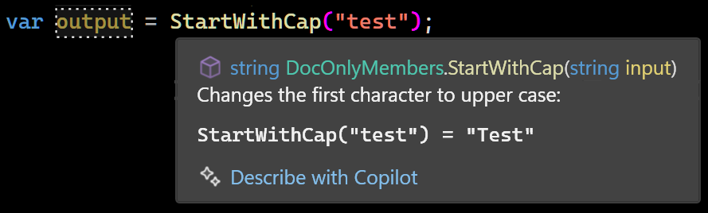
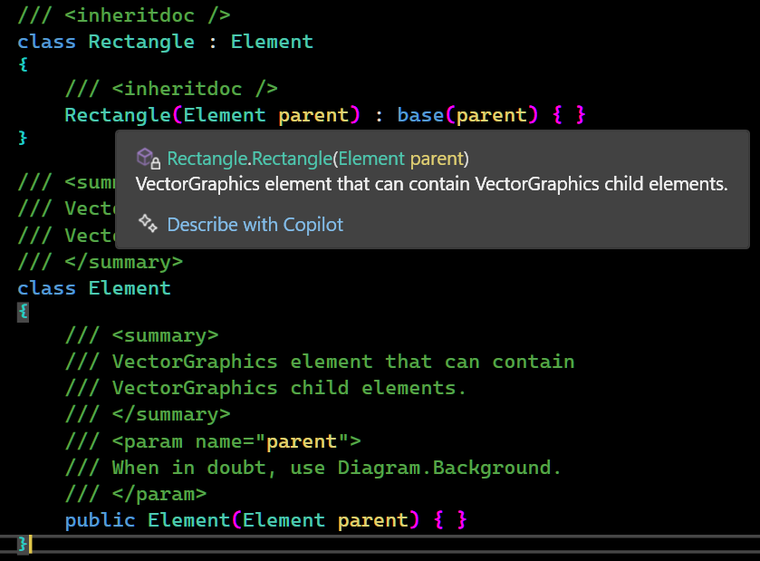
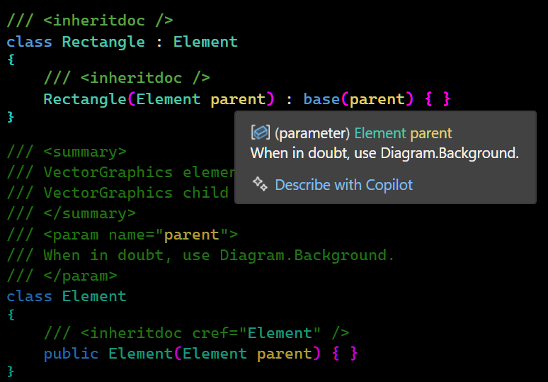
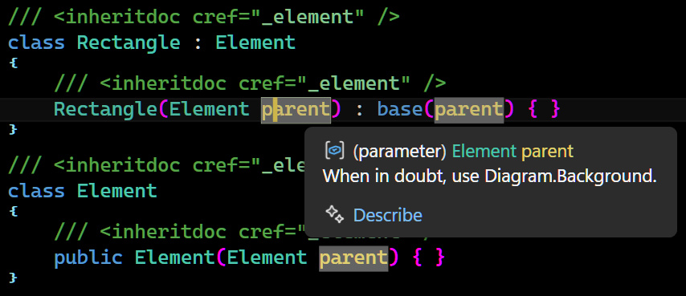
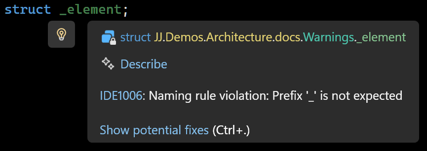
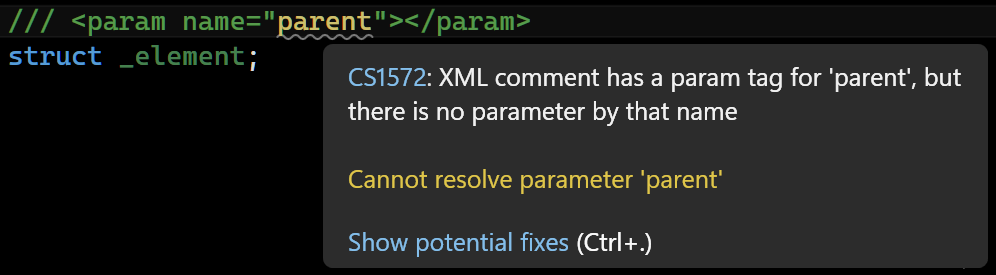

`[ Draft ]`

📔 Doc-Only Members
====================

A way to centralize and reuse comments: a technique to improve your docs in code.

- [What are XML Doc Comments?](#what-are-xml-doc-comments)
- [Declutter Your Code!](#declutter-your-code)
- [Stop Repeating the Comments!](#stop-repeating-the-comments)
- [Inherit the Comments!](#inherit-the-comments)
- [Reuse the Comments!](#reuse-the-comments)
- [Reuse the Comments Anywhere!](#reuse-the-comments-anywhere)
- [Say "No" to Bewildering Links](#say-no-to-bewildering-links)
- [Say "No" to XPaths](#say-no-to-xpaths)
- [Unobtrusive Doc-Only Members](#unobtrusive-doc-only-members)
    - [Docs Namespace](#docs-namespace)
    - [Public](#public)
    - [Object Browser](#object-browser)
    - [Structs](#structs)
    - [Naming Style](#naming-style)
- [Make 'Em Play Nicely](#make-em-play-nicely)
    - [Shipping](#shipping)
    - [Missing Comments](#missing-comments)
    - [Naming Rules](#naming-rules)
    - [Namespace != Folder](#namespace--folder)
    - [Param Tag Mismatch](#param-tag-mismatch)
- [Efficiency](#efficiency)
    - [Copy from the README](#copy-from-the-readme)
    - [One Generalized Comment](#one-generalized-comment)
    - [Ditch the Params](#ditch-the-params)
    - [To `cref` Or Not To `cref`](#to-cref-or-not-to-cref)
    - [Remarks Are Awesome](#remarks-are-awesome)
- [Conclusion](#conclusion)

What are XML Doc Comments?
--------------------------

XML doc comments are those special comments, that pop up when you hover classes, methods or properties in your code:



You can add them to your own code, so instant documentation pops up while you program.

Here's an example method:

```cs
string StartWithCap(string input)
{
    if (input.Length == 0) return input;
    return input.Left(1).ToUpper() + input.CutLeft(1);
}
```

Do you know what it does? Great, but this might help:  

```cs
/// <summary>
/// Changes the first character to upper case:
/// <code>
/// StartWithCap("test") = "Test"
/// </code>
/// </summary>
string StartWithCap(string input)
{
    if (input.Length == 0) return input;
    return input.Left(1).ToUpper() + input.CutLeft(1);
}
```

An XML doc comment helps you remember what it's for. Even if you have not much to write about it, a slight addition of detail can make the reader get an "aha" moment of recognition.

There's a lot of other options for writing doc comments, we'll be covering in this article.

Declutter Your Code!
--------------------

See, the doc comments are put in the code, and it can get quite crowded with them.

I couldn't even give a good example: it'd overpower this very article just as it'd overpower your code. Here's a one anyway:

```cs
/// <summary>
/// Returns the left part of a string.
/// Can return less characters than
/// the length provided if string is shorter.
/// </summary>
string TakeStart(string input, int length)
{
    if (length > input.Length) length = input.Length;
    return input.Left(length);
}

/// <summary>
/// Takes the part of a string until the specified delimiter. 
/// Excludes the delimiter itself.
/// </summary>
string TakeStartUntil(string input, string until)
{
    if (until == null) throw new ArgumentNullException(nameof(until));
    int index = input.IndexOf(until, StringComparison.Ordinal);
    if (index == -1) return "";
    string output = input.Left(index);
    return output;
}

/// <summary>
/// Takes the part of a string until the specified delimiter. 
/// Excludes the delimiter itself.
/// </summary>
string TakeStartUntil(string input, char until)
{
    return TakeStartUntil(input, until.ToString());
}
```

More often there's even more documentation. Sometimes you can hardly see the code itself. Where is my code? Oh, it's hiding behind that wall of comments.

Stop Repeating the Comments!
----------------------------

Comments would also often get repeated. In the former example you can already spot some repetition:

```cs
/// <summary>
/// Takes the part of a string until the specified delimiter.
/// Excludes the delimiter itself.
/// </summary>
string TakeStartUntil(string input, string until);

/// <summary>
/// Takes the part of a string until the specified delimiter.
/// Excludes the delimiter itself.
/// </summary>
string TakeStartUntil(string input, char until);
```

They have exactly the same comment! But there are ways to avoid the clutter.

Inherit the Comments!
---------------------

One way is to use `<inheritdoc>`, which takes over the doc comment from the `base` class or method. This is a shortcut to avoid repeating the comment:

```cs
/// <inheritdoc />
class Rectangle : Element
{
    /// <inheritdoc />
    Rectangle(Element parent) : base(parent) { }
}
```

It makes the `Rectangle` class inherit comments of its base class  `Element`. Here is the `Element` class. The comments live there andwe didn't need to repeat them the `Rectangle` class:

```cs
/// <summary>
/// VectorGraphics element that can contain
/// VectorGraphics child elements.
/// </summary>
class Element
{
    /// <summary>
    /// VectorGraphics element that can contain
    /// VectorGraphics child elements.
    /// </summary>
    /// <param name="parent">
    /// When in doubt, use Diagram.Background.
    /// </param>
    public Element(Element parent) { }
}
```

Here's a resulting `IntelliSense` tool tip:



It works! But there's still repeated comments in the `Element` base class! Oh no! Now what?

Reuse the Comments!
-------------------

`<inheritdoc>` is very flexible. You can use the `cref` attribute to point at any member you want. This comes out handy for our constructor to brush away any repeated text:

```cs
/// <summary>
/// VectorGraphics element that can contain
/// VectorGraphics child elements.
/// </summary>
/// <param name="parent">
/// When in doubt, use Diagram.Background.
/// </param>
class Element
{
    /// <inheritdoc cref="Element" />
    public Element(Element parent) { }
}
```

There the inner constructor `inherits` the doc from the `Element class`, because we added the `cref` attribute pointing to it. Here's a resulting tool tip:

`[ TODO: A picture that is more to the point about hovering the Element class name might be better. ]`



Yes, it's lazy! But efficient. 

But wait! This is all fine and dandy, but there's still a bunch of comment in the base class. Because eventually, it's got to live somewhere, right? What shall we do...?

Reuse the Comments Anywhere!
----------------------------

Where'd the code go? To find our code back, we can use a trick, making things much easier. I like to put my comments in a file called `docs.cs`:

```cs
/// <summary>
/// VectorGraphics element that can contain
/// VectorGraphics child elements.
/// </summary>
/// <param name="parent">
/// When in doubt, use Diagram.Background.
/// </param>
struct _element;
```

Those are our __Doc-Only Members__. Here they are referenced with `inheritdoc`:

```cs
/// <inheritdoc cref="_element" />
class Rectangle : Element
{
    /// <inheritdoc cref="_element" />
    Rectangle(Element parent) : base(parent) { }
}

/// <inheritdoc cref="_element" />
class Element
{
    /// <inheritdoc cref="_element" />
    public Element(Element parent) { }
}
```

Now each documentation is just a single unobtrusive line with an `inheritdoc` tag.

This way the code doesn't get cluttered with comments, the `inheritdoc` `cref`'s are simple, it's easier to reuse the same doc comment for efficiency, and have meaningful, helpful pop ups all over the place. The docs are now central, which makes it a lot easier to review, revise and maintain.

It's my preferred way of doing it now.



Say "No" to Bewildering Links
-----------------------------


These `cref` links can get wild if you're dealing with overloads and, oh boy, generics:


You can see how the code coloring of the `crefs` obscures the actual code? With centralized doc comments, we've snuck by that beast completely:


Much cleaner!

Say "No" to XPaths
------------------

There is an alternative: Storing docs in separate XML files:

`[ Example XML of that. ]`

You can then link to that XML with XPath

`[ Links to XML file from code ]`

But those links are convoluted and can break easily. How's that going to look for generics? I don't even want to know. Centralizing docs in code seems a stronger alternative.


Unobtrusive Doc-Only Members
----------------------------

### Docs Namespace

I like to give the docs their own sub-namespace `.docs`

```cs
namespace JJ.Demos.Architecture.docs;

/// <summary>...</summary>
struct _element;
```

This keeps them from cluttering the main namespace.

To use the `docs` you'd add a `using` statement to `GlobalUsings.cs`:

```cs
global using JJ.Demos.Architecture.docs;
```

Or to each code file, you can just add `using docs`:

```cs
namespace JJ.Demos.Architecture;

using docs;

/// <inheritdoc cref="_element" />
class Element;
```

### Public

I actually like to make the doc-structs `public`:

```cs
/// <summary>...</summary>
public struct _element;
```

That way a `docs` namespace gives an overview of the documentation even outside your assembly.

### Object Browser

Now you can inspect them in the `Object Browser` as a whole, and so can others:

`[Screen shot]`

You can check your documentation in the Object Browser and see it all in one place.

### Structs

The choice to use `structs` is for camouflage. They are usually displayed in an unassuming green color, making the `<inheritdoc>'s` blend in the background, so the code itself pops out.

`[ TODO: Screen shot ]`

This in contrast to crefs to actual code elements, which might be colored like that code element, which makes them visually very confusing to me:

`[ TODO: Screen shot ]`

### Naming Style

The naming format is also specifically chosen to make the `<inheritdoc/>` tags as unobtrusive as possible.

Consider the follow docs only member called `_myprop`:

```cs
/// <summary> ... </summary>
struct _myprop;
```

Not only do the lower case letters not stand out as much. The underscore prevents the name from colliding with the actual code elements:


Make 'Em Play Nicely
--------------------

### Shipping

To ship the docs along with your `NuGet` package you can add this to your `csproj` file.

```xml
<GenerateDocumentationFile>True</GenerateDocumentationFile>
```
To actually generate the package you add: 

```xml
<GeneratePackageOnBuild>True</GeneratePackageOnBuild>
```

Put those tags inside a `<PropertyGroup>` and you'll be ready to go.

### Missing Comments

You can add an extra check to find missing `XML` comments, by turning their warnings into errors. This would help keep your released packages always documented. Add the following to your `csproj`:

```xml
<WarningsAsErrors>$(WarningsAsErrors);CS1591</WarningsAsErrors> <!--missing docs as errors-->
```

If you already `<TreatWarningsAsErrors>`, you could do the opposite and build in lenience for missing docs, for while you're still writing your comments and are not quite done yet:

```xml
<NoWarn>$(NoWarn);CS1591</NoWarn> <!--missing doc lenience-->
```

These tags also belong in a inside a `<PropertyGroup>` so be sure to put them there.

### Naming Rules

You may get some warnings you might need to deal with. The system might start bickering about things, like naming rule violations:



See the [Naming Style](#naming-style) section explains why we would even use names like that. There's no way to configure a naming rule specifically for doc-only elements, so I like to squelch that warning at the top of the `docs.cs` file:

```
#pragma warning disable IDE1006 // naming rule`
```

### Namespace != Folder

The namespace where we put the docs is violating another naming rule. We  put a `docs` namespace in the `JJ.Demos.Architecture` folder, which does not include the `docs` sub-folder, which can get you another nag from the compiler:


Squelch as follows:

```
#pragma warning disable IDE0130 // namespace != folder
```

Since we only use one docs file per project, at least we can just squelch these pesky warnings with a single line each.

### Param Tag Mismatch

Another warning you can get, has to do with the docs-only members not actually *having* the parameters you define:



The parameters are part of the methods you inherit the doc from. I'd just squelch that warning at the top of the code file:

```
#pragma warning disable CS1572 // param tag mismatch
```

The members you use it for will still use the `param` doc anyway.

Downside: You do lose the checks on `param` existence. That's the trade-off. You get a whole lot back for it though, like centralized reusable docs, maintainability and focus and clarity in your code.

Efficiency
----------

Here follow a few strategies for producting XML doc comments efficiently.

### Copy from the README

If you already have a README.md with descriptions of what your code does, you could cut it up into little pieces: one per code element and add them as docs only members. Apply them to multiple members. That way you get a head-start at making your code comments more complete.

You can copy key parts of your README directly into your doc comments, or use a generalized comment for several elements when they share a description.
This keeps documentation efficient.

### One Generalized Comment

You can choose to make one generalized description of multiple code elements and put all in one docs-only member. You can use `<inheritdoc>` to apply those to multiple code elements at once. Sometimes this means efficiency for the author, but it can also help the reader, when a few elements are so related and a shared comment provides a little "how to" at hand where needed.

### Ditch the Params

Te main description is more important than the parameters, so you could get away with not adding documentation to the separate parameters at all and save yourself a lot of time.

Comments like `<param name="text">This is the text.</param>` are usually not very useful anyway.

I often choose to stick with a good `<summary>` and be done with it. Only if there's something very specific to say, I might ad a `<param>` tag but this is rare in my code.

Decide for yourself:
Do you want detailed `<param>` tags for everything, or just the essentials? Sometimes, focusing on the main description is more practical.

### To `cref` Or Not To `cref`

Linking from one `<summary>` to other code elements (using `<see>` elements) might provide a rich navigation. But you can *choose* whether to make everything a link or not, and save some time writing. The main text of the `<summary>` might be more important. It's a choice. It's up to you. Efficiency, quality, take your pick.

### Remarks Are Awesome

...

- [ ] `<remarks>` for extending and reusing comments.

Conclusion
----------

Eventually I settled on this doc-only member trick, which has been serving me very well ever since. I hope you can use it too. The end result: centralized comments, efficiently written, without repetitions and their not cluttering your code.
