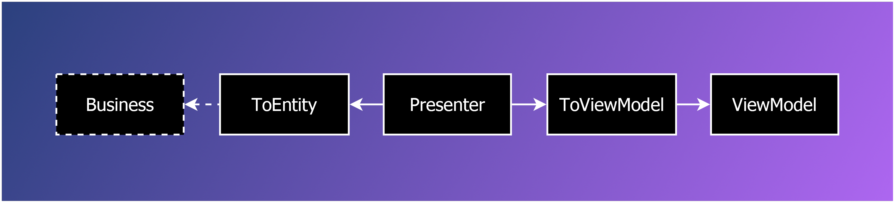

<style type="text/css" rel="stylesheet">td:first-child { white-space: nowrap; } thead { display: none; } </style>

`[ Draft ]`

🖥️ Presentation Patterns
=========================

[back](README.md)

The [presentation layer](../layers.md#presentation-layer) is the visual part of a program. It is what the user sees. Much of the [presentation code](../layers.md#presentation-layer) is kept [platform independent](../layers.md#platform-independence-1) in this software architecture. These are the [design patterns](README.md) regularly employed.



<h2>Contents</h2>

<ul>
<li><a href="https://jjvanzon.github.io/JJs-Reference-Architecture/patterns/viewmodels.html">ViewModels</a></li>
<li><a href="https://jjvanzon.github.io/JJs-Reference-Architecture/patterns/presenters.html">Presenters</a></li>
<li><a href="#toviewmodel">ToViewModel</a></li>
<li><a href="#toentity">ToEntity</a></li>
<li><a href="#views">Views</a></li>
<li><a href="#lookup-lists">Lookup Lists</a></li>
<li><a href="#full-load--partial-load--client-native-code">Full Load – Partial Load – Client-Native Code</a></li>
<li><a href="#stateless-and-stateful">Stateless and Stateful</a></li>
<li><a href="#nullcoalesce-viewmodels">NullCoalesce (ViewModels)</a></li>
<li><a href="#temporary-ids">Temporary ID's</a></li>
<li><a href="#considerations">Considerations</a></li>
</ul>


<h2 id="viewmodels">ViewModels</h2>

See the [`ViewModels`](viewmodels.md) article.


<h2 id="presenters">Presenters</h2>

See the [`Presenters`](presenters.md) article.


ToViewModel
-----------

An extension method that converts an [`Entity`](data-access.md#entities) to a [`ViewModel`](#viewmodels). You can make simple `ToViewModel` methods per [`Entity`](data-access.md#entities), converting it to a simple [`ViewModel`](#viewmodels) that represents the [`Entity`](data-access.md#entities). You can also have methods returning more complex [`ViewModels`](#viewmodels), such as `ToDetailsViewModel()` or `ToCategoryTreeEditViewModel()`.

You may pass [`Repositories`](data-access.md#repository) to the `ToViewModel` methods if required.

Sometimes you cannot appoint one [`Entity type`](data-access.md#entities) as the source of a [`ViewModel`](#viewmodels). In that case you cannot logically make it an extension method, but you make it a [`Helper`](other.md#helper) method in the `static ViewModelHelpers class`.

The `ToViewModel classes` should be put in the sub-folder / sub-namespace `ToViewModel` in your csproj. For an app with many [`Views`](#views) a split it up into the following files may be a good plan:

    ToIDAndNameExtensions.cs
    ToItemViewModelExtensions.cs
    ToListItemViewModelExtensions.cs
    ToPartialViewModelExtensions.cs
    ToScreenViewModelExtensions.cs
    ToViewModelHelper.cs
    ToViewModelHelper.EmptyViewModels.cs
    ToViewModelHelper.Values.cs
    ToViewModelHelper.Items.cs
    ToViewModelHelper.ListItems.cs
    ToViewModelHelper.Lookups.cs
    ToViewModelHelper.Partials.cs
    ToViewModelHelper.Screens.cs

For clarity: the `ViewModelHelper` files are all `ViewModelHelper partial classes`. The other files have a `class` that has the same name as the file.

Inside the `classes`, the methods should be sorted by source [entity](data-access.md#entities) or application section alphabetically and each section should be headed by a comment line, e.g.:

```cs
// Orders

public static OrderListViewModel ToListViewModel(this IList<Order> orders) { ... }
public static OrderEditPopupViewModel ToEditViewModel(this Order order) { ... }
public static OrderDeletePopupViewModel ToDeleteViewModel(this IList<Order> orders) { ... }
```

Some [`ViewModels`](#viewmodels) do not take one primary [`Entity`](data-access.md#entities) as input. So it does not make sense to turn it into an extension method, because you cannot decide which [`Entity`](data-access.md#entities) is the this argument. In that case we put it in a `ViewModelHelper class` with `static classes` without this arguments. `ViewModelHelper` is also part of the `ToViewModel` layer.


ToEntity
--------

Extension methods that convert a [`ViewModel`](#viewmodels) to an [`Entity`](data-access.md#entities).

You typically pass [`Repositories`](data-access.md#repository) to the method. A simple `ToEntity` method might look up an existing [`Entity`](data-access.md#entities), if it exists, it would be updated, if it does not, it would be created.

A more complex `ToEntity` method might also update related [`Entities`](data-access.md#entities). In that case related [`Entities`](data-access.md#entities) might be inserted, updated and deleted, depending on whether the [`Entity`](data-access.md#entities) still exists in the [`ViewModel`](#viewmodels) or in the data store.

A `ToEntity` method takes on much of the resposibility of a Save action.

`< TODO: Describe the organization of the ToEntity extensions. >`


Views
-----

A *template* for rendering the `View`.

It might be `HTML`.

In `WebForms` this would be an `aspx`.

In [`MVC`](../api/table.md#mvc) it can be an `aspx` or `cshtml`.

Any code used in the [`View`](#views) should be simple. That is: most tasks should be done by the [`Presenter`](presenters.md#-presenters), which produces the [`ViewModel`](#viewmodels), which is simply shown on screen. The [`View`](#views) should not contain [business logic](../layers.md#business-layer).


Lookup Lists
------------

In a stateless environment, lookup lists in [`Views`](#views) can be resource-intensive. For instance a drop down list in each row of a grid in which you choose from 1000 items may easily bloat your `HTML`. You might repeat the same list of 1000 items for each grid row. There are multiple ways to combat this problem.

For small lookup lists you might include a copy of the list in each [Item ViewModel](viewmodels.md#entity-viewmodels) and repeat the same lookup list in `HTML`.

Reusing the same list instance in multiple [ViewModels](#viewmodels) may seem to save you some memory, but a message formatter may actually repeat the list when sending a [`ViewModel`](#viewmodels) over the line.

For lookup lists up until say 100 items you might want to have a single list in an [`Edit ViewModel`](viewmodels.md#screen-viewmodels). A central list may save some memory but, but when you still repeat the HTML multiple times, you did not gain much. You may use the HTML5 `<datalist>` tag to let a `<select>` / drop down list reuse the same data. You might also use a [`jQuery`](../api/table.md#jquery) trick to populate a drop down just before you slide it open.

For big lookup list a viable option seems to [`AJAX`](../api/web.md#ajax) the list and show a popup that provides some search functionality, and not retrieve the full list in a single request. Once [`AJAX'ed`](../api/web.md#ajax) you might *cache* the popup to be reused each time you need to select something from it.


Full Load – Partial Load – Client-Native Code
---------------------------------------------

You might save the server some work by doing [partial loads instead of full loads](../api/web.md#ajax) or maybe even do [`JavaScript`](../api/table.md#javascript) or other client-native code.

[Partial loads](../api/web.md#ajax) load part of a web page, intead of the whole page, so the whole page does not have to be refreshed every time. It also might save work for the server that has to do less processing then.

[`JavaScript`](../api/table.md#javascript) is client-native code, that could omit server code altoghether, but potentially with a penalty on maintainability, because the client-code may be written in a way that is more dependent on specific [view](#views) details, which might easily change as the server-code evolves.

You could also call it: first choice full load.

In web technology you could also call it:

Full postback - [`AJAX`](../api/web.md#ajax) - [`JavaScript`](../api/table.md#javascript)

When programming page navigation, the first choice for showing content is a *full page load* in this [architecture](..). Only if there is a very good reason, we might use [`AJAX`](../api/web.md#ajax) to do a *partial load*. Only with a very good reason, we might start programming user interaction in [`JavaScript`](../api/table.md#javascript).

But it was always the first choice to do full postbacks.

The reason for this choice is *maintainability*: programming the application navigation in [`C#`](../api/table.md#csharp) using [`Presenters`](presenters.md#-presenters) is more maintainable than a whole lot of [`JavaScript`](../api/table.md#javascript). Also: when you do not use [`AJAX`](../api/web.md#ajax), the [`Presenter`](presenters.md#-presenters) keeps full control over the application navigation, and you do not have to let the web layer be aware of page navigation details.

Furthermore [`AJAX'ing`](../api/web.md#ajax) comes with extra difficulties. For instance that [`MVC`](../api/table.md#mvc) `<input>` tag ID's vary depending on the context and must be preserved after an [`AJAX`](../api/web.md#ajax) call, big code blocks of [`JavaScript`](../api/table.md#javascript) for doing [`AJAX`](../api/web.md#ajax) posts, managing when you do a full redirect or just an update of a div. Keeping overview over the multitude of formats with which you can get and post partial content. The added complexity of sometimes returning a row, sometimes returning a partial, sometimes returning a full [`View`](#views). Things like managing the redirection to a full [`View`](#views) from a partial action. Info from a parent [`ViewModel`](#viewmodels) e.g. a lookup list that is passed to the generation of a child [`ViewModel`](#viewmodels) is not available when you generate a partial [`View`](#views). `Request.RawUrl` cannot be used as a return URL in links anymore. Related info in other panels is not updated when info from one panel changes. A lot of times the data on screen is so intricately related to eachother, updating one panel just does not cut it. The server just does not get a chance to change the [`View`](#views) depending on the outcome of the business logic. Sometimes an [`AJAX`](../api/web.md#ajax) call's result should be put in a different target element, depending on the type you get returned, which adds more complexity.

Some of the difficulties with [`AJAX`](../api/web.md#ajax) have been solved by employing a specific way of working, as described under [`AJAX`](../api/web.md#ajax) in the Aspects section.


Stateless and Stateful
----------------------

The [presentation patterns](#️-patterns-presentation) may differ slightly if used in a stateful environment, but most of it stays in tact. For instance that [`Presenters`](presenters.md#-presenters) have action methods that take a [`ViewModel`](#viewmodels) and output a new [`ViewModel`](#viewmodels) is still useful in that setting. In a stateless environment such as web, it is needed, because the input [`ViewModel`](#viewmodels) only contains the user input, not the data that is only displayed and also not the lookup lists for drop down list boxes, etc. So in a stateless environment a new [`ViewModel`](#viewmodels) has to be created. You cannot just return the user input [`ViewModel`](#viewmodels). You would think that in a stateful environment, such as a `Windows` application, this would not be necessary anymore, because the read-only [`View`](#views) data does not get lost between user actions. However, creating a new [`ViewModel`](#viewmodels) is still useful, because it creates a kind of transaction, so that when something fails in the action, the original [`ViewModel`](#viewmodels) remains untouched.

You would be making assumptions in your [`Presenter`](presenters.md#-presenters) code when you program a stateful or stateful application. Some things in a stateful environment environment would not work in a stateless environment and you might make some `objects` long-lived in a stateful environment, such as `Context`, [`Repositories`](data-access.md#repository) and [`Presenters`](presenters.md#-presenters). But even if you build code around those assumptions, then when switching to a stateless environment –  if that would ever happen – the code is still so close to what's needed for stateless, that it might not come with any insurmountable problems. I would not beforehand worry about 'will this work in stateless', because then you would write a lot of logic and waste a lot of energy programming something that might probably never be used. And programming something for no reason at all, handling edge cases that would never occur, is a really counter-intuitive, unproductive way of working.

`< TODO: Added benefit: Transactional. >`


NullCoalesce (ViewModels)
-------------------------

When you user input back as a [`ViewModel`](#viewmodels) from your presentation framework of choice, for instance [`MVC`](../api/table.md#mvc), you might encounter null-lists in it, for lists that do not have any items. To prevent other code from doing `NullCoalescing` or instead tripping over the nulls, you can centralize the `NullCoalescing` of pieces of [`ViewModel`](#viewmodels) and call it in the [`Presenter`](presenters.md#-presenters).

`< TODO: Better description. Also incorporate:`

`- Also add a code example.`  
`- Consider making a separate pattern description for NullCoalesce methods in general and move it to the Other Patterns section to which you then refer from this section NullCoalesce (ViewModels).`
`- NullCoalesce. Applied to viewmodels that are passed to Presenters. The choice is made here to only NullCoalesce things that a View / client technology might leave out. Theoretically it might be better to NullCoalesce everything in the ViewModel, but this does take full traversal of the tree, which comes with a (small) performance penalty. Also: the NullCoalesce procedures take some typing time for the programmer, and requires maintenance when the structure changes. That is why the choice is made to only NullCoalesce a select set of things, that is adapted to our specific needs, rather than something that will always work. >`


Temporary ID's
--------------

When you edit a list, and between actions you do not commit you may need to generate ID's for the rows that are not committed, otherwise you cannot identify them individually to for instance delete a specific uncommitted row. For this you can add a TemporaryID to the [`ViewModel`](#viewmodels), that are typically Guids.

The TemporaryID's can be really temporary and can be regenerated every time you create a new [`ViewModel`](#viewmodels).

The TemporaryID concept breaks down, as soon as you need to use it to refer to something from multiple places in the [`ViewModel`](#viewmodels).

An alternative is to let a data store generate the ID's by flushing pendings statements to the data store, which might give you data-store-generated ID's. But this method fails when the data violates database constraints. Since the data does not have to be valid until we press save, this is usually not a viable option, not to speak of that switching to another persistence technology might not give you data-store-generated ID's upon flushing at all.

Another alternative is a different ID generation scheme. You may use an [`SQL`](../api/sql.md) Sequence, or use GUID's, which you assign from your code. Switching from int ID's to GUID's is a high impact change though, and does come with performance and storage penalties.


Considerations
--------------

### ToEntity / ToViewModel

`< TODO: Explain the argument that ViewModel, ToEntity and ToViewModel does require programming a lot of conversion code, but gives you complete freedom over your program navigation, but the alternative, a framework prevents writing this conversion code for each application, but has the downside that you are stuck with what the framework offers and loose the complete freedom over your how your program navigation works. >`

[back](README.md)