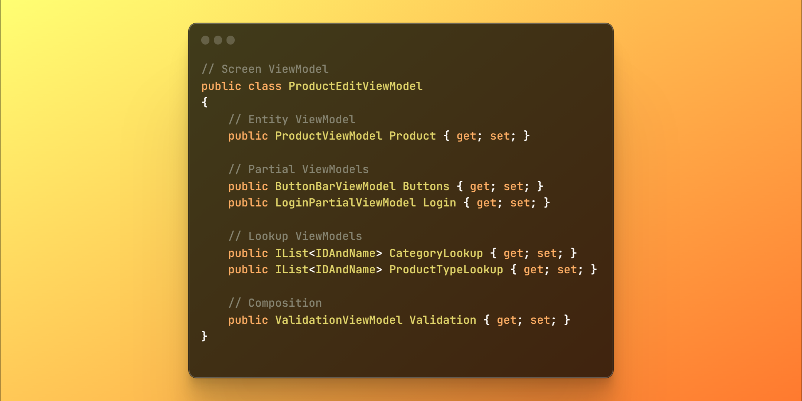

---
title: "🪟 ViewModels"
image: "/images/view-models-page.png"
description: "A ViewModel provides a simplified and organized representation of the data to display on screen."
keywords:
  - viewmodels
  - presentation layer
  - screens
  - platform independent
  - platform independence
  - design patterns
  - best practices
  - code samples
  - clean code
  - c#
  - .net
  - coding
  - programming
  - software engineering
  - software development
  - software design
  - software architecture
  - layered architecture
  - software
  - computers
---

🪟 ViewModels
==============

[back](presentation.md)

[`ViewModels`](#-viewmodels) are as simple as they are invaluable in [this architecture](..).  
A [`ViewModel`](#-viewmodels) provides a simplified and organized representation of the data to display on screen.




<h2>Contents</h2>

- [Only Data](#only-data)
- [Screen ViewModels](#screen-viewmodels)
- [Entity ViewModels](#entity-viewmodels)
- [Partial ViewModels](#partial-viewmodels)
- [ListItem ViewModels](#listitem-viewmodels)
- [Lookup ViewModels](#lookup-viewmodels)
- [How to Model](#how-to-model)
- ["What", not "How"](#what-not-how)
- ["What", not "Why"](#what-not-why)
- [Keeping It Clean](#keeping-it-clean)
- [No Entities](#no-entities)
- [Avoid ViewModel to ViewModel Conversion](#avoid-viewmodel-to-viewmodel-conversion)
- [Avoid Inheritance](#avoid-inheritance)
- [Composition](#composition)
- [Realistic Example](#realistic-example)
- [Conclusion](#conclusion)


Only Data
---------

In [this architecture](..) a [`ViewModel`](#-viewmodels) is meant to be a pure [data object](data-access.md#dto). It's recommended that [`ViewModels`](#-viewmodels) only have `public` properties, *no* methods, *no* constructors, *no* member initialization and *no* list instantiation. This to insist that the code *handling* the [`ViewModels`](#-viewmodels) takes full responsibility for the data. This also makes it better possible to integrate with different types of technology. Here is an example of a simple [`ViewModel`](#-viewmodels):

```cs
public class ProductViewModel
{ 
    public int ID { get; set; }
    public string Name { get; set; }
    public string Description { get; set; }
}
```


Screen ViewModels
-----------------

Every screen can get a [`ViewModel`](#-viewmodels). Here are some [`Screen ViewModels`](#screen-viewmodels) you might find in an application: 

    ProductDetailsViewModel
    ProductListViewModel
    ProductEditViewModel
    ProductDeleteViewModel

These names are built up from parts:

1. Starting with the [`Entity`](data-access.md#entities) name:  
   `Product`, `Category`
2. Then something [`CRUD`](../layers.md#crud)-related:  
   `Details`, `List`, `Edit` or `Delete`
3. And it ends with:  
   [`ViewModel`](#-viewmodels)

Instead of [`CRUD`](../layers.md#crud) actions, you could also use terms like `Overview`, `Selector`, `NotFound`, or `Login`:

    ProductOverviewViewModel
    CategorySelectorViewModel
    NotFoundViewModel
    LoginViewModel

Here is a code example of a [`Screen ViewModel`](#screen-viewmodels):

```cs
public class ProductEditViewModel
{
    public int ID { get; set; }
    public string Name { get; set; }
    public string Description { get; set; }
    public string Category { get; set; }
    public string ProductType { get; set; }
    public IList<string> ValidationMessages { get; set; }
    public bool CanDelete { get; set; }
}
```


Entity ViewModels
-----------------

You can also reuse [`ViewModels`](#-viewmodels) that represent single [`Entities`](data-access.md#entities), e.g.:

    ProductViewModel
    CategoryViewModel

For instance:

```cs
public class CategoryViewModel 
{ 
    public int ID { get; set; }
    public string Name { get; set; }
}
```

[`Entity ViewModels`](#entity-viewmodels) might be reused among different [`Screen ViewModels`](#screen-viewmodels), for instance:

```cs
/// <summary>
/// An Edit ViewModel using several Entity ViewModels.
/// </summary>
public class ProductEditViewModel
{
    public int ID { get; set; }
    public string Name { get; set; }

    // Using Entity ViewModels
    public CategoryViewModel Category { get; set; }
    public ProductTypeViewModel ProductType { get; set; }
}
```

[`Entity ViewModels`](#entity-viewmodels) are a kind of `Item ViewModel`.


Partial ViewModels
------------------

[`Partial ViewModels`](#partial-viewmodels) describe *parts* of a screen, to keep overview of its sections, like:

    LoginPartialViewModel
    ButtonBarViewModel
    MenuViewModel
    PagerViewModel
    
They may or may not have the word `Partial` in their name. Here is a code sample of a `ButtonBarViewModel`:

```cs
/// <summary>
/// Partial ViewModel representing a ButtonBar.
/// </summary>
public class ButtonBarViewModel 
{ 
    public bool CanSave { get; set; }
    public bool CanDelete { get; set; }
    public bool CanCreate { get; set; }
    public bool CanShowList { get; set; }
}
```

Each property in there says whether you can use a certain button or not.

The [`Partial ViewModels`](#partial-viewmodels) can be used in [`Screen ViewModels`](#screen-viewmodels). Here some [`Partials`](#partial-viewmodels) are used in the `ProductEditViewModel`:

```cs
/// <summary>
/// Edit ViewModel with Partials
/// </summary>
public class ProductEditViewModel
{
    public int ID { get; set; }
    public string Name { get; set; }

    // Partials:
    public ButtonBarViewModel Buttons { get; set; }
    public LoginPartialViewModel Login { get; set; }
}
```


ListItem ViewModels
-------------------

[`ListItem ViewModels`](#listitem-viewmodels) are similar to the [`Entity ViewModels`](#entity-viewmodels) but instead they might represent a row in *list* or *grid*. Here are some names they might get:

    ProductListItemViewModel
    CategoryItemViewModel

A `CategoryItemViewModel` could look as follows:

```cs
public class CategoryItemViewModel
{
    public int ID { get; set; }
    public string Name { get; set; }
    public string UsedBy { get; set; }
    public bool CanDelete { get; set; }
}
```

So they can be different from the [`Entity ViewModels`](#entity-viewmodels).  
[`ListItem ViewModels`](#listitem-viewmodels) can be used inside a `ListViewModel`:

```cs
/// <summary>
/// Example of a ViewModel using ListItem ViewModels.
/// </summary>
public class CategoryListViewModel
{
    // Here, a ListItem ViewModel is used.
    public IList<CategoryItemViewModel> Categories { get; set; }
}
```

Some list views only need an [`IDAndName`](../api/table.md#jj-canonical) [`DTO`](data-access.md#dto), a version of which can be found in the [`JJ.Canonical`](../api/table.md#jj-canonical) project:

```cs
namespace JJ.Data.Canonical
{
    public class IDAndName
    {
        public int ID { get; set; }
        public string Name { get; set; }
    }
}
```

Here you can find [`IDAndName`](../api/table.md#jj-canonical) objects used in a `ListViewModel`:

```cs
/// <summary>
/// Example of a List ViewModel that uses IDAndName as the item type.
/// </summary>
public class CategoryListViewModel
{
    // Here, IDAndName is used as a list item.
    public IList<IDAndName> Categories { get; set; }
}
```


Lookup ViewModels
-----------------

A *lookup* list can provide the data for drop-down select boxes or other controls, e.g.:

```cs
IList<IDAndName> ProductTypeLookup { get; set; }
```

It might be used in a [`Screen ViewModel`](#screen-viewmodels) like this:

```cs
/// <summary>
/// Edit ViewModel with a Lookup List in it.
/// </summary>
public class ProductEditViewModel
{
    public int ID { get; set; }
    public string Name { get; set; }
    public IDAndName ProductType { get; set; }

    // Here is the Lookup ViewModel.
    IList<IDAndName> ProductTypeLookup { get; set; }
}
```


How to Model
------------

A [`ViewModel`](#-viewmodels) is an abstract representation of what is shown on screen. The idea for how to model them is:

> *A [`ViewModel`](#-viewmodels) says __what__ is shown on screen, not __how__ or __why__.*


"What", not "How"
-----------------

A [`ViewModel`](#-viewmodels) says ***what*** is shown on screen, not ***how:***

Therefore `CanDelete` may be a better name than `DeleteButtonVisible`. Whether it is a `Button` or a hyperlink or `Visible` or `Enabled`, should be up to the [`View`](#views) instead.


"What", not "Why"
-----------------

A [`ViewModel`](#-viewmodels) should say ***what*** is shown on screen, not ***why:***  

For instance: if the business logic tells us that an [`Entity`](data-access.md#entities) is a very special [`Entity`](data-access.md#entities), therefore it should be displayed read-only, the [`ViewModel`](#-viewmodels) might contain a property `IsReadOnly` or `CanEdit`, not a property named `ThisIsAVerySpecialEntity`. 
The *reason* for displaying data read-only should not be a concern for a [`ViewModel`](#-viewmodels) or a [view](presentation.md#views).


Keeping It Clean
----------------

[`ViewModels`](#-viewmodels) might only use *simple* `types` and references to other [`ViewModels`](#-viewmodels). This keeps the [`ViewModel`](presentation.md#views) layer completely self-contained.


No Entities
-----------

For instance, a [`ViewModel`](#-viewmodels) in [this architecture](..) isn't supposed to reference any [`Entities`](data-access.md#entities). This is because it would potentially connect the [`ViewModel`](#-viewmodels) to a database, which is not always desired or even possible.

Even when the [`ViewModel`](data-access.md#entities) looks almost exactly the same as the [`Entity`](data-access.md#entities), we tend to not use [`Entities`](data-access.md#entities) directly. 

[`Entity`](data-access.md#entities):

```cs
public class Product
{
    public virtual int ID { get; set; }
    public virtual string Name { get; set; }
    public virtual Category Category { get; set; }
}
```

[`ViewModel`](#-viewmodels):

```cs
public class ProductViewModel
{
    public int ID { get; set; }
    public string Name { get; set; }
    public CategoryViewModel Category { get; set; }
}
```

It is worth noting that linking to an [`Entity`](data-access.md#entities) can result in the availability of other related [`Entities`](data-access.md#entities), which may broaden the scope of the [view](presentation.md#views) beyond our intentions:

```cs
/// <summary>
/// This ViewModel references an Entity, which is not recommended.
/// </summary>
public class ProductViewModel
{
    public int ID { get; set; }
    public string Name { get; set; }

    // Not recommended: Referencing an Entity from a ViewModel.
    public Category Category { get; set; }
}

// Unintentionally, many customers' data
// is available in the Product view, 
// because we referenced an Entity.
var customers =
    productViewModel.Category.Products
                    .SelectMany(x => x.Orders)
                    .Select(x => x.Customer);
```

An added benefit of decoupling the [`ViewModels`](#-viewmodels) from [`Entities`](data-access.md#entities), is that it makes it possible to change a [`ViewModel`](#-viewmodels) without affecting the [data access layer](../layers.md#data-layer) or the [business logic](../layers.md#business-layer):

[`ViewModel`](#-viewmodels):

```cs
public class CustomerViewModel
{
    public string CustomerNumber { get; set; }
    public string FirstName { get; set; }
    public string CouponCode { get; set; }
}
```

[`Entity`](data-access.md#entities):

```cs
public class Customer
{
    public virtual int ID { get; set; }
    public virtual string Name { get; set; }
    public virtual string CustomerNumber { get; set; }
}
```

Here the [`Entity`](data-access.md#entities) and [`ViewModel`](#-viewmodels) look completely different, which is totally fine.


Avoid ViewModel to ViewModel Conversion
---------------------------------------

It is not advised to convert [`ViewModels`](#-viewmodels) to other [`ViewModels`](#-viewmodels) directly:

```cs
/// <summary>
/// Conversion from ViewModel to ViewModel is not recommended.
/// </summary>
public static void Convert(
    EditViewModel userInput, ProductViewModel viewModel)
{
    if (viewModel.HasVat)
    {
        viewModel.Price = userInput.Price * userInput.Vat;
    }
    else
    {
        viewModel.Price = userInput.Price / userInput.Vat;
    }
}
```

What we're trying to prevent here is too much interdependence between [`ViewModels`](#-viewmodels). Prefer converting from [`Entities`](data-access.md#entities) to [`ViewModel`](#-viewmodels) and back:

```cs
Product entity = _repository.Get(id);

decimal price = entity.PriceWithoutVat * _taxCalculator.VatFactor;

var viewModel = new EditViewModel { Price = price };
```

This gives us finer control over where the data comes from and goes. But there might be exceptions. There could be cases, where it makes more sense to operate directly on the [`ViewModels`](#-viewmodels) instead:

```cs
public void ExpandNode(TreeViewModel viewModel, int id)
{
    var node = viewModel.Nodes.Single(x => x.ID == id);
    node.IsExpanded = true;
}
```

It may be about properties, that aren't intended for permanent storage. You can also pass other non-persisted properties between [`ViewModel`](#-viewmodels) like this:

```cs
public QuizViewModel Answer(QuizViewModel userInput)
{
    var viewModel = new QuizViewModel();

    // Yield over non-persisted properties.
    viewModel.SelectedOption = userInput.SelectedOption;
    viewModel.AnswerVisible = userInput.AnswerVisible;

    return viewModel;
}
```


Avoid Inheritance
-----------------

Inheritance is not the go-to choice for [`ViewModels`](#-viewmodels).

Using inheritance creating a `base` [`ViewModel`](#-viewmodels) can lead to a high number of interdependencies between the [`Views`](presentation.md#views) and the [`ViewModels`](#-viewmodels). If the `base` [`ViewModel`](#-viewmodels) changes, it can potentially break many [`Views`](presentation.md#views), making the application harder to maintain:

```cs
public abstract class ScreenViewModel
{
    public string Name { get; set; }
    public string Description { get; set; }
}

public class HomePageViewModel : ScreenViewModel
{
    // ...
}

public class ProductEditViewModel : ScreenViewModel
{
    // ...
}
```

Here the `BaseViewModel` contains the properties `Name` and `Description`. These properties might potentially mean something different for the `HomePage` and `ProductEdit` [views](#-viewmodels). If we decide to rename the `base` properties to be more specific, or to change their purpose, we could be breaking multiple views, because we used inheritance.

By avoiding inheritance, a [`ViewModel`](#-viewmodels) can only break things that directly depend on it, reducing the potential impact of changes:

```cs
public class HomePageViewModel
{
    public string PageTitle { get; set; }
    public string UserDisplayName { get; set; }
}

public class ProductEditViewModel
{
    public int ProductID { get; set; }
    public int ProductName { get; set; }
    public int ProductDescription { get; set; }
}
```

In these examples, each [`ViewModel`](#-viewmodels) is self-sufficient and does not affect the other.

To really 'seal' the deal, you could make the [`ViewModel`](#-viewmodels) `classes` `sealed` to prevent inheritance at all:

```cs
public sealed class HomePageViewModel
{
    public string PageTitle { get; set; }
    public string UserDisplayName { get; set; }
}
```

Though no hard rules here. It doesn't mean that inheritance should always be avoided. It may still be possible to use inheritance in a way that is maintainable by applying it carefully:

```cs
public abstract class ScreenViewModel
{
    public bool Visible { get; set; }
    public bool Successful { get; set; }
    public IList<string> ValidationMessages { get; set; }
}
```

By keeping the members in the base class very general, and not applicable to specific situations, it would be less likely to break as the software evolves.


Composition
-----------

As an alternative, you could also choose to use other design patterns, such as [composition](#composition), to reduce the impact of changes:

```cs
public class HomePageViewModel
{
    public ScreenViewModel Screen { get; set; }
    public LoginPartialViewModel Login { get; set; }
}

public class ProductEditViewModel
{
    public ScreenViewModel Screen { get; set; }
    public ValidationViewModel Validation { get; set; }
}
```

The `HomePage` uses common properties and has a `Login`. The `ProductEdit` [view](presentation.md#views) uses common properties and has `Validation`.

`ScreenViewModel` and the `ValidationViewModel` are reused. `ScreenViewModel` defines common properties for any screen or page. The `ValidationViewModel` has properties for data validation, like `ValidationMessages` and a `Successful` flag.

By using [composition](#composition), changes to a child object can still have an impact on multiple [views](presentation.md#views). But the modular nature of [composition](#composition) allows for a potentially smaller scope of dependency than [inheritance](#avoid-inheritance).


Realistic Example
-----------------

Finally, here is a realistic example of a `ProductEdit` [`ViewModel`](#-viewmodels):

```cs
// Screen ViewModel
public class ProductEditViewModel
{
    // Entity ViewModel
    public ProductViewModel Product { get; set; }

    // Partial ViewModels
    public ButtonBarViewModel Buttons { get; set; }
    public LoginPartialViewModel Login { get; set; }

    // Lookup ViewModels
    public IList<IDAndName> CategoryLookup { get; set; }
    public IList<IDAndName> ProductTypeLookup { get; set; }

    // Composition
    public ValidationViewModel Validation { get; set; }
}
```


Conclusion
----------

Hopefully this gave a good impression of how [`ViewModels`](#-viewmodels) might be structured. They can enable technology independence, preventing hard coupling to [business logic](../layers.md#business-layer) and [data access](../layers.md#data-layer), offering a flexible way to model the user interaction. In the coming sections, more patterns will be introduced, to illustrate how these [`ViewModels`](#-viewmodels) might be used in practice. To see where they come from and go.

[back](presentation.md)