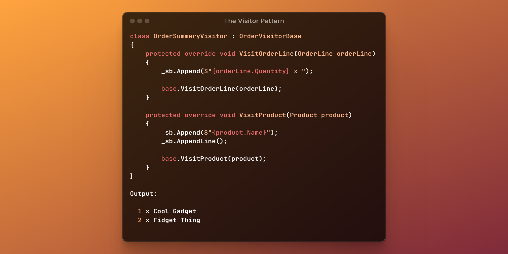

🎄 The Visitor Pattern
=======================

[back](.)

[`Visitor`](#-the-visitor-pattern) `classes` process recursive tree structures that might involve many `objects` and multiple `types` of `objects`.



<h2>Contents</h2>

- [Introduction](#introduction)
- [Visit Methods](#visit-methods)
- [Base Visitor](#base-visitor)
- [Specialized Visitors](#specialized-visitors)
- [Optimization](#optimization)
- [Entry Points](#entry-points)
- [Using Fields](#using-fields)
- [Polymorphic Visitation](#polymorphic-visitation)
- [Change the Sequence](#change-the-sequence)
- [Accept Methods](#accept-methods)
- [Alternatives](#alternatives)
- [Conclusion](#conclusion)


Introduction
------------

Usually a [`Visitor`](#-the-visitor-pattern) translates a complex structure into something else. Examples are calculating total costs over a recursive structure, or filtering down a whole `object` graph by complex criteria. [`Visitors`](#-the-visitor-pattern) can result in well performing code.

Whenever a whole recursive structure needs to be processed, the [`Visitor`](#-the-visitor-pattern) pattern may be a good way to go.


Visit Methods
-------------

A [`Visitor`](#-the-visitor-pattern) `class` has a set of [`Visit`](#visit-methods) methods, e.g. `VisitOrder`, `VisitProduct`, typically one for every `type`:

```cs
class Visitor
{
    void VisitOrder(Order order) { }
    void VisitOrderLine(OrderLine orderLine) { }
    void VisitProduct(Product product) { }
}
```

It can also have separate [`Visit`](#visit-methods) methods for `collections`:

```cs
void VisitOrderLines(IList<OrderLine> orderLines) { }
```

And there might be [`Visit`](#visit-methods) methods for special cases:

```cs
void VisitPhysicalProduct(Product product) { }
void VisitDigitalProduct(Product product) { }
```


Base Visitor
------------

A `base` [`Visitor`](#-the-visitor-pattern) might simply follow the whole recursive structure, and has a [`Visit`](#visit-methods) method for each node. Here is an example where an `Order` structure is `Visited`:

```cs
class OrderVisitorBase
{
    /// <summary>
    /// VisitOrder processes the child objects:
    /// Customer, Supplier and OrderLines.
    /// </summary>
    protected virtual void VisitOrder(Order order)
    {
        VisitCustomer(order.Customer);
        VisitSupplier(order.Supplier);

        foreach (var orderLine in order.OrderLines.ToArray())
        {
            VisitOrderLine(orderLine);
        }
    }

    /// <summary>
    /// VisitOrderLine also processes its child object: Product.
    /// </summary>
    protected virtual void VisitOrderLine(OrderLine orderLine)
        => VisitProduct(orderLine.Product);

    protected virtual void VisitCustomer(Customer customer) { }
    protected virtual void VisitSupplier(Supplier supplier) { }
    protected virtual void VisitProduct(Product product) { }
}
```

The ones with *child objects* also call [`Visit`](#visit-methods) on their children. Those without children have empty implementations.


Specialized Visitors
--------------------

You can make *specialized* [`Visitor`](#-the-visitor-pattern) classes, by overriding the [`Visit`](#visit-methods) methods.

If you only want to process certain `types` of `objects`, you can override [`Visit`](#visit-methods) methods for those `types` only:

```cs
/// <summary>
/// This specialized Visitor only processes
/// OrderLines and Products,
/// so the respective Visit methods are overridden.
/// </summary>
class OrderSummaryVisitor : OrderVisitorBase
{
    protected override void VisitOrderLine(OrderLine orderLine)
        => base.VisitOrderLine(orderLine);

    protected override void VisitProduct(Product product) 
        => base.VisitProduct(product);
}
```

They call their `base` methods. Keep those calls in there, so the `base` will process the rest of the recursive structure!

The aim for this simple new [`Visitor`](#-the-visitor-pattern) is to create a text, that summarizes the `Order`. 
Here is the code that uses a `StringBuilder` for this:

```cs
/// <summary>
/// Here the Visit methods are extended,
/// creating a text that summarizes the Order.
/// </summary>
class OrderSummaryVisitor : OrderVisitorBase
{
    StringBuilder _sb = new();

    protected override void VisitOrderLine(OrderLine orderLine)
    {
        _sb.Append($"{orderLine.Quantity} x ");

        base.VisitOrderLine(orderLine);
    }

    protected override void VisitProduct(Product product)
    {
        _sb.Append($"{product.Name}");
        _sb.AppendLine();

        base.VisitProduct(product);
    }
}
```

The result of the process might be a text like this:

```
1 x Cool Gadget
2 x Fidget Thing
```

Don't be underwhelmed. This is just a simple example. The more complicated the structures: this is where the [`Visitor`](#-the-visitor-pattern) pattern really starts to shine.


Optimization
------------

You can make the performance better by `overriding` [`Visit`](#visit-methods) methods for skipping parts of the recursive structure that don't you don't need:

```cs
/// <summary>
/// This Visitor aims to optimize the recursive process.
/// </summary>
class OrderSummaryVisitor : OrderVisitorBase
{
    /// <summary>
    /// Override VisitOrder and leave out part of the recursion.
    /// </summary>
    protected override void VisitOrder(Order order)
    {
        // Customer and Supplier are skipped here for optimization.

        foreach (var orderLine in order.OrderLines.ToArray())
        {
            VisitOrderLine(orderLine);
        }

        // Don't call base here. This method replaced it.
    }
}
```

However, be mindful of the trade-off between performance and completeness, as skipping parts of the structure also means missing out on the deeper objects.


Entry Points
------------

`Public` methods can show us the starting point of the recursion, making it easier to understand where the process begins:

```cs
class OrderSummaryVisitor : OrderVisitorBase
{
    StringBuilder _sb = new();

    /// <summary>
    /// This Execute method is the only one that's public.
    /// This makes it clear where the process starts.
    /// The Visit methods are kept protected
    /// for internal processing.
    /// </summary>
    public string Execute(Order order)
    {
        VisitOrder(order);
        return _sb.ToString();
    }

    ...
}
```

Here is the complete code sample of our derived `Visitor`:

```cs
class OrderSummaryVisitor : OrderVisitorBase
{
    StringBuilder _sb = new();

    public string Execute(Order order)
    {
        VisitOrder(order);
        return _sb.ToString();
    }

    protected override void VisitOrderLine(OrderLine orderLine)
    {
        _sb.Append($"{orderLine.Quantity} x ");

        base.VisitOrderLine(orderLine);
    }

    protected override void VisitProduct(Product product)
    {
        _sb.Append($"{product.Name}");
        _sb.AppendLine();

        base.VisitProduct(product);
    }
}
```


Using Fields
------------

The result of a [`Visitor's`](#-the-visitor-pattern) operation is typically stored in *fields* and used across multiple [`Visit`](#visit-methods) methods. In the examples above, we are talking about the `StringBuilder` field. The result structure might not have a straightforward, 1-to-1 relationship with the source structure. This makes fields the better choice over parameters and return values. It keeps our `base` [`Visitors`](#-the-visitor-pattern) more reusable as well.


Polymorphic Visitation
----------------------

A `Customer` and `Supplier` might both derive from a `Party base` type:

```cs
class Supplier : Party { }
class Customer : Party { }
```

Sometimes there is a [`Visit`](#visit-methods) method for each concrete `type`. A [`Visitor`](#-the-visitor-pattern) `class` might allow tapping into different levels of the abstraction like this:

```cs
protected virtual void VisitPartyPolymorphic(Party party)
{
    switch (party)
    {
        case Supplier supplier:
            VisitSupplier(supplier);
            break;

        case Customer customer:
            VisitCustomer(customer);
            break;
    }
}

protected virtual void VisitSupplier(Supplier supplier)
    => VisitPartyBase(supplier);

protected virtual void VisitCustomer(Customer customer)
    => VisitPartyBase(customer);

protected virtual void VisitPartyBase(Party party) { }
```

This way you can separately `override` a [`Visit`](#visit-methods) method for `Supplier` or `Customer`.

But you could also `override` `VisitPartyBase` instead, where you wish to handle both `Parties` the same way.

The `VisitPartyPolymorphic` method is best used for switching between different types. It might not be the first choice for `overriding`. However, it's still the best method to *call*, as it ensures that all specialized [`Visit`](#visit-methods) methods are called.

You need all those methods delegating in the right order, for the visitation to work properly.

Here is another example of polymorphic visitation, where we don't `switch` on an `object type`, but on an `enum` instead:

```cs
protected virtual void VisitProductPolymorphic(Product product)
{
    var productTypeEnum = product.GetProductTypeEnum();
    switch (productTypeEnum)
    {
        case ProductTypeEnum.Physical:
            VisitPhysicalProduct(product);
            break;

        case ProductTypeEnum.Digital:
            VisitDigitalProduct(product);
            break;
    }
}

protected virtual void VisitPhysicalProduct(Product product)
    => VisitProductBase(product);

protected virtual void VisitDigitalProduct(Product product)
    => VisitProductBase(product);

protected virtual void VisitProductBase(Product product) { }
```

This way we can create [`Visit`](#visit-methods) methods for specific cases if needed.

Here is a full example of a [`Visitor`](#-the-visitor-pattern) `base class` with polymorphic [`Visit`](#visit-methods) methods:

```cs
class PolymorphicVisitorBase
{
    protected virtual void VisitOrder(Order order)
    {
        VisitPartyPolymorphic(order.Customer);
        VisitPartyPolymorphic(order.Supplier);
        VisitOrderLines(order.OrderLines);
    }

    protected virtual void VisitPartyPolymorphic(Party party)
    {
        switch (party)
        {
            case Supplier supplier:
                VisitSupplier(supplier);
                break;

            case Customer customer:
                VisitCustomer(customer);
                break;
        }
    }

    protected virtual void VisitSupplier(Supplier supplier)
        => VisitPartyBase(supplier);

    protected virtual void VisitCustomer(Customer customer)
        => VisitPartyBase(customer);

    protected virtual void VisitPartyBase(Party party) { }

    protected virtual void VisitOrderLines(IList<OrderLine> orderLines)
    {
        foreach (OrderLine orderLine in orderLines)
        {
            VisitOrderLine(orderLine);
        }
    }

    protected virtual void VisitOrderLine(OrderLine orderLine)
        => VisitProductPolymorphic(orderLine.Product);

    protected virtual void VisitProductPolymorphic(Product product)
    {
        var productTypeEnum = product.GetProductTypeEnum();
        switch (productTypeEnum)
        {
            case ProductTypeEnum.Physical:
                VisitPhysicalProduct(product);
                break;

            case ProductTypeEnum.Digital:
                VisitDigitalProduct(product);
                break;
        }
    }

    protected virtual void VisitPhysicalProduct(Product product)
        => VisitProductBase(product);

    protected virtual void VisitDigitalProduct(Product product)
        => VisitProductBase(product);

    protected virtual void VisitProductBase(Product product) { }
}
```

This may seem like a lot of code, but note that the `base class` is set up with fixed patterns, and is written only once, so that the specialized [`Visitor`](#-the-visitor-pattern) `classes` can be made much simpler.


Change the Sequence
-------------------

You might also `override` a [`Visit`](#visit-methods) method to change the order in which things are processed:

```cs
/// <summary>
/// This Visitor changes the order of processing.
/// </summary>
class ReversedOrderVisitor : OrderVisitorBase
{
    protected override void VisitOrder(Order order)
    {
        foreach (var orderLine in order.OrderLines.ToArray())
        {
            VisitOrderLine(orderLine);
        }

        // Visit Customer and Supplier last instead of first.
        VisitCustomer(order.Customer);
        VisitSupplier(order.Supplier);
    }
}
```


Accept Methods
--------------

The *classic* [`Visitor`](#-the-visitor-pattern) pattern has a bit of a drawback in my opinion. It requires that `classes` *used by* the [`Visitor`](#-the-visitor-pattern) have to be *adapted*. `Accept` methods would be added to them. I think this is adapting the wrong `classes`. My advice would be not to do that, and leave out these `Accept` methods.

This would keep the [`Visitor`](#-the-visitor-pattern) `classes` self-sufficient and separated from the rest of the code.

However, `Accept` methods could be useful for specialized use-cases for instance to prevent the [polymorphic visitation](#polymorphic-visitation) proposed earlier.


Alternatives
------------

However, there are also alternatives for the [`Visitor`](#-the-visitor-pattern) pattern.

For instance, [`JJ.Framework.Collections`](../api.md#jj-framework-collections), which allows [`LINQ`](../api.md#linq)-style processing of recursive structures, with methods like [`.SelectRecursive`](https://www.nuget.org/packages/JJ.Framework.Collections#recursive-collection-extensions), which work for simpler scenarios.

You could also skip the [`base Visitor`](#base-visitor) and program a (recursive) [converter](../aspects.md#conversion) instead, if you're only interested in a specific part of the structure.

But the [`Visitor`](#-the-visitor-pattern) pattern might be more ideal, when the structure is quite complicated, or when you want to process the same structure in many different ways.


Conclusion
----------

By creating a `base` [`Visitor`](#-the-visitor-pattern) and multiple specialized [`Visitors`](#-the-visitor-pattern), you can create short and powerful code for processing recursive structures. A coding error is easily made, and can break calculations easily. However, it is the best and fastest choice for complicated processes that involve complex recursive structures.

Another good example of a [`Visitor`](#-the-visitor-pattern) `class` is [`.NET's`](../api.md#dotnet) own [`ExpressionVisitor`](https://learn.microsoft.com/en-us/dotnet/api/system.linq.expressions.expressionvisitor). However, the style of the [`Visitors`](#-the-visitor-pattern) might be different here. It can still be called a [`Visitor`](#-the-visitor-pattern) if it operates by slightly different rules.

[back](.)
