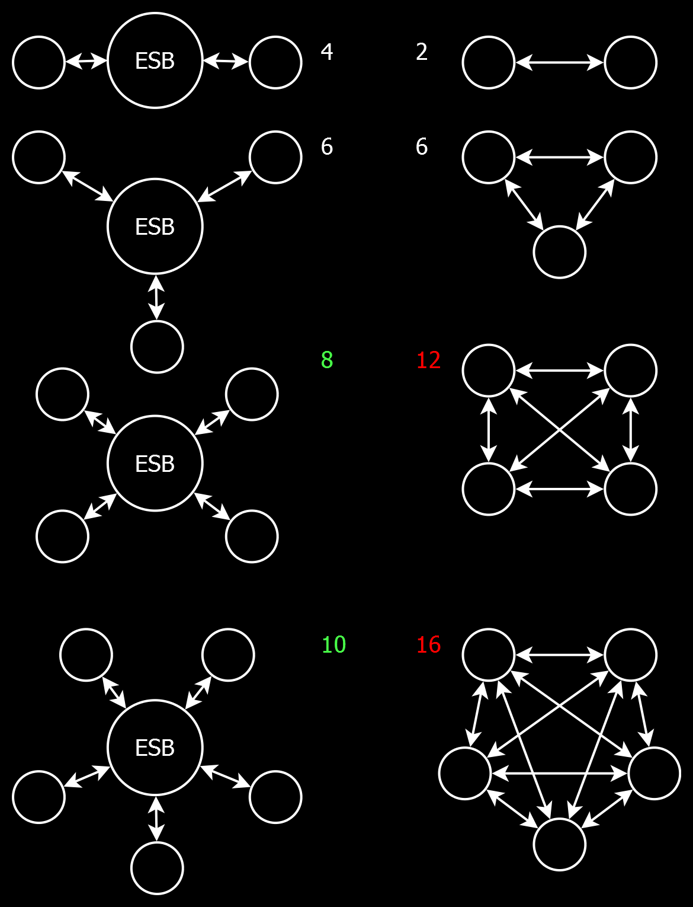

<style>thead{display:none;}</style>

🌐 Service Oriented Architecture
=================================

[back](.)

<h3>Contents</h3>

- [Introduction](#introduction)
- [The ESB Concept](#the-esb-concept)
- [Canonical Model](#canonical-model)
- [Less Integration Code](#less-integration-code)
- [Clearer Integration Code](#clearer-integration-code)
- [In Practice](#in-practice)
- [Memory](#memory)
- [Standard ESB vs Custom ESB](#standard-esb-vs-custom-esb)
- [ESB Model](#esb-model)
    - [Enterprises](#enterprises)
    - [ConnectionTypes](#connectiontypes)
    - [Connections](#connections)
    - [KeyMappings](#keymappings)
    - [Transmissions](#transmissions)
- [Service Implementations](#service-implementations)
- [Multi-Dispatch](#multi-dispatch)
- [Namespaces](#namespaces)
- [Service-Related Patterns](#service-related-patterns)
    - [IsSupported](#issupported)
    - [Facade](#facade)
    - [Hidden Infrastructure](#hidden-infrastructure)
    - [Tag Model](#tag-model)
    - [Canonical KeyMapping](#canonical-keymapping)


Introduction
------------

What has been described so far is the [application architecture](introduction.md#application-architecture-vs-service-architecture). Another part of this [software architecture](index.md) is the *service oriented architecture.* It is about linking [systems](#connectiontypes) together.


The ESB Concept
---------------

`ESB` stands for *Enterprise Service Bus*, which is a [system](#connectiontypes) for exchanging data between different [systems](#connectiontypes) of different [organizations](#enterprises) in different [formats](#connectiontypes) with different [protocols](#connectiontypes). Central components are used, to make [integration](#connectiontypes) between these [systems](#connectiontypes) more streamlined. A relevant concept is the [`Canonical`](#canonical-model) model.


Canonical Model
---------------

A `Canonical` model helps us exchange data between [systems](#connectiontypes). Data can be retrieved from multiple [systems](#connectiontypes) and is [converted](aspects.md#conversion) to a `Canonical` form, so that the same model may be reused for data that comes from various [systems](#connectiontypes). The aim for the `Canonical` model is to be as pure and general as possible, so information of different [systems](#connectiontypes) can fit into it with minimal trouble.


Less Integration Code
---------------------

Say you have `4` [systems](#connectiontypes): `A`, `B`, `C` and `D` and you want to connect all `4` of them together. Theoretically you would have to write `12` different message [conversions](aspects.md#conversion). See all the arrows in this diagram:


By connecting [systems](#connectiontypes) to an `ESB`, instead of to each other, you need to implement only `8` different message [conversions](aspects.md#conversion). The number of arrows is reduced:


You just saved yourself __33%__ of the work!

With every added [system](#connectiontypes) it gets better. You can see this from the numbers below, indicating the amount of message [conversions](aspects.md#conversion).



The first [integration](#connectiontypes) between 2 [systems](#connectiontypes) you actually program *more* message [conversions](aspects.md#conversion) by using an `ESB`. But wait: the next [system](#connectiontypes) it's already a tie between `ESB` and no `ESB`. And the 4th [integration](#connectiontypes) you introduce, you will have saved 33% of the overall work.

It gets better with each [system](#connectiontypes) you add to your `ESB`. When messages from one [system](#connectiontypes) are [converted](aspects.md#conversion) to and from a [`Canonical`](#canonical-model) model, you can automatically connect to all the other [systems](#connectiontypes).


Clearer Integration Code
------------------------

But it gets better. You save yourself even more work. The code to [convert](aspects.md#conversion) a message to [`Canonical`](#canonical-model) model is often easier than [converting](aspects.md#conversion) from one [system's](#connectiontypes) format to the other [system's](#connectiontypes) format. Instead of [converting](aspects.md#conversion) from one quirky format to another quirky format, which is quite difficult to do, you can [convert](aspects.md#conversion) from one quirky format to a more [straightforward format](#canonical-model), which is quite a lot easier to program.


In Practice
-----------

In practice not every [system](#connectiontypes) tends to send every type of message back and forth. And sometimes the messaging is not bidirectional but one-way only. But the benefits of an `ESB` still hold and [systems](#connectiontypes) would be linked with less code and less effort than custom programming every [integration](#connectiontypes).


Memory
------

An added benefit to the `Canonical` model, is that it it tends to live in memory. This means that changes to it don't not require any [data migrations](database-conventions.md#upgrade-scripts). You would only refactor the [conversion](aspects.md#conversion) code. That makes it lower impact and more flexible.


Standard ESB vs Custom ESB
--------------------------

There is standard `Enterprise Service Bus` software. Yet, you could also build a *custom* one. The concepts might be easier to implement than you think. Standard `ESB's` are complex and have a steep learning curve, require training, specialists. This all while you are going to have to *custom program* much of the [message conversion](aspects.md#conversion) yourself anyway, and design your own [`Canonical`](#canonical-model) model, which is basically all of the work. Therefore building one yourself may certainly be an option.


ESB Model
---------

On top of a [`Canonical`](#canonical-model) model, we might need more facilities. The `ESB` could offer a [model](patterns.md#entity) for administrating [`Connection`](#connections) settings and register [`Enterprises`](#enterprises) that can log in to our [system](#connectiontypes) to get access to our services.

Next: The main [entities](patterns.md#entity) of the `ESB` model:

### Enterprises

`Enterprises` participating in this [service architecture](#-service-oriented-architecture) would be registered in the `ESB` database. Those who need to log in, will get a `User` [entity](patterns.md#entity) with encrypted credentials.

### ConnectionTypes

All types of [`Connections`](#connections) that can be established between systems can be found in the `ConnectionTypes` table. Each `ConnectionType` is meant to be a very specific way of *integrating* with a *system*, with a specific messaging *protocol*, message *format* and *implementation*.

### Connections

Every individual `Connection` between two [`Enterprises`](#enterprises) would be registered in the `Connection` table with the `Connection` settings stored with it. Each `Connection` has an associated [`ConnectionType`](#connectiontypes) that indicates what type of [integration](#connectiontypes) it is.

Note that some `Connections` might not be *between* [`Enterprises`](#enterprises), but involve only *one* [`Enterprise`](#enterprises). Not all `Connections` need to be full-fledged messaging [implementations](#connectiontypes). Sometimes they are simply a database connection or even the path of a network folder.

### KeyMappings

Different systems handling the same type of data, such as `Orders` and `Customers`, well they often use different *identifiers* for things. To facilitate communication between these systems, it may be necessary to map these identifiers to one another. An [`ESB` model](#esb-model) can have [entities](patterns.md#entity) and [logic](layers.md#business-layer) to manage those kinds of reference numbers, which can also be referred to as [`KeyMappings`](#canonical-keymapping).

### Transmissions

It's may be a good idea to [log](aspects.md#logging) the messages that are transferred over a [`Connection`](#connections). This can be helpful for troubleshooting and debugging, but keep in mind that it can have an impact on performance and storage, so this feature is to be used with care.


Service Implementations
-----------------------

The [implementation](#connectiontypes) of a service would involve [message *transformation*](aspects.md#conversion) and *transmission*. Data is received through some [communication protocol](#connectiontypes), the message format is parsed and then [converted](aspects.md#conversion) to a [`Canonical`](#canonical-model) model. After that, the [`Canonical`](#canonical-model) model is [converted](aspects.md#conversion) to another message format and sent over another [communication protocol](#connectiontypes).


Multi-Dispatch
--------------

The contents of a [`Canonical`](#canonical-model) model can determine where it needs to be sent. For example, an `Order` may indicate a specific `Supplier` that it should be sent to. One `Supplier` might use their own unique [integration protocol](#connectiontypes), while another might prefer to receive the `Order` by email. This [service architecture](#-service-oriented-architecture) enables retrieving a message from one [system](#connectiontypes), for instance an `Order`, and then forwarding it to an arbitrary other [system](#connectiontypes). That is part of the power of a [`Canonical`](#canonical-model) model. It enables communication between multiple [systems](#connectiontypes) by [converting](aspects.md#conversion) their messages to a [common format](#canonical-model).


Namespaces
----------

These [namespaces](namespaces-assemblies-and-folders.md) use a hypothetical `Ordering` system. The main [layers](layers.md) can be recognized there, among which: [`Data`](layers.md#data-layer), [`Business`](layers.md#business-layer) and `Services`.

|                                                 |     |
|-------------------------------------------------|-----|
| __`JJ.Services`__                               | Root [`namespace`](namespaces-assemblies-and-folders.md) for (web) services.
| __`JJ.LocalServices`__                          | Root [`namespace`](namespaces-assemblies-and-folders.md) for `Windows` services. (Not part of this [service architecture](#-service-oriented-architecture), but this is where that other type of service goes.)
| __`JJ.Data.Canonical`__                         | Where [`Canonical` entities](#canonical-model) are modeled.
| __`JJ.Data.Esb`__                               | [Models](#esb-model) for [`Enterprises`](#enterprises), `Users`, [`ConnectionTypes`](#connectiontypes), [`Connections`](#connections), etc. Basically, the configuration settings of this architecture.
| __`JJ.Data.Esb.NHibernate`__                    | Stores the [`Esb` model](#esb-model) using [`NHibernate`](api.md#nhibernate).
| __`JJ.Data.Esb.SqlClient`__                     | [`SQL`](api.md#sql) queries for working with the [`Esb` entities](#esb-model).
| __`JJ.Business.Canonical`__                     | Shared [logic](layers.md#business-layer) that operates on [`Canonical`](#canonical-model) models.
| __`JJ.Business.Esb`__                           | [Business logic](layers.md#business-layer) for managing the [`Esb` model](#esb-model).
| __`JJ.Services.Ordering.Interface`__            | Defines [`interfaces`](https://learn.microsoft.com/en-us/dotnet/csharp/language-reference/keywords/interface) (the [`C#`](https://learn.microsoft.com/en-us/dotnet/csharp/language-reference/keywords/interface) kind) that `abstract` the way messages are sent between different `Ordering` systems.
| __`JJ.Services.Ordering.Dispatcher`__           | Makes sure messages (`Orders`, `Price` updates) are received from and sent to the [right system](#multi-dispatch) depending on message content, [settings](#esb-model) and [logic](layers.md#business-layer).
| __`JJ.Services.Ordering.Email`__                | A specific [implementation](#connectiontypes) of an `Ordering` system, in which we send the `Order` by email.
| __`JJ.Services.Ordering.AwesomeProtocol`__ | [Implementation](#connectiontypes) of an `Ordering` `interface`, behind which we use the hypothetical `AwesomeProtocol`.
| __`JJ.Services.Ordering.Wcf`__                  | A `WCF` service that allows you to communicate with the [multi-dispatch](#multi-dispatch) `Ordering` system.
| __`JJ.Services.Ordering.Wcf.Interface`__        | Defines the `interface` of the `WCF` service. This `interface` can be used both by server and client.
| __`JJ.Services.Ordering.Wcf.Client`__           | Allows a connection to the `WCF` service using a convenient, strongly typed `interface`.
| __`JJ.Services.Ordering.JsonRest`__             | Exposes the [multi-dispatch](#multi-dispatch) `Ordering` service using the `Json` and `Rest` protocols.
| __`JJ.Services.Ordering.WebApi`__               | There is no reason `Web API` should not be involved in this [service architecture](#-service-oriented-architecture). In fact, the idea of `WCF` being the default for services, might not be a very long-lived.
| __`JJ.Presentation.Shop.AppService.Wcf`__       | A special kind of service is an `AppService`, that exposes [presentation logic](layers.md#presentation-layer) instead of [business logic](layers.md#business-layer) returning [`ViewModels`](patterns.md#viewmodel).


Service-Related Patterns
------------------------

### IsSupported

A service environment may hold the same `interface` for accessing multiple [systems](#connectiontypes). But not every [system](#connectiontypes) is able to support the same features. You could solve this by creating a lot of different `interfaces`. But then it might be more difficult to know which `interface` to use. Instead, you could also add `IsSupported` properties to the `interface`. Then an implementation can communicate back if it supports a feature or not:

```cs
Product PlaceOrder();
bool PlaceOrderIsSupported { get; }

Product GetProducts();
bool GetProductsIsSupported { get; }
```

Then when for instance running price updates, you can simply *skip* the [systems](#connectiontypes) that do not support it. Possibly a different mechanism is used for keeping prices up-to-date, possibly there is another reason why price updates are irrelevant. It does not matter. The `IsSupported` booleans keeps complexity at bay, instead of the confusion of handling a large number of `interfaces`.

### Facade

A [`Facade`](patterns.md#facade) is an `interface` that sits in front of other `interfaces` and `classes`. Its goal is to provide an easier way to access a more complex system.

This concept is used in this [architecture](#index.md) to give a service an even simpler `interface` than the underlying [business](layers.md#business-layer). It may hide interactions with multiple [systems](#connectiontypes), and hide [infrastructural setup](layers.md#infrastructure).

### Hidden Infrastructure

When it comes to handling infrastructure setup, there's a key difference between the [application architecture](introduction.md#application-architecture-vs-service-architecture) and this [service oriented architecture](#-service-oriented-architecture)

In the [application architecture](introduction.md#application-architecture-vs-service-architecture), the top-level project is responsible for determining the [infrastructural context](layers.md#infrastructure) and passing it down to the lower layers, for instance as `interfaces` on [security](aspects.md#security) and [`data access`](patterns.md#repository-interfaces). 

But the [service architecture](#-service-oriented-architecture) determines the [infrastructural context](layers.md#infrastructure) in the bottom-level project. At least in the case of multi-dispatch this seems necessary. For instance, a bottom-level project like `JJ.Services.Ordering.Email` would not reveal that there is an `SMTP` client setup under the hood. You cannot see that from the constructor or the `interface`. The services would handle that internally.

### Tag Model

The [`Canonical`](#canonical-model) model should focus on data, that plays a logical role in your company. But another [system](#connectiontypes) may need data that is not relevant to you. To avoid cluttering the [`Canonical`](#canonical-model) model with unnecessary structures, you could use `Tag` models. You might use those `Tags` in [domain models](patterns.md#entity) too, to add data, that does not apply to your business processes. But this data can still be sent along to another [system](#connectiontypes), when it's needed.

Here are some examples of `Tag` models:

    Order { Tags[] }
    Tag { Name, Value }

You might also make the `Tags` culture-specific:

    Tag { Name, Value, CultureName }

Or you could *loosely link* `Tags` to [entities](patterns.md#entity), like so:

    Tag { Name, Value, EntityTypeName, EntityID }

### Canonical KeyMapping

[`KeyMapping`](#keymappings) is an idea that maps `ReferenceNumbers` from one [system](#connectiontypes) to another. For example, the same `Order` could have a different `OrderNumber` depending on which [system](#connectiontypes) or [party](#enterprises) it is sent to.

If the amount of [systems](#connectiontypes) becomes larger, the amount of [`KeyMappings`](#keymappings) might go up exponentially.

You might get many `IDs` in your model:

    Order
    {
        InternalID,
        CustomerOrderNumber,
        SupplierOrderNumber,
        ManufacturerOrderNumber,
        IntermediaryOrderNumber
    }

And the jeopardy of getting many [`KeyMappings`](#keymappings) in the [`ESB` database](#esb-model):

    KeyA <=> KeyB
    KeyA <=> KeyC
    KeyA <=> KeyD
    KeyB <=> KeyC
    KeyB <=> KeyD
    KeyC <=> KeyD

This can become difficult to manage. You could make it a bit more generic like this:

    Order
    {
        Identifiers[] { System, Number }
    }

So it becomes an array of `Identifiers` for different [`Systems`](#connectiontypes).

But there's a *trick*, that requires only 2 key fields in your [`Canonical`](#canonical-model) models, and no more!

    Order
    {
        InternalID
        ExternalID
    }

What you could do is map `ExternalIDs` from one [system](#connectiontypes) to `InternalIDs` in the `ESB`, so that the `InternalID` can in turn be mapped to an `ID` from yet again another [system](#connectiontypes):

    { SystemA, ExternalID } => InternalID
    { SystemB, ExternalID } => InternalID
    { SystemC, ExternalID } => InternalID 
    { SystemD, ExternalID } => InternalID

This way, when a new [system](#connectiontypes) is added, only one [`KeyMapping`](#keymappings) is needed, to map to all the other [systems](#connectiontypes).

As messages are [sent back and forth](#multi-dispatch) between [systems](#connectiontypes), the keys in the [`Canonical`](#canonical-model) model are translated from `ExternalID` to `InternalID`. Then the `ExternalID` property is overwritten by the `ID` from the next [system](#connectiontypes).

It all depends on the specific design of your system. But hopefully this demonstrated a few options how to handle [`KeyMappings`](#keymappings), `IDs` and reference numbers in a [Service Oriented Architecture](#-service-oriented-architecture).

[back](.)
