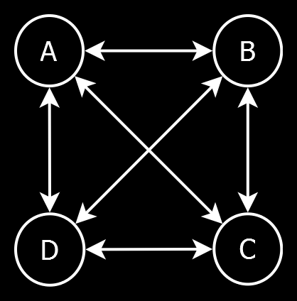

🌐 Service Oriented Architecture
=================================

[back](.)

<h3>Contents</h3>

- [Introduction](#introduction)
- [The ESB Concept](#the-esb-concept)
- [Canonical Model](#canonical-model)
- [Less Integration Code](#less-integration-code)
- [Clearer Integration Code](#clearer-integration-code)
- [In Practice](#in-practice)
- [In-Memory](#in-memory)
- [Standard ESB vs Custom ESB](#standard-esb-vs-custom-esb)
- [ESB Model](#esb-model)
    - [Enterprises](#enterprises)
    - [ConnectionTypes](#connectiontypes)
    - [Connections](#connections)
    - [KeyMappings](#keymappings)
    - [Transmissions](#transmissions)
- [Service Implementations](#service-implementations)
- [Multi-Dispatch](#multi-dispatch)
- [Namespaces](#namespaces)
- [Service-Related Patterns](#service-related-patterns)
    - [IsSupported](#issupported)
    - [Facade](#facade)
    - [Hidden Infrastructure](#hidden-infrastructure)
    - [Tag Model](#tag-model)
    - [3-Stage KeyMapping](#3-stage-keymapping)


Introduction
------------

What has been described so far is the [application architecture](introduction.md#application-architecture-vs-service-architecture). A second part of this [software architecture](index.md) is the *service oriented architecture*, which is mainly about linking systems together. This section is an addition to the documentation with regards to the service architecture. Currently the main technology used here is `WCF`.


The ESB Concept
---------------

`ESB` stands for *Enterprise Service Bus*, which is a system for exchanging data between different systems of different organizations in different formats with different protocols. Central components are used to make integration between these systems more manageable. One relevant concept is the [`Canonical` model](#canonical-model).


Canonical Model
---------------

The `Canonical` model helps us exchange data between systems. Data can be retrieved from multiple systems and is converted to a `Canonical` form, so that the same code may be reused for data that comes from various systems. The aim is for the `Canonical` model to be as pure and general as possible, so indeed information of any system can fit into it with few modifications.


Less Integration Code
---------------------

Say you have `4` systems: `A`, `B`, `C` and `D` and you want to connect all `4` of them together. Theoretically you would have to write `12` different message conversion as you can see from the arrows in the diagram below:



By connecting a system to the `ESB`, instead of connecting individual systems together, you have to implement only `8` different message conversions as you can see from the arrows below:


You just saved yourself 33% of the work!

With every system you add to your `ESB` it gets better as you can see from the numbers below that indicate the amount of message conversions.


The first integration between 2 systems you program using your `ESB` you actually program more message conversions, but with the next system it is already a tie between `ESB` and no `ESB`. The 4th integration you introduce, will have saved 33% of the overall work.

It gets better with each system you introduce in your `ESB`. When messages from a system are converted to and from the [`Canonical` model](#canonical-model), you can automatically connect it to all the other systems.


Clearer Integration Code
------------------------

But it gets better. You save yourself even more work. The conversion code from message to [`Canonical` model](#canonical-model) is often easier than converting from one system's format to the other system's format, because instead of converting from one quirky format to another quirky format, which is quite difficult to do, you convert from one quirky format to a more straightforward format, which is quite a lot easier to program.


In Practice
-----------

In practice not every system sends every type of message back and forth to every other system. And sometimes the messaging is not bidirectional but one-way only. But the benefits of the `ESB` still hold and systems would be linked together with less code and less effort than custom programming every integration between two systems.


In-Memory
---------

An added benefit to the `Canonical` model is that it tends to live in memory. That means changes to it, do not require any data migrations, just refactoring of to the conversion code, which makes it lower impact and more flexible.


Standard ESB vs Custom ESB
--------------------------

There are standard `Enterprise Service Bus` software packages available. Yet, you might choose to build a *custom* one yourself. The concepts might not be too hard to implement. And standard `ESB's` are complex and have a steep learning curve, require training, specialists. This all while you are going to have to custom program much of the message conversion code yourself anyway, and design your own [`Canonical` model](#canonical-model), which is basically all of the work. Therefore building it yourself seems a viable option.


ESB Model
---------

On top of a [`Canonical` model](#canonical-model), we might need more facilities. The `ESB` model could offer a model for administrating `Connection` settings and register `Enterprises` that can log in to our system to get access to our services.

Next will be listed the main [entities](#entity) of this model.

### Enterprises

Every `Enterprise` involved in this service architecture would be registered in the `ESB` database. Some of these `Enterprises` will actually log into our system. Those will get an associated `User` [entity](patterns.md#entity) with (encrypted) credentials stored in it.

### ConnectionTypes

Every type of `Connection` between systems might be registered in a table of `ConnectionTypes`. Each `ConnectionType` is meant to be a very specific way of integrating with a system, with a specific messaging protocol, message format and implementation.

### Connections

Every individual `Connection` between two `Enterprises` would be registered in the `Connection` table with the `Connection` settings stored with it. Each `Connection` has an associated `ConnectionType` that indicates what type of integration it is. Note that some `Connections` might not be *between* `Enterprises`, but involve only *one* `Enterprise`. `Connections` do not have to be complete messaging implementations. Sometimes they are simply database connection settings or even the path of a network folder.

### KeyMappings

Often systems have different identifiers for e.g. `Orders` or other objects. There may be a need to map a reference number from one system to the reference number of another system. An `ESB` model could have [entities](#entity) and logic to manage those `KeyMappings`.

### Transmissions

Optionally you can log the transferred messages that went over a `Connection`. Do note that logging all messages can impact performance and storage requirements so perhaps use it sparsely.


Service Implementations
-----------------------

The implementation of a service would involve mostly *message transformation* and *transmission*. Data is received through some communication protocol, the message format is parsed and then converted to a [`Canonical` model](#canonical-model). Conversely, [`Canonical` models](#canonical-model) are converted back to a specific message format and sent over a communication protocol.


Multi-Dispatch
--------------

The content of a [`Canonical` model](#canonical-model) might determine what service to send it to. For instance, one [`Canonical`](#canonical-model) `Order` has to be sent to one `Supplier` using their own specific integration protocol, another order might simply be e-mailed to the `Supplier`. This service architecture enables you to retrieve a message from one system, for instance an `Order`, and then send that message to an arbitrary other system. That is part of the power of the [`Canonical` model](#canonical-model), where multiple systems' messages being converted to [`Canonical` model](#canonical-model), enables all those systems to communicate with each other.


Namespaces
----------

These namespaces use a hypothetical `Ordering` system as an example:

|                                                 |     |
|-------------------------------------------------|-----|
| __`JJ.Services`__                               | Root `namespace` for web services / `WCF` services/
| __`JJ.LocalServices`__                          | Root `namespace` for Windows services. (Not part of the service architecture, but this is where that other type of service goes.)
| __`JJ.Data.Canonical`__                         | Where are [`Canonical`](#canonical-model) [entity](patterns.md#entity) models are defined.
| __`JJ.Data.Esb`__                               | [Entity model](patterns.md#entity) that stores `Enterprises`, `Users`, `ConnectionTypes`, `Connections`, etc. Basically, the configuration settings of the architecture.
| __`JJ.Data.Esb.NHibernate`__                    | Stores the `Esb` [entity model](patterns.md#entity) using [`NHibernate`](api.md#nhibernate).
| __`JJ.Data.Esb.SqlClient`__                     | [`SQL`](api.md#sql) queries for working with the stored `Esb` [entity model](patterns.md#entity).
| __`JJ.Business.Canonical`__                     | Some shared logic that operates on [`Canonical` models](#canonical-model).
| __`JJ.Business.Esb`__                           | Business logic for managing the `Esb` model.
| __`JJ.Services.Ordering.Interface`__            | Defines [`interfaces`](https://learn.microsoft.com/en-us/dotnet/csharp/language-reference/keywords/interface) (the [`C#`](https://learn.microsoft.com/en-us/dotnet/csharp/language-reference/keywords/interface) kind) that `abstract` the way messages are sent between different `Ordering` systems. These interfaces use the [`Canonical` models](#canonical-model).
| __`JJ.Services.Ordering.Dispatcher`__           | Makes sure messages (orders, price updates) are received from and sent to the right system depending on message content.
| __`JJ.Services.Ordering.Email`__                | A specific implementation of an `Ordering` `interface`, behind which we send the order by e-mail.
| __`JJ.Services.Ordering.SuperAwesomeProtocol`__ | A specific implementation of an `Ordering` `interface`, behind which we implement the hypothetical `SuperAwesomeProtocol` for sending `Orders`.
| __`JJ.Services.Ordering.Wcf`__                  | A `WCF` service that allows you to communicate with the multi-dispatch ordering system.
| __`JJ.Services.Ordering.Wcf.Interface`__        | Defines the `interface` of the `WCF` service that allows you to communicate with the multi-dispatch `Ordering` system. This service `interface` can is used by both service and client.
| __`JJ.Services.Ordering.Wcf.Client`__           | Allows code to connect to the `WCF` service using the strongly typed service `interface`.
| __`JJ.Services.Ordering.JsonRest`__             | Exposes the multi-dispatch `Ordering` service using the `Json` and `Rest` protocols.
| __`JJ.Services.Ordering.WebApi`__               | There is no reason `Web API` should not be involved in this service architecture, in fact, the idea of `WCF` being the default for services, might not be a very long-lived.
| __`JJ.Presentation.Shop.AppService.Wcf`__       | A special kind of service is an `AppService`, that exposes [presentation logic](layers.md#presentation-layer) instead of [business logic](layers.md#business-layer) and returns [`ViewModels`](patterns.md#viewmodel).


Service-Related Patterns
------------------------

### IsSupported

A service environment may hold the same `interface` for accessing multiple systems. But not every system is able to support the same features. You could solve it by creating a lot of different `interfaces`, but that would make the service layer more difficult to use, because you would not know which interface to use. Instead, you could also add `IsSupported` properties to the `interface` to make an implementation communicate back if it supports a feature at all, for instance:

```cs
OrderStatusEnum IOrderFacade.GetOrderStatus();

bool IOrderFacade.GetOrderStatusIsSupported { get; }
```

Then when running price updates for multiple systems, you can simply skip the ones that do not support it. Possibly a different mechanism is used for keeping prices up-to-date, possibly there is another reason why price updates are irrelevant. It does not matter. The `IsSupported` booleans keeps complexity at bay, more than introducing a large number of `interfaces` that would all need to be handled separately.

### Facade

An `interface` behind which a lot of other `interfaces` and `classes` are used, with the goal of simplifying working with these systems.

This concept is used in this [architecture](#index.md) to give a service `interface` an even simpler `interface` than the underlying business logic has. It may hide interactions with multiple systems, and hide infrastructural setup.

### Hidden Infrastructure

Not so much a pattern, but a difference in handling infrastructure setup between a possible [application architecture](introduction.md#application-architecture-vs-service-architecture) and this kind of service architecture. In the [application architecture](introduction.md#application-architecture-vs-service-architecture) the [infrastructural context](layers.md#infrastructure) may be determined by the top-level project and passed down to the deeper layers as for instance [`Repository interfaces`](patterns.md#repository) or `interfaces` on [security](aspects.md#security). While in the *service architecture* the [infrastructural context](layers.md#infrastructure) might be determined by the bottom-level project. At least in the case of multi-dispatch this seems necessary. A bottom-level project, for instance `JJ.Services.Ordering.Email` does not expose that there will be `SMTP` server setup. You cannot see that from the constructor or `interface`. The service would handle all that internally.

### Tag Model

The [`Canonical` model](#canonical-model) should concern itself with data that is exchanged, which has a logical function in the systems in your company. But *some* data is only relevant to one system alone and not used to make two or more systems link together either. You could opt to not pollute your [`Canonical` model](#canonical-model) with data modeling that concerns none of your business processes, but just add `Tag` collections to your [`Canonical` model](#canonical-model). You might add those `Tag` models to specific domain models too. That way you could add data to your domain models, that none of your own logic concerns itself with, but is still data that you are supposed to send along to another system, because *it* needs it. Here follow some examples of `Tag` models.

    Order { Tags[] }
    Tag { Name, Value }

You might also make tags culture specific:

    Tag { Name, Value, CultureName }

You might loosely link the tags:

    Tag { Name, Value, EntityTypeName, EntityID }


### 3-Stage KeyMapping

`KeyMapping` is an idea that maps `ExternalIDs` from one system to `ExternalIDs` of another system.

If the amount of systems becomes larger the amount of `KeyMappings` might go up exponentially.

You might get many `IDs` in your model:

    Order
    {
        InternalID,
        CustomerOrderNumber,
        SupplierOrderNumber,
        ManufacturerOrderNumber,
        IntermediaryOrderNumber
    }

And the jeopardy of getting many `KeyMappings` arises:

    KeyA <=> KeyB
    KeyA <=> KeyC
    KeyA <=> KeyD
    KeyB <=> KeyC
    KeyB <=> KeyD
    KeyC <=> KeyD

But this might become difficult to manage and not very generic in the long run. You could make it a bit more generic like this:

    Order
    {
        IDs[] { System, Number }
    }

So it becomes an array of `IDs` for different `Systems`.

But there's a trick, that requires only 2 key fields in your [`Canonical` models](#canonical-model), and no more!

    Order
    {
        InternalID
        ExternalID
    }

What you could do is map `ExternalIDs` from one system *only* to `InternalIDs` in the `ESB`, so that the `InternalID` can in turn be mapped to an `ID` from another system:

    { System.A, ExternalID } => InternalID
    { System.B, ExternalID } => InternalID
    { System.C, ExternalID } => InternalID 
    { System.D, ExternalID } => InternalID

This way, when a new system is added, only one `KeyMapping` is needed to map it to all the other systems.

As messages are sent back and forth between systems, the keys in the [`Canonical` model](#canonical-model) are translated from `ExternalID` to `InternalID`. Then the `ExternalID` property is overwritten by the `ID` from the next system.

It does all depend on the specific design of your system. But hopefully this demonstrated a few options how to handle `KeyMappings`, `IDs` and reference numbers in a [Service Oriented Architecture](#-service-oriented-architecture).

[back](.)
